

    
Universidad Peruana de Ciencias Aplicadas- Ingeniería de Software - Ciclo 2025-20

    <h1 style="margin: 10px 0; border-bottom: none;">1ASI0657 - Fundamentos de Arquitectura de Software</h1>
    
    <h4 style="margin: 10px 0; border-bottom: none;">NRC: 6339</h4>
    <h4 style="margin: 10px 0; border-bottom: none;">Profesor: Ocampo Tello, Ernesto</h4>
    <h2 style="margin: 10px 0; border-bottom: none;">Informe de Trabajo Final</h2>
    <h3 style="margin: 10px 0; border-bottom: none;">Startup: GreatBuild</h3>
    <h3 style="margin: 10px 0; border-bottom: none;">Producto: ClearCost</h3>
    <h4 style="margin: 10px 0; border-bottom: none;">Integrantes:</h4>
    <ul style="display: inline-block; text-align: left; padding: 0;">
        <li style="padding: 5px 0;">Diestra Zambrano, Adriana Maria (202218110)</li>
        <li style="padding: 5px 0;">Fernandez Remon, Roy Linsh (20221b778)</li>
        <li style="padding: 5px 0;">León Vivas, Fabrizio Amir (20211b994)</li>
    </ul>
    <h4 style="margin: 10px 0; border-bottom: none;">Setiembre de 2025</h4>

# Registro de Versiones del Informe

<table style="border-collapse: collapse; width: 100%; text-align: left;">
    <thead>
        <tr>
            <th style="border: 1px solid black; padding: 8px; font-weight: bold; text-align: center;">Versión</th>
            <th style="border: 1px solid black; padding: 8px; font-weight: bold; text-align: center;">Fecha</th>
            <th style="border: 1px solid black; padding: 8px; font-weight: bold; text-align: center;">Autor</th>
            <th style="border: 1px solid black; padding: 8px; font-weight: bold;">Descripción de modificación</th>
        </tr>
    </thead>
    <tbody>
        <tr>
            <td>1.0</td>
            <td>11/09/2025</td>
            <td>
                <ul>
                    <li>Diestra Zambrano, Adriana Maria</li>
                    <li>Fernandez Remon, Roy Linsh</li>
                    <li>León Vivas, Fabrizio Amir</li>
                </ul>
            </td>
            <td>
                <strong>Adición de secciones:</strong> 
                
Registro de Versiones del Informe

                
Project Report Collaboration Insights

                
Student Outcome

                
1.1. Startup Profile

                
1.1.1. Descripción de la Startup

                
1.1.2. Perfiles de integrantes del equipo

                
1.2. Solution Profile

                
1.2.1. Antecedentes y problemática

                
1.2.2. Lean UX Process

                
1.2.2.1. Lean UX Problem Statements

                
1.2.2.2. Lean UX Assumptions

                
1.2.2.3. Lean UX Hypothesis Statements

                
1.2.2.4. Lean UX Canvas

                
1.3. Segmentos objetivo

                
2.1. Competidores

                
2.1.1. Análisis competitivo

                
2.1.2. Estrategias y tácticas frente a competidores

                
2.2. Entrevistas

                
2.2.1. Diseño de entrevistas

                
2.2.2. Registro de entrevistas

                
2.2.3. Análisis de entrevistas

                
2.3. Needfinding

                
2.3.1. User Personas

                
2.3.2. User Task Matrix

                
2.3.3. Empathy Mapping

                
2.3.4. As-is Scenario Mapping

                
3.1. To-Be Scenario Mapping

                
3.2. User Stories

                
3.3. Impact Mapping

                
3.4. Alcance

                
3.5. Product Backlog

        </tr>
    </tbody>
</table>

# Project Report Collaboration Insights

El desarrollo del informe se realizó en un repositorio dedicado en la organización de GitHub. Enlace: [https://github.com/GreatBuild/Report](https://github.com/GreatBuild/Report)

Se presenta una tabla que especifica qué miembro del equipo se corresponde con qué usuario de GitHub.

<table cellpadding="6" cellspacing="0" style="border-collapse: collapse; width: 100%;">
  <tr>
    <th>Team Member  (Last Name, First Name)</th>
    <th>GitHub Username</th>
  </tr>
  <tr>
    <td>Diestra Zambrano, Adriana Maria</td>
    <td>adriiiiii123</td>
  </tr>
  <tr>
    <td>Fernandez Remon, Roy Linsh</td>
    <td>RTPX26</td>
  </tr>
  <tr>
    <td>León Vivas, Fabrizio Amir</td>
    <td>CodyLionVivo</td>
  </tr>
</table>

**TB1**

Este entregable comprende la elaboración del informe desde el Capítulo I hasta el Capítulo III, desarrollado íntegramente a partir del proceso de investigación en equipo y del diseño del sistema.

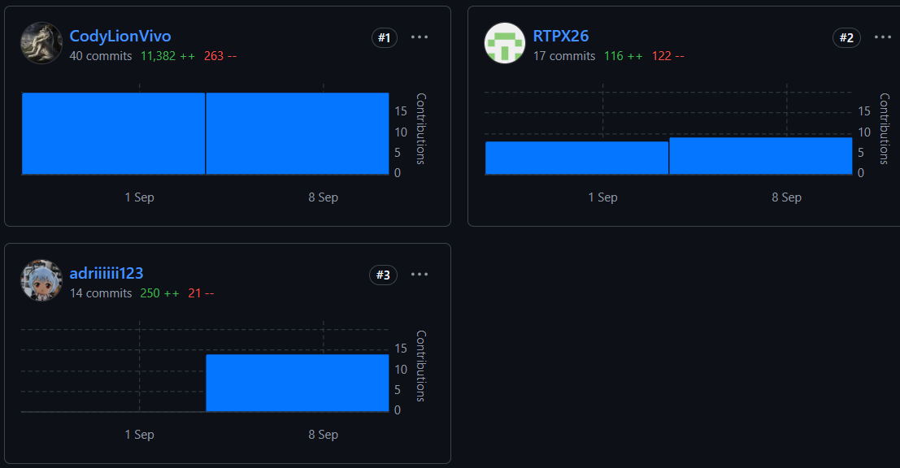

# Contenido

- [Registro de Versiones del Informe](#registro-de-versiones-del-informe)
- [Project Report Collaboration Insights](#project-report-collaboration-insights)
- [Student Outcome](#student-outcome)
- [Capítulo I: Introducción](#capítulo-i-introducción)
  - [1.1. Startup Profile](#11-startup-profile)
    - [1.1.1. Descripción de la Startup](#111-descripción-de-la-startup)
    - [1.1.2. Perfiles de integrantes del equipo](#112-perfiles-de-integrantes-del-equipo)
  - [1.2. Solution Profile](#12-solution-profile)
    - [1.2.1 Antecedentes y problemática](#121-antecedentes-y-problemática)
    - [1.2.2 Lean UX Process](#122-lean-ux-process)
      - [1.2.2.1. Lean UX Problem Statements](#1221-lean-ux-problem-statements)
      - [1.2.2.2. Lean UX Assumptions](#1222-lean-ux-assumptions)
      - [1.2.2.3. Lean UX Hypothesis Statements](#1223-lean-ux-hypothesis-statements)
      - [1.2.2.4. Lean UX Canvas](#1224-lean-ux-canvas)
- [1.3. Segmentos objetivo](#13-segmentos-objetivo)
- [Capítulo II: Requirements Elicitation & Analysis](#capítulo-ii-requirements-elicitation--analysis)
  - [2.1. Competidores](#21-competidores)
    - [2.1.1. Análisis competitivo](#211-análisis-competitivo)
    - [2.1.2. Estrategias y tácticas frente a competidores](#212-estrategias-y-tácticas-frente-a-competidores)
  - [2.2. Entrevistas](#22-entrevistas)
    - [2.2.1. Diseño de entrevistas](#221-diseño-de-entrevistas)
    - [2.2.2. Registro de entrevistas](#222-registro-de-entrevistas)
    - [2.2.3. Análisis de entrevistas](#223-análisis-de-entrevistas)
  - [2.3. Needfinding](#23-needfinding)
    - [2.3.1. User Personas](#231-user-personas)
    - [2.3.2. User Task Matrix](#232-user-task-matrix)
    - [2.3.3. User Journey Mapping](#233-user-journey-mapping)
    - [2.3.4. Empathy Mapping](#234-empathy-mapping)
    - [2.3.5. As-is Scenario Mapping](#235-as-is-scenario-mapping)

- [Capítulo III: Requirements Specification](#capítulo-iii-requirements-specification)
  - [3.1. To-Be Scenario Mapping](#31-to-be-scenario-mapping)
  - [3.2. User Stories](#32-user-stories)
  - [3.3. Impact Mapping](#33-impact-mapping)
  - [3.4. Alcance](#34-alcance)
  - [3.5. Product Backlog](#35-product-backlog)
- [Conclusiones](#conclusiones)
- [Bibliografía](#bibliografía)
- [Anexos](#anexos)

# Student Outcome

<table style="border-collapse: collapse; width: 100%; text-align: left;">
    <thead>
        <tr>
            <th style="border: 1px solid black; padding: 8px; font-weight: bold; width: 25%;">Criterio Específico</th>
            <th style="border: 1px solid black; padding: 8px; font-weight: bold; width: 45%;">Acciones realizadas</th>
            <th style="border: 1px solid black; padding: 8px; font-weight: bold; width: 30%;">Conclusiones</th>
        </tr>
    </thead>
    <tbody>
        <tr>
            <td>
                Actualiza conceptos y conocimientos necesarios para su desarrollo profesional y en especial para su proyecto en soluciones de software.
            </td>
            <td>
                <strong>TB1:</strong> 
                <ul>
                    <li><strong>Adriana:</strong> </li>
                    <li><strong>Fabrizio:</strong> Repasé los artefactos necesarios para el capítulo II y III para realizar un correcto dimensionamiento de la solución de software.</li>
                    <li><strong>Roy:</strong> Se realizó las entrevistas con su respectivo análisis y los requerimientos funcionales y no funcionales para obtener la información necesaria para seguir con el desarrollo de el proyecto y el software  </li>
                </ul>
            </td>
            <td>
                <strong>TB1:</strong> El entregable más que laborioso fue interesante ya que nos permitio usar conocimientos previos para el desarrollo de la solución de software. 
            </td>
        </tr>
        <tr>
            <td>
                Reconoce la necesidad del aprendizaje permanente para el desempeño profesional y el desarrollo de proyectos en soluciones de software.
            </td>
            <td>
                <strong>TB1:</strong> 
                <ul>
                    <li><strong>Adriana:</strong> </li>
                    <li><strong>Fabrizio:</strong> A través de las entrevistas obtuve una comprensión sólida tanto del modelo de negocio como del problema que se busca abordar.</li>
                    <li><strong>Roy: Mediante el desarrollo de las entrevistas y requerimientos pude entender los problemas que tienen las personas y el cómo poder solucionarlas.</strong> </li>
                </ul>
            </td>
            <td>
                <strong>TB1:</strong> Como equipo, coincidimos en que las entrevistas constituyeron un elemento clave para comprender con mayor profundidad el modelo de negocio. Asimismo, el trabajo se desarrolló en un marco de coordinación y apoyo mutuo. 
            </td>
        </tr>
    </tobdy>
</table>

# Capítulo I: Introducción

# 1.1. Startup Profile

### 1.1.1. Descripción de la Startup
GreatBuild impulsa la transformación digital en el sector de la ingeniería civil. A través de ClearCost, desarrollamos soluciones tecnológicas que optimizan la planificación, el control financiero y la gestión integral de proyectos de construcción. Nuestro enfoque no solo busca reducir errores en los expedientes técnicos, sino también mejorar la coordinación de equipos multidisciplinarios, la organización de tareas y el seguimiento de reuniones, asegurando una ejecución más eficiente y transparente.

Misión: Nuestra misión es transformar la manera en que se gestionan los expedientes técnicos y la operación diaria de los proyectos de construcción mediante herramientas digitales innovadoras. Nos proponemos reducir errores en la recopilación y procesamiento de información, optimizar la asignación de tareas y fortalecer la comunicación entre equipos. A través de una plataforma accesible y colaborativa, facilitamos el trabajo de constructoras, contratistas y especialistas, garantizando un flujo de información claro, ordenado y en tiempo real.

Visión: Aspiramos a convertirnos en la plataforma de referencia para constructoras y consultoras independientes en la gestión financiera y operativa de proyectos de construcción. En los próximos tres años, buscamos consolidar nuestra presencia alcanzando al menos el 3% de las empresas consultoras de obra en Lima Metropolitana, posicionándonos como un aliado estratégico en la modernización y digitalización de los procesos constructivos en el país. Nuestro compromiso es ofrecer una herramienta que no solo optimice los presupuestos y expedientes, sino que también eleve la productividad y colaboración de los equipos en cada proyecto.

Valores:

- Transparencia: garantizar información clara y sin ambigüedades sobre el uso del presupuesto.
- Confianza: fortalecer la relación entre constructoras y clientes mediante datos verificables.
- Accesibilidad: ofrecer una solución disponible 24/7 en cualquier dispositivo.
- Seguridad: proteger la información financiera con altos estándares de privacidad.
- Eficiencia: optimizar el tiempo y los recursos en la gestión financiera de cada obra.

### 1.1.2. Perfiles de intregrantes del equipo

<table style="width: 100%; border-collapse: collapse; margin-bottom: 20px;">
        <thead>
            <tr>
                <th style="border: 1px solid #ddd; padding: 10px; text-align: left; width: 25%;">Foto</th>
                <th style="border: 1px solid #ddd; padding: 10px; text-align: left; width: 15%;">Nombres y Apellidos</th>
                <th style="border: 1px solid #ddd; padding: 10px; text-align: left; width: 15%;">Código de Alumno</th>
                <th style="border: 1px solid #ddd; padding: 10px; text-align: left; width: 15%;">Carrera</th>
                <th style="border: 1px solid #ddd; padding: 10px; text-align: left; width: 30%;">Habilidades</th>
            </tr>
        </thead>
        <tbody>
            <tr>
                <td style="border: 1px solid #ddd; padding: 10px; text-align: left; background-color: #f2f2f2; color: #333;"></td>
                <td style="border: 1px solid #ddd; padding: 10px; text-align: left; background-color: #f2f2f2; color: #333;">Diestra Zambrano, Adriana Maria</td>
                <td style="border: 1px solid #ddd; padding: 10px; text-align: left; background-color: #f2f2f2; color: #333;">202218110</td>
                <td style="border: 1px solid #ddd; padding: 10px; text-align: left; background-color: #f2f2f2; color: #333;">Ingeniería de Software</td>
                <td style="max-width: 300px; overflow: hidden; text-overflow: ellipsis; white-space: normal;">
                    <ul>
                        <li>Desarrollo web</li>
                        <li>Gestión y diseño de bases de datos SQL y noSQL</li>
                        <li>Experiencia con Frameworks ágiles</li>
                        <li>Programación en C++ y Python</li>
                    </ul>
                </td>
            </tr>
            <tr>
                <td style="border: 1px solid #ddd; padding: 10px; text-align: left; background-color: #f2f2f2; color: #333;"></td>
                <td style="border: 1px solid #ddd; padding: 10px; text-align: left; background-color: #f2f2f2; color: #333;">Fernandez Remon, Roy Linsh</td>
                <td style="border: 1px solid #ddd; padding: 10px; text-align: left; background-color: #f2f2f2; color: #333;">20221b778</td>
                <td style="border: 1px solid #ddd; padding: 10px; text-align: left; background-color: #f2f2f2; color: #333;">Ingeniería de Software</td>
                <td style="max-width: 300px; overflow: hidden; text-overflow: ellipsis; white-space: normal;">
                    <ul>
                        <li>Análisis de datos</li>
                        <li>Gestión y diseño de bases de datos SQL</li>
                        <li>Experiencia en programación en C++, Python y uso de herramientas de Análisis de datos</li>
                    </ul>
                </td>
            </tr>
            <tr>
                <td style="border: 1px solid #ddd; padding: 10px; text-align: left; background-color: #f2f2f2; color: #333;"></td>
                <td style="border: 1px solid #ddd; padding: 10px; text-align: left; background-color: #f2f2f2; color: #333;">León Vivas, Fabrizio Amir</td>
                <td style="border: 1px solid #ddd; padding: 10px; text-align: left; background-color: #f2f2f2; color: #333;">20211b994</td>
                <td style="border: 1px solid #ddd; padding: 10px; text-align: left; background-color: #f2f2f2; color: #333;">Ingeniería de Software</td>
                <td style="max-width: 300px; overflow: hidden; text-overflow: ellipsis; white-space: normal;">
                    <ul>
                        <li>Desarrollo front-end</li>
                        <li>Conocimiento de TI en sistemas basados en UNIX</li>
                        <li>Competente en C++, JavaScript y Python</li>
                        <li>Experiencia con Frameworks ágiles</li>
                    </ul>
                </td> 
            </tr>
        </tbody>
</table>

## 1.2. Solution Profile

### 1.2.1. Nombre del producto

El nombre del producto es ClearCost.

### 1.2.2. Antecedentes y problemática

**Aproximación preliminar a los antecedentes**

En el ámbito de la ingeniería civil, la gestión integral de proyectos de construcción continúa siendo un desafío crítico, especialmente para consultoras y contratistas independientes. La falta de herramientas especializadas que integren el control financiero con la coordinación de equipos y actividades provoca retrasos en la ejecución, dificultades en el manejo de información y una toma de decisiones poco eficiente frente a la complejidad de atender múltiples proyectos en paralelo.

Gran parte de las empresas pequeñas y medianas aún depende de sistemas genéricos de almacenamiento en la nube o de métodos desorganizados que no están concebidos para la gestión de proyectos de construcción. Esta dependencia limita la capacidad de planificar con precisión, asignar responsabilidades de manera efectiva y dar seguimiento a la trazabilidad de los cambios en cronogramas y presupuestos. Como resultado, se ve comprometida la eficiencia operativa, la transparencia en el uso de los recursos y la comunicación entre las distintas áreas involucradas en cada obra.

**Deficiencias en expedientes técnicos y planificación**

Diversos estudios y expertos señalan que en Perú existe un problema generalizado con la formulación y gestión de los expedientes técnicos de obras públicas. Eloy Durán, director general de la Oficina de Programación Multianual de Inversiones del Ministerio de Economía y Finanzas (MEF), advirtió recientemente que “muchos expedientes técnicos presentan deficiencias en su formulación”, e incluso alertó que solo 1 de cada 6 proyectos de inversión pública cuenta con un expediente técnico adecuado.

Estas deficiencias en la fase de planificación se traducen luego en problemas durante la ejecución: ajustes de diseño sobre la marcha, ampliaciones de plazo y sobrecostos. De hecho, la Asociación Peruana de Consultoría reportó que los estudios y expedientes técnicos deficientes son la principal causa de que 1,826 obras públicas (por más de S/ 24,090 millones) se encuentren paralizadas en todo el país. El presidente de dicho gremio enfatiza que al “final, lo barato sale caro”: al ahorrar en la elaboración de expedientes de calidad, luego surgen problemas durante la ejecución (paralizaciones, ampliaciones de plazo, presupuestos adicionales y adendas) que encarecen la obra.

Es importante señalar que existe una brecha entre la etapa de preinversión y el expediente técnico definitivo: con frecuencia “ambos se aprueban con montos económicos distintos que, en la práctica, nunca coinciden”, según una gerenta de planificación municipal. Esta disparidad implica que los presupuestos iniciales subestiman el costo real de las obras, obligando a constantes reajustes financieros durante la ejecución.

**Sobrecostos y falta de control presupuestario**

La falta de control presupuestal y trazabilidad financiera en los proyectos se refleja en sobrecostos significativos. Según un informe de Videnza Instituto, al 2023, varias carteras del gobierno nacional mostraban sobrecostos que excedían el 15% del monto inicialmente aprobado en los expedientes técnicos. (Cabe recordar que en Perú, un sobrecosto mayor al 15% obliga a obtener aprobación de la Contraloría, lo cual puede generar demoras adicionales). En sectores como Transportes y Vivienda, los sobrecostos promedio superaban ese 15%, y en el caso del Ministerio del Interior llegaron a más del 20% por encima de lo presupuestado originalmente, siendo esta entidad la que “encabeza los sobrecostos de proyectos de inversión”.

Los efectos económicos de estos sobrecostos y débil control financiero son considerables. Proyectos emblemáticos han duplicado su costo: por ejemplo, la carretera Moquegua-Omate-Arequipa inició con S/420 millones y ahora supera los S/813 millones tras adendas y disputas. Cada vez que un presupuesto se desborda más allá de cierto umbral, se detiene la inversión hasta reautorizar fondos, generando demoras administrativas y a veces litigios. En conjunto, estas ineficiencias representan millones de soles perdidos o inmovilizados que pudieron haberse evitado con mejor trazabilidad del gasto y control presupuestal en tiempo real.

**Rezago en digitalización del sector construcción**

Una de las causas transversales que explican las ineficiencias anteriores es la baja adopción de herramientas digitales y sistemas integrados de información en la gestión de proyectos de construcción. El sector construcción es considerado uno de los menos digitalizados a nivel mundial y particularmente en el Perú, debido a su atomización y a la escasa capacitación tecnológica del recurso humano. Un artículo de DPL News cita datos de McKinsey que ubican a la construcción por detrás de rubros como la agricultura en materia de transformación digital.

De hecho, esta “falta de digitalización se ha vuelto muy evidente en el sector de la construcción” peruano, donde muchos proyectos se siguen ejecutando de manera tradicional desde hace décadas (procesos manuales, poco uso de software especializado). La consecuencia directa de ello es la baja visibilidad y trazabilidad de la información crítica: los controles de obra se llevan en papeles o silos de datos desconectados, dificultando detectar desviaciones a tiempo. Por ejemplo, la transcripción manual de datos de campo a la computadora y la comunicación ineficiente “generan ineficiencia y pérdida de tiempo para el staff en obra”.

**Objetivos de la Solución:**

El principal objetivo de ClearCost es proporcionar a las constructoras y a sus clientes una plataforma que brinde total transparencia y control sobre el manejo financiero de los proyectos de construcción. La solución busca garantizar que cada gasto, desde la planificación hasta la ejecución, pueda ser supervisado y comprendido de manera clara y accesible para todos los involucrados.Entre sus principales objetivos están:
- Garantizar una mayor claridad en los presupuestos asignados a cada actividad dentro de un expediente técnico, evitando ambigüedades y facilitando su interpretación.
- Agilizar la toma de decisiones empresariales mediante una visualización clara y detallada del estado financiero del proyecto, reduciendo tiempos en validaciones y aprobaciones.
-Fortalecer la confianza entre constructoras y clientes mediante un acceso transparente y verificable a la información financiera.
-Promover la eficiencia administrativa al centralizar en una única plataforma el registro de gastos, presupuestos y liquidaciones, reduciendo la dependencia de herramientas dispersas y minimizando errores.

**Alcance y Restricciones:**

La solución debe ser fácil de utilizar incluso para usuarios con poca experiencia digital, ofreciendo una interfaz intuitiva que minimice barreras de adopción. Asimismo, debe estar diseñada para adaptarse tanto a grandes constructoras como a consultoras y contratistas independientes

La seguridad y privacidad de los datos representan un aspecto crítico; por ello, la información debe estar estrictamente protegida y ser accesible únicamente para los usuarios con los permisos correspondientes. Además, el sistema debe contemplar la posibilidad de integración con software de código abierto y soluciones empresariales ya existentes, garantizando flexibilidad y escalabilidad en su implementación.

**Análisis 5W+2H**

***What?***

La situación se traduce en presupuestos poco claros, retrasos administrativos, dificultades en la coordinación de equipos, gestión desorganizada de tareas y reuniones poco efectivas. Todo esto genera gastos no previstos y desconfianza entre las partes involucradas en el proyecto.

***Why?***

La raíz de la dificultad radica en la ausencia de sistemas especializados que integren tanto el control financiero como la gestión operativa de los proyectos de construcción. Esto obliga a las empresas a depender de herramientas genéricas o procesos manuales que resultan ineficientes para un entorno complejo y multidisciplinario.

***Who?***

Los principales afectados son las constructoras, que carecen de mecanismos efectivos para validar presupuestos, coordinar tareas y dar seguimiento a cronogramas, y los clientes, que no cuentan con visibilidad suficiente sobre cómo avanza la inversión ni cómo se gestionan los recursos humanos y financieros de su proyecto.

***When?***

El problema ocurre de manera constante a lo largo de todas las etapas del proyecto, desde la planificación inicial y la elaboración del expediente técnico, hasta la ejecución, supervisión de actividades y liquidación final.

***Where?***

Esta problemática es evidente en el contexto peruano, particularmente en pequeñas y medianas empresas de construcción y consultoría que operan en Lima Metropolitana y regiones. Sin embargo, la necesidad de soluciones integrales es aplicable a cualquier mercado donde la digitalización de procesos financieros y de gestión aún sea limitada.

***How?***

Actualmente se gestionan los presupuestos con hojas de cálculo dispersas, mientras que las tareas, reuniones y comunicaciones de los equipos se coordinan mediante herramientas aisladas o incluso de manera informal. Esta fragmentación no garantiza precisión ni trazabilidad, aumentando el riesgo de errores, duplicidad de esfuerzos, sobrecostos y retrasos.

***How much?***

La falta de integración entre la gestión financiera y la coordinación operativa de los proyectos genera un impacto considerable: sobrecostos que superan los montos previstos, retrasos de meses en la entrega de obras y pérdida de confianza entre clientes y constructoras. Además, la ineficiencia en la organización de equipos y tareas reduce significativamente la productividad y eleva los costos indirectos de administración.

### 1.2.3 Lean UX Process.

#### 1.2.3.1. Lean UX Problem Statement.

Actualmente, la organización de documentos, la comunicación entre especialidades y la trazabilidad financiera de los expedientes técnicos carecen de eficiencia y claridad. Esto genera retrasos, reprocesos y falta de confianza tanto en la gestión interna de las consultoras como en la relación con los clientes que financian los proyectos.

El sistema de gestión de proyectos en obras civiles busca garantizar la correcta elaboración de expedientes técnicos, una adecuada coordinación entre equipos y áreas de trabajo, y al mismo tiempo asegurar que los presupuestos y gastos se presenten de manera clara y confiable para todas las partes interesadas.

Se necesita una forma integral de gestionar los proyectos de construcción que permita organizar expedientes técnicos, coordinar equipos y supervisar con transparencia los recursos financieros, de modo que constructoras y clientes cuenten con información precisa, accesible y en tiempo real para la toma de decisiones.

#### 1.2.3.2. Lean UX Assumptions.

**Business Outcomes**
* Alcanzar el 3% de las empresas consultoras de obras en Lima Metropolitana en un plazo de 3 años.
* Reducir en un 50% el tiempo necesario para replanificar ante errores de planificación.

**Users**

**1. Víctor Umeres - Contratista, Dueño de empresa constructora**
* Tomar decisiones estratégicas sobre múltiples proyectos.
* Conocer, evaluar y considerar múltiples datos.
* Mantener un flujo de trabajo organizado.
* Gestionar los cambios en planificación.

**2. Ana Ramos - Especialista de área**
* Realizar trabajos de investigación obteniendo datos precisos.
* Organizar datos de manera legible, bajo estándares claros.

**User Outcomes**

**1. Víctor Umeres - Contratista, Dueño de empresa constructora**
* Agilizar la toma de decisiones empresariales.
* Sentir control y dominio del sistema.
* Responder eficazmente al cambio.

**2. Ana Ramos - Especialista de área**
* Garantizar una entrega a tiempo de su sección correspondiente de la memoria descriptiva.
* Obtener datos precisos y de calidad.
* Mejorar la comunicación y coordinación con distintas áreas.

**Solutions**

* Dashboard de proyectos
* Comunicados 
* Recordatorios
* Subir y descargar archivos
* Documentación de funcionalidades
* Gestión de calendarios
* Gestión de proyectos
* Mensajes
* Ficheros para documentos compartidos
* Replanteo de documentos post-entrega
* Creación de ajustes contractuales
* Creación de plantillas métricas

**Business Assumptions**
* Creo que mis clientes necesitan una plataforma que les brinde claridad y trazabilidad financiera en sus proyectos de construcción.
* Estas necesidades se pueden resolver con una herramienta digital que centralice y organice presupuestos, gastos y liquidaciones.
* Mis clientes iniciales son (o serán) constructoras medianas y consultoras independientes que gestionan expedientes técnicos.
* El valor #1 que un cliente quiere de mi servicio es transparencia en el uso de su presupuesto.
* El cliente también puede obtener estos beneficios adicionales: ahorro de tiempo en validaciones, confianza con sus clientes y reducción de riesgos de sobrecostos.
* Voy a adquirir la mayoría de mis clientes a través de alianzas con constructoras, networking en cámaras de construcción y marketing B2B digital.
* Haré dinero a través de planes de suscripción y servicios premium de reportes avanzados.
* Mi competencia principal en el mercado será el uso de hojas de cálculo y sistemas financieros genéricos.
* Los venceremos debido a una propuesta especializada en construcción, diseñada para las necesidades reales del sector.
* Mi mayor riesgo de producto es la baja adopción tecnológica por parte de usuarios con poca experiencia digital.
* Resolveremos esto a través de una interfaz intuitiva, capacitaciones y soporte personalizado.
* ¿Qué otros supuestos tenemos? Eso sí, si se prueba que es falso, causará que nuestro negocio/proyecto no funcione:
    - Que las constructoras y clientes estén dispuestos a usar una plataforma digital en lugar de hojas de cálculo dispersas.
    - Que la transparencia financiera se perciba como un valor agregado y no como una amenaza interna para los actores involucrados.

**User Assumptions**
* ¿Quién es el usuario?
    - Empresas constructoras, contratistas independientes y clientes de proyectos de construcción.
* ¿Dónde encaja nuestro producto en su trabajo o vida?
    - En el seguimiento diario de presupuestos y control financiero de proyectos, así como en la verificación de gastos por parte de los clientes.
* ¿Qué problemas tiene nuestro producto que resolver?
    - Falta de claridad en presupuestos, retrasos en validaciones, poca visibilidad del gasto real y dificultad en comunicar transparencia a los clientes.
* ¿Cuándo y cómo es nuestro producto usado?
    - Durante la planificación inicial del expediente técnico y a lo largo de la ejecución del proyecto, accediendo desde la oficina o en campo mediante dispositivos digitales.
* ¿Qué características son importantes?
    - **Trazabilidad financiera detallada:** seguimiento completo del flujo presupuestal desde la planificación hasta la ejecución, identificando con precisión en qué tarea, contrato o recurso se utiliza cada monto, evitando pérdidas de información y mejorando la rendición de cuentas.
    - **Reportes claros:** generación de informes comprensibles para profesionales y clientes, con gráficos, comparativos y resúmenes que faciliten la lectura y la toma de decisiones sin necesidad de conocimientos técnicos avanzados.
    - **Facilidad de uso:** interfaz intuitiva y amigable que minimice la curva de aprendizaje, permitiendo que incluso usuarios con poca experiencia digital puedan navegar y aprovechar la herramienta de manera rápida y sin fricciones.
    - **Seguridad en los datos:** protección de la información financiera y contractual con estándares altos de privacidad y acceso restringido, garantizando que solo los usuarios autorizados puedan visualizar o modificar la información sensible.
    - **Disponibilidad 24/7:** acceso permanente a la plataforma en cualquier momento y desde cualquier dispositivo, lo que asegura continuidad operativa y permite consultas críticas tanto en oficina como en campo.
* ¿Cómo debe verse nuestro producto y comportarse?
    - Debe transmitir confianza y simplicidad, con un diseño claro, dashboards fáciles de interpretar y procesos fluidos que no requieran conocimientos técnicos avanzados.

#### 1.2.3.3. Lean UX Hypothesis Statements.

Hemos formulado como equipo las siguientes hipótesis orientadas a probar las distintas funcionalidades que hemos obtenido como parte del Lean UX Process:

* Creemos que podremos incrementar en un 50% la cantidad de proyectos planificados a tiempo en 5 años si los usuarios cuentan con dashboards de proyectos, gestión centralizada de tareas y herramientas de calendario que agilicen la coordinación y la toma de decisiones.
* Creemos que los clientes de proyectos valoran la transparencia financiera para confiar en la constructora que ejecuta su inversión. Sabremos que tuvimos éxito cuando veamos un incremento del 15% en el índice de satisfacción del cliente medido en encuestas posteriores al uso de la plataforma.
* Creemos que podremos reducir en un 50% el tiempo dedicado a replanificar ante errores de planificación si los usuarios disponen de funcionalidades que permitan registrar y aprobar ajustes contractuales de forma oportuna.
* Creemos que la trazabilidad verificable de los gastos reducirá los sobrecostos derivados de falta de control. Sabremos que alcanzamos resultados positivos cuando veamos una disminución del 10% en incidencias de sobrecostos en proyectos piloto gestionados con ClearCost.
* Creemos que podremos aumentar en un 30% la productividad de los equipos si los usuarios cuentan con un sistema integrado de almacenamiento y gestión documental que evite duplicidad de archivos y pérdidas de información.
* Creemos que el valor principal percibido será el ahorro de tiempo en la elaboración y revisión de presupuestos. Sabremos que hemos validado la propuesta cuando veamos una reducción promedio del 25% en el tiempo de elaboración de presupuestos en comparación con los procesos previos al uso de ClearCost.
* Creemos que lograremos alcanzar al 3% de las empresas consultoras de obra en Lima Metropolitana en 3 años si los usuarios perciben un control financiero claro gracias a reportes accesibles y trazabilidad del 90% del presupuesto de cada obra.
* Creemos que la disponibilidad 24/7 será considerada indispensable para el seguimiento en campo y oficina. Sabremos que obtuvimos éxito cuando veamos que al menos el 90% de los accesos provienen de múltiples dispositivos (móvil y escritorio) y que se registran accesos fuera del horario de oficina.
* Creemos que podremos incrementar en un 40% la confianza de los clientes hacia las constructoras si se les brinda visibilidad directa de los gastos por rubro (materiales, mano de obra, maquinaria) mediante un portal de transparencia.

#### 1.2.3.4. Lean UX Canvas.

El Lean UX Canvas del proyecto muestra un enfoque claro hacia la mejora de la planificación de proyectos en ingeniería civil, orientado principalmente a consultoras pequeñas y contratistas independientes. Se identificaron problemáticas como la coordinación de cronogramas, la recopilación de datos técnicos y el uso limitado de herramientas digitales. Las soluciones propuestas incluyen funcionalidades como dashboards, gestión de calendarios, archivos compartidos y comunicación interna. Los usuarios clave —como especialistas de área, contratistas y entidades contratantes— validan estas necesidades. El objetivo es aumentar en un 50% los proyectos entregados a tiempo en 5 años y alcanzar al 3% del mercado en Lima Metropolitana en 3 años.

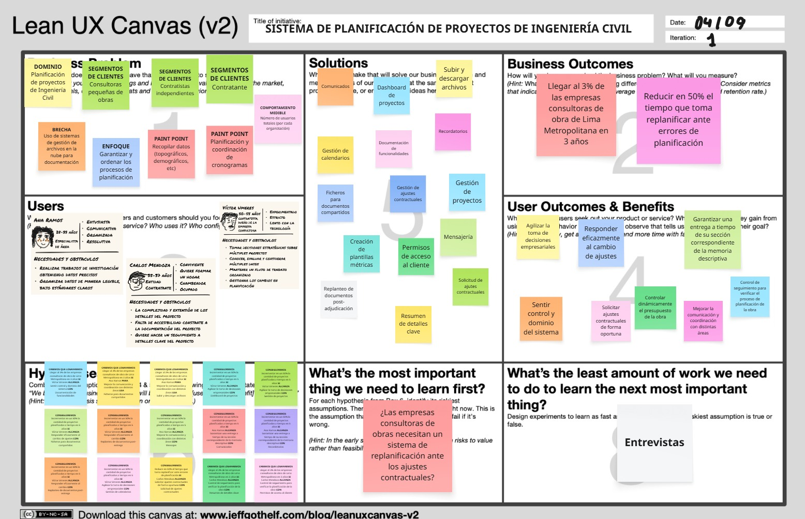

## 1.3. Segmentos Objetivo
**1. Contratista**

De acuerdo con los datos del OSCE, la mayoría de los líderes en este sector son hombres de alrededor de 40 años, con formación universitaria, lo que les permite dirigir proyectos de menor escala con eficiencia y calidad.  

Estudios complementarios del INEI y del Ministerio de Vivienda confirman esta tendencia, resaltando que en la construcción predominan empresas lideradas por profesionales en ese rango de edad, consolidando un perfil sólido enfocado en la optimización de recursos.  

- Género: Masculino  
- Edad promedio: 40 años  
- Formación: Educación universitaria en ingeniería civil o disciplinas afines  

**2. Especialista de Área**

La información del OSCE indica que estos profesionales, mayoritariamente hombres, tienen una edad promedio de 38 años y cuentan con estudios de posgrado o especializaciones en técnicas avanzadas.  

Los reportes del INEI refuerzan que la formación avanzada es un factor determinante para la competitividad en el sector.  

- Género: Masculino  
- Edad promedio: 38 años  
- Formación: Posgrado o especialización en técnicas avanzadas  

**3. Entidad Contratante**

El análisis de los datos del OSCE muestra que los clientes, en su mayoría hombres, presentan una edad promedio de 35 años y poseen formación técnica o universitaria.  

Estos resultados se complementan con estudios del INEI y reportes del Ministerio de Vivienda, los cuales evidencian que el perfil del contratante individual se orienta hacia soluciones accesibles y de calidad, esenciales para proyectos residenciales o comerciales de pequeña escala.  

- Género: Masculino  
- Edad promedio: 35 años  
- Formación: Educación técnica o universitaria  

# Capítulo II: Requirements Elicitation & Analysis

## 2.1. Competidores
### 2.1.1. Análisis Competitivo
El análisis competitivo es fundamental para desarrollar una estrategia sólida en el mercado, ya que permite comprender qué soluciones existen, cómo operan y qué valor ofrecen a los clientes. A través de esta metodología, se pueden detectar brechas en el mercado y evaluar qué necesidades de los clientes aún no están cubiertas. Por ese motivo, se presentará el siguiente cuadro con el análisis competitivo correspondiente.

<table style="width: 100%; border-collapse: collapse; text-align: left; page-break-inside: auto;">
    <thead>
        <tr>
            <th style="border: 1px solid #000; padding: 10px; font-weight: bold;" colspan="6">Competitive Analysis Landscape</th>
        </tr>
        <tr>
            <th style="border: 1px solid #000; padding: 10px;font-weight: bold;" colspan="2" rowspan="2">¿Por qué llevar a cabo este análisis?</th>
            <th style="border: 1px solid #000; padding: 10px;font-weight: bold;" colspan="4">¿Cuáles son las principales ventajas competitivas frente a nuestros competidores?</th>
        </tr>
        <tr>
            <td style="border: 1px solid #000; padding: 10px;" colspan="4">El resultado de analizar el mercado y a los competidores directos e indirectos proporciona datos que serán utilizados para delimitar estrategias con el fin de posicionar nuestro producto en el mercado competitivo.</td>
        </tr>
        <tr>
            <th style="border: 1px solid #000; padding: 10px;font-weight: bold;" colspan="2">(En la cabecera colocar por cada competidor nombre y logo)</th>
            <th style="border: 1px solid #000; padding: 10px;font-weight: bold; width: 20%; text-align: center;">GreatBuild
            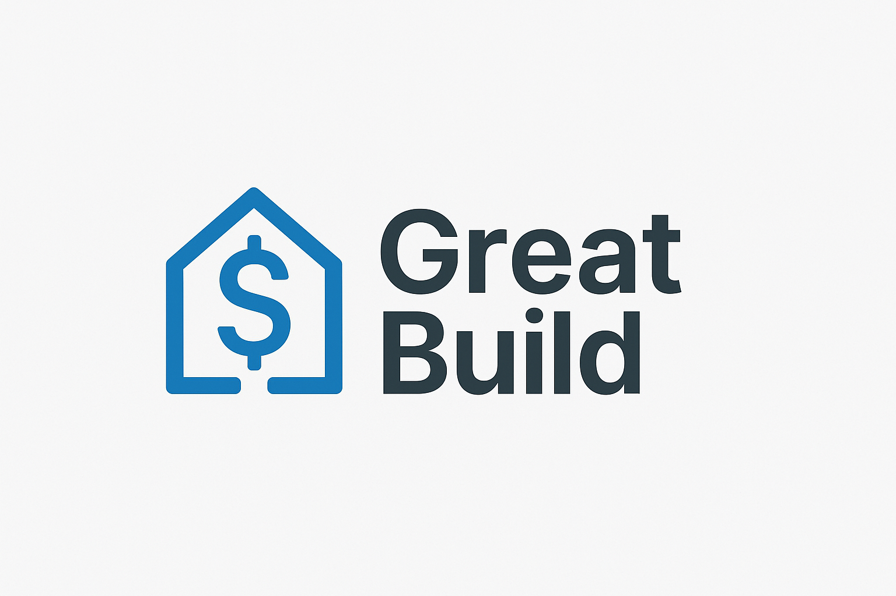
            </th>
            <th style="border: 1px solid #000; padding: 10px;font-weight: bold; width: 20%; text-align: center;">
                Autodesk Construction Cloud
                
            </th>
            <th style="border: 1px solid #000; padding: 10px;font-weight: bold; width: 20%; text-align: center;">
                Procore
                
            </th>
            <th style="border: 1px solid #000; padding: 10px;font-weight: bold; width: 20%; text-align: center;">
                Deltek ComputerEase
                
            </th>
        </tr>
    </thead>
    <tbody>
        <tr>
            <th style="border: 1px solid #000; padding: 10px; font-weight: normal; width: 12%; writing-mode: tb-rl; text-align: center; vertical-align: middle; white-space: nowrap; font-weight: bold; width: 8%;" rowspan="2">Perfil</th>
            <th style="border: 1px solid #000; padding: 10px; font-weight: normal; width: 12%;">Overview</th>
            <td style="border: 1px solid #000; padding: 10px;" style="text-align:center;">
                GreatBuild ofrece un sistema de gestión de proyectos de ingeniería civil diseñado para contratistas, consultoras pequeñas de obras y subcontratistas. La plataforma permite gestionar proyectos, planificar cronogramas, controlar costos, administrar documentación técnica y organizar expedientes técnicos en un solo lugar, asegurando eficiencia y cumplimiento de plazos.
            </td>
            <td style="border: 1px solid #000; padding: 10px;" style="text-align:center;">
                Esta plataforma conecta flujos de trabajo, equipos y datos en todas las etapas de la construcción, facilitando la colaboración y mejorando la eficiencia en proyectos de construcción.
            </td>
            <td style="border: 1px solid #000; padding: 10px;" style="text-align:center;">
                Procore ofrece una solución integral en línea para la gestión de proyectos de construcción, incluyendo control de costos, comunicaciones y colaboración, utilizada ampliamente en la industria.
            </td>
            <td style="border: 1px solid #000; padding: 10px;" style="text-align:center;">
                Software de contabilidad y gestión de proyectos de construcción que integra costos laborales con herramientas remotas, ayudando a las empresas a gestionar eficazmente sus proyectos y finanzas.
            </td>
        </tr>
        <tr>
            <th style="border: 1px solid #000; padding: 10px; font-weight: normal; width: 12%;">Ventaja competitiva ¿Qué valor ofrece a los clientes?</th>
            <td style="border: 1px solid #000; padding: 10px;" style="text-align:center;">
                GreatBuild se diferencia por ser una nube especializada en la gestión de proyectos de ingeniería civil, ofreciendo una solución integral que combina planificación, control de costos, gestión documental y expedientes técnicos en una sola plataforma.
            </td>
            <td style="border: 1px solid #000; padding: 10px;" style="text-align:center;">
                Ofrece una integración completa de herramientas para la gestión de proyectos de construcción, desde el diseño hasta la adjudicación.
            </td>
            <td style="border: 1px solid #000; padding: 10px;" style="text-align:center;">
                Procore destaca por su interfaz intuitiva y facilidad de uso, lo que permite a los equipos de construcción gestionar proyectos de manera efectiva sin necesidad de una curva de aprendizaje extensa.
            </td>
            <td style="border: 1px solid #000; padding: 10px;" style="text-align:center;">
                Se enfoca en ofrecer una solución integral para la planificación y gestión de proyectos en el sector de la construccción.
            </td>
        </tr>
        <tr>
            <th style="border: 1px solid #000; padding: 10px; font-weight: normal; width: 12%; writing-mode: tb-rl; text-align: center; vertical-align: middle; white-space: nowrap; font-weight: bold; width: 8%;" rowspan="5">Perfil de marketing</th>
            <th style="border: 1px solid #000; padding: 10px; font-weight: normal; width: 12%;">Mercado objetivo</th>
            <td style="border: 1px solid #000; padding: 10px;">
                <ul>
                    <li>Contratistas independientes.</li>
                    <li>Consultoras pequeñas de obras.</li>
                </ul>
            </td>
            <td style="border: 1px solid #000; padding: 10px;">
                <ul>
                    <li>Grandes empresas de construcción.</li>
                    <li>Consultoras de ingeniería.</li>
                </ul>
            </td>
            <td style="border: 1px solid #000; padding: 10px;">
                <ul>
                    <li>Contratistas generales.</li>
                    <li>Subcontratistas.</li>
                    <li>Empresas constructoras.</li>
                </ul>
            </td>
            <td style="border: 1px solid #000; padding: 10px;">
                <ul>
                    <li>Contratistas de construcción.</li>
                </ul>
            </td>
        </tr>
        <tr>
            <th style="border: 1px solid #000; padding: 10px; font-weight: normal; width: 12%;">Estrategias de marketing</th>
            <td style="border: 1px solid #000; padding: 10px;">
                <ul>
                    <li>Prueba Gratuita de 14 o 30 Días.</li>
                    <li>Casos de Éxito.</li>
                    <li>Campañas de redes sociales.</li>
                </ul> 
            </td>
            <td style="border: 1px solid #000; padding: 10px;">
                <ul>
                    <li>Marketing de Contenidos.</li>
                    <li>Webinars y Formación en Línea.</li>
                    <li>Publicidad Digital y Redes Sociales.</li>
                </ul>
            </td>
            <td style="border: 1px solid #000; padding: 10px;">
                <ul>
                    <li>Email Marketing.</li>
                    <li>Convenios con Empresas Constructoras y Gobiernos.</li>
                    <li>Eventos en línea.</li>
                </ul>
            </td>
            <td style="border: 1px solid #000; padding: 10px;">
                <ul>
                    <li>Eventos y Webinars de Capacitación.</li>
                    <li>Estrategia de Publicidad Directa.</li>
                    <li>Referencias y Testimonios.</li>
                </ul>
            </td>
        </tr>
        <tr>
            <th style="border: 1px solid #000; padding: 10px; font-weight: normal; width: 12%;">Productos & Servicios</th>
            <td style="border: 1px solid #000; padding: 10px;">
                <ul>
                    <li>Aplicación web para gestión de proyectos, planificación y optimización de recursos para agilizar los procesos y plazos del desarrollo de un proyecto.</li>
                    <li>Gestor de expedientes y fichas técnicas en base a roles predefinidos.</li>
                    <li>Funciona como nube para almacenamiento de documentos.</li>
                </ul>
            </td>
            <td style="border: 1px solid #000; padding: 10px;">
                <ul>
                    <li>Plataforma para la gestión de licitaciones y conexión con contratistas, facilitando la comunicación durante las fases iniciales del proyecto.</li>
                    <li>Herramienta para la gestión de planos y documentos en proyectos de construcción, permitiendo a los equipos acceder y actualizar información en tiempo real en la obra.</li>
                    <li>Servicios adicionales para adaptar el software a las necesidades específicas de cada cliente o tipo de proyecto.</li>
                </ul>
            </td>
            <td style="border: 1px solid #000; padding: 10px;">
                <ul>
                    <li>Construction Financials: Herramienta enfocada en la gestión financiera del proyecto, como presupuestos, órdenes de cambio y pagos a contratistas, integrando la contabilidad con la gestión del proyecto.</li>
                    <li>Consultoría personalizada: Servicios de implementación y consultoría para adaptar el software a las necesidades de cada cliente.</li>
                </ul>
            </td>
            <td style="border: 1px solid #000; padding: 10px;">
                <ul>
                    <li>Software de contabilidad para la construcción</li>
                    <li>Gestión de proyectos: Herramienta de gestión integral que ayuda a los contratistas a planificar, programar y controlar los proyectos, asegurando que se mantengan dentro del presupuesto y cronograma.</li>
                    <li>Soporte técnico y consultoría</li>
                </ul>
            </td>
        </tr>
        <tr>
            <th style="border: 1px solid #000; padding: 10px; font-weight: normal; width: 12%;">Precios & Costos</th>
            <td style="border: 1px solid #000; padding: 10px;" style="text-align:center;">
                GreatBuild brinda una modelo de precios basado en suscripción. Además, evalua las funciones y caracteristicas del software en base al cliente.
            </td>
            <td style="border: 1px solid #000; padding: 10px;" style="text-align:center;">
                Utiliza un modelo de precios basado en suscripción. Ofrece prubas gratuitas para su producto BIM 360.
            </td>
            <td style="border: 1px solid #000; padding: 10px;" style="text-align:center;">
                Procore utiliza un modelo de precios basado en suscripción. Los precios varian dependiendo de la organización, rondando entre $1,000 a $2,000 USD al mes. Además, ofrece una prueba gratuita de 14 días.
            </td>
            <td style="border: 1px solid #000; padding: 10px;" style="text-align:center;">
                Deltek ComputerEase ofrece un modelo basado en suscripción o licencias perpetuas, dependiendo de las necesidades del cliente. Asimismo, cuenta con una demostración gratuita que debe ser solicitada.
            </td>
        </tr>
        <tr>
            <th style="border: 1px solid #000; padding: 10px; font-weight: normal; width: 12%;">Canales de distribución (Web y/o Móvil)</th>
            <td style="border: 1px solid #000; padding: 10px;" style="text-align:center;">
                Aplicación web.
            </td>
            <td style="border: 1px solid #000; padding: 10px;" style="text-align:center;">
                Dispone de aplicación web y aplicación móvil.
            </td>
            <td style="border: 1px solid #000; padding: 10px;" style="text-align:center;">
                Dispone de aplicación web y aplicación móvil.
            </td>
            <td style="border: 1px solid #000; padding: 10px;" style="text-align:center;">
                Solo dispone de aplicación web.
            </td>
        </tr>
        <tr>
            <th style="border: 1px solid #000; padding: 10px; font-weight: normal; width: 12%; writing-mode: tb-rl; text-align: center; vertical-align: middle; white-space: nowrap; font-weight: bold; width: 8%;" rowspan="6">Análisis SWOT</th>
            <th style="border: 1px solid #000; padding: 10px; font-weight: normal; width: 12%;" colspan="5">Realice esto para su startup y sus competidores. Sus fortalezas deberían apoyar sus oportunidades y contribuir a lo que ustedes definen como su posible ventaja competitiva.</th>
        </tr>
        <tr>
            <th style="border: 1px solid #000; padding: 10px; font-weight: normal; width: 12%;">Fortalezas</th>
            <td style="border: 1px solid #000; padding: 10px;">
                <ul>
                    <li>Enfoque Específico en Ingeniería Civil.</li>
                    <li>Funciona como una nube.</li>
                    <li>Gestión Integral de Expedientes Técnicos.</li>
                </ul>
            </td>
            <td style="border: 1px solid #000; padding: 10px;">
                <ul>
                    <li>Es uno de los líderes en la tecnología BIM, lo que le permite ofrecer soluciones avanzadas para la gestión de la construcción desde la planificación hasta la adjudicación.</li>
                    <li>Esta posicionada como el estándar en la industria de la construcción.</li>
                    <li>Su infraestructura en la nube permite que los equipos de trabajo se conecten de manera remota desde cualquier lugar y dispositivo.</li>
                </ul>
            </td>
            <td style="border: 1px solid #000; padding: 10px;">
                <ul>
                    <li>Amplia red de colaboradores e integraciones con otros sistemas de la industria.</li>
                    <li>Ofrece una solución compacta, convirtiéndose en una opción atractiva para las grandes empresas.</li>
                </ul>
            </td>
            <td style="border: 1px solid #000; padding: 10px;">
                <ul>
                    <li>Ofrece tanto herramientas de contabilidad como de gestión de proyectos, lo que permite a los contratistas tener una visión clara de sus operaciones y finanzas.</li>
                    <li>Deltek ha ganado una base de clientes leales que aprecian la fiabilidad y la precisión de su software en la gestión financiera.</li>
                </ul>
            </td>
        </tr>
        <tr>
            <th style="border: 1px solid #000; padding: 10px; font-weight: normal; width: 12%;">Debilidades</th>
            <td style="border: 1px solid #000; padding: 10px;">
                <ul>
                    <li>Dependencia de Internet.</li>
                    <li>Requiere inversión en marketing y captación de clientes.</li>
                    <li>Funcionalidades menos competitivas.
                </ul>
            </td>
            <td style="border: 1px solid #000; padding: 10px;">
                <ul>
                    <li>El precio de las suscripciones puede ser alto, especialmente para empresas pequeñas o medianas.</li>
                    <li>Los productos de Autodesk pueden ser complejos y requerir tiempo para aprender a usarlos de manera eficiente, lo que puede ser una barrera para empresas pequeñas o sin experiencia.</li>
                </ul>
            </td>
            <td style="border: 1px solid #000; padding: 10px;">
                <ul>
                    <li>Aunque tiene muchas funciones, la personalización de algunas herramientas puede ser limitada en comparación con otros competidores.</li>
                    <li>Los costos de suscripciones pueden ser prohibitivos para pequeñas empresas o aquellos con presupuestos ajustados, especialmente cuando se incluyen módulos adicionales.</li>
                </ul>
            </td>
            <td style="border: 1px solid #000; padding: 10px;">
                <ul>
                    <li>Enfoque limitado en gestión de proyectos.</li>
                    <li>Interfaz menos moderna.</li>
                    <li>Precios menos competitivos.</li>
                </ul>
            </td>
        </tr>
        <tr>
            <th style="border: 1px solid #000; padding: 10px; font-weight: normal; width: 12%;">Oportunidades</th>
            <td style="border: 1px solid #000; padding: 10px;">
                <ul>
                    <li>Crecimiento del Sector Construcción.</li>
                    <li>Digitalización y Transformación Digital.</li>
                    <li>Integración con Otras Plataformas.</li>
                </ul>
            </td>
            <td style="border: 1px solid #000; padding: 10px;">
                <ul>
                    <li>Expansión a nuevos mercados.</li>
                    <li>Aumento de la demanda de soluciones colaborativas.</li>
                    <li>Avances tecnológicos.</li>
                </ul>
            </td>
            <td style="border: 1px solid #000; padding: 10px;">
                <ul>
                    <li>Crecimiento en mercados internacionales.</li>
                    <li>Innovación en la automatización.</li>
                    <li>Ampliación de funcionalidades.</li>
                </ul>
            </td>
            <td style="border: 1px solid #000; padding: 10px;">
                <ul>
                    <li>Expansión a nuevas funciones.</li>
                    <li>Integración con nuevas tecnologías.</li>
                    <li>Adopción de nuevas plataformas móviles.</li>
                </ul>
            </td>
        </tr>
        <tr>
            <th style="border: 1px solid #000; padding: 10px; font-weight: normal; width: 12%;">Amenazas</th>
            <td style="border: 1px solid #000; padding: 10px;">
                <ul>
                    <li>Resistencia al Cambio por Parte de Empresas Tradicionales.</li>
                    <li>Preocupaciones de Seguridad y Privacidad.</li>
                    <li>Integración al mercado como una startup emergente.</li>
                </ul>
            </td>
            <td style="border: 1px solid #000; padding: 10px;">
                <ul>
                    <li>Competencia creciente.</li>
                    <li>Riesgo de obsolescencia.</li>
                    <li>Condiciones económicas globales.</li>
                </ul>
            </td>
            <td style="border: 1px solid #000; padding: 10px;">
                <ul>
                    <li>Problemas con la adopción en mercados más pequeños.</li>
                    <li>Desafíos de integración.</li>
                </ul>
            </td>
            <td style="border: 1px solid #000; padding: 10px;">
                <ul>
                    <li>Presión de precios bajos.</li>
                    <li>Cambios tecnológicos rápidos.</li>
                    <li>Competencia de plataformas más completas.</li>
                </ul>
            </td>
        </tr>
    </tbody>
</table>

### 2.1.2. Estrategias y tácticas frente a competidores

#### 1. Destacar la Especialización en Ingeniería Civil y la Excelencia Técnica
* Contexto:
    * Fortalezas de los competidores: Se han consolidado como referentes en la industria, cuentan con una amplia red de colaboradores e integraciones, y ofrecen soluciones integrales que abarcan la gestión operativa y financiera.
    * Nuestras fortalezas: Enfoque especializado en ingeniería civil, operación basada en la nube y capacidad para gestionar expedientes técnicos de manera integral.
* Tactica:
    * Desarrollar estudios de caso y campañas de marketing que evidencien la efectividad de nuestra solución, resaltando la experiencia y conocimiento en el sector.

#### 2. Ofrecer Precios Competitivos y Optimizar la Usabilidad
* Contexto:
    * Debilidades de los competidores: Sus precios resultan poco accesibles para pequeñas y medianas empresas, y su alcance en gestión de proyectos suele ser limitado.
    * Nuestras debilidades: Se requiere mayor inversión en estrategias de marketing y captación de clientes, además de una fuerte dependencia de la conectividad a Internet.
* Tactica:
    * Implementar pruebas de usabilidad para asegurar que la interfaz sea intuitiva y sencilla, garantizando una experiencia de usuario eficiente y accesible.

#### 3. Aprovechar el Crecimiento del Mercado y la Transformación Digital
* Contexto:
    * Oportunidades en el mercado: Creciente demanda de soluciones colaborativas y expansión hacia mercados internacionales.
    * Nuestras oportunidades: Expansión del sector construcción y avance sostenido de la transformación digital.
* Tactica:
    * Diseñar campañas digitales orientadas a empresas que aún no han modernizado sus procesos, con el propósito de captar nuevos clientes y ampliar nuestra presencia en el mercado.

#### 4. Posicionar una Plataforma Flexible, Segura y Centrada en el Cliente
* Contexto:
    * Amenazas de los competidores: Baja adopción en mercados pequeños, velocidad de los cambios tecnológicos y una competencia cada vez más intensa.
    * Nuestras amenazas: Resistencia al cambio por parte de organizaciones tradicionales y preocupaciones en torno a la seguridad y privacidad de los datos.
* Tácticas:
    * Adaptar la plataforma a las necesidades de cada usuario, reduciendo la curva de aprendizaje y ofreciendo acompañamiento constante para fomentar confianza y facilitar la adopción.
    * Brindar garantías y certificaciones de seguridad que respalden nuestro compromiso con la protección de la información.
    * Habilitar mecanismos para que los clientes puedan dar retroalimentación sobre el avance de los proyectos, fortaleciendo la relación y mejorando el servicio de manera continua.

## 2.2. Entrevistas

### 2.2.1. Diseño de entrevistas

**Lista de preguntas**

Cada conjunto de preguntas fue diseñado de manera específica para los diferentes segmentos objetivo, con el propósito de comprender cómo desarrollan su trabajo, qué herramientas emplean y qué dificultades encuentran al planificar o modificar proyectos técnicos. Para garantizar un flujo natural durante las entrevistas, se recreó una conversación completa a modo de simulación, lo que permitió identificar quiebres en el ritmo o repeticiones innecesarias. A partir de ese ejercicio, se reorganizó el orden de las preguntas, manteniendo un enfoque coherente y dinámico sin sacrificar la precisión técnica.

Las preguntas numeradas con un solo dígito corresponden a las preguntas principales, orientadas a guiar la entrevista y generar información valiosa. En complemento, se incluyen preguntas secundarias que permiten profundizar según las respuestas del entrevistado, enriqueciendo así el análisis.

**Preguntas para Contratista / Proyectista**

**Empathy and Persona**

1. Primero, díganos un poco sobre usted y a qué se dedica.
- 1.1. En base a su respuesta, se pregunta los campos que no se hayan podido llenar directamente según el formato presente en Plantilla de datos generales.
2. Cuéntenos, ¿Cómo luce un día típico de trabajo para usted?
3. ¿Qué herramientas utiliza en su día a día para realizar o apoyarse en el desarrollo de estas labores?
4. De estas actividades, ¿Qué parte identifica usted como la más laboriosa o frustrante?
5. ¿Qué cree que necesite para revertir esta situación?
6. Y de ellas, ¿Cuál cree usted que es la más importante, y por qué razón?

**Domain Model**

7. Describir el dominio en base a lo aprendido autónomamente y en base a ello.
- 7.1. ¿Las secciones que hemos planteado son correctas? ¿Son un reflejo de su trabajo?
- 7.2. ¿Cuál de estas (del nuevo modelo) considera que es la más importante o fundamental para el éxito de la planificación del proyecto? ¿Por qué razón?
8. En base a su experiencia, ¿Cómo organiza los documentos de un expediente técnico? (directorios, carpetas, documentos)
9. ¿Cómo es la organización y repartición de tareas en la elaboración de un expediente técnico?
10. ¿Qué valor tiene la comunicación entre especialistas del expediente técnico?
11. ¿Qué otras áreas de la organización se involucran directa o indirectamente en la elaboración de los expedientes técnicos? ¿Cómo se relacionan con el equipo principal?
12. ¿Qué tan importante es el cumplimiento de plazos con respecto al expediente técnico? ¿Se realizan estimaciones de tiempo?
13. ¿Es posible que deba realizar cambios al expediente técnico durante su desarrollo o tras la adjudicación de la obra?
    - ¿Cómo se realiza este proceso y qué tan importante o difícil resulta para la organización lidiar con él?

**Preguntas para Especialista de área**

**Empathy and Persona**

1. Primero, díganos un poco sobre usted y a qué se dedica.
- 1.1. En base a su respuesta, se pregunta los campos que no se hayan podido llenar directamente según el formato presente en Plantilla de datos generales.
2. Cuéntenos, ¿Cómo es trabajar en la elaboración de un expediente técnico de obra / proyecto?
3. ¿Qué herramientas utiliza para apoyarse en el desarrollo de estas labores?
4. De estas actividades, ¿Qué parte identifica usted como la más laboriosa o frustrante?
5. ¿Qué cree que necesite para revertir esta situación?
6. Y de ellas, ¿Cuál cree usted que es la más importante, y por qué razón?

**Domain Model**

7. ¿Cómo obtiene la información o datos necesarios para elaborar su parte del expediente técnico?
8. ¿Qué procesos sigue para transformar esa información en entregables o documentos técnicos?
9. ¿Cómo presenta o entrega finalmente su trabajo? ¿En qué formato y a través de qué canal?
10. ¿Qué estándares, normativas o lineamientos debe cumplir en su especialidad?
11. ¿Cómo asegura que su trabajo cumpla con los cronogramas establecidos?
12. ¿Qué tan fácil o difícil es coordinar con su equipo directo? ¿Qué herramientas utilizan para ello?
13. ¿Cómo se comunica con otras áreas técnicas (como estructuras, arquitectura, etc.) durante el desarrollo del expediente?

**Preguntas para Entidad contratante**

**Empathy and Persona**

1. Primero, díganos un poco sobre usted y a qué se dedica.
- 1.1. En base a su respuesta, se pregunta los campos que no se hayan podido llenar directamente según el formato presente en Plantilla de datos generales
2. Cuéntenos, ¿Alguna vez se ha planteado construir su propio hogar? ¿Por qué?
3. En base a ello, ¿ha llegado a contactar a algún contratista o proyectista? ¿Qué impresión le dejaron?
- 3.1. ¿Por qué razón no ha contactado con ellos? ¿Es debido a algún factor de confianza?
4. ¿Conoce a alguien en su entorno (amigos, familiares, conocidos) que haya planificado la construcción de su hogar? ¿Cómo fue su experiencia?
5. Cuando empiece a planificar su vivienda, ¿qué expectativas tendría respecto al servicio?

**(Explicar brevemente la propuesta del proyecto al entrevistado).**

6. ¿Ha escuchado de algún proyecto similar a este?
- 6.1. ¿Qué piensa de ello?¿En qué cree que aportaría?
- 6.2. ¿Qué características añadiría para mejorar la experiencia?

**Tabla de datos generales**

La plantilla de datos generales permite obtener información básica sobre los entrevistados, como su entorno, personalidad, herramientas favoritas y preferencias tecnológicas. Esta información sirve como punto de partida para profundizar durante la entrevista.

<table style="
        width: 100%;
        text-align: left;
        font-size: 14px;">
  <thead>
    <tr>
      <th style="width: 50%; border: 1px solid #000;">Campo</th>
      <th style="width: 50%; border: 1px solid #000;">Valor</th>
    </tr>
  </thead>
  <tbody>
    <tr><td style="border: 1px solid #000;">Género</td><td style="border: 1px solid #000;"></td></tr>
    <tr><td style="border: 1px solid #000;">Personalidad</td><td style="border: 1px solid #000;"></td></tr>
    <tr><td style="border: 1px solid #000;">Nombre</td><td style="border: 1px solid #000;"></td></tr>
    <tr><td style="border: 1px solid #000;">Edad</td><td style="border: 1px solid #000;"></td></tr>
    <tr><td style="border: 1px solid #000;">Ocupación</td><td style="border: 1px solid #000;"></td></tr>
    <tr><td style="border: 1px solid #000;">Estado Civil</td><td style="border: 1px solid #000;"></td></tr>
    <tr><td style="border: 1px solid #000;">Dispositivos favoritos</td><td style="border: 1px solid #000;"></td></tr>
    <tr><td style="border: 1px solid #000;">Browsers (Safari, Google, Chrome, Mozilla, Edge, etc.)</td><td style="border: 1px solid #000;"></td></tr>
    <tr><td style="border: 1px solid #000;">Canales o medios de comunicación</td><td style="border: 1px solid #000;"></td></tr>
    <tr><td style="border: 1px solid #000;">Marcas e influencers</td><td style="border: 1px solid #000;"></td></tr>
  </tbody>
</table>

### 2.2.2. Registro de entrevistas

<table class="tabla-entrevista">
  <thead>
    <tr>
      <th style="
            text-align: left;
            padding: 12px;
            background-color: #f0f0f0;
            font-size: 22px;"><strong>SEGMENTO OBJETIVO: CONTRATISTA</strong></th>
      <th><strong>#1</strong></th>
    </tr>
  </thead>
  <tbody>
    <tr>
      <td colspan="2" style="padding: 0; vertical-align: top; background-color: #fff border-top: 1px solid #ddd;">
        

          

            
Datos generales

            <ul style="margin: 0; padding-left: 20px; list-style-type: disc; font-size: 1.05em; line-height: 1.7; color: #333;">
              <li><strong>Nombres: </strong>Mario Joaquín </li>
              <li><strong>Apellidos: </strong>Lopez Acuña </li>
              <li><strong>Edad: </strong>29 </li>
              <li><strong>Distrito: </strong>La Molina </li>
              <li><strong>URL Entrevista:</strong> <a href="https://upcedupe-my.sharepoint.com/:v:/g/personal/u20221b778_upc_edu_pe/EXUmfDv35CtJlqIayO7BJjsB5uF_qp8kDdevyEcgz3_gKw?e=qMDWgB&nav=eyJyZWZlcnJhbEluZm8iOnsicmVmZXJyYWxBcHAiOiJTdHJlYW1XZWJBcHAiLCJyZWZlcnJhbFZpZXciOiJTaGFyZURpYWxvZy1MaW5rIiwicmVmZXJyYWxBcHBQbGF0Zm9ybSI6IldlYiIsInJlZmVycmFsTW9kZSI6InZpZXcifX0%3D" target="_blank">Ver video</a></li>
              <li><strong>Timestamp:</strong> 00:00</li>
              <li><strong>Duración:</strong> 11:05</li>
            </ul>
          

          
        

      </td>
    </tr>
    <tr>
      <td colspan="2" style="padding: 0; vertical-align: top; background-color: #fff border-top: 1px solid #ddd;">
        

          
Resumen

          <ul style="padding-left: 20px; list-style-type: disc; color: #333; font-size: 1em; margin: 0;">
            <li><strong>Personalidad:</strong>  Guardián. Lleva la gran responsabilidad de dirigir una empresa con más de 30 años en el mercado que trabaja para el Estado Peruano. El cumplimiento de las normativas, los acuerdos y las expectativas de los clientes son su máxima prioridad.</li>
            <li><strong>Marcas:</strong> Microsoft, Autodesk Inc y S10. Son herramientas que utiliza en su trabajo.</li>
            <li><strong>Uso de tecnología:</strong> Minimo. Su empresa refleja un nivel de adopción de la tecnología bastante bajo, incluyendo prácticas poco convencionales como almacenar archivos en discos duros físicos.</li>
            <li><strong>Canales:</strong> WhatsApp. Lo usa como medio de comunicación y transferencia de archivos.</li>
            <li><strong>Browsers:</strong> Google Chrome. Sin razón en particular, posiblemente por la popularidad de Google.</li>
            <li><strong>Dispositivos:</strong> Celular y Laptop. Debido a su portabilidad.</li>
            <li><strong>Background:</strong> En 1992 fundó su empresa dedicada a la ejecución de obras para empresas privadas, consolidando experiencia como residente de obra. En la actualidad su empresa se dedica a la consultoría y elaboración de expedientes técnicos para el Estado Peruano. </li>
            <li>
              <strong>Frustraciones:</strong>
              <ul style="list-style-type: circle; padding-left: 20px;">
                <li>La adopción de tecnología.</li>
                <li>Capacitación de personal.</li>
              </ul>
            </li>
            <li>
              <strong>Flujos principales:</strong>
              <ul style="list-style-type: circle; padding-left: 20px;">
                <li>Estudios básicos (medidas descriptivas).</li>
                <li>Elaboración y seguimiento de calendario.</li>
                <li>Gestión de observaciones y compatibilidad.</li>
                <li>Seguimiento del contrato.</li>
              </ul>
            </li>
          </ul>
        

      </td>
    </tr>
  </tbody>
</table>

<table class="tabla-entrevista">
  <thead>
    <tr>
      <th style="
            text-align: left;
            padding: 12px;
            background-color: #f0f0f0;
            font-size: 22px;"><strong>SEGMENTO OBJETIVO: CONTRATISTA</strong></th>
      <th><strong>#2</strong></th>
    </tr>
  </thead>
  <tbody>
    <tr>
      <td colspan="2" style="padding: 0; vertical-align: top; background-color: #fff border-top: 1px solid #ddd;">
        

          

            
Datos generales

            <ul style="margin: 0; padding-left: 20px; list-style-type: disc; font-size: 1.05em; line-height: 1.7; color: #333;">
              <li><strong>Nombres: </strong>Álvaro Martín </li>
              <li><strong>Apellidos: </strong>Torres Huamani </li>
              <li><strong>Edad: </strong>27 </li>
              <li><strong>Distrito: </strong>San Juan de Lurigancho </li>
              <li><strong>URL Entrevista:</strong> <a href="https://upcedupe-my.sharepoint.com/:v:/g/personal/u20221b778_upc_edu_pe/EXUmfDv35CtJlqIayO7BJjsB5uF_qp8kDdevyEcgz3_gKw?e=qMDWgB&nav=eyJyZWZlcnJhbEluZm8iOnsicmVmZXJyYWxBcHAiOiJTdHJlYW1XZWJBcHAiLCJyZWZlcnJhbFZpZXciOiJTaGFyZURpYWxvZy1MaW5rIiwicmVmZXJyYWxBcHBQbGF0Zm9ybSI6IldlYiIsInJlZmVycmFsTW9kZSI6InZpZXcifX0%3D" target="_blank">Ver video</a></li>
              <li><strong>Timestamp:</strong> 11:05</li>
              <li><strong>Duración:</strong> 07:20</li>
            </ul>
          

          
        

      </td>
    </tr>
    <tr>
      <td colspan="2" style="padding: 0; vertical-align: top; background-color: #fff border-top: 1px solid #ddd;">
        

          
Resumen

          <ul style="padding-left: 20px; list-style-type: disc; color: #333; font-size: 1em; margin: 0;">
            <li><strong>Personalidad:</strong> Guardian. Demuestra un claro respeto por las normas y el cumplimiento de los acuerdos.</li>
            <li><strong>Marcas:</strong> Microsoft y Autodesk Inc. Principalmente sigue marcas porque ofrecen herramientas o soluciones valiosas para su trabajo.</li>
            <li><strong>Uso de tecnología:</strong> Medio, práctico. Posee habilidades de navegación, ofimática y uso de software específico para su trabajo.</li>
            <li><strong>Canales:</strong> Plataformas y herramientas de Microsoft (Microsoft Teams, por ejemplo). Demuestra un grado de integración alto con las herramientas de ofimática de Microsoft.</li>
            <li><strong>Browsers:</strong> Google Chrome. Sin una razón específica, posiblemente debido a la popularidad de Google.</li>
            <li><strong>Dispositivos:</strong> Celular y Laptop. Esto es debido a la portabilidad, lo que le permite seguir trabajando sin estar atado a una oficina.</li>
            <li><strong>Background:</strong> Su experiencia ha estado tanto en la parte administrativa (como gerente) como en la parte operativa (como residente de obra), actividad que suele extrañar. </li>
            <li>
              <strong>Frustraciones:</strong>
              <ul style="list-style-type: circle; padding-left: 20px;">
                <li>El factor distancia, pues no siempre puede estar en el lugar de la obra para dar su mejor juicio.</li>
                <li>La poca interconexión entre sistemas, pues muchos procesos dependen de autorizaciones que terminan en lo manual, muchas veces.</li>
              </ul>
            </li>
            <li>
              <strong>Flujos principales:</strong>
              <ul style="list-style-type: circle; padding-left: 20px;">
                <li>Comunicación / contacto con el cliente.</li>
                <li>Seguimiento de normativas y acuerdos (contratos).</li>
                <li>Conceder y solicitar autorización entre distintas áreas.</li>
                <li>Seguimiento y cumplimiento de calendarización.</li>
              </ul>
            </li>
          </ul>
        

      </td>
    </tr>
  </tbody>
</table>

<table class="tabla-entrevista">
  <thead>
    <tr>
      <th style="
            text-align: left;
            padding: 12px;
            background-color: #f0f0f0;
            font-size: 22px;"><strong>SEGMENTO OBJETIVO: CONTRATISTA</strong></th>
      <th><strong>#3</strong></th>
    </tr>
  </thead>
  <tbody>
    <tr>
      <td colspan="2" style="padding: 0; vertical-align: top; background-color: #fff border-top: 1px solid #ddd;">
        

          

            
Datos generales

            <ul style="margin: 0; padding-left: 20px; list-style-type: disc; font-size: 1.05em; line-height: 1.7; color: #333;">
              <li><strong>Nombres: </strong>Jorge Rolando </li>
              <li><strong>Apellidos: </strong>García Roca </li>
              <li><strong>Edad: </strong>30 </li>
              <li><strong>URL Entrevista:</strong> <a href="poner el link del video">Ver video</a></li>
              <li><strong>Timestamp:</strong> 18:26</li>
              <li><strong>Duración:</strong> 09:00</li>
            </ul>
          

          
        

      </td>
    </tr>
    <tr>
      <td colspan="2" style="padding: 0; vertical-align: top; background-color: #fff border-top: 1px solid #ddd;">
        

          
Resumen

          <ul style="padding-left: 20px; list-style-type: disc; color: #333; font-size: 1em; margin: 0;">
            <li><strong>Personalidad:</strong> Guardián. Como contratista de ejecución de obra, entiende la importancia de seguir lo establecido en el expediente técnico.</li>
            <li><strong>Marcas:</strong> Microsoft, Autodesk Inc y S10. Son herramientas que utiliza en su trabajo.</li>
            <li><strong>Uso de tecnología:</strong> Mínimo. Su empresa refleja un nivel de adopción de la tecnología bastante bajo, sin un grado de integración completa en las operaciones de empresa.</li>
            <li><strong>Canales:</strong> WhatsApp y Telegram. Los usa como canales de comunicación.</li>
            <li><strong>Browsers:</strong> Google Chrome. Sin razón en particular, posiblemente por la popularidad de Google.</li>
            <li><strong>Dispositivos:</strong> Celular y PC. Son aquellos que le resultan más familiares.</li>
            <li><strong>Background:</strong> Es gerente de su propia empresa dedicada a la ejecución de acabados finos en obras, públicas o privadas.</li>
            <li>
              <strong>Frustraciones:</strong>
              <ul style="list-style-type: circle; padding-left: 20px;">
                <li>Realizar consultas al residente de obra ante incompatibilidad de planos.</li>
              </ul>
            </li>
            <li>
              <strong>Flujos principales:</strong>
              <ul style="list-style-type: circle; padding-left: 20px;">
                <li>Seguir y cumplir los lineamientos de el expediente técnico.</li>
                <li>Realizar consultas o solicitar revisiones ante incompatibilidad de planos.</li>
              </ul>
            </li>
          </ul>
        

      </td>
    </tr>
  </tbody>
</table>

<table class="tabla-entrevista">
  <thead>
    <tr>
      <th style="
            text-align: left;
            padding: 12px;
            background-color: #f0f0f0;
            font-size: 22px;"><strong>SEGMENTO OBJETIVO: ESPECIALISTA</strong></th>
      <th><strong>#1</strong></th>
    </tr>
  </thead>
  <tbody>
    <tr>
      <td colspan="2" style="padding: 0; vertical-align: top; background-color: #fff border-top: 1px solid #ddd;">
        

          

            
Datos generales

            <ul style="margin: 0; padding-left: 20px; list-style-type: disc; font-size: 1.05em; line-height: 1.7; color: #333;">
              <li><strong>Nombres: </strong>Bryan </li>
              <li><strong>Apellidos: </strong>Espejo </li>
              <li><strong>Edad: </strong>28 </li>
              <li><strong>URL Entrevista:</strong> <a href="https://upcedupe-my.sharepoint.com/:v:/g/personal/u202218110_upc_edu_pe/EaXm8JKIl2tJuBEe8dJViRkBDhAqC27mTxNw2yEHDqvv4Q?e=IGj6qN&nav=eyJyZWZlcnJhbEluZm8iOnsicmVmZXJyYWxBcHAiOiJTdHJlYW1XZWJBcHAiLCJyZWZlcnJhbFZpZXciOiJTaGFyZURpYWxvZy1MaW5rIiwicmVmZXJyYWxBcHBQbGF0Zm9ybSI6IldlYiIsInJlZmVycmFsTW9kZSI6InZpZXcifX0%3D">Ver video</a></li>
              <li><strong>Timestamp:</strong> 28:02</li>
              <li><strong>Duración:</strong> 05:27</li>
            </ul>
          

          
        

      </td>
    </tr>
    <tr>
      <td colspan="2" style="padding: 0; vertical-align: top; background-color: #fff border-top: 1px solid #ddd;">
        

          
Resumen

          <ul style="padding-left: 20px; list-style-type: disc; color: #333; font-size: 1em; margin: 0;">
            <li><strong>Personalidad:</strong> Innovador, colaborador, analítico y oridentado a resultados.</li>
            <li><strong>Marcas:</strong> Autodesk, BIM360, Contech influencers. Son herramientas que utiliza en su trabajo.</li>
            <li><strong>Canales:</strong> Email corporativo, Microsoft Teams, WhatsApp Business, Trello.</li>
            <li><strong>Browsers:</strong> Google Chrome, Mircosoft Edge</li>
            <li><strong>Dispositivos:</strong> Laptop y celular.</li>
            <li>
              <strong>Frustraciones:</strong>
              <ul style="list-style-type: circle; padding-left: 20px;">
                <li>Revisar que los metrados y presupuestos estén alineados con los planos, ya que las inconsistencias obligan a validar varias veces.</li>
    <li>Recibir información inicial poco clara (planos y especificaciones), lo que complica todo el trabajo posterior.</li>
    <li>Dependencia de un cruce manual entre planos, metrados y presupuestos, aumentando la probabilidad de errores.</li>
    <li>Dificultades de coordinación porque cada especialista trabaja a un ritmo distinto, lo que genera retrasos.</li>
              </ul>
            </li>
            <li>
              <strong>Flujos principales:</strong>
              <ul style="list-style-type: circle; padding-left: 20px;">
                <li>Recepción de planos y términos de referencia del cliente.</li>
                <li>Extracción de metrados a partir de los planos en AutoCAD/Civil 3D.</li>
                <li>Elaboración de presupuestos y control en Excel.</li>
                <li>Coordinación y comunicación con proyectistas y especialistas.</li>
                <li>Seguimiento de cronogramas con fases y recordatorios en Google Calendar.</li>
              </ul>
            </li>
          </ul>
        

      </td>
    </tr>
  </tbody>
</table>

<table class="tabla-entrevista">
  <thead>
    <tr>
      <th style="
            text-align: left;
            padding: 12px;
            background-color: #f0f0f0;
            font-size: 22px;"><strong>SEGMENTO OBJETIVO: ESPECIALISTA</strong></th>
      <th><strong>#2</strong></th>
    </tr>
  </thead>
  <tbody>
    <tr>
      <td colspan="2" style="padding: 0; vertical-align: top; background-color: #fff border-top: 1px solid #ddd;">
        

          

            
Datos generales

            <ul style="margin: 0; padding-left: 20px; list-style-type: disc; font-size: 1.05em; line-height: 1.7; color: #333;">
              <li><strong>Nombres: </strong>Juan Manuel </li>
              <li><strong>Apellidos: </strong>Santos </li>
              <li><strong>Edad: </strong>25 </li>
              <li><strong>URL Entrevista:</strong> <a href="https://upcedupe-my.sharepoint.com/:v:/g/personal/u202218110_upc_edu_pe/ER4P_mI9465Lk4gnybJnVtIBoEfEy4FL4OuIu7wVAdAWZw?e=XNXkUi&nav=eyJyZWZlcnJhbEluZm8iOnsicmVmZXJyYWxBcHAiOiJTdHJlYW1XZWJBcHAiLCJyZWZlcnJhbFZpZXciOiJTaGFyZURpYWxvZy1MaW5rIiwicmVmZXJyYWxBcHBQbGF0Zm9ybSI6IldlYiIsInJlZmVycmFsTW9kZSI6InZpZXcifX0%3D">Ver video</a></li>
              <li><strong>Timestamp:</strong> 33:07</li>
              <li><strong>Duración:</strong> 06:17</li>
            </ul>
          

          
        

      </td>
    </tr>
    <tr>
      <td colspan="2" style="padding: 0; vertical-align: top; background-color: #fff border-top: 1px solid #ddd;">
        

          
Resumen

          <ul style="padding-left: 20px; list-style-type: disc; color: #333; font-size: 1em; margin: 0;">
            <li><strong>Personalidad:</strong> Colaborador, trabaja en equipo y comunicación efectiva.</li>
            <li><strong>Marcas:</strong> Autodesk, BIM360</li>
            <li><strong>Canales:</strong> Microsoft Teams, WhatsApp y correo.</li>
            <li><strong>Browsers:</strong> Google Chrome</li>
            <li><strong>Dispositivos:</strong> Laptop y celular.</li>
            <li>
              <strong>Frustraciones:</strong>
              <ul style="list-style-type: circle; padding-left: 20px;">
                <li>Integrar información de distintas especialidades (estructuras, arquitectura, instalaciones), ya que los datos llegan en formatos distintos y con inconsistencias.</li>
                  <li>Necesidad de validar constantemente normativas y requisitos, lo que consume tiempo adicional.</li>
                  <li>Dificultades en la coordinación entre equipos por diversidad de disciplinas y herramientas utilizadas.</li>
              </ul>
            </li>
            <li>
              <strong>Flujos principales:</strong>
              <ul style="list-style-type: circle; padding-left: 20px;">
                 <li>Obtención de información mediante entrevistas, planos preliminares y normativas.</li>
    <li>Validación de normativas y requisitos de la entidad contratante.</li>
    <li>Estandarización de formatos y plantillas de trabajo.</li>
                  <li>Entrega final en PDF y DWG mediante correo, nube o plataformas colaborativas.</li>
    <li>Planificación y control de cronogramas con Trello/MS Project.</li>
    <li>Coordinación continua con equipos mediante Teams, Trello y WhatsApp Business.</li>
              </ul>
            </li>
          </ul>
        

      </td>
    </tr>
  </tbody>
</table>

<table class="tabla-entrevista">
  <thead>
    <tr>
      <th style="
            text-align: left;
            padding: 12px;
            background-color: #f0f0f0;
            font-size: 22px;"><strong>SEGMENTO OBJETIVO: ESPECIALISTA</strong></th>
      <th><strong>#3</strong></th>
    </tr>
  </thead>
  <tbody>
    <tr>
      <td colspan="2" style="padding: 0; vertical-align: top; background-color: #fff border-top: 1px solid #ddd;">
        

          

            
Datos generales

            <ul style="margin: 0; padding-left: 20px; list-style-type: disc; font-size: 1.05em; line-height: 1.7; color: #333;">
              <li><strong>Nombres: </strong>Jeremy </li>
              <li><strong>Apellidos: </strong>Escudero </li>
              <li><strong>Edad: </strong>27 </li>
              <li><strong>URL Entrevista:</strong> <a href="https://upcedupe-my.sharepoint.com/:v:/g/personal/u202218110_upc_edu_pe/EWUwAvoIjZxGmilwGb2EKwYBkuAENoFbcbiRkpcpFgKuVA?e=H4V9ha&nav=eyJyZWZlcnJhbEluZm8iOnsicmVmZXJyYWxBcHAiOiJTdHJlYW1XZWJBcHAiLCJyZWZlcnJhbFZpZXciOiJTaGFyZURpYWxvZy1MaW5rIiwicmVmZXJyYWxBcHBQbGF0Zm9ybSI6IldlYiIsInJlZmVycmFsTW9kZSI6InZpZXcifX0%3D">Ver video</a></li>
              <li><strong>Timestamp:</strong> 39:48</li>
              <li><strong>Duración:</strong> 04:58</li>
            </ul>
          

          
        

      </td>
    </tr>
    <tr>
      <td colspan="2" style="padding: 0; vertical-align: top; background-color: #fff border-top: 1px solid #ddd;">
        

          
Resumen

          <ul style="padding-left: 20px; list-style-type: disc; color: #333; font-size: 1em; margin: 0;">
            <li><strong>Personalidad:</strong> Responsable, práctico y orientado a los resultados.</li>
            <li><strong>Marcas:</strong> Autodesk, Bentley Systems, Construtech LATAM.</li>
            <li><strong>Canales:</strong> Correo corporativo, WhatsApp y Microsoft Teams.</li>
            <li><strong>Browsers:</strong> Google Chrome, Mircosoft Edge</li>
            <li><strong>Dispositivos:</strong> Laptop y celular.</li>
            <li>
              <strong>Frustraciones:</strong>
              <ul style="list-style-type: circle; padding-left: 20px;">
                <li>Consolidar la información de todas las especialidades. Los errores de coordinación generan observaciones que retrasan la aprobación del expediente técnico.</li>
    <li>Altos niveles de presión por tiempos ajustados y múltiples revisiones que demandan rehacer entregables.</li>
              </ul>
            </li>
            <li>
              <strong>Flujos principales:</strong>
              <ul style="list-style-type: circle; padding-left: 20px;">
                <li>Elaboración de estudios básicos y cálculos técnicos.</li>
                <li>Revisión de planos y consistencia entre especialidades.</li>
                <li>Elaboración de metrados, presupuestos y análisis de costos.</li>
                <li>Generación de reportes, memorias y entregables.</li>
              </ul>
            </li>
          </ul>
        

      </td>
    </tr>
  </tbody>
</table>

<table class="tabla-entrevista">
  <thead>
    <tr>
      <th style="
            text-align: left;
            padding: 12px;
            background-color: #f0f0f0;
            font-size: 22px;"><strong>SEGMENTO OBJETIVO: ENTIDAD CONTRATANTE</strong></th>
      <th><strong>#1</strong></th>
    </tr>
  </thead>
  <tbody>
    <tr>
      <td colspan="2" style="padding: 0; vertical-align: top; background-color: #fff border-top: 1px solid #ddd;">
        

          

            
Datos generales

            <ul style="margin: 0; padding-left: 20px; list-style-type: disc; font-size: 1.05em; line-height: 1.7; color: #333;">
              <li><strong>Nombres: Maryori</strong> </li>
              <li><strong>Apellidos: Atanacio Cruces</strong> </li>
              <li><strong>Edad: 24 años</strong> </li>
              <li><strong>Distrito: San Juan de Lurigancho</strong> </li>
              <li><strong>URL Entrevista:</strong> <a href="https://upcedupe-my.sharepoint.com/:v:/g/personal/u20221b778_upc_edu_pe/EXUmfDv35CtJlqIayO7BJjsB5uF_qp8kDdevyEcgz3_gKw?e=qMDWgB&nav=eyJyZWZlcnJhbEluZm8iOnsicmVmZXJyYWxBcHAiOiJTdHJlYW1XZWJBcHAiLCJyZWZlcnJhbFZpZXciOiJTaGFyZURpYWxvZy1MaW5rIiwicmVmZXJyYWxBcHBQbGF0Zm9ybSI6IldlYiIsInJlZmVycmFsTW9kZSI6InZpZXcifX0%3D" target="_blank">Ver video</a></li>
              <li><strong>Timestamp:</strong> 44:45</li>
              <li><strong>Duración: 05:24 minutos</strong> </li>
            </ul>
          

          
        

      </td>
    </tr>
    <tr>
      <td colspan="2" style="padding: 0; vertical-align: top; background-color: #fff border-top: 1px solid #ddd;">
        

          
Resumen

          <ul style="padding-left: 20px; list-style-type: disc; color: #333; font-size: 1em; margin: 0;">
            <li><strong>Personalidad: Muy alegre</strong> </li>
            <li><strong>Marcas: Urbania</strong> </li>
            <li><strong>Uso de tecnología: Android y Windows</strong> </li>
            <li><strong>Canales: Facebook, Instagram y Youtube</strong>  </li>
            <li><strong>Browsers: Google</strong> </li>
            <li><strong>Dispositivos: Teléfono y laptop</strong> </li>
            <li>
              <strong>Frustraciones: Falta de confianza</strong>
              <ul style="list-style-type: circle; padding-left: 20px;">
              </ul>
            </li>
            <li>
              <strong>Flujos principales:</strong>
              <ul style="list-style-type: circle; padding-left: 20px;">
                <li>Contactar con el proyectista.</li>
              </ul>
            </li>
          </ul>
        

      </td>
    </tr>
  </tbody>
</table> 

<table class="tabla-entrevista">
  <thead>
    <tr>
      <th style="
            text-align: left;
            padding: 12px;
            background-color: #f0f0f0;
            font-size: 22px;"><strong>SEGMENTO OBJETIVO: ENTIDAD CONTRATANTE</strong></th>
      <th><strong>#2</strong></th>
    </tr>
  </thead>
  <tbody>
    <tr>
      <td colspan="2" style="padding: 0; vertical-align: top; background-color: #fff border-top: 1px solid #ddd;">
        

          

            
Datos generales

            <ul style="margin: 0; padding-left: 20px; list-style-type: disc; font-size: 1.05em; line-height: 1.7; color: #333;">
              <li><strong>Nombres: Jefry Alfredo</strong> </li>
              <li><strong>Apellidos: Prado Remón</strong> </li>
              <li><strong>Edad: 24 años</strong> </li>
              <li><strong>Distrito: San Juan de Lurigancho</strong> </li>
              <li><strong>URL Entrevista:</strong> <a href="https://upcedupe-my.sharepoint.com/:v:/g/personal/u20221b778_upc_edu_pe/ER9bt6vsEx1IgnmR-Iog4AEBGuRPJ5qfXmp1LLslX6VnGA?e=OjTzcZ&nav=eyJyZWZlcnJhbEluZm8iOnsicmVmZXJyYWxBcHAiOiJTdHJlYW1XZWJBcHAiLCJyZWZlcnJhbFZpZXciOiJTaGFyZURpYWxvZy1MaW5rIiwicmVmZXJyYWxBcHBQbGF0Zm9ybSI6IldlYiIsInJlZmVycmFsTW9kZSI6InZpZXcifX0%3D" target="_blank">Ver video</a></li>
              <li><strong>Timestamp:</strong> 50:09</li>
              <li><strong>Duración: 04:15 minutos</strong> </li>
            </ul>
          

          
        

      </td>
    </tr>
    <tr>
      <td colspan="2" style="padding: 0; vertical-align: top; background-color: #fff border-top: 1px solid #ddd;">
        

          
Resumen

          <ul style="padding-left: 20px; list-style-type: disc; color: #333; font-size: 1em; margin: 0;">
            <li><strong>Personalidad: Muy responsable</strong> </li>
            <li><strong>Marcas: Urbania</strong> </li>
            <li><strong>Uso de tecnología: Android y Windows</strong> </li>
            <li><strong>Canales: Facebook, TikTok e Instragram</strong>  </li>
            <li><strong>Browsers: Chrome</strong> </li>
            <li><strong>Dispositivos: Teléfono y Laptop</strong> </li>
            <li>
              <strong>Frustraciones: Considera que tiene una falta de experiencia que le permita poder contratar a una persona ideal</strong>
              <ul style="list-style-type: circle; padding-left: 20px;">
              </ul>
            </li>
            <li>
              <strong>Flujos principales:</strong>
              <ul style="list-style-type: circle; padding-left: 20px;">
                <li>Contactar con el proyectista.</li>
                <li>Presentar el requerimiento del proyecto.</li>
              </ul>
            </li>
          </ul>
        

      </td>
    </tr>
  </tbody>
</table>

### 2.2.3. Análisis de entrevistas

**CONTRATISTAS**

**1. Resumen:** Los contratistas son en su mayoría varones adultos con experiencia previa como residentes de obra. Actualmente desempeñan la función de gerentes en oficinas, alejados del área operativa, lo cual les genera cierta nostalgia por “los viejos tiempos” en campo. Son personas sencillas, de trato directo y verbo fluido, con un alto respeto por las normas y los acuerdos establecidos. Presentan ciertas dificultades en el uso de tecnologías digitales, aunque muestran disposición al aprendizaje, motivados principalmente por aumentar la eficiencia de su organización.

**2. Edad:**  Las edades de los entrevistados de este segmento están en mediados de llegar a los 30 años de edad. Se toma como edad representativa la media aritmética de los datos.

| Entrevistado | Mario López | Alvaro Torres | Jorge García | Valor representativo |
|-|-|-|-|-|
| **Edad** | 29 | 27 | 30 | 29 |

**3. Personalidad:** La totalidad de los entrevistados (100%) se alínean al arquetipo de personalidad *Guardián*, debido a su respeto irrestricto y meticuloso de las normas y acuerdos. Se toma este arquetipo de personalidad como representativo.

| Entrevistado | Mario López | Alvaro Torres | Jorge García | Valor representativo |
|-|-|-|-|-|
| **Personalidad** | Guardián | Guardián | Guardián | Guardián |

**4. Marcas e influencers:** La totalidad de los entrevistados (100%) mencionó las marcas Microsoft y Autodesk. De ellos, la gran mayoría (66.7%) mencionaron la marca S10. Se toma como marcas representativas Microsoft, Autodesk y S10.

| Marca | Frecuencia Absoluta | Frecuencia Relativa | Entrevistados que la siguen (%) |
|-|-|-|-|
| Microsoft | 3 | 37.5% | 100% |
| Autodesk Inc. | 3 | 37.5% | 100% |
| S10 | 2 | 25% | 66.7% |
| **Total** | 8 | 100% | - |

**5. Uso de tecnología:** La gran mayoría de los entrevistados (66.7%) demostró un nivel bajo de dominio e integración de la tecnología en su trabajo y vida diaria, mientras que la menor parte (33.3%) mostró un nivel intermedio. Se toma como nivel de uso de tecnología representativo el nivel Bajo.

| Nivel de uso de tecnología | Frecuencia Absoluta | % de entrevistados en este nivel |
|-|-|-|
| Bajo | 2 | 66.7% |
| Medio | 1 | 33.3% |
| Alto | 0 | 0% |
| **Total** | 3 | 100% |

**6. Canales:** La gran mayoría de los entrevistados (66.7%) mencionó utilizar WhatsApp como canal de comunicación, especialmente para el trabajo, mientras que la menor parte (33.3%) mencionó utilizar el ecosistema de Microsoft y Telegram.

| Canal de comunicación | Frecuencia Absoluta | Frecuencia Relativa | Entrevistados que lo usan (%) |
|-|-|-|-|
| WhatsApp | 2 | 50% | 66.7% |
| Ecosistema Microsoft | 1 | 25% | 33.3% |
| Telegram | 1 | 25% | 33.3% |
| **Total** | 4 | 100% | - |

**7. Browsers:** La totalidad de los entrevistados (100%) mencionó utilizar exclusivamente Google Chrome como su navegador web. Esta preferencia podría estar relacionada con su bajo nivel de dominio tecnológico, lo que los lleva a mantenerse en entornos digitales conocidos y seguros, sin explorar otras alternativas disponibles. Se toma como representativa la única alternativa mencionada.

| Navegador Web | Frecuencia Absoluta | Frecuencia Relativa | Entrevistados que lo usan (%) |
|-|-|-|-|
| Google Chrome | 3 | 100% | 100% |
| **Total** | 3 | 100% | - |

**8. Dispositivos:** La totalidad de los entrevistados (100%) mencionó utilizar el celular como herramienta principal para acceder a recursos digitales. La gran mayoría (66.7%) reportó el uso de Laptops, mientras que una menor parte reportó el uso de computadoras de escritorio (33.3%). Se toma como representativa la clara tendencia hacia la portabilidad (Celular y Laptop).

| Dispositivo | Frecuencia Absoluta | Frecuencia Relativa | Entrevistados que lo usan (%) |
|-|-|-|-|
| Celular | 3 | 50% | 100% |
| Laptop | 2 | 33.3% | 66.7% |
| PC | 1 | 16.7% | 33.3% |
| **Total** | 6 | 100% | - |

**9. Flujos principales:** La totalidad de los entrevistados (100%) señaló la importancia del seguimiento y cumplimiento del calendario. La gran mayoría (66.7%) destacó la importancia del seguimiento del contrato y la gestión de observaciones y compatibilidad de los planos. De manera aislada se mencionaron otros flujos como el contacto con el cliente o la recaudación ded medidas descriptivas, entre otras. Estos últimos flujos tienen cierto grado de solapamiento con los flujos principales mayoritarios, cumpliendo un rol de apoyo o soporte.

| Flujo de trabajo | Frecuencia Absoluta | Frecuencia Relativa | Entrevistados que lo priorizan (%) |
|-|-|-|-|
| Comunicación / contacto con el cliente | 1 | 9.1% | 33.3% |
| Conceder y solicitar autorización entre distintas áreas | 1 | 9.1% | 33.3% |
| Estudios básicos (medidas descriptivas) | 1 | 9.1% | 33.3% |
| Elaboración del calendario | 1 | 9.1% | 33.3% |
| Seguimiento y cumplimiento del calendario | 3 | 27.3% | 100% |
| Seguimiento del contrato | 2 | 18.2% | 66.7% |
| Gestión de observaciones y compatibilidad de planos | 2 | 18.2% | 66.7% |
| **Total** | 11 | 100% | - |

## 2.3. Needfinding

### 2.3.1. User Personas

Para la definición de los segmentos objetivo se tomaron en cuenta principalmente características demográficas extraídas de las entrevistas. Estos datos sirvieron como base para construir los perfiles de los User Personas y, a su vez, para reconocer sus motivaciones e intereses. De manera complementaria, se incorporaron también aspectos relacionados con sus competencias, hábitos y preferencias en el uso de tecnología y herramientas, los cuales fueron identificados durante el análisis de las entrevistas.

**Contratistas**

Edilberto Cáceres es ingeniero civil de 29 años que inició su carrera como asistente y luego residente de obra, adquiriendo habilidades fundamentales en gestión de proyectos y en la resolución de imprevistos en campo. Actualmente dirige una pequeña empresa consultora dedicada a la elaboración de expedientes técnicos para proyectos de obra civil, enfocándose en asegurar la calidad de los entregables y el cumplimiento de la normativa vigente. Se le reconoce por su profesionalismo, su compromiso con la excelencia técnica y su capacidad para brindar soluciones viables tanto a entidades públicas como a clientes privados.

  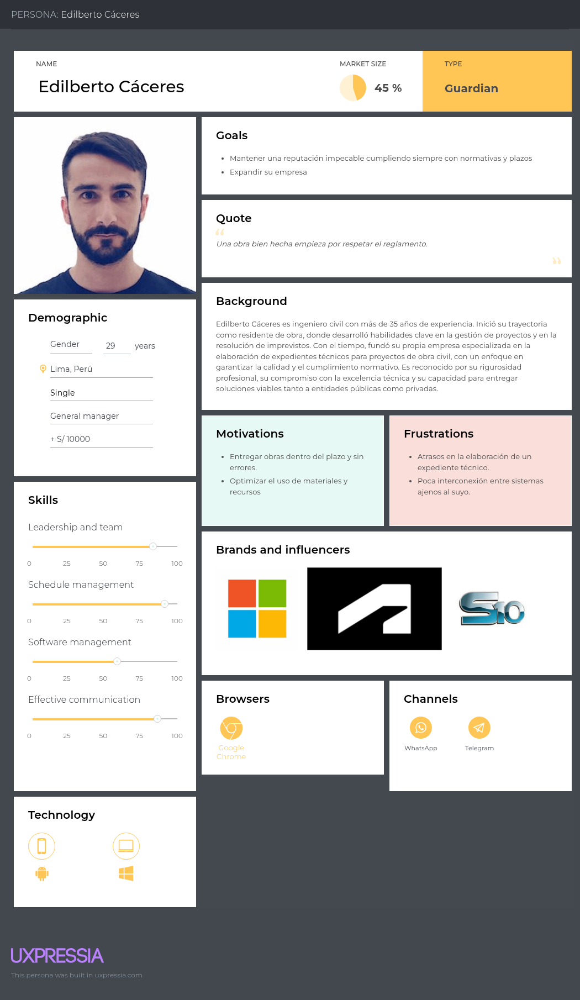

**Especialistas**

José Rodríguez representa al segmento objetivo de los Especialistas. Es arquitecto de profesión con una amplia trayectoria. Se caracteriza por su motivación constante y su pasión por la arquitectura. Posee un sólido compromiso con el cumplimiento de las normativas en el ejercicio de sus funciones. Destaca por su capacidad de comunicación con otros profesionales y por su habilidad analítica en el desarrollo de proyectos.

  

**Entidad Contratante**

Javier Luján representa al segmento objetivo de las Entidades contratantes. Actualmente busca un contratista para planificar la construcción de su vivienda en un terreno heredado. Se caracteriza por ser una persona precavida, orientada a garantizar la seguridad y bienestar de su futura familia. Además, muestra una marcada afinidad con el uso de la tecnología, lo que le facilita involucrarse activamente en la gestión de su proyecto.

  

### 2.3.2. User Task Matrix

Se considera para la realización de este User Task Matrix los User Persona, sus actividades, frecuencia e importancia.

<table border="1" cellpadding="5" cellspacing="0">
  <thead>
    <tr>
      <th rowspan="2">Task</th>
      <th colspan="2">Edilberto Cáceres</th>
      <th colspan="2">José Rodríguez</th>
      <th colspan="2">Javier Luján</th>
    </tr>
    <tr>
      <th>Frecuencia</th>
      <th>Importancia</th>
      <th>Frecuencia</th>
      <th>Importancia</th>
      <th>Frecuencia</th>
      <th>Importancia</th>
    </tr>
  </thead>
  <tbody>
    <tr><td>Contacto con cliente</td><td>Alta</td><td>Alta</td><td>Baja</td><td>Alta</td><td>Nunca</td><td>Baja</td></tr>
    <tr><td>Conceder autorización de comunicación de áreas</td><td>Media</td><td>Alta</td><td>Baja</td><td>Alta</td><td>Nunca</td><td>Alta</td></tr>
    <tr><td>Planificación de cronogramas</td><td>Media</td><td>Alta</td><td>Media</td><td>Alta</td><td>Baja</td><td>Media</td></tr>
    <tr><td>Cumplimiento de cronogramas</td><td>Alta</td><td>Alta</td><td>Alta</td><td>Alta</td><td>Nunca</td><td>Baja</td></tr>
    <tr><td>Planificación de estudios básicos</td><td>Media</td><td>Alta</td><td>Alta</td><td>Alta</td><td>Nunca</td><td>Baja</td></tr>
    <tr><td>Ejecución de estudios básicos</td><td>Baja</td><td>Alta</td><td>Media</td><td>Alta</td><td>Nunca</td><td>Baja</td></tr>
    <tr><td>Seguimiento de normativas</td><td>Alta</td><td>Alta</td><td>Alta</td><td>Alta</td><td>Media</td><td>Alta</td></tr>
    <tr><td>Consultar a otras áreas</td><td>Media</td><td>Alta</td><td>Alta</td><td>Alta</td><td>Nunca</td><td>Baja</td></tr>
    <tr><td>Solicitar revisiones</td><td>Nunca</td><td>Baja</td><td>Alta</td><td>Alta</td><td>Alta</td><td>Alta</td></tr>
    <tr><td>Reuniones de coordinación</td><td>Alta</td><td>Alta</td><td>Alta</td><td>Media</td><td>Media</td><td>Alta</td></tr>
    <tr><td>Entregar avances de expediente</td><td>Media</td><td>Alta</td><td>Alta</td><td>Alta</td><td>Media</td><td>Baja</td></tr>
    <tr><td>Cálculo de materiales y precios unitarios</td><td>Media</td><td>Alta</td><td>Alta</td><td>Alta</td><td>Nunca</td><td>Baja</td></tr>
    <tr><td>Comunicarse con contratista</td><td>Nunca</td><td>Baja</td><td>Media</td><td>Alta</td><td>Alta</td><td>Alta</td></tr>
    <tr><td>Explicar requisitos</td><td>Media</td><td>Alta</td><td>Nunca</td><td>Baja</td><td>Alta</td><td>Alta</td></tr>
    <tr><td>Supervisar cumplimiento de requisitos</td><td>Alta</td><td>Alta</td><td>Media</td><td>Alta</td><td>Alta</td><td>Alta</td></tr>
  </tbody>
</table>

**INTERPRETACIÓN DE RESULTADOS**

* Edilberto Cáceres: En su rol de contratista, participa de manera constante en reuniones y coordinaciones tanto con el cliente como con los especialistas. Otorga gran relevancia al cumplimiento de las normativas y a la observancia de los términos de referencia de cada proyecto. Considera que todas las fases del expediente técnico —desde la coordinación inicial con el cliente hasta la elaboración detallada de cada sección— resultan esenciales para garantizar la calidad del trabajo.

### 2.3.3. Empathy Mapping

**Contratistas**

En este segmento se reflejan las necesidades, frustraciones y oportunidades propias del contratista, junto con las percepciones de su entorno y sus observaciones directas. Se determina que el contratista cumple un rol fundamental en la elaboración del expediente técnico, asumiendo una participación activa en diversas actividades críticas que abarcan todo el proceso.

  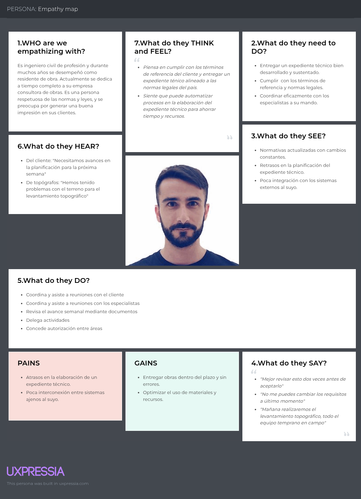

**Especialistas**

Se representan las necesidades, frustraciones y oportunidades del especialista, así como las percepciones de su entorno y sus propias observaciones. Se hace especial énfasis en la importancia de la comunicación entre especialidades, la participación en reuniones de coordinación y el cumplimiento riguroso de las normativas establecidas.

  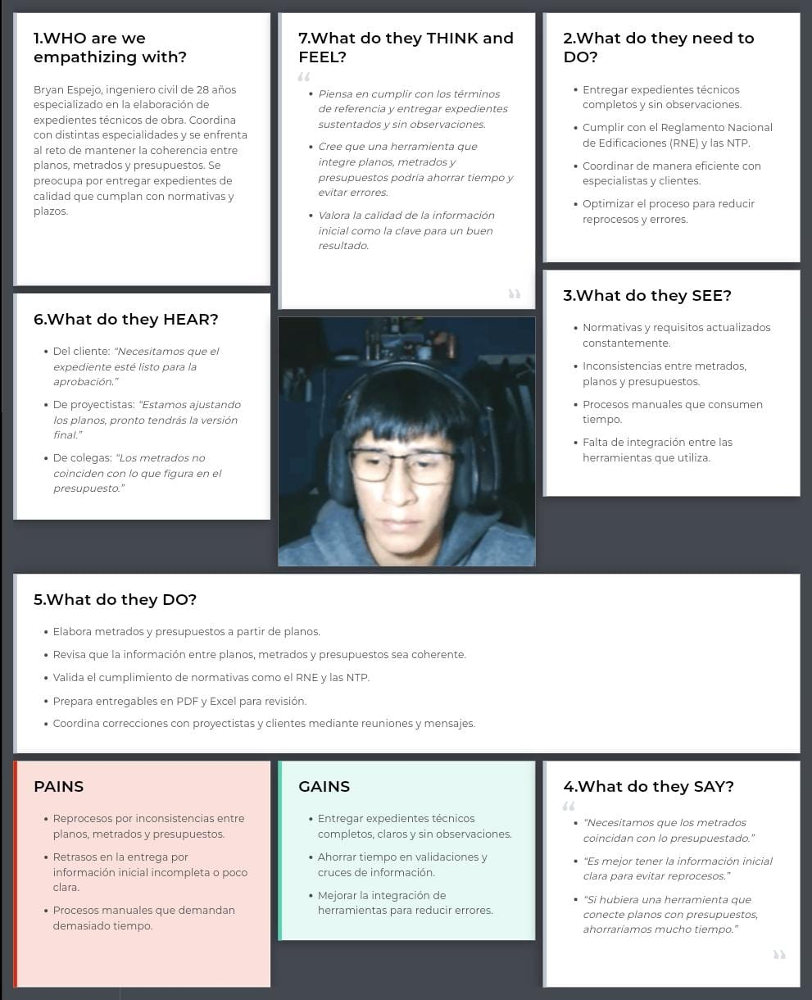

**Entidad contratante**

Se representan las necesidades, frustraciones y oportunidades de la entidad contratante, junto con las percepciones de su entorno y sus propias observaciones. Se destaca especialmente la influencia de las experiencias compartidas por colegas y conocidos.

  

### 2.3.4. As-is Scenario Mapping

Para construir esta sección del As-Is Scenario Mapping, el equipo trabajó de manera colaborativa, adoptando la perspectiva de los usuarios con el fin de describir situaciones que reflejaran las dificultades detectadas en el Empathy Map. Si bien durante el análisis surgieron más tareas, el resultado final se limitó a aquellas que se ajustaban al alcance definido para el proyecto.

**Contratistas**

Este escenario describe el flujo de trabajo dentro de la etapa de planificación de un proyecto. Se resalta la importancia de cumplir con los requisitos establecidos y de mantener un seguimiento constante durante la preparación del expediente técnico.

  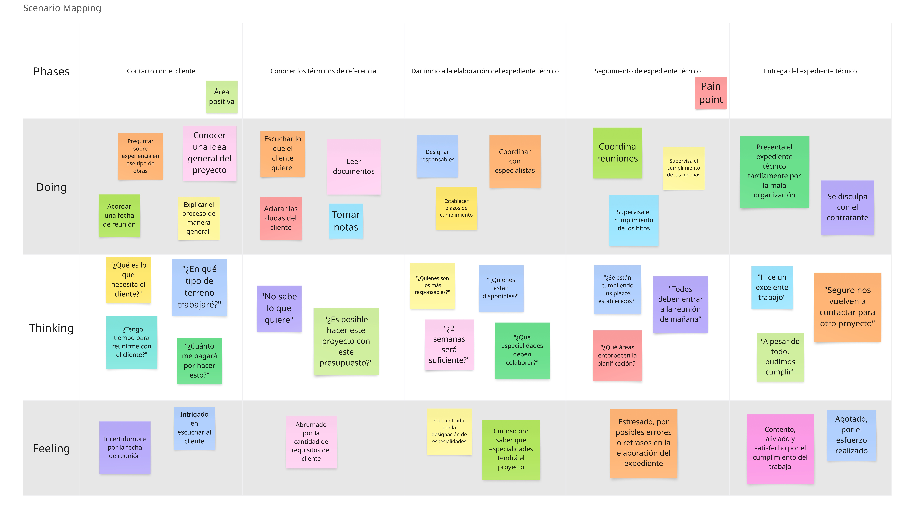

**Especialista**

Este escenario representa el flujo de trabajo del especialista durante la entrega de un encargo relacionado con el expediente técnico. Se resalta la importancia del cumplimiento de las normativas vigentes y la comunicación constante con otras especialidades para garantizar la coherencia y calidad del proyecto.

  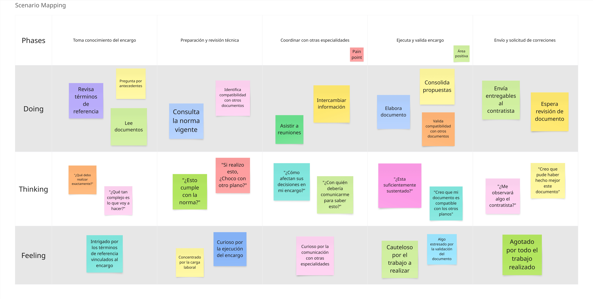

**Entidad contratante**

Este escenario representa el flujo de trabajo de la entidad contratante, desde el primer contacto con el contratista hasta el seguimiento del proyecto. Se hace especial énfasis en la verificación y cumplimiento de los requisitos establecidos.

  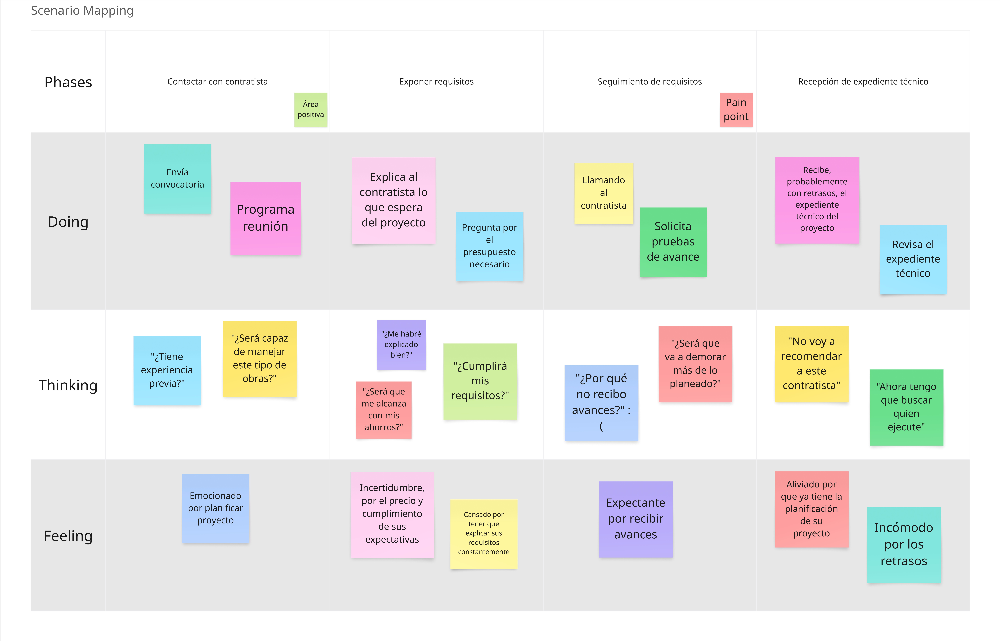

# Capítulo III: Requirements Specification

## 3.1. To-Be Scenario Mapping

Para desarrollar esta sección del To-be Scenario Mapping, el equipo colaboró adoptando la perspectiva de los usuarios. A partir del escenario descrito en el As-is Scenario Mapping, se propuso una situación mejorada para los distintos segmentos, incorporando a ClearCost dentro de su flujo de trabajo.

**Contratista**

Este escenario refleja el flujo de trabajo dentro de la etapa de planificación del proyecto. En contraste con el As-is Scenario, se observa una mejora significativa en la creación del proyecto, así como en la organización de los cronogramas y los hitos del expediente técnico.

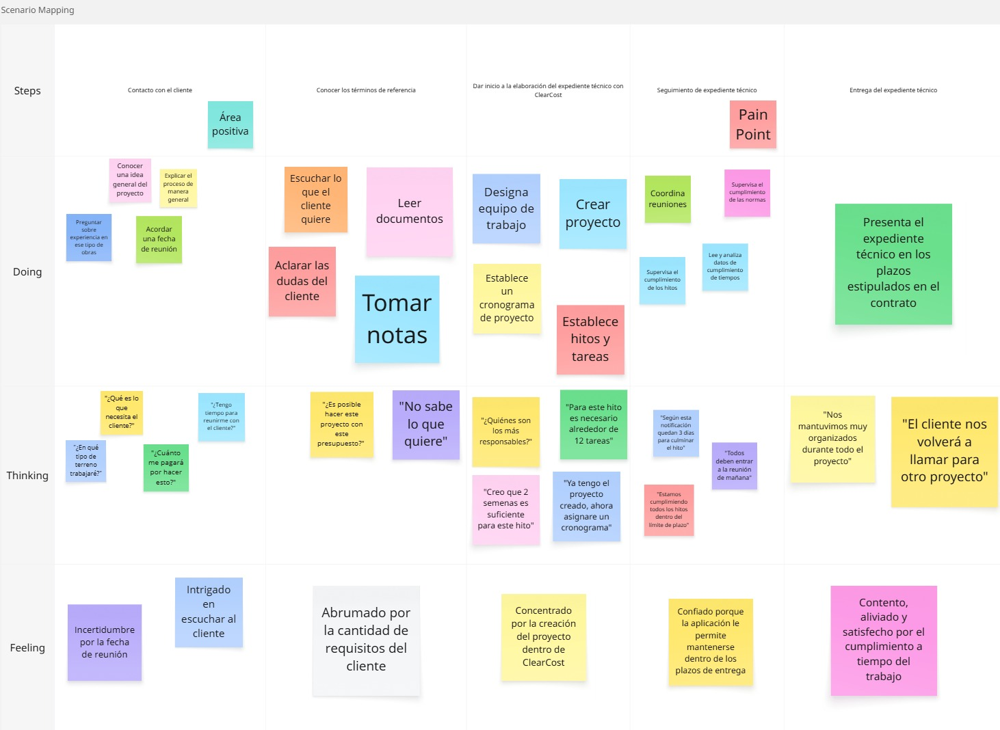

**Especialista**

Este escenario describe el flujo de trabajo del especialista al momento de atender un encargo vinculado al expediente técnico. A diferencia del As-is Scenario, se evidencia una mejora en la recepción de la tarea asignada, así como en la coordinación y comunicación entre las distintas especialidades que participan en el desarrollo del expediente.

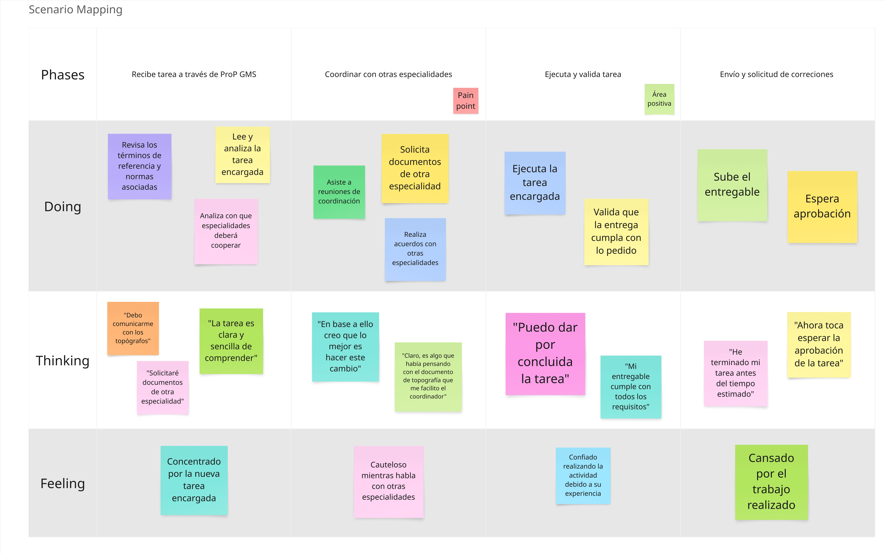

**Entidad contratante**

Este escenario representa el flujo de trabajo de la entidad contratante, desde el primer acercamiento con el contratista hasta el seguimiento del avance del proyecto. En comparación con el As-is Scenario, se percibe una mejora notable en la supervisión del cumplimiento de plazos y en la validación de los hitos establecidos.

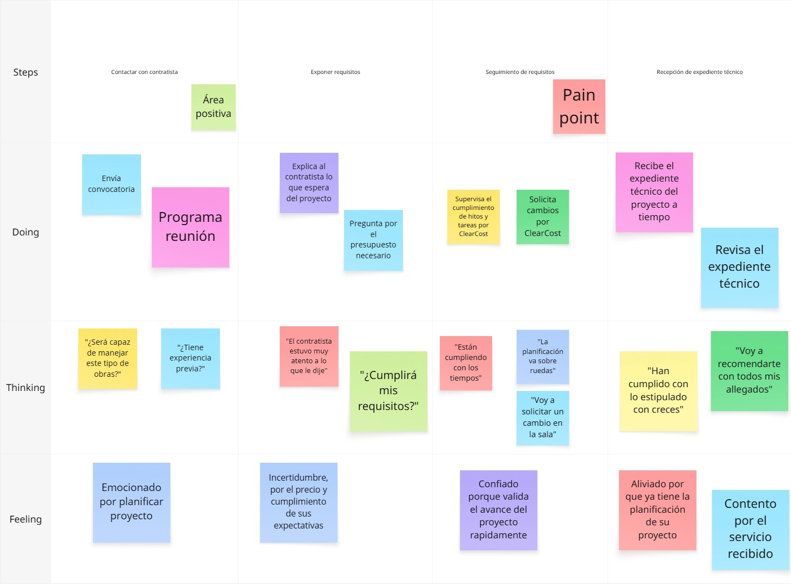

## 3.2. User Stories

Se elaboraron historias de usuario, historias técnicas (para el API) e historias de sitio web estático, denotadas por US, TS y SWR respectivamente. Se aplicaron buenas prácticas como INVEST. En el cuadro a continuación, se visualizarán dichas historias de usuario, las épicas y sus respectivos criterios de aceptación.

<table style="width: 100%; border-collapse: collapse;">
    <thead>
        <tr>
            <th>Epic / Story ID</th>
            <th>Título</th>
            <th>Descripción</th>
            <th>Criterios de Aceptación</th>
            <th>Relacionado con (Epic ID)</th>
        </tr>
    </thead>
    <tbody>   
    <tr>
        <td>US001</td>
        <td>Ingresar nombre del proyecto</td>
        <td>Como contratista quiero asignar un nombre claro al proyecto para identificarlo fácilmente y mantenerlo organizado dentro del workspace</td>
        <td><strong>Scenario: Nombre obligatorio</strong> Given el contratista accede al formulario de creación de proyecto When envía el formulario sin ingresar nombre Then el sistema debe mostrar un mensaje indicando que el nombre es obligatorio  </td>
        <td>EP01</td>
    </tr>
    <tr>
        <td>US002</td>
        <td>Ingresar fecha de inicio del proyecto</td>
        <td>Como contratista quiero establecer la fecha en que el proyecto comienza oficialmente para definir el punto de partida del cronograma técnico y administrativo</td>
        <td><strong>Scenario: Asignación automática de fecha de inicio</strong> Given el contratista accede al formulario de creación de proyecto When el formulario es cargado Then el campo 'Fecha de inicio' debe rellenarse automáticamente con la fecha actual Then el campo debe estar deshabilitado para edición manual  </td>
        <td>EP01</td>
    </tr>
    <tr>
        <td>US003</td>
        <td>Ingresar fecha de finalización del proyecto</td>
        <td>Como contratista quiero definir el plazo previsto para la ejecución del proyecto para planificar los hitos técnicos y asegurar la entrega oportuna del expediente</td>
        <td><strong>Scenario: Fecha válida</strong> Given el contratista accede al formulario de creación de proyecto Given ha ingresado una fecha de finalización posterior a la fecha actual When envía el formulario Then el sistema debe guardar la fecha correctamente Then mostrar un mensaje de confirmación  <strong>Scenario: Fecha inválida</strong> Given el contratista accede al formulario de creación de proyecto Given ha ingresado una fecha de finalización anterior o igual a la fecha actual When envía el formulario Then el sistema debe impedir la creación del proyecto Then mostrar un mensaje 'La fecha de finalización debe ser posterior a la fecha actual'  </td>
        <td>EP01</td>
    </tr>
    <tr>
        <td>US004</td>
        <td>Asociar contrato firmado y su fecha al proyecto</td>
        <td>Como contratista quiero vincular el contrato legal que respalda el proyecto para formalizar la ejecución del proyecto con la entidad contratante de manera legal y trazable</td>
        <td><strong>Scenario: Interfaz permite subir archivo local al workspace</strong> Given el contratista accede al formulario de creación de proyecto When visualiza el campo para subir el contrato Then el sistema debe mostrar un input para seleccionar un archivo local desde el dispositivo Then el sistema debe aceptar formatos comunes como PDF, DOCX o imágenes  <strong>Scenario: Subida del archivo y referencia al proyecto</strong> Given el contratista ha seleccionado un archivo válido When confirma la subida del archivo Then el sistema debe subir el archivo al workspace de la organización Then crear una referencia de tipo PROJECT_CONTRACT Then mostrar el archivo como referenciado dentro del formulario del proyecto  <strong>Scenario: Contrato y fecha proporcionados correctamente</strong> Given el contratista ha subido el archivo del contrato Given y ha ingresado una fecha válida de firma When envía el formulario Then el sistema debe asociar la referencia del archivo al proyecto Then guardar la fecha de firma como parte del proyecto Then mostrar un mensaje de confirmación  <strong>Scenario: Contrato o fecha faltante</strong> Given el contratista accede al formulario de creación de proyecto When envía el formulario sin haber completado ambos campos Then el sistema debe impedir la creación del proyecto Then mostrar un mensaje indicando que tanto el contrato como la fecha de firma son obligatorios  </td>
        <td>EP01</td>
    </tr>
    <tr>
        <td>US005</td>
        <td>Seleccionar entidad contratante del proyecto</td>
        <td>Como contratista quiero asociar la entidad responsable del encargo del proyecto para formalizar y registrar correctamente la relación contractual desde el inicio</td>
        <td><strong>Scenario: Mostrar campo de correo electrónico</strong> Given el contratista accede al formulario de creación de proyecto When visualiza el campo de entidad contratante Then el sistema debe mostrar un campo de texto para ingresar el correo electrónico de la entidad contratante  <strong>Scenario: Correo no vinculado a entidad contratante</strong> Given el contratista ha ingresado un correo que no está asociado a ninguna entidad contratante registrada When envía el formulario Then el sistema debe impedir la creación del proyecto Then mostrar un mensaje indicando que el correo ingresado no corresponde a una entidad contratante válida  <strong>Scenario: Correo válido ingresado</strong> Given el contratista ha ingresado un correo de una entidad contratante válida When envía el formulario Then el sistema debe asociar dicha entidad al proyecto Then mostrar un mensaje de confirmación  </td>
        <td>EP01</td>
    </tr>
    <tr>
        <td>US006</td>
        <td>Visualizar listado de proyectos accesibles</td>
        <td>Como miembro del equipo quiero consultar todos los proyectos a los que tengo acceso dentro de mi organización para identificar rápidamente los proyectos disponibles y comprender mi responsabilidad en cada uno</td>
        <td><strong>Scenario: Usuario ve el listado de proyectos accesibles</strong> Given el usuario pertenece a una organización con al menos un proyecto asignado When accede a la sección de proyectos Then el sistema debe mostrar una lista con los proyectos accesibles Then cada proyecto debe mostrar el nombre, estado y el rol del usuario dentro del proyecto  <strong>Scenario: Usuario sin proyectos asignados</strong> Given el usuario pertenece a una organización sin proyectos activos o asignados When accede a la sección de proyectos Then el sistema debe mostrar un mensaje informando que no tiene proyectos disponibles  </td>
        <td>EP01</td>
    </tr>
    <tr>
        <td>US007</td>
        <td>Consultar los detalles de un proyecto específico</td>
        <td>Como miembro del equipo del proyecto quiero ver toda la información relevante de un proyecto en el que participo para comprender su estado, equipo, documentos y planificación para colaborar efectivamente</td>
        <td><strong>Scenario: Miembro del equipo accede a los detalles básicos del proyecto</strong> Given el usuario forma parte del equipo del proyecto When solicita consultar los detalles del proyecto Then el sistema debe mostrar el nombre, estado, fechas, entidad contratante y miembros del equipo Then el sistema no debe mostrar el contrato ni las opciones de configuración si el usuario no es el contratista  <strong>Scenario: Contratista accede a los detalles completos del proyecto</strong> Given el usuario forma parte del equipo del proyecto Given y es el contratista (dueño de la organización del proyecto) When solicita consultar los detalles del proyecto Then el sistema debe mostrar todos los datos del proyecto, incluyendo contrato y opciones de configuración  <strong>Scenario: Usuario no autorizado intenta acceder</strong> Given el usuario no forma parte del equipo del proyecto When intenta consultar los detalles de dicho proyecto Then el sistema debe denegar el acceso Then mostrar un mensaje indicando que no tiene permisos para acceder a este proyecto  </td>
        <td>EP01</td>
    </tr>
    <tr>
        <td>US008</td>
        <td>Editar nombre y descripción de un proyecto</td>
        <td>Como contratista quiero modificar los datos descriptivos del proyecto cuando haya errores o cambios de enfoque para mantener la información del proyecto clara y actualizada para los miembros del equipo</td>
        <td><strong>Scenario: Contratista actualiza nombre o descripción</strong> Given el usuario es el contratista del proyecto Given se encuentra en la sección de configuración del proyecto When envía el formulario con el nuevo nombre o descripción Then el sistema debe guardar los cambios y mostrar un mensaje de confirmación  <strong>Scenario: Campos vacíos al editar</strong> Given el contratista accede al formulario de edición Given se encuentra en la sección de configuración del proyecto When envía el formulario sin completar el nombre Then el sistema debe impedir el guardado Then mostrar un mensaje indicando que el nombre del proyecto es obligatorio  </td>
        <td>EP01</td>
    </tr>
    <tr>
        <td>US009</td>
        <td>Cambiar el estado del proyecto</td>
        <td>Como contratista quiero actualizar manualmente la etiqueta de estado del proyecto para indicar su progreso para ayudar al equipo a interpretar en qué etapa se encuentra el proyecto</td>
        <td><strong>Scenario: Contratista cambia el estado del proyecto</strong> Given el usuario es el contratista del proyecto Given se encuentra en la sección de configuración del proyecto When confirma el cambio de estado Then el sistema debe actualizar el estado del proyecto Then mostrar un mensaje de confirmación  <strong>Scenario: Usuario no autorizado intenta cambiar el estado</strong> Given el usuario no es el contratista When intenta cambiar el estado del proyecto Then el sistema debe bloquear la acción Then mostrar un mensaje indicando que no tiene permisos para cambiar el estado  </td>
        <td>EP01</td>
    </tr>
    <tr>
        <td>US010</td>
        <td>Actualizar entidad contratante y contrato del proyecto</td>
        <td>Como contratista quiero corregir o modificar formalmente la relación contractual del proyecto para mantener la validez legal del encargo ante cambios institucionales o errores de registro</td>
        <td><strong>Scenario: Actualizar entidad y contrato correctamente</strong> Given el usuario es el contratista del proyecto Given se encuentra en la sección de configuración del proyecto Given ha ingresado un nuevo correo de entidad contratante válido Given ha seleccionado un nuevo archivo de contrato When confirma el procedimiento Then el sistema debe subir el nuevo contrato al workspace de la organización Then crear una nueva referencia de tipo PROJECT_CONTRACT Then asociar la nueva entidad contratante y el nuevo contrato al proyecto Then mostrar un mensaje indicando que la actualización se realizó correctamente  <strong>Scenario: Intento de cambiar entidad sin nuevo contrato</strong> Given el usuario es el contratista Given se encuentra en la sección de configuración del proyecto Given ha ingresado un nuevo correo de entidad contratante válido Given no ha adjuntado un nuevo archivo de contrato When confirma el procedimiento Then el sistema debe impedir la modificación Then mostrar un mensaje indicando que se requiere un nuevo contrato para cambiar la entidad contratante  <strong>Scenario: Correo de entidad no registrada</strong> Given el contratista ha ingresado un correo que no corresponde a una entidad contratante registrada When confirma el procedimiento Then el sistema debe impedir la actualización Then mostrar un mensaje indicando que la entidad contratante ingresada no es válida  </td>
        <td>EP01</td>
    </tr>
    <tr>
        <td>US011</td>
        <td>Eliminar un proyecto</td>
        <td>Como contratista quiero descartar un proyecto si fue creado por error o ya no será ejecutado para mantener el entorno de trabajo limpio y enfocado solo en proyectos activos</td>
        <td><strong>Scenario: Mostrar advertencia y solicitar confirmación manual</strong> Given el usuario es el contratista del proyecto Given se encuentra en la sección de configuración del proyecto When intenta eliminar el proyecto Then el sistema debe mostrar una advertencia informando que se eliminarán todos los datos del proyecto salvo los archivos subidos al workspace Then el sistema debe solicitar una confirmación manual del tipo 'delete + nombre del proyecto'  <strong>Scenario: Confirmación válida para eliminar proyecto</strong> Given el contratista ha recibido la advertencia Given ha ingresado correctamente la frase de confirmación solicitada When envía la confirmación Then el sistema debe eliminar el proyecto definitivamente Then mostrar un mensaje indicando que el proyecto fue eliminado exitosamente  <strong>Scenario: Confirmación inválida impide eliminación</strong> Given el contratista ha recibido la advertencia When envía una confirmación que no coincide con el formato requerido Then el sistema debe cancelar la operación Then mostrar un mensaje indicando que la confirmación no es válida  <strong>Scenario: Usuario no autorizado intenta eliminar un proyecto</strong> Given el usuario no es el contratista When intenta eliminar el proyecto Then el sistema debe bloquear la acción Then mostrar un mensaje indicando que no tiene permisos para eliminar el proyecto  </td>
        <td>EP01</td>
    </tr>
    <tr>
        <td>US012</td>
        <td>Agregar miembro de organización al equipo de proyecto</td>
        <td>Como contratista quiero añadir miembros de su organización al equipo de un proyecto activo para formar y estructurar el equipo responsable de cumplir con los entregables del proyecto</td>
        <td><strong>Scenario: Visualizar miembros disponibles de la organización</strong> Given el contratista accede a la sección de configuración del equipo de un proyecto When se despliega el campo de selección de miembro Then el sistema debe mostrar todos los miembros de su organización Then debe indicar visualmente cuáles ya pertenecen al equipo del proyecto  <strong>Scenario: Seleccionar miembro que no pertenece al equipo</strong> Given el contratista visualiza la lista de los miembros de su organización When selecciona un miembro que aún no forma parte del equipo Then el sistema debe asignar al miembro seleccionado al campo 'miembro' del formulario  <strong>Scenario: Seleccionar miembro que ya forma parte del equipo</strong> Given el contratista visualiza la lista de los miembros de su organización When selecciona un miembro que ya forma parte del equipo Then el sistema no debe realizar ninguna acción adicional Then no debe mostrar errores  </td>
        <td>EP02</td>
    </tr>
    <tr>
        <td>US013</td>
        <td>Buscar miembro por nombre o correo dentro de la organización</td>
        <td>Como contratista quiero filtrar eficientemente la lista de miembros de la organización al seleccionar integrantes del equipo para reducir el tiempo de búsqueda cuando la organización tiene muchos miembros</td>
        <td><strong>Scenario: La lista de miembros permite escribir texto</strong> Given el contratista accede a la sección de configuración del equipo When abre la lista de miembros de su organización Then el sistema debe permitir escribir texto directamente sobre la lista para activar el filtrado  <strong>Scenario: Filtrado automático por nombre o correo</strong> Given el contratista ha empezado a escribir texto en la lista de miembros When el texto ingresado coincide parcial o totalmente con un nombre o correo Then el sistema debe mostrar solo los miembros cuyos nombres o correos coincidan con el texto ingresado  <strong>Scenario: Sin coincidencias en la búsqueda</strong> Given el contratista ha ingresado texto que no coincide con ningún nombre o correo When escribe en la lista Then el sistema debe mostrar un mensaje indicando que no se encontraron coincidencias  </td>
        <td>EP02</td>
    </tr>
    <tr>
        <td>US014</td>
        <td>Seleccionar rol del miembro del equipo</td>
        <td>Como contratista quiero definir el rol de cada miembro del equipo al momento de asignarlo para organizar el equipo de trabajo según funciones de coordinación o especialización</td>
        <td><strong>Scenario: Visualizar opciones de rol disponibles</strong> Given el contratista está en la sección de configuración del equipo de un proyecto Given ha asignado un miembro al campo 'miembro' del formulario When se despliega el campo para seleccionar el rol Then el sistema debe permitir seleccionar entre las opciones 'COORDINATOR' y 'especialista'  <strong>Scenario: Intento de confirmar sin seleccionar rol</strong> Given el contratista ha asignado un miembro al formulario Given no ha seleccionado ningún rol When confirma la incorporación Then el sistema debe impedir la acción Then mostrar un mensaje indicando que el rol es obligatorio  </td>
        <td>EP02</td>
    </tr>
    <tr>
        <td>US015</td>
        <td>Seleccionar especialidad del miembro del equipo</td>
        <td>Como contratista quiero asignar la especialidad técnica del miembro del equipo si su rol es especialista para organizar correctamente al equipo por áreas de conocimiento y asignación de tareas</td>
        <td><strong>Scenario: Visualizar campo de especialidad al seleccionar rol 'especialista'</strong> Given el contratista está en el formulario de añadir miembro When selecciona el rol 'especialista' Then el sistema debe mostrar un campo para seleccionar una especialidad técnica  <strong>Scenario: Ocultar campo de especialidad al seleccionar rol 'COORDINATOR'</strong> Given el contratista está en el formulario de añadir miembro When selecciona el rol 'COORDINATOR' Then el sistema no debe mostrar el campo de especialidad  <strong>Scenario: Intento de confirmar sin seleccionar especialidad</strong> Given el contratista ha seleccionado el rol 'especialista' Given no ha seleccionado una especialidad When confirma la incorporación del miembro Then el sistema debe impedir la acción Then mostrar un mensaje indicando que la especialidad es obligatoria para especialistas  </td>
        <td>EP02</td>
    </tr>
    <tr>
        <td>US016</td>
        <td>Confirmar incorporación de los miembros seleccionados al proyecto</td>
        <td>Como contratista quiero revisar y confirmar los miembros que ha preparado para añadir al equipo del proyecto para tener control final antes de que se realicen los cambios en el equipo del proyecto</td>
        <td><strong>Scenario: Confirmar miembros con datos completos</strong> Given el contratista ha asignado correctamente todos los campos obligatorios del formulario Given está en el formulario de añadir miembro When confirma la incorporación Then el sistema debe agregar el miembro al equipo del proyecto Then mostrar un mensaje de confirmación  <strong>Scenario: Intento de confirmar sin seleccionar un miembro</strong> Given el contratista está en el formulario de añadir miembro When intenta confirmar sin haber seleccionado un miembro Then el sistema debe impedir la acción Then mostrar un mensaje indicando que debe seleccionar un miembro para continuar  </td>
        <td>EP02</td>
    </tr>
    <tr>
        <td>US017</td>
        <td>Visualizar listado de miembros del equipo del proyecto</td>
        <td>Como miembro del proyecto quiero consultar los miembros que forman parte del equipo y sus roles para entender la estructura del equipo y saber quién cumple qué función</td>
        <td><strong>Scenario: Ver listado completo del equipo</strong> Given el usuario forma parte del equipo del proyecto When accede a la sección del equipo del proyecto Then el sistema debe mostrar todos los miembros del equipo Then debe incluir para cada miembro: nombre, rol y especialidad (si aplica)  <strong>Scenario: Visualizar opción de editar para miembros distintos a sí mismo</strong> Given el usuario es el contratista Given está visualizando la lista de miembros del equipo When selecciona a un miembro de equipo diferente de sí mismo Then el sistema debe mostrar una opción para editar el rol junto a cada miembro editable Then no debe mostrar dicha opción junto a su propio nombre  <strong>Scenario: Visualizar opción de eliminar si es contratista</strong> Given el usuario es el contratista Given está visualizando la lista de miembros del equipo When selecciona a un miembro de equipo diferente de sí mismo Then el sistema debe mostrar una opción de eliminar del equipo junto a cada miembro Then no debe mostrar dicha opción junto a su propio nombre  </td>
        <td>EP02</td>
    </tr>
    <tr>
        <td>US018</td>
        <td>Editar el rol de un miembro del equipo del proyecto</td>
        <td>Como contratista quiero modificar el rol de un miembro del equipo cuando cambien sus responsabilidades para mantener la estructura del equipo alineada con las necesidades del proyecto</td>
        <td><strong>Scenario: Usuario que no es contratista no ve la opción de editar rol</strong> Given el usuario no es el contratista del proyecto When visualiza la lista de miembros del equipo Then el sistema no debe mostrar ninguna opción para editar el rol  <strong>Scenario: Permitir editar rol de un miembro</strong> Given el contratista ha abierto la opción para editar el rol de un miembro When abre el formulario de edición de rol Then el sistema debe mostrar un campo para seleccionar un rol Then mostrar su valor actual  <strong>Scenario: Confirmar nuevo rol correctamente</strong> Given el contratista ha seleccionado un nuevo rol para el miembro When confirma la acción Then el sistema debe actualizar el rol del miembro Then mostrar un mensaje de confirmación  <strong>Scenario: Impedir guardar sin seleccionar un rol</strong> Given el contratista ha accedido al formulario de edición de rol Given no ha seleccionado ningún valor When confirma la acción Then el sistema debe impedir la acción Then mostrar un mensaje indicando que el rol es obligatorio  </td>
        <td>EP02</td>
    </tr>
    <tr>
        <td>US019</td>
        <td>Editar la especialidad de un miembro del equipo del proyecto</td>
        <td>Como contratista quiero modificar la especialidad técnica de un miembro que tenga el rol de especialista para mantener la asignación de especialidades actualizada para una correcta distribución de tareas</td>
        <td><strong>Scenario: Visualizar campo de especialidad al abrir el formulario si el rol es 'especialista'</strong> Given el contratista accede al formulario de edición de un miembro Given el miembro tiene asignado el rol 'especialista' When se carga el formulario Then el sistema debe mostrar un campo para seleccionar una especialidad Then mostrar su valor actual  <strong>Scenario: Mostrar campo de especialidad al cambiar dinámicamente el rol a 'especialista'</strong> Given el contratista está editando el rol de un miembro del equipo When cambia el valor del rol a 'especialista' Then el sistema debe mostrar el campo de especialidad  <strong>Scenario: Ocultar campo de especialidad al cambiar dinámicamente el rol a uno distinto de 'especialista'</strong> Given el contratista está editando el rol de un miembro del equipo Given el rol estaba previamente en 'especialista' When cambia el valor del rol a 'COORDINATOR' Then el sistema debe ocultar el campo de especialidad  <strong>Scenario: Guardar sin especialidad cuando el rol es 'especialista'</strong> Given el contratista ha asignado el rol 'especialista' a un miembro Given no ha seleccionado una especialidad When confirma la edición Then el sistema debe impedir la acción Then mostrar un mensaje indicando que la especialidad es obligatoria  <strong>Scenario: Guardar correctamente con rol y especialidad asignados</strong> Given el contratista ha editado el rol a 'especialista' Given ha seleccionado una especialidad When confirma la edición Then el sistema debe actualizar la especialidad del miembro Then mostrar un mensaje de confirmación  </td>
        <td>EP02</td>
    </tr>
    <tr>
        <td>US020</td>
        <td>Eliminar un miembro del equipo del proyecto sin tareas asignadas</td>
        <td>Como contratista quiero retirar a un miembro del equipo cuando ya no tiene función activa en el proyecto y no tiene tareas asignadas para mantener el equipo alineado y evitar confirmaciones accidentales</td>
        <td><strong>Scenario: Solicitar confirmación por input</strong> Given el contratista ha seleccionado eliminar a un miembro que no tiene tareas asignadas When inicia la acción de eliminar Then el sistema debe solicitar que escriba 'eliminar + nombre del miembro' para confirmar  <strong>Scenario: Confirmación correcta por input</strong> Given el contratista ha ingresado correctamente el texto de confirmación When confirma la acción Then el sistema debe eliminar al miembro del equipo Then mostrar un mensaje de confirmación  <strong>Scenario: Confirmación incorrecta por input</strong> Given el contratista ha ingresado un texto incorrecto When intenta confirmar la eliminación Then el sistema debe cancelar la eliminación Then mostrar un mensaje indicando que la confirmación no es válida  </td>
        <td>EP02</td>
    </tr>
    <tr>
        <td>US021</td>
        <td>Eliminar un miembro del equipo del proyecto con tareas asignadas</td>
        <td>Como contratista quiero retirar a un miembro que ya no participa, controlando correctamente sus tareas y participaciones para mantener integridad del proyecto evitando tareas huérfanas y reuniones inconsistentes</td>
        <td><strong>Scenario: Mostrar advertencia si el miembro tiene tareas o reuniones</strong> Given el contratista ha seleccionado eliminar a un miembro del equipo Given el miembro tiene tareas asignadas o está invitado a reuniones When inicia la acción de eliminar Then el sistema debe mostrar una advertencia indicando que todas las tareas asignadas al miembro cambiarán su estado a DRAFT y que será eliminado de todas las reuniones  <strong>Scenario: Eliminar miembro y actualizar tareas y reuniones</strong> Given el contratista ha confirmado la eliminación del miembro Given el miembro tenía tareas y reuniones asignadas When confirma la eliminación Then el sistema debe eliminar al miembro del equipo Then cambiar todas sus tareas a estado DRAFT Then eliminar al miembro de todas las reuniones del proyecto Then mostrar un mensaje de confirmación  </td>
        <td>EP02</td>
    </tr>
    <tr>
        <td>US022</td>
        <td>Visualizar opción de añadir hito al cronograma</td>
        <td>Como contratista quiero acceder a la funcionalidad de crear nuevos hitos en el cronograma del proyecto para permitir la planificación estructurada de entregables en etapas definidas</td>
        <td><strong>Scenario: Mostrar opción de crear hito si es contratista</strong> Given el usuario es el contratista Given accede al cronograma del proyecto When se carga la vista del cronograma Then el sistema debe mostrar una opción para añadir un nuevo hito  <strong>Scenario: Ocultar opción si el usuario no es contratista</strong> Given el usuario no es el contratista When accede al cronograma del proyecto Then el sistema no debe mostrar la opción para añadir hitos  <strong>Scenario: Desplegar formulario al seleccionar la opción de crear hito</strong> Given el contratista accede al cronograma del proyecto When selecciona la opción para añadir un nuevo hito Then el sistema debe desplegar un formulario para ingresar los datos del hito  </td>
        <td>EP03</td>
    </tr>
    <tr>
        <td>US023</td>
        <td>Ingresar nombre del hito del cronograma</td>
        <td>Como contratista quiero asignar un nombre claro y representativo al hito del cronograma para identificar fácilmente el propósito de cada etapa del proyecto</td>
        <td><strong>Scenario: Visualizar campo de nombre del hito</strong> Given el contratista ha abierto el formulario para añadir un hito When se carga el formulario Then el sistema debe mostrar un campo para ingresar el nombre del hito  <strong>Scenario: Intento de continuar sin ingresar nombre</strong> Given el contratista está en el formulario para añadir un hito Given no ha ingresado un nombre When intenta finalizar la creación Then el sistema debe impedir la acción Then mostrar un mensaje indicando que el nombre del hito es obligatorio  </td>
        <td>EP03</td>
    </tr>
    <tr>
        <td>US024</td>
        <td>Ingresar fechas de inicio y fin del hito</td>
        <td>Como contratista quiero definir el período que abarca un hito dentro del cronograma para estructurar temporalmente las etapas del proyecto y facilitar la planificación</td>
        <td><strong>Scenario: Visualizar campos de fecha</strong> Given el contratista ha abierto el formulario para añadir un hito When se carga el formulario Then el sistema debe mostrar un campo para la fecha de inicio Then y otro campo para la fecha de fin del hito  <strong>Scenario: Intento de continuar sin ingresar fechas</strong> Given el contratista está en el formulario de crear hito When intenta confirmar la creación sin haber ingresado ninguna de las dos fechas Then el sistema debe impedir la acción Then mostrar un mensaje indicando que ambas fechas son obligatorias  <strong>Scenario: Fecha de inicio posterior a la de fin</strong> Given el contratista ha ingresado una fecha de inicio posterior a la fecha de fin When confirma la edición del campo de fecha de inicio Then el sistema debe actualizar la fecha de fin para que coincida con la de inicio  <strong>Scenario: Fecha de fin anterior a la de inicio</strong> Given el contratista ha ingresado una fecha de fin anterior a la fecha de inicio When confirma la edición del campo de fecha de fin Then el sistema debe actualizar la fecha de inicio para que coincida con la de fin  </td>
        <td>EP03</td>
    </tr>
    <tr>
        <td>US025</td>
        <td>Confirmar creación del hito</td>
        <td>Como contratista quiero guardar un nuevo hito en el cronograma del proyecto para integrar el hito dentro de la planificación del proyecto y comenzar a estructurar entregables</td>
        <td><strong>Scenario: Confirmar hito con datos válidos</strong> Given el contratista ha completado el formulario con nombre y fechas Given las fechas del hito se encuentran dentro del rango de fechas del proyecto When confirma la creación del hito Then el sistema debe crear el hito en el cronograma Then mostrar un mensaje de confirmación  <strong>Scenario: Intento de confirmar con datos incompletos</strong> Given el contratista está en el formulario de creación de hito Given falta el nombre o alguna de las fechas When intenta confirmar la creación Then el sistema debe impedir la acción Then mostrar un mensaje indicando que debe completar todos los campos obligatorios  </td>
        <td>EP03</td>
    </tr>
    <tr>
        <td>US026</td>
        <td>Visualizar lista de hitos del cronograma del proyecto</td>
        <td>Como miembro del proyecto quiero consultar los hitos definidos en el cronograma del proyecto para entender la estructura temporal del proyecto y preparar las actividades por etapa</td>
        <td><strong>Scenario: Ver lista de hitos</strong> Given el usuario pertenece al equipo del proyecto When accede a la sección de cronograma Then el sistema debe mostrar la lista de hitos registrados Then cada hito debe incluir su nombre, fecha de inicio y fecha de fin  <strong>Scenario: Sin hitos en el cronograma</strong> Given el proyecto aún no tiene hitos registrados When el usuario accede al cronograma Then el sistema debe mostrar un mensaje indicando que no hay hitos creados  <strong>Scenario: Mostrar opción de editar si es contratista</strong> Given el usuario accede a la lista de hitos del cronograma When el sistema identifica que el usuario es el contratista Then debe mostrarse una opción para editar cada hito Then esta opción no debe mostrarse si el usuario no es el contratista  <strong>Scenario: Mostrar opción de eliminar si es contratista</strong> Given el usuario accede a la lista de hitos del cronograma When el sistema identifica que el usuario es el contratista Then debe mostrarse una opción para eliminar cada hito Then esta opción no debe mostrarse si el usuario no es el contratista  </td>
        <td>EP03</td>
    </tr>
    <tr>
        <td>US027</td>
        <td>Editar nombre de un hito del cronograma</td>
        <td>Como contratista quiero modificar el nombre de un hito cuando sea necesario ajustarlo o corregirlo para mantener la claridad del cronograma frente al equipo y reflejar adecuadamente la etapa del proyecto</td>
        <td><strong>Scenario: Visualizar campo de nombre al editar hito</strong> Given el contratista accede a la edición de un hito existente When se carga el formulario de edición Then el sistema debe mostrar el campo de nombre con el valor actual prellenado  <strong>Scenario: Editar y confirmar nuevo nombre</strong> Given el contratista ha editado el campo de nombre When confirma la edición Then el sistema debe actualizar el nombre del hito Then mostrar un mensaje de confirmación  <strong>Scenario: Intento de confirmar sin nombre</strong> Given el contratista ha dejado vacío el campo de nombre When confirma la edición Then el sistema debe impedir la acción Then mostrar un mensaje indicando que el nombre es obligatorio  </td>
        <td>EP03</td>
    </tr>
    <tr>
        <td>US028</td>
        <td>Editar fechas de inicio y fin de un hito</td>
        <td>Como contratista quiero ajustar el período de un hito en función de cambios en el cronograma del proyecto para mantener actualizada la planificación temporal y reflejar la realidad del avance</td>
        <td><strong>Scenario: Visualizar campos de fecha al editar</strong> Given el contratista accede al formulario de edición de un hito When se carga la interfaz de edición Then el sistema debe mostrar los campos de fecha de inicio y fecha de fin con sus valores actuales  <strong>Scenario: Actualizar fechas válidas dentro del rango del proyecto</strong> Given el contratista ha modificado ambas fechas Given las fechas están dentro del rango de fechas del proyecto When confirma la edición Then el sistema debe actualizar las fechas del hito Then mostrar un mensaje de confirmación  <strong>Scenario: Fecha de inicio posterior a la de fin</strong> Given el contratista ha ingresado una fecha de inicio posterior a la de fin When confirma el campo de fecha de inicio Then el sistema debe actualizar automáticamente la fecha de fin para igualarla a la de inicio  <strong>Scenario: Fecha de fin anterior a la de inicio</strong> Given el contratista ha ingresado una fecha de fin anterior a la de inicio When confirma el campo de fecha de fin Then el sistema debe actualizar automáticamente la fecha de inicio para igualarla a la de fin  </td>
        <td>EP03</td>
    </tr>
    <tr>
        <td>US029</td>
        <td>Eliminar un hito del cronograma</td>
        <td>Como contratista quiero eliminar un hito que ya no es necesario dentro del cronograma del proyecto para mantener el cronograma limpio y alineado con los hitos verdaderamente relevantes</td>
        <td><strong>Scenario: Solicitar confirmación manual por input</strong> Given el contratista ha seleccionado un hito para eliminar When se despliega el diálogo de eliminación Then el sistema debe solicitar que escriba 'eliminar + nombre del hito' para confirmar  <strong>Scenario: Confirmación correcta por input</strong> Given el contratista ha escrito correctamente la confirmación When confirma la eliminación Then el sistema debe eliminar el hito del cronograma Then mostrar un mensaje de confirmación  <strong>Scenario: Confirmación incorrecta por input</strong> Given el contratista ha escrito una confirmación incorrecta When intenta confirmar la eliminación Then el sistema debe cancelar la operación Then mostrar un mensaje indicando que la confirmación no es válida  <strong>Scenario: Cancelar eliminación de hito</strong> Given el contratista ha iniciado la eliminación When cancela la acción desde el diálogo de confirmación Then el sistema no debe realizar ningún cambio en el cronograma  </td>
        <td>EP03</td>
    </tr>
    <tr>
        <td>US030</td>
        <td>Confirmar eliminación de un hito con contenido asociado</td>
        <td>Como contratista quiero comprender las consecuencias de eliminar un hito que contiene tareas o reuniones vinculadas para tomar decisiones informadas y evitar la pérdida accidental de contenido importante</td>
        <td><strong>Scenario: Advertir sobre contenido vinculado</strong> Given el contratista ha seleccionado un hito que contiene tareas o reuniones When se despliega el diálogo de eliminación Then el sistema debe mostrar una advertencia indicando que se eliminarán también todas las tareas y reuniones asociadas al hito  <strong>Scenario: Eliminar hito y su contenido al confirmar</strong> Given el contratista ha confirmado correctamente la eliminación del hito con contenido When acepta la advertencia y finaliza la eliminación Then el sistema debe eliminar el hito del cronograma Then eliminar todas las tareas y reuniones asociadas Then mostrar un mensaje de confirmación  </td>
        <td>EP03</td>
    </tr>
    <tr>
        <td>US031</td>
        <td>Configurar orden de visualización de hitos del cronograma</td>
        <td>Como contratista quiero elegir cómo se ordenan los hitos al visualizarlos en el cronograma para mejorar la legibilidad y adaptarse al estilo de trabajo del contratista o del equipo</td>
        <td><strong>Scenario: Mostrar opciones de orden disponibles</strong> Given el contratista accede a la vista del cronograma When abre el menú de configuración de orden Then el sistema debe mostrar las siguientes opciones de orden: Then 'Más próximos primero', 'Último al inicio', y 'Primero al inicio'  <strong>Scenario: Aplicar orden por más próximos primero</strong> Given el contratista ha seleccionado 'Más próximos primero' When confirma la selección Then el sistema debe ordenar los hitos mostrando primero el hito actual y los futuros, y luego los pasados  <strong>Scenario: Aplicar orden por último al inicio</strong> Given el contratista ha seleccionado 'Último al inicio' When confirma la selección Then el sistema debe mostrar los hitos en orden cronológico descendente  <strong>Scenario: Aplicar orden por primero al inicio</strong> Given el contratista ha seleccionado 'Primero al inicio' When confirma la selección Then el sistema debe mostrar los hitos en orden cronológico ascendente  </td>
        <td>EP03</td>
    </tr>
    <tr>
        <td>US032</td>
        <td>Visualizar lista de tareas del cronograma por hito</td>
        <td>Como miembro del proyecto quiero consultar las tareas planificadas dentro de los hitos del cronograma del proyecto para entender el trabajo técnico pendiente o en curso según la planificación del proyecto</td>
        <td><strong>Scenario: Visualizar tareas si es contratista o coordinador</strong> Given el usuario es el contratista o un coordinador del proyecto When expande un hito del cronograma Then el sistema debe mostrar todas las tareas asociadas a ese hito con detalles básicos como nombre, fecha límite y estado actual  <strong>Scenario: Visualizar solo tareas asignadas si es especialista</strong> Given el usuario es un especialista When expande un hito del cronograma Then el sistema debe mostrar solo las tareas asignadas a ese especialista con detalles básicos como nombre, fecha límite y estado actual  <strong>Scenario: Mostrar opción de añadir tarea solo si es contratista</strong> Given el usuario es el contratista When expande un hito del cronograma Then el sistema debe mostrar una opción para añadir una nueva tarea  <strong>Scenario: Visualizar opción para editar tarea solo si es contratista</strong> Given el usuario es el contratista del proyecto When visualiza la lista de tareas Then el sistema debe mostrar una opción para editar el nombre junto a cada tarea  <strong>Scenario: Visualizar opción de eliminar si es contratista</strong> Given el usuario es el contratista del proyecto When visualiza la lista de tareas Then el sistema debe mostrar la opción para eliminar junto a cada tarea  </td>
        <td>EP04</td>
    </tr>
    <tr>
        <td>US033</td>
        <td>Ingresar nombre y especialidad de la tarea</td>
        <td>Como contratista quiero definir el objetivo técnico de una tarea y su ámbito de especialidad para estructurar claramente el trabajo técnico que debe realizarse dentro de cada hito del cronograma</td>
        <td><strong>Scenario: Visualizar campos de nombre y especialidad</strong> Given el contratista accede al formulario de creación de tarea When se carga el formulario Then el sistema debe mostrar un campo obligatorio para ingresar el nombre de la tarea Then y una lista de especialidades para seleccionar una  <strong>Scenario: Intento de continuar sin completar ambos campos</strong> Given el contratista está en el formulario de creación de tarea When intenta continuar sin ingresar nombre o sin seleccionar especialidad Then el sistema debe impedir la acción Then mostrar un mensaje indicando que ambos campos son obligatorios  </td>
        <td>EP04</td>
    </tr>
    <tr>
        <td>US034</td>
        <td>Ingresar nombre de la tarea</td>
        <td>Como contratista quiero asignar un nombre que identifique claramente el propósito de la tarea para permitir que el equipo reconozca fácilmente el objetivo técnico de cada actividad</td>
        <td><strong>Scenario: Visualizar campo de nombre de tarea</strong> Given el contratista accede al formulario para añadir una nueva tarea When se carga el formulario Then el sistema debe mostrar un campo obligatorio para ingresar el nombre de la tarea  <strong>Scenario: Validar campo obligatorio de nombre</strong> Given el contratista está en el formulario de creación de tarea When intenta continuar sin haber ingresado un nombre Then el sistema debe impedir la acción Then mostrar un mensaje indicando que el nombre es obligatorio  </td>
        <td>EP04</td>
    </tr>
    <tr>
        <td>US035</td>
        <td>Seleccionar especialidad de la tarea</td>
        <td>Como contratista quiero definir la especialidad técnica necesaria para completar una tarea para asignar la tarea al perfil adecuado y permitir una distribución lógica del trabajo</td>
        <td><strong>Scenario: Visualizar lista de especialidades disponibles</strong> Given el contratista accede al formulario de creación de tarea When se carga el formulario Then el sistema debe mostrar un campo de selección con las especialidades disponibles  <strong>Scenario: Validar selección de especialidad</strong> Given el contratista está en el formulario de creación de tarea When intenta continuar sin haber seleccionado una especialidad Then el sistema debe impedir la acción Then mostrar un mensaje indicando que la especialidad es obligatoria  </td>
        <td>EP04</td>
    </tr>
    <tr>
        <td>US036</td>
        <td>Ingresar fechas de inicio y vencimiento de la tarea</td>
        <td>Como contratista quiero definir el rango de tiempo durante el cual debe realizarse una tarea para mantener un cronograma preciso y detectar tareas retrasadas o vencidas</td>
        <td><strong>Scenario: Visualizar campos de fechas</strong> Given el contratista accede al formulario de creación de tarea When se carga el formulario Then el sistema debe mostrar campos separados para ingresar la fecha de inicio y la fecha de vencimiento  <strong>Scenario: Validar que ambas fechas sean obligatorias</strong> Given el contratista está en el formulario de creación de tarea When intenta confirmar la tarea sin haber ingresado una o ambas fechas Then el sistema debe impedir la acción Then mostrar un mensaje indicando que ambas fechas son obligatorias  <strong>Scenario: Ajustar fecha si hay inconsistencias</strong> Given el contratista ha ingresado una fecha de inicio posterior a la de vencimiento When confirma uno de los campos Then el sistema debe actualizar automáticamente la otra fecha para que coincida  <strong>Scenario: Validar que las fechas estén dentro del rango del hito</strong> Given el contratista ha ingresado fechas válidas When las fechas están fuera del rango del hito al que se asignará la tarea Then el sistema debe impedir la acción Then mostrar un mensaje indicando que las fechas deben estar dentro del rango del hito  </td>
        <td>EP04</td>
    </tr>
    <tr>
        <td>US037</td>
        <td>Confirmar creación de la tarea</td>
        <td>Como contratista quiero guardar una nueva tarea en el cronograma del proyecto una vez ingresados todos los campos requeridos para formalizar la existencia de la tarea y permitir su visualización y gestión dentro del flujo del proyecto</td>
        <td><strong>Scenario: Confirmar tarea con todos los datos requeridos</strong> Given el contratista ha ingresado el nombre, especialidad, fecha de inicio y fecha de vencimiento válidos When confirma la creación de la tarea Then el sistema debe crear la tarea en el cronograma Then asignarle el estado inicial DRAFT Then mostrar un mensaje de confirmación  <strong>Scenario: Intento de confirmar con datos incompletos</strong> Given el contratista está en el formulario de creación de tarea Given falta uno o más campos obligatorios When intenta confirmar la creación Then el sistema debe impedir la acción Then mostrar un mensaje indicando que debe completar todos los campos obligatorios  </td>
        <td>EP04</td>
    </tr>
    <tr>
        <td>US038</td>
        <td>Asignar responsable a una tarea</td>
        <td>Como contratista quiero designar a un miembro del equipo como responsable de ejecutar una tarea para garantizar la trazabilidad de la tarea y activar su flujo de trabajo</td>
        <td><strong>Scenario: Visualizar lista de miembros del equipo</strong> Given el contratista accede al formulario para asignar responsable a una tarea When se carga la interfaz de asignación Then el sistema debe mostrar una lista con todos los miembros del equipo del proyecto  <strong>Scenario: Asignar responsable y cambiar estado a PENDING</strong> Given el contratista ha seleccionado un miembro de la lista When confirma la asignación Then el sistema debe registrar al miembro como responsable de la tarea Then cambiar el estado de la tarea a PENDING Then mostrar un mensaje de confirmación  <strong>Scenario: Intento de asignar responsable sin selección</strong> Given el contratista está en el formulario de asignación When intenta confirmar sin haber seleccionado un miembro Then el sistema debe impedir la acción Then mostrar un mensaje indicando que debe seleccionar un responsable  </td>
        <td>EP04</td>
    </tr>
    <tr>
        <td>US039</td>
        <td>Filtrar responsables por especialidad afín a la tarea</td>
        <td>Como contratista quiero activar un filtro para facilitar la asignación de tareas a especialistas compatibles para agilizar la asignación técnica de tareas evitando errores por desalineación de especialidades</td>
        <td><strong>Scenario: Visualizar opción para activar filtro por especialidad</strong> Given el contratista accede al formulario de asignación de responsable When se carga la interfaz de selección Then el sistema debe mostrar un checkbox o switch etiquetado como 'Filtrar por especialidad afín'  <strong>Scenario: Alternar estado del filtro</strong> Given el checkbox o switch está visible en la interfaz When el contratista activa o desactiva el filtro Then el sistema debe registrar el cambio de estado del filtro y actualizar la lista mostrada  <strong>Scenario: Filtrar lista al activar el filtro</strong> Given el filtro está activado When se muestra la lista de miembros del equipo Then el sistema debe mostrar solo a los miembros cuya especialidad coincida con la de la tarea  </td>
        <td>EP04</td>
    </tr>
    <tr>
        <td>US040</td>
        <td>Editar nombre de una tarea</td>
        <td>Como contratista quiero modificar el nombre de una tarea para reflejar mejor su propósito o alcance para mejorar la claridad y comprensión de las actividades planificadas dentro del proyecto</td>
        <td><strong>Scenario: Mostrar campo de edición con nombre actual</strong> Given el contratista ha iniciado la edición del nombre de una tarea When se despliega el formulario de edición Then el sistema debe mostrar el campo con el nombre actual prellenado  <strong>Scenario: Confirmar cambio de nombre</strong> Given el contratista ha modificado el nombre de una tarea When confirma el cambio Then el sistema debe actualizar el nombre de la tarea Then mostrar un mensaje de confirmación  </td>
        <td>EP04</td>
    </tr>
    <tr>
        <td>US041</td>
        <td>Editar nombre de una tarea</td>
        <td>Como contratista quiero modificar el nombre de una tarea para reflejar mejor su propósito o alcance para mejorar la claridad y comprensión de las actividades planificadas dentro del proyecto</td>
        <td><strong>Scenario: Mostrar campo de edición con nombre actual</strong> Given el contratista ha accedido a la opción de editar una tarea When se despliega el formulario de edición Then el sistema debe mostrar el campo de nombre con el valor actual prellenado  <strong>Scenario: Validar campo obligatorio de nombre</strong> Given el contratista está editando el nombre de una tarea When intenta confirmar sin haber ingresado un nuevo nombre Then el sistema debe impedir la acción Then mostrar un mensaje indicando que el nombre es obligatorio  <strong>Scenario: Confirmar cambio de nombre</strong> Given el contratista ha modificado el nombre de una tarea When confirma el cambio Then el sistema debe actualizar el nombre de la tarea Then mostrar un mensaje de confirmación  </td>
        <td>EP04</td>
    </tr>
    <tr>
        <td>US042</td>
        <td>Editar especialidad de una tarea</td>
        <td>Como contratista quiero modificar la especialidad técnica requerida para una tarea según cambios en los entregables o enfoque para garantizar que cada tarea esté alineada con el perfil técnico adecuado</td>
        <td><strong>Scenario: Mostrar campo de especialidad con valor actual</strong> Given el contratista ha accedido a la opción de editar una tarea When se despliega el formulario de edición Then el sistema debe mostrar un campo de selección con la especialidad actual preseleccionada  <strong>Scenario: Validar campo obligatorio de especialidad</strong> Given el contratista está editando la especialidad de una tarea When intenta confirmar sin haber seleccionado una especialidad Then el sistema debe impedir la acción Then mostrar un mensaje indicando que la especialidad es obligatoria  <strong>Scenario: Confirmar cambio de especialidad</strong> Given el contratista ha seleccionado una nueva especialidad When confirma el cambio Then el sistema debe actualizar la especialidad de la tarea Then mostrar un mensaje de confirmación  </td>
        <td>EP04</td>
    </tr>
    <tr>
        <td>US043</td>
        <td>Editar fechas de inicio y vencimiento de una tarea</td>
        <td>Como contratista quiero ajustar el período programado de una tarea ante cambios en el cronograma o entregables para mantener una planificación actualizada y coherente con el hito del cronograma</td>
        <td><strong>Scenario: Mostrar campos de fechas con valores actuales</strong> Given el contratista ha accedido a la opción de editar una tarea When se despliega el formulario de edición Then el sistema debe mostrar los campos de fecha de inicio y fecha de vencimiento con sus valores actuales prellenados  <strong>Scenario: Validar que ambas fechas sean obligatorias</strong> Given el contratista está en el formulario de edición de fechas When intenta confirmar sin haber completado ambos campos Then el sistema debe impedir la acción Then mostrar un mensaje indicando que ambas fechas son obligatorias  <strong>Scenario: Ajustar automáticamente fechas inconsistentes</strong> Given el contratista ha ingresado una fecha de inicio posterior a la fecha de vencimiento, o viceversa When confirma uno de los campos Then el sistema debe ajustar automáticamente la otra fecha para que coincida  <strong>Scenario: Validar que las fechas estén dentro del rango del hito</strong> Given el contratista ha ingresado nuevas fechas When las fechas están fuera del rango del hito Then el sistema debe impedir la acción Then mostrar un mensaje indicando que las fechas deben estar dentro del rango del hito  <strong>Scenario: Confirmar cambios en fechas</strong> Given el contratista ha ingresado fechas válidas dentro del rango del hito When confirma la edición Then el sistema debe actualizar las fechas de la tarea Then mostrar un mensaje de confirmación  </td>
        <td>EP04</td>
    </tr>
    <tr>
        <td>US044</td>
        <td>Activar filtro por especialidad al seleccionar responsable de una tarea</td>
        <td>Como contratista quiero mostrar solo los miembros cuya especialidad coincida con la especialidad de la tarea, tanto en la asignación como en la edición del responsable para facilitar una selección precisa del responsable técnico ideal</td>
        <td><strong>Scenario: Mostrar control de filtro en asignación o edición</strong> Given el contratista está asignando o editando el responsable de una tarea When se carga la interfaz de selección Then el sistema debe mostrar un switch o checkbox para activar el filtro por especialidad afín  <strong>Scenario: Filtrar la lista al activar el filtro</strong> Given el filtro por especialidad está activado When el contratista visualiza la lista de miembros del equipo Then el sistema debe mostrar solo los miembros cuya especialidad coincida con la de la tarea  <strong>Scenario: Desactivar filtro y mostrar lista completa</strong> Given el filtro ha sido desactivado manualmente When se muestra la lista de miembros del equipo Then el sistema debe mostrar nuevamente todos los miembros del equipo  </td>
        <td>EP04</td>
    </tr>
    <tr>
        <td>US045</td>
        <td>Visualizar opción de entregar una tarea</td>
        <td>Como especialista quiero saber si tiene permitido enviar la entrega de una tarea que le fue asignada para acceder fácilmente al formulario de entrega solo cuando corresponde</td>
        <td><strong>Scenario: Mostrar opción de entrega si es responsable</strong> Given el usuario es el responsable asignado de la tarea Given el estado de la tarea es PENDING When visualiza los detalles de la tarea Then el sistema debe mostrar un botón o enlace para iniciar la entrega de la tarea  <strong>Scenario: Ocultar opción si no es responsable</strong> Given el usuario no es el responsable de la tarea When visualiza los detalles de la tarea Then el sistema no debe mostrar la opción para enviar entrega  </td>
        <td>EP04</td>
    </tr>
    <tr>
        <td>US046</td>
        <td>Adjuntar archivos en la entrega de tarea</td>
        <td>Como especialista quiero subir documentos técnicos o evidencias como parte de la entrega de una tarea para centralizar la documentación técnica en el workspace de la organización y asegurar trazabilidad</td>
        <td><strong>Scenario: Visualizar input para adjuntar archivos</strong> Given el responsable accede al formulario de entrega de tarea When se carga la interfaz Then el sistema debe mostrar un campo para subir archivos desde el dispositivo  <strong>Scenario: Subir archivos al workspace y generar referencia en la entrega</strong> Given el responsable ha seleccionado uno o más archivos válidos When confirma la selección Then el sistema debe subir automáticamente los archivos al workspace de la organización Then crear referencias de tipo TASK_SUBMISSION para cada archivo Then guardar en el entregable solo las referencias generadas Then mostrar un mensaje de éxito  <strong>Scenario: Rechazar archivos no válidos</strong> Given el responsable ha seleccionado archivos con formato no permitido When intenta subirlos Then el sistema debe impedir la acción Then mostrar un mensaje indicando los formatos válidos (por ejemplo: PDF, DOCX, JPG, PNG)  </td>
        <td>EP04</td>
    </tr>
    <tr>
        <td>US047</td>
        <td>Escribir notas en la entrega de tarea</td>
        <td>Como especialista quiero incluir observaciones, comentarios técnicos o explicaciones junto a los archivos entregados para facilitar la comprensión y revisión de la entrega por parte del coordinador o contratista</td>
        <td><strong>Scenario: Visualizar campo de notas</strong> Given el responsable accede al formulario de entrega de tarea When se carga la interfaz Then el sistema debe mostrar un campo de texto para ingresar notas o comentarios adicionales  <strong>Scenario: Permitir entrega con o sin notas</strong> Given el responsable está completando la entrega When envía la entrega sin ingresar notas Then el sistema debe permitir continuar la acción sin mostrar advertencias  <strong>Scenario: Guardar notas junto al entregable</strong> Given el responsable ha escrito comentarios técnicos en el campo de notas When confirma la entrega Then el sistema debe almacenar las notas como parte del entregable de la tarea  </td>
        <td>EP04</td>
    </tr>
    <tr>
        <td>US048</td>
        <td>Enviar entrega de tarea</td>
        <td>Como especialista quiero finalizar el proceso de entrega de una tarea con los elementos completados para marcar la tarea como enviada para su revisión, asegurando trazabilidad y control de avances</td>
        <td><strong>Scenario: Confirmar entrega con archivos válidos</strong> Given el especialista ha adjuntado al menos una referencia a un archivo When confirma la entrega Then el sistema debe registrar un nuevo TaskSubmission Then cambiar el estado de la tarea a SUBMITTED Then mostrar un mensaje de confirmación  <strong>Scenario: Evitar envío si no hay archivos adjuntos</strong> Given el especialista no ha adjuntado ninguna referencia a archivo When intenta confirmar la entrega Then el sistema debe impedir la acción Then mostrar un mensaje indicando que se requiere al menos un archivo  </td>
        <td>EP04</td>
    </tr>
    <tr>
        <td>US049</td>
        <td>Visualizar tareas pendientes de revisión</td>
        <td>Como coordinador o contratista quiero consultar todas las tareas del proyecto y saber cuáles requieren revisión para mantener control sobre el estado de avance de las tareas y facilitar la evaluación oportuna</td>
        <td><strong>Scenario: Habilitar acciones de revisión solo en tareas SUBMITTED</strong> Given el usuario visualiza la lista de tareas When una tarea se encuentra en estado SUBMITTED Then el sistema debe mostrar opciones para revisar dicha tarea (aprobar o rechazar)  <strong>Scenario: No permitir revisión si la tarea no está enviada</strong> Given la tarea no se encuentra en estado SUBMITTED When el usuario intenta revisarla Then el sistema debe impedir la acción y mostrar un mensaje indicando que la tarea no está disponible para revisión  </td>
        <td>EP04</td>
    </tr>
    <tr>
        <td>US050</td>
        <td>Aprobar entrega de tarea</td>
        <td>Como coordinador o contratista quiero marcar una tarea entregada como completada satisfactoriamente tras su revisión para cerrar formalmente el ciclo de ejecución de la tarea y reflejar su avance dentro del proyecto</td>
        <td><strong>Scenario: Mostrar opción de aprobar solo si la tarea está enviada</strong> Given el usuario accede a una tarea con estado SUBMITTED When visualiza la entrega Then el sistema debe mostrar la opción para aprobar la entrega  <strong>Scenario: Confirmar aprobación de la entrega</strong> Given el usuario ha revisado la entrega y está conforme When confirma la aprobación Then el sistema debe cambiar el estado de la tarea a APPROVED Then guardar la fecha y el usuario que aprobó la entrega Then mostrar un mensaje de confirmación  </td>
        <td>EP04</td>
    </tr>
    <tr>
        <td>US051</td>
        <td>Rechazar entrega de tarea con retroalimentación</td>
        <td>Como coordinador o contratista quiero marcar una entrega como no aceptada y proporcionar retroalimentación clara al especialista para garantizar la calidad del trabajo entregado y orientar mejoras en una nueva entrega</td>
        <td><strong>Scenario: Mostrar campo de retroalimentación al rechazar</strong> Given el usuario accede a una tarea en estado SUBMITTED When selecciona la opción para rechazar la entrega Then el sistema debe mostrar un campo obligatorio para escribir retroalimentación  <strong>Scenario: Confirmar rechazo con retroalimentación</strong> Given el usuario ha escrito retroalimentación When confirma el rechazo Then el sistema debe cambiar el estado de la tarea a REJECTED Then guardar la nota y el usuario que realizó la revisión Then mostrar un mensaje de confirmación  <strong>Scenario: Impedir rechazo sin retroalimentación</strong> Given el usuario ha seleccionado rechazar una entrega When intenta confirmar sin escribir retroalimentación Then el sistema debe impedir la acción Then mostrar un mensaje indicando que el campo de retroalimentación es obligatorio  </td>
        <td>EP04</td>
    </tr>
    <tr>
        <td>US052</td>
        <td>Volver a enviar una tarea rechazada</td>
        <td>Como especialista quiero realizar una nueva entrega luego de recibir retroalimentación en una revisión anterior para permitir el perfeccionamiento del trabajo técnico y el avance del proyecto tras correcciones</td>
        <td><strong>Scenario: Visualizar opción de reenviar tarea solo si fue rechazada</strong> Given el usuario es el responsable de la tarea Given la tarea está en estado REJECTED When accede a los detalles de la tarea Then el sistema debe mostrar la opción para enviar una nueva entrega  <strong>Scenario: Adjuntar archivos nuevos desde el dispositivo</strong> Given el responsable accede al formulario de nueva entrega When se carga la interfaz Then el sistema debe mostrar un input para subir archivos desde el dispositivo  <strong>Scenario: Subir archivos al workspace y referenciarlos en la nueva entrega</strong> Given el especialista ha seleccionado archivos válidos When confirma la subida Then el sistema debe subir automáticamente los archivos al workspace de la organización Then crear referencias de tipo TASK_SUBMISSION para cada archivo Then incluir las referencias en la nueva entrega de tarea  <strong>Scenario: Realizar nueva entrega y actualizar estado</strong> Given el especialista ha completado la nueva entrega con archivos adjuntos When confirma el envío Then el sistema debe guardar la entrega con sus comentarios y referencias Then actualizar el estado de la tarea a SUBMITTED Then mostrar un mensaje de confirmación  <strong>Scenario: Impedir reenvío si no hay nuevos archivos</strong> Given el especialista intenta reenviar la tarea When no ha adjuntado ningún archivo Then el sistema debe impedir la acción Then mostrar un mensaje indicando que debe adjuntar al menos un archivo nuevo  </td>
        <td>EP04</td>
    </tr>
    <tr>
        <td>US053</td>
        <td>Eliminar una tarea del cronograma</td>
        <td>Como contratista quiero retirar tareas que ya no deben ser ejecutadas o que fueron registradas por error para mantener la planificación limpia, precisa y sin tareas obsoletas</td>
        <td><strong>Scenario: Solicitar confirmación antes de eliminar</strong> Given el contratista ha seleccionado la opción para eliminar una tarea When se despliega el diálogo de eliminación Then el sistema debe solicitar una confirmación escrita del tipo 'eliminar + nombre de la tarea'  <strong>Scenario: Eliminar tarea si confirmación es correcta</strong> Given el contratista ha escrito correctamente la confirmación When confirma la acción Then el sistema debe eliminar la tarea del cronograma Then mostrar un mensaje de confirmación  <strong>Scenario: Cancelar eliminación si la confirmación es incorrecta</strong> Given el contratista ha escrito incorrectamente la confirmación When intenta confirmar la acción Then el sistema debe cancelar la operación Then mostrar un mensaje indicando que la confirmación no es válida  </td>
        <td>EP04</td>
    </tr>
    <tr>
        <td>US076</td>
        <td>Iniciar solicitud de cambio desde una solicitud de cambio</td>
        <td>Como entidad contratante quiero solicitar formalmente una modificación del alcance, contenido o entrega del proyecto para asegurar que el cambio sea evaluado, aprobado o rechazado bajo un proceso trazable</td>
        <td><strong>Scenario: Visualizar formulario para solicitud de cambio</strong> Given la entidad contratante accede a la sección de solicitudes de cambio de un proyecto When selecciona la opción para iniciar una nueva solicitud Then el sistema debe mostrar un formulario con los campos: descripción del cambio (obligatorio)  <strong>Scenario: Validar campos obligatorios del solicitud de cambio</strong> Given la entidad contratante ha dejado el campo de descripción vacío en el formulario When intenta confirmar la solicitud Then el sistema debe impedir la acción Then mostrar un mensaje indicando que debe llenar todos los campos obligatorios  <strong>Scenario: Crear solicitud de cambio y proceso de cambio válidamente</strong> Given la entidad contratante ha ingresado una descripción válida When confirma la solicitud Then el sistema debe registrar la nueva solicitud de cambio Then crear un proceso de cambio con estado PENDING vinculado a esta solicitud Then registrar como origen el tipo CHANGE_REQUEST con su ID asociado Then mostrar un mensaje de confirmación  <strong>Scenario: Impedir creación si ya existe un proceso PENDING</strong> Given el proyecto ya tiene un proceso de cambio en estado PENDING When la entidad contratante intenta enviar una nueva solicitud Then el sistema debe impedir la acción Then mostrar un mensaje indicando que ya existe una solicitud pendiente en curso  </td>
        <td>EP07</td>
    </tr>
    <tr>
        <td>US077</td>
        <td>Iniciar solicitud de cambio desde una consulta técnica</td>
        <td>Como residente de obra quiero reportar un problema técnico observado durante la ejecución del proyecto que requiere aprobación formal para ser modificado para registrar incidentes técnicos y estructurar su evaluación mediante un proceso formal de cambio</td>
        <td><strong>Scenario: Visualizar formulario para consulta técnica</strong> Given el residente de obra accede a la sección de consultas técnicas de un proyecto When selecciona la opción para iniciar una nueva consulta técnica Then el sistema debe mostrar un formulario con el campo: descripción del problema (obligatorio)  <strong>Scenario: Validar campos obligatorios de la consulta</strong> Given el residente de obra ha dejado el campo de descripción vacío en el formulario When intenta confirmar la solicitud Then el sistema debe impedir la acción Then mostrar un mensaje indicando que debe completar la descripción  <strong>Scenario: Crear consulta técnica y proceso de cambio válidamente</strong> Given el residente de obra ha ingresado una descripción válida When confirma la solicitud Then el sistema debe registrar una nueva consulta técnica Then crear un proceso de cambio con estado PENDING vinculado a esta consulta Then registrar como origen el tipo TECHNICAL_QUERY con su ID asociado Then cambiar el estado del proyecto asociado a CHANGE_REQUESTED Then mostrar un mensaje de confirmación  <strong>Scenario: Impedir creación si ya existe un proceso PENDING</strong> Given el proyecto ya tiene un proceso de cambio en estado PENDING When el residente de obra intenta iniciar una nueva consulta técnica Then el sistema debe impedir la acción Then mostrar un mensaje indicando que ya existe una solicitud pendiente en curso  </td>
        <td>EP07</td>
    </tr>
    <tr>
        <td>US078</td>
        <td>Visualizar detalles de proceso de cambio</td>
        <td>Como contratista quiero visualizar el motivo detrás de una solicitud de cambio iniciada por un cliente o residente para analizar el contexto del cambio y tomar una decisión fundamentada sobre su aprobación o rechazo</td>
        <td><strong>Scenario: Visualizar la justificación en detalle</strong> Given el contratista accede a un proceso de cambio en estado PENDING When visualiza los detalles del proceso Then el sistema debe mostrar la justificación ingresada por quien inició la solicitud  <strong>Scenario: Indicar el origen del cambio</strong> Given el contratista accede a los detalles del proceso de cambio When se muestra la información relacionada Then el sistema debe indicar si el origen es una solicitud de cambio o una consulta técnica Then mostrar el identificador y la descripción del origen  </td>
        <td>EP07</td>
    </tr>
    <tr>
        <td>US079</td>
        <td>Ver proceso de cambio iniciados</td>
        <td>Como contratista o miembro del equipo quiero consultar todos los procesos de cambio registrados en el proyecto para analizar el historial de solicitudes y realizar un seguimiento efectivo del estado de los cambios</td>
        <td><strong>Scenario: Visualizar listado de procesos de cambio</strong> Given el usuario accede a la sección de solicitudes de cambio de un proyecto When se carga la vista de procesos iniciados Then el sistema debe mostrar una lista con todos los proceso de cambioes registrados en el proyecto Then cada item debe incluir el tipo de origen, la fecha de creación, el estado actual y un resumen de la justificación  <strong>Scenario: Filtrar lista por estado</strong> Given el usuario está visualizando la lista de procesos iniciados When utiliza un filtro por estado (PENDING, APPROVED, REJECTED) Then el sistema debe actualizar la lista para mostrar solo los procesos que coincidan con el estado seleccionado  </td>
        <td>EP07</td>
    </tr>
    <tr>
        <td>US080</td>
        <td>Ver proceso de cambio iniciados (Entidad contratante)</td>
        <td>Como entidad contratante quiero consultar las solicitudes de cambio iniciadas por su organización para hacer seguimiento al estado de sus solicitudes y entender la evolución del proceso de evaluación</td>
        <td><strong>Scenario: Visualizar procesos iniciados por la entidad contratante</strong> Given la entidad contratante accede a la sección de solicitudes de cambio When se carga la vista de procesos de cambio Then el sistema debe mostrar solo los proceso de cambioes iniciados por su organización mediante solicitud de cambios Then cada item debe incluir fecha, estado, descripción y justificación  <strong>Scenario: Visualizar estado actualizado del proceso de cambio</strong> Given la entidad contratante está viendo una solicitud iniciada por ellos When abre los detalles de un proceso de cambio Then el sistema debe mostrar el estado actual (PENDING, APPROVED o REJECTED) y, si existe, la respuesta del contratista  </td>
        <td>EP07</td>
    </tr>
    <tr>
        <td>US081</td>
        <td>Restringir acceso a proceso de cambioes iniciados fuera de la organización</td>
        <td>Como entidad contratante o residente de obra quiero mantener la confidencialidad de los procesos iniciados por otras organizaciones para proteger la integridad de los datos y asegurar la trazabilidad solo para actores autorizados</td>
        <td><strong>Scenario: Impedir visualización de procesos iniciados por otros</strong> Given un usuario pertenece a una organización distinta a la que inició el proceso de cambio When intenta acceder a la lista o detalles de ese proceso de cambio Then el sistema debe impedir el acceso Then mostrar un mensaje indicando que el proceso no está disponible  <strong>Scenario: Permitir acceso solo si la organización inició el proceso</strong> Given el usuario forma parte de la organización que inició el proceso (como entidad contratante o residente) When accede a la sección de solicitudes de cambio Then el sistema debe mostrar solamente los proceso de cambioes iniciados por esa organización y proyecto específico  </td>
        <td>EP07</td>
    </tr>
    <tr>
        <td>US082</td>
        <td>Aprobar un proceso de cambio</td>
        <td>Como contratista quiero aceptar formalmente una solicitud de cambio tras evaluar su justificación para avanzar con la modificación del proyecto bajo respaldo documentado y ordenado</td>
        <td><strong>Scenario: Aprobar proceso y generar orden de cambio</strong> Given el contratista accede a un proceso de cambio en estado PENDING Given ha ingresado una descripción válida para la aprobación When confirma la aprobación Then el sistema debe cambiar el estado del proceso de cambio a APPROVED Then crear un adicional de obra asociado Then actualizar el estado del proyecto a CHANGE_PENDING  <strong>Scenario: Validar campo obligatorio: descripción</strong> Given el contratista accede a un proceso de cambio en estado PENDING Given no ha ingresado una descripción para justificar la aprobación When intenta confirmar la aprobación Then el sistema debe impedir la acción Then mostrar un mensaje indicando que la descripción es obligatoria  </td>
        <td>EP08</td>
    </tr>
    <tr>
        <td>US083</td>
        <td>Rechazar un proceso de cambio</td>
        <td>Como contratista quiero denegar una solicitud de cambio que no se justifica o no puede ser atendida para mantener la estabilidad del proyecto evitando cambios innecesarios o mal fundamentados</td>
        <td><strong>Scenario: Rechazar proceso de cambio válidamente</strong> Given el contratista accede a un proceso de cambio en estado PENDING Given ha ingresado una descripción con el motivo del rechazo When confirma el rechazo Then el sistema debe cambiar el estado del proceso de cambio a REJECTED  <strong>Scenario: Validar campo obligatorio: motivo de rechazo</strong> Given el contratista accede a un proceso de cambio en estado PENDING Given no ha ingresado una descripción del motivo de rechazo When intenta confirmar el rechazo Then el sistema debe impedir la acción Then mostrar un mensaje indicando que debe ingresar una descripción para rechazar  </td>
        <td>EP08</td>
    </tr>
    <tr>
        <td>US084</td>
        <td>Solicitar datos para registrar adicional de obra al aprobar</td>
        <td>Como contratista quiero completar los datos necesarios para formalizar la orden de cambio al aprobar una solicitud para emitir la orden de cambio de forma clara, contextualizada y documentada</td>
        <td><strong>Scenario: Solicitar campos requeridos para el adicional de obra</strong> Given el contratista ha decidido aprobar un proceso de cambio When se inicia el procedimiento de aprobación Then el sistema debe solicitar los siguientes campos: descripción del cambio (obligatorio), selección del hito relacionado (obligatorio)  <strong>Scenario: Validar que se ingresen todos los campos</strong> Given el contratista ha dejado vacíos uno o más campos obligatorios When intenta confirmar la aprobación Then el sistema debe impedir la acción Then mostrar un mensaje indicando que debe ingresar una descripción y seleccionar un hito  <strong>Scenario: Registrar adicional de obra si los datos son válidos</strong> Given el contratista ha ingresado una descripción válida Given y ha seleccionado un hito relacionado When confirma la aprobación Then el sistema debe registrar un nuevo adicional de obra con los datos proporcionados  </td>
        <td>EP08</td>
    </tr>
    <tr>
        <td>US085</td>
        <td>Crear nuevo hito a partir de un adicional de obra aprobado</td>
        <td>Como contratista quiero incluir formalmente una etapa adicional en el cronograma del proyecto como resultado de un cambio aprobado para reflejar en la planificación oficial el impacto del cambio aprobado sobre el desarrollo del proyecto</td>
        <td><strong>Scenario: Solicitar datos para el nuevo hito</strong> Given el contratista ha aprobado un proceso de cambio Given y el sistema ha generado un adicional de obra When se activa la creación del hito asociado Then el sistema debe solicitar los siguientes campos: nombre del hito (obligatorio), fecha de inicio (obligatoria), fecha de fin (obligatoria)  <strong>Scenario: Validar campos vacíos</strong> Given el contratista no ha llenado uno o más campos requeridos When intenta confirmar la creación del hito Then el sistema debe impedir la acción Then mostrar un mensaje indicando que todos los campos son obligatorios  <strong>Scenario: Validar rango de fechas del proyecto</strong> Given el contratista ha ingresado fechas para el nuevo hito When confirma la creación Then el sistema debe validar que la fecha de inicio y fin estén dentro del rango del proyecto Then impedir la creación si alguna fecha está fuera de rango Then mostrar un mensaje indicando que las fechas deben estar dentro del plazo del proyecto  <strong>Scenario: Ajuste automático entre fechas inconsistentes</strong> Given el contratista ha ingresado una combinación de fechas en la que la fecha de inicio es posterior a la de fin, o viceversa When confirma el campo de fecha de inicio o fecha de fin Then el sistema debe ajustar automáticamente la fecha que corresponda para igualarla a la otra, garantizando una secuencia cronológica válida  <strong>Scenario: Registrar el nuevo hito correctamente</strong> Given el contratista ha completado todos los campos válidamente When confirma la creación Then el sistema debe registrar el nuevo hito dentro del cronograma del proyecto Then vincularlo al adicional de obra aprobado  </td>
        <td>EP08</td>
    </tr>
    <tr>
        <td>US086</td>
        <td>Registrar Respuesta al cambio luego de aprobar o rechazar</td>
        <td>Como contratista quiero dejar constancia formal de su decisión respecto a una solicitud de cambio para mantener un historial completo de las decisiones tomadas, incluyendo quién respondió y cuándo</td>
        <td><strong>Scenario: Registrar respuesta tras aprobación</strong> Given el contratista ha aprobado un proceso de cambio When se completa el proceso de aprobación Then el sistema debe registrar un Respuesta al cambio con la descripción ingresada, el contratista como autor y la fecha actual como respondedAt  <strong>Scenario: Registrar respuesta tras rechazo</strong> Given el contratista ha rechazado un proceso de cambio When se completa el proceso de rechazo Then el sistema debe registrar un Respuesta al cambio con la descripción ingresada, el contratista como autor y la fecha actual como respondedAt  </td>
        <td>EP08</td>
    </tr>
    <tr>
        <td>US087</td>
        <td>Crear una organización</td>
        <td>Como persona registrada en el sistema quiero iniciar el registro de una nueva organización consultora para poder organizar su estructura interna y comenzar a gestionar proyectos con su equipo</td>
        <td><strong>Scenario: Mostrar opción de creación siempre</strong> Given el usuario ha iniciado sesión When accede a la sección de organizaciones Then el sistema debe mostrar una opción para crear una nueva organización  <strong>Scenario: Mostrar formulario si tiene workspace disponible</strong> Given el usuario tiene un workspace activo disponible When selecciona la opción para crear una organización Then el sistema debe mostrar el formulario de creación de organización  </td>
        <td>EP09</td>
    </tr>
    <tr>
        <td>US088</td>
        <td>Crear una organización</td>
        <td>Como persona registrada en el sistema quiero registrar una nueva organización consultora para administrar su estructura interna y comenzar a gestionar proyectos con su equipo</td>
        <td><strong>Scenario: Mostrar opción de crear organización</strong> Given el usuario ha iniciado sesión en el sistema When accede a la sección de organizaciones Then el sistema debe mostrar la opción para crear una nueva organización  <strong>Scenario: Abrir formulario de creación</strong> Given el usuario ha seleccionado la opción de crear una organización When hace clic en dicha opción Then el sistema debe mostrar el formulario para ingresar los datos de la organización  </td>
        <td>EP09</td>
    </tr>
    <tr>
        <td>US089</td>
        <td>Ingresar razón social de la organización</td>
        <td>Como persona registrada quiero proporcionar la razón social durante la creación de una organización para registrar formalmente a la organización con el nombre legal requerido</td>
        <td><strong>Scenario: Mostrar campo de razón social</strong> Given el usuario accede al formulario de creación de organización When se carga la interfaz Then el sistema debe mostrar un campo para ingresar la razón social de la organización  <strong>Scenario: Validar campo obligatorio</strong> Given el usuario ha dejado vacío el campo de razón social When intenta confirmar el registro Then el sistema debe impedir la acción Then mostrar un mensaje indicando que la razón social es obligatoria  </td>
        <td>EP09</td>
    </tr>
    <tr>
        <td>US090</td>
        <td>Ingresar nombre comercial de la organización</td>
        <td>Como persona registrada quiero proporcionar un nombre comercial durante la creación de una organización para identificar públicamente a la organización con un nombre amigable o representativo</td>
        <td><strong>Scenario: Mostrar campo de nombre comercial</strong> Given el usuario accede al formulario de creación de organización When se carga la interfaz Then el sistema debe mostrar un campo para ingresar el nombre comercial de la organización, indicando que es opcional  </td>
        <td>EP09</td>
    </tr>
    <tr>
        <td>US091</td>
        <td>Ingresar RUC de la organización</td>
        <td>Como persona registrada quiero proporcionar el RUC como identificador tributario durante la creación de una organización para cumplir con los requisitos legales de registro y evitar duplicidades o inconsistencias</td>
        <td><strong>Scenario: Mostrar campo de RUC</strong> Given el usuario accede al formulario de creación de organización When se carga la interfaz Then el sistema debe mostrar un campo para ingresar el RUC de la organización  <strong>Scenario: Validar que el RUC no esté vacío</strong> Given el usuario ha dejado el campo de RUC vacío When intenta confirmar el registro Then el sistema debe impedir la acción Then mostrar un mensaje indicando que el RUC es obligatorio  <strong>Scenario: Validar que el RUC tenga exactamente 11 caracteres</strong> Given el usuario ha ingresado un RUC con menos o más de 11 caracteres When intenta confirmar el registro Then el sistema debe impedir la acción Then mostrar un mensaje indicando que el RUC debe tener exactamente 11 caracteres  <strong>Scenario: Validar que el RUC contenga solo caracteres numéricos</strong> Given el usuario ha ingresado caracteres no numéricos en el RUC When intenta confirmar el registro Then el sistema debe impedir la acción Then mostrar un mensaje indicando que el RUC debe contener solo números  </td>
        <td>EP09</td>
    </tr>
    <tr>
        <td>US092</td>
        <td>Confirmar creación de la organización</td>
        <td>Como persona registrada quiero finalizar el proceso de creación de una organización una vez completado el formulario para registrar formalmente la organización dentro del sistema y habilitarla para operaciones posteriores</td>
        <td><strong>Scenario: Crear organización con datos válidos</strong> Given el usuario ha completado correctamente todos los campos obligatorios del formulario When confirma el envío del formulario Then el sistema debe registrar la nueva organización con estado ACTIVO Then mostrar un mensaje de éxito  <strong>Scenario: Impedir creación si faltan campos obligatorios</strong> Given el usuario ha dejado uno o más campos obligatorios incompletos o inválidos When intenta enviar el formulario Then el sistema debe impedir la creación de la organización Then mostrar un mensaje indicando que debe corregir los errores antes de continuar  </td>
        <td>EP09</td>
    </tr>
    <tr>
        <td>US093</td>
        <td>Visualizar organizaciones</td>
        <td>Como persona registrada quiero consultar las organizaciones de las que forma parte para acceder rápidamente a las entidades con las que colabora o gestiona proyectos</td>
        <td><strong>Scenario: Mostrar lista de organizaciones</strong> Given el usuario ha iniciado sesión When accede a la sección de organizaciones Then el sistema debe mostrar una lista con todas las organizaciones a las que pertenece Then cada organización debe mostrar su nombre comercial (razón social si no lo tiene), estado y rol del usuario como miembro de la organización  <strong>Scenario: Mensaje si no pertenece a ninguna organización</strong> Given el usuario no pertenece a ninguna organización When accede a la sección de organizaciones Then el sistema debe mostrar un mensaje indicando que aún no forma parte de ninguna organización  </td>
        <td>EP09</td>
    </tr>
    <tr>
        <td>US094</td>
        <td>Acceder al dashboard de una organización</td>
        <td>Como persona registrada quiero ingresar a la vista principal de una organización a la que pertenece para gestionar proyectos, miembros, configuraciones y otros recursos desde un punto centralizado</td>
        <td><strong>Scenario: Acceder a organización desde la lista</strong> Given el usuario ha accedido a la sección de organizaciones Given visualiza una organización a la que pertenece When selecciona dicha organización Then el sistema debe abrir el dashboard correspondiente a esa organización Then mostrar las secciones relevantes como proyectos, miembros y configuración  <strong>Scenario: Impedir acceso si no pertenece a la organización</strong> Given el usuario intenta acceder directamente a una organización que no figura en su lista When envía una solicitud para abrir su dashboard Then el sistema debe impedir el acceso Then mostrar un mensaje indicando que no pertenece a dicha organización  </td>
        <td>EP09</td>
    </tr>
    <tr>
        <td>US095</td>
        <td>Editar razón social de la organización</td>
        <td>Como contratista quiero actualizar la razón social registrada cuando existan cambios formales en la empresa para mantener alineada la información del sistema con los datos legales oficiales de la organización</td>
        <td><strong>Scenario: Mostrar campo editable solo si es contratista</strong> Given el usuario ha accedido a la sección de configuración de una organización When el sistema identifica que el usuario es el contratista Then el sistema debe mostrar un campo editable para modificar la razón social  <strong>Scenario: Impedir edición si no es contratista</strong> Given el usuario no es el contratista de la organización When accede a la sección de configuración Then el sistema no debe mostrar la opción para editar la razón social  <strong>Scenario: Validar campo obligatorio</strong> Given el contratista ha dejado vacío el campo de razón social When intenta guardar los cambios Then el sistema debe impedir la acción Then mostrar un mensaje indicando que la razón social es obligatoria  </td>
        <td>EP10</td>
    </tr>
    <tr>
        <td>US096</td>
        <td>Editar nombre comercial de la organización</td>
        <td>Como contratista quiero actualizar el nombre comercial cuando cambie la presentación pública de la organización para mantener la información visual y comunicacional coherente con la identidad actual de la empresa</td>
        <td><strong>Scenario: Mostrar acción solo si es contratista</strong> Given el usuario ha accedido a la sección de configuración de una organización When se carga la interfaz con las acciones disponibles Then el sistema debe mostrar la opción correspondiente (editar/eliminar) solo si el usuario es el contratista de la organización  <strong>Scenario: Mostrar campo editable solo si es contratista</strong> Given el usuario ha accedido a la configuración de la organización When el sistema identifica que es el contratista Then el sistema debe mostrar un campo editable para modificar el nombre comercial  <strong>Scenario: Impedir edición si no es contratista</strong> Given el usuario no es el contratista de la organización When accede a la configuración de la organización Then el sistema no debe mostrar el campo editable  </td>
        <td>EP10</td>
    </tr>
    <tr>
        <td>US097</td>
        <td>Editar nombre comercial de la organización</td>
        <td>Como contratista quiero actualizar el nombre comercial cuando cambie la presentación pública de la organización para mantener la información visual y comunicacional coherente con la identidad actual de la empresa</td>
        <td><strong>Scenario: Mostrar acción solo si es contratista</strong> Given el usuario ha accedido a la sección de configuración de una organización When se carga la interfaz con las acciones disponibles Then el sistema debe mostrar la opción correspondiente (editar/eliminar) solo si el usuario es el contratista de la organización  <strong>Scenario: Mostrar campo editable solo si es contratista</strong> Given el usuario ha accedido a la configuración de la organización When el sistema identifica que es el contratista Then el sistema debe mostrar un campo editable para modificar el nombre comercial Then el campo debe indicarse explícitamente como opcional  <strong>Scenario: Impedir edición si no es contratista</strong> Given el usuario no es el contratista de la organización When accede a la configuración de la organización Then el sistema no debe mostrar el campo editable  </td>
        <td>EP10</td>
    </tr>
    <tr>
        <td>US098</td>
        <td>Eliminar organización (estado INACTIVE)</td>
        <td>Como contratista quiero desactivar una organización cuando ya no sea necesaria para proteger el sistema de errores accidentales y mantener control sobre el ciclo de vida de la entidad</td>
        <td><strong>Scenario: Mostrar acción solo si es contratista</strong> Given el usuario ha accedido a la sección de configuración de una organización When se carga la interfaz con las acciones disponibles Then el sistema debe mostrar la opción correspondiente (editar/eliminar) solo si el usuario es el contratista de la organización  <strong>Scenario: Eliminar organización lógicamente</strong> Given el usuario es el contratista de la organización When confirma la acción de eliminar la organización Then el sistema debe marcar la organización con estado INACTIVE Then no se deben eliminar inmediatamente los datos asociados Then mostrar un mensaje indicando que la eliminación es reversible por un tiempo limitado  <strong>Scenario: Impedir eliminación si no es contratista</strong> Given el usuario no es el contratista de la organización When intenta eliminar la organización Then el sistema debe impedir la acción Then mostrar un mensaje indicando que solo el contratista puede realizar esta operación  </td>
        <td>EP10</td>
    </tr>
    <tr>
        <td>US099</td>
        <td>Eliminar definitivamente la organización (vía confirmación por correo)</td>
        <td>Como contratista quiero eliminar de manera inmediata y permanente una organización cuando se justifique con una confirmación explícita para limpiar datos obsoletos o innecesarios del sistema sin esperar el periodo de eliminación lógica</td>
        <td><strong>Scenario: Mostrar opción solo si es contratista</strong> Given el usuario ha accedido a la configuración de una organización When el sistema identifica que el usuario es el contratista Then el sistema debe mostrar la opción de eliminación forzada  <strong>Scenario: Solicitar confirmación por correo</strong> Given el contratista ha elegido la opción de eliminación forzada When confirma la intención de eliminar Then el sistema debe enviar un correo con un enlace o código de confirmación al contratista  <strong>Scenario: Eliminar definitivamente al confirmar</strong> Given el contratista ha ingresado correctamente el código de confirmación o ha seguido el enlace When se valida dicha confirmación Then el sistema debe eliminar permanentemente la organización Then eliminar todos los recursos asociados como proyectos y miembros Then mantener los archivos intactos ya que están ligados al workspace  <strong>Scenario: Impedir eliminación sin confirmación válida</strong> Given el contratista ha ingresado un código inválido o expirado When intenta confirmar la eliminación forzada Then el sistema debe impedir la acción Then mostrar un mensaje de error indicando que la confirmación no es válida  </td>
        <td>EP10</td>
    </tr>
    <tr>
        <td>US100</td>
        <td>Invitar a una persona a la organización</td>
        <td>Como contratista quiero incorporar nuevos miembros a la organización enviando invitaciones para expandir el equipo de trabajo de forma controlada y con trazabilidad</td>
        <td><strong>Scenario: Visualizar opción de invitar en configuración</strong> Given el usuario ha accedido a la sección de configuración de la organización When el sistema identifica que es el contratista Then el sistema debe mostrar una opción para enviar nuevas invitaciones  <strong>Scenario: Enviar invitación por correo</strong> Given el contratista ha ingresado un correo válido en el formulario de invitación When confirma el envío Then el sistema debe crear una nueva invitación con estado PENDING Then asociar la invitación a la persona y organización correspondiente Then mostrar un mensaje de confirmación  </td>
        <td>EP11</td>
    </tr>
    <tr>
        <td>US101</td>
        <td>Validar que no exista ya una invitación pendiente</td>
        <td>Como contratista quiero evitar el envío redundante de invitaciones a personas que ya han sido invitadas para mantener orden en el proceso de incorporación y evitar confusión en los usuarios</td>
        <td><strong>Scenario: Impedir nueva invitación si ya hay una pendiente</strong> Given la persona ya tiene una invitación en estado PENDING para esta organización When el contratista intenta enviar una nueva invitación Then el sistema debe impedir la acción Then mostrar un mensaje indicando que ya se ha enviado una invitación pendiente  <strong>Scenario: Permitir nueva invitación si la anterior fue rechazada</strong> Given la última invitación enviada a esa persona fue REJECTED When el contratista intenta enviar una nueva invitación Then el sistema debe permitir el envío Then crear una nueva invitación con estado PENDING  </td>
        <td>EP11</td>
    </tr>
    <tr>
        <td>US102</td>
        <td>Impedir invitar a alguien que ya es miembro</td>
        <td>Como contratista quiero evitar enviar invitaciones a personas que ya forman parte de la organización para prevenir errores y mantener consistencia en la gestión de miembros</td>
        <td><strong>Scenario: Detectar membresía previa</strong> Given la persona ya figura como miembro activo de la organización When el contratista intenta enviarle una invitación Then el sistema debe impedir la acción Then mostrar un mensaje indicando que la persona ya pertenece a la organización  </td>
        <td>EP11</td>
    </tr>
    <tr>
        <td>US103</td>
        <td>Ver listado de invitaciones enviadas</td>
        <td>Como contratista quiero consultar las invitaciones que ha enviado para incorporar miembros a la organización para dar seguimiento a quién ha sido invitado y qué respuesta ha dado</td>
        <td><strong>Scenario: Mostrar historial de invitaciones</strong> Given el usuario es contratista de una organización When accede a la sección de gestión de invitaciones Then el sistema debe mostrar una lista de todas las invitaciones enviadas con sus estados (PENDING, ACCEPTED, REJECTED)  <strong>Scenario: Mostrar mensaje si no hay invitaciones</strong> Given la organización aún no tiene invitaciones registradas When el contratista accede a la sección de invitaciones Then el sistema debe mostrar un mensaje indicando que aún no se han enviado invitaciones  </td>
        <td>EP11</td>
    </tr>
    <tr>
        <td>US104</td>
        <td>Aceptar o rechazar una invitación recibida</td>
        <td>Como persona invitada quiero responder a una invitación de ingreso a una organización para controlar su afiliación a organizaciones y gestionar de forma consciente su participación</td>
        <td><strong>Scenario: Mostrar invitaciones pendientes</strong> Given el usuario ha sido invitado a una organización When accede a la sección de invitaciones Then el sistema debe mostrar todas las invitaciones en estado PENDING dirigidas al usuario  <strong>Scenario: Aceptar una invitación</strong> Given el usuario visualiza una invitación pendiente When decide aceptar la invitación Then el sistema debe cambiar el estado de la invitación a ACCEPTED Then añadir al usuario como miembro de la organización con tipo WORKER Then mostrar un mensaje de confirmación  <strong>Scenario: Rechazar una invitación</strong> Given el usuario visualiza una invitación pendiente When decide rechazar la invitación Then el sistema debe cambiar el estado de la invitación a REJECTED Then mostrar un mensaje de confirmación  </td>
        <td>EP11</td>
    </tr>
    <tr>
        <td>US105</td>
        <td>Visualizar lista de miembros de la organización</td>
        <td>Como miembro de una organización quiero consultar quiénes forman parte de su organización para conocer la composición del equipo y facilitar la comunicación o coordinación</td>
        <td><strong>Scenario: Mostrar lista de miembros</strong> Given el usuario pertenece a una organización When accede al dashboard de esa organización Then el sistema debe mostrar una lista con todos los miembros actuales Then cada miembro debe mostrar su nombre, rol (contratista o worker) y fecha de ingreso  <strong>Scenario: Mostrar mensaje si no hay miembros</strong> Given el usuario pertenece a una organización que solo tiene un miembro registrado When accede al dashboard Then el sistema debe mostrar un mensaje indicando que todavía no hay otros miembros registrados  <strong>Scenario: Mostrar opción de eliminar si es contratista</strong> Given el usuario es el contratista de la organización When se muestra la lista de miembros Then el sistema debe mostrar la opción de eliminar junto a cada miembro (excepto a sí mismo)  </td>
        <td>EP11</td>
    </tr>
    <tr>
        <td>US106</td>
        <td>Eliminar miembro de la organización</td>
        <td>Como contratista quiero retirar a un miembro que ya no colabora dentro de la organización para mantener actualizada la lista de miembros activos y evitar responsabilidades innecesarias</td>
        <td><strong>Scenario: Eliminar miembro sin advertencias si no tiene asignaciones</strong> Given el contratista ha seleccionado un miembro sin tareas asignadas When confirma la eliminación Then el sistema debe eliminar al miembro de la organización Then mostrar un mensaje de confirmación  <strong>Scenario: Mostrar advertencia si tiene tareas asignadas</strong> Given el contratista ha seleccionado un miembro con tareas asignadas en uno o más proyectos When intenta eliminar al miembro Then el sistema debe mostrar un mensaje de advertencia indicando que todas las tareas asignadas pasarán a estado DRAFT Then una vez confirmado, el sistema debe eliminar al miembro y actualizar automáticamente el estado de dichas tareas  </td>
        <td>EP11</td>
    </tr>
    <tr>
        <td>US117</td>
        <td>Elegir tipo de cuenta al iniciar el registro</td>
        <td>Como persona externa al sistema quiero indicar qué tipo de cuenta desea registrar para visualizar el formulario adecuado según el tipo de participación que tendrá en la plataforma</td>
        <td><strong>Scenario: Seleccionar tipo de cuenta antes de llenar datos</strong> Given el usuario accede a la página de registro When el sistema carga el formulario inicial Then el sistema debe mostrar un selector con las opciones de tipo de cuenta: ORGANIZATION_USER y CLIENT_USER Then el usuario debe poder continuar solo después de elegir una opción  </td>
        <td>EP15</td>
    </tr>
    <tr>
        <td>US118</td>
        <td>Mostrar campos de registro según tipo de cuenta seleccionado</td>
        <td>Como persona externa al sistema quiero llenar solo los campos necesarios para el tipo de cuenta elegida para facilitar el registro con un formulario claro y adaptado a sus necesidades</td>
        <td><strong>Scenario: Mostrar campos básicos para CLIENT_USER</strong> Given el usuario se encuentra en el formulario de registro When selecciona CLIENT_USER como tipo de cuenta Then se deben mostrar los campos: nombre completo, correo electrónico y contraseña Then no deben mostrarse campos relacionados a profesión  <strong>Scenario: Mostrar campos extendidos para ORGANIZATION_USER</strong> Given el usuario se encuentra en el formulario de registro When selecciona ORGANIZATION_USER como tipo de cuenta Then se deben mostrar los campos: nombre completo, correo electrónico, contraseña, nombre de la profesión y número de colegiatura Then los campos profesionales deben marcarse como obligatorios  </td>
        <td>EP15</td>
    </tr>
    <tr>
        <td>US119</td>
        <td>Validar campos requeridos según tipo de cuenta</td>
        <td>Como persona externa al sistema quiero completar correctamente los campos necesarios según el tipo de cuenta seleccionada para garantizar que el sistema tenga la información mínima necesaria para crear la cuenta correctamente</td>
        <td><strong>Scenario: Validación de CLIENT_USER</strong> Given el usuario ha seleccionado CLIENT_USER como tipo de cuenta Given se encuentra en el formulario de registro When intenta enviar el formulario sin llenar nombre completo, correo electrónico o contraseña Then el sistema debe mostrar un mensaje indicando que todos esos campos son obligatorios Then no se debe permitir enviar el formulario hasta completarlos correctamente  <strong>Scenario: Validación de ORGANIZATION_USER</strong> Given el usuario ha seleccionado ORGANIZATION_USER como tipo de cuenta Given se encuentra en el formulario de registro When intenta enviar el formulario sin completar alguno de los campos: nombre completo, correo electrónico, contraseña, profesión o número de colegiatura Then el sistema debe mostrar un mensaje indicando que todos los campos anteriores son obligatorios Then no se debe permitir enviar el formulario hasta completarlos correctamente  </td>
        <td>EP15</td>
    </tr>
    <tr>
        <td>US120</td>
        <td>Validar si el correo ya está registrado o en uso en una solicitud pendiente</td>
        <td>Como persona externa al sistema quiero saber si su correo ya está vinculado a una cuenta o en uso en una solicitud activa para evitar duplicar cuentas o solicitudes, y guiar correctamente el proceso de ingreso al sistema</td>
        <td><strong>Scenario: Correo ya asociado a un UserAccount</strong> Given el usuario se encuentra en el formulario de registro When ingresa un correo electrónico ya vinculado a una cuenta existente Then el sistema debe mostrar un mensaje indicando que el correo ya está registrado Then puede sugerir recuperar el acceso en lugar de volver a registrarse  <strong>Scenario: Correo asociado a una solicitud de registro pendiente</strong> Given el usuario ingresa un correo con una solicitud de registro activa (estado CONFIRMATION_PENDING) When intenta enviar nuevamente el formulario de registro Then el sistema debe mostrar un mensaje indicando que ya existe una solicitud pendiente para ese correo Then debe sugerirse revisar el correo y completar el proceso de confirmación  </td>
        <td>EP15</td>
    </tr>
    <tr>
        <td>US121</td>
        <td>Confirmar el registro mediante enlace recibido por correo</td>
        <td>Como persona que inició su registro quiero validar su identidad para activar su cuenta para garantizar que solo usuarios con acceso a su correo puedan finalizar el registro</td>
        <td><strong>Scenario: Confirmar registro con enlace válido</strong> Given el usuario ha recibido un correo con enlace de confirmación When hace clic en el enlace dentro del periodo de validez Then el sistema debe validar el token y completar el registro Then mostrar un mensaje de confirmación indicando que la cuenta ha sido activada correctamente  <strong>Scenario: Intentar confirmar con enlace vencido</strong> Given el usuario intenta acceder al enlace de confirmación fuera del periodo de validez When abre el enlace expirado Then el sistema debe mostrar un mensaje indicando que el enlace ha expirado Then sugerir reiniciar el proceso de registro  </td>
        <td>EP15</td>
    </tr>
    <tr>
        <td>US122</td>
        <td>Iniciar sesión desde el formulario de login</td>
        <td>Como usuario del sistema quiero autenticarse para acceder a las funcionalidades protegidas de la plataforma para trabajar dentro de su entorno personal o organizacional de forma segura</td>
        <td><strong>Scenario: Autenticarse con credenciales válidas</strong> Given el usuario se encuentra en el formulario de login When ingresa un correo y contraseña válidos y envía el formulario Then el sistema debe iniciar sesión y redirigir al dashboard correspondiente Then debe generarse una sesión activa y un token válido  </td>
        <td>EP16</td>
    </tr>
    <tr>
        <td>US123</td>
        <td>Mostrar error si las credenciales son incorrectas</td>
        <td>Como usuario del sistema quiero saber cuándo ha ingresado mal su correo o contraseña al intentar iniciar sesión para corregir rápidamente el error y evitar intentos fallidos o bloqueos innecesarios</td>
        <td><strong>Scenario: Credenciales inválidas</strong> Given el usuario se encuentra en el formulario de login When envía un correo o contraseña incorrectos Then el sistema debe mostrar un mensaje indicando que las credenciales son inválidas Then no se debe iniciar sesión ni redirigir al usuario  </td>
        <td>EP16</td>
    </tr>
    <tr>
        <td>US124</td>
        <td>Mantener sesión activa mientras el usuario interactúa</td>
        <td>Como usuario del sistema quiero permanecer autenticado mientras trabaja continuamente en la plataforma para evitar interrupciones y pérdida de información por cierre de sesión anticipado</td>
        <td><strong>Scenario: Extender validez de la sesión con actividad reciente</strong> Given el usuario ha iniciado sesión Given realiza acciones en la plataforma (navegar, guardar, interactuar) When transcurre el tiempo de expiración estándar sin inactividad Then el sistema debe mantener la sesión activa Then el usuario no debe ser redirigido a la pantalla de login  </td>
        <td>EP16</td>
    </tr>
    <tr>
        <td>US125</td>
        <td>Cerrar sesión manualmente desde el sistema</td>
        <td>Como usuario del sistema quiero finalizar su sesión cuando termina de usar la plataforma para garantizar que nadie más acceda a su información tras dejar de utilizar el sistema</td>
        <td><strong>Scenario: Cerrar sesión desde el menú</strong> Given el usuario está autenticado y en cualquier parte del sistema When selecciona la opción 'Cerrar sesión' Then el sistema debe finalizar la sesión actual Then redirigir al usuario a la pantalla de login  </td>
        <td>EP16</td>
    </tr>
    <tr>
        <td>US130</td>
        <td>Visualizar información personal registrada</td>
        <td>Como usuario autenticado quiero consultar los datos que el sistema tiene registrados sobre su identidad personal para verificar que su información esté actualizada y corregir posibles errores</td>
        <td><strong>Scenario: Mostrar los campos del perfil</strong> Given el usuario ha iniciado sesión When accede a la sección de perfil personal Then el sistema debe mostrar su nombre completo, correo electrónico, número de teléfono y, si corresponde, profesión y número de colegiatura  </td>
        <td>EP18</td>
    </tr>
    <tr>
        <td>US131</td>
        <td>Editar nombre completo del perfil</td>
        <td>Como usuario autenticado quiero actualizar su nombre completo si ha cambiado o contiene errores para mantener una representación precisa de su identidad dentro del sistema</td>
        <td><strong>Scenario: Modificar nombre y guardar</strong> Given el usuario ha accedido a la sección de perfil personal When edita el campo de nombre completo y guarda los cambios Then el sistema debe actualizar el nombre completo del usuario Then mostrar un mensaje de confirmación de la edición  </td>
        <td>EP18</td>
    </tr>
    <tr>
        <td>US132</td>
        <td>Editar correo electrónico personal</td>
        <td>Como usuario autenticado quiero cambiar su correo personal si ha cambiado de proveedor o detecta un error para recibir correctamente todas las notificaciones e invitaciones del sistema</td>
        <td><strong>Scenario: Actualizar correo electrónico</strong> Given el usuario está autenticado Given se encuentra en la sección de edición del perfil When modifica el campo de correo electrónico y guarda los cambios Then el sistema debe actualizar el correo registrado en su perfil Then mostrar un mensaje de confirmación  </td>
        <td>EP18</td>
    </tr>
    <tr>
        <td>US133</td>
        <td>Editar número de teléfono</td>
        <td>Como usuario autenticado quiero modificar su número de contacto registrado en el perfil para asegurar que su número actual esté disponible en caso de contacto, verificación o notificaciones</td>
        <td><strong>Scenario: Actualizar número de teléfono</strong> Given el usuario ha accedido a la edición del perfil When modifica el campo de teléfono y guarda los cambios Then el sistema debe registrar el nuevo número Then mostrar un mensaje indicando que el cambio se realizó exitosamente  </td>
        <td>EP18</td>
    </tr>
    <tr>
        <td>US148</td>
        <td>Cambiar el idioma preferido desde la configuración de cuenta</td>
        <td>Como usuario autenticado quiero ajustar el idioma en el que desea navegar la plataforma para tener una experiencia más cómoda y comprensible al utilizar el sistema</td>
        <td><strong>Scenario: Seleccionar idioma desde la configuración</strong> Given el usuario ha iniciado sesión Given accede a la configuración de cuenta When modifica su idioma preferido entre las opciones disponibles Then el sistema debe actualizar su preferencia Then reflejar el nuevo idioma en la interfaz en la siguiente carga  </td>
        <td>EP18</td>
    </tr>
    <tr><td>TS01</td><td>Crear organización</td><td>Como Developer, quiero implementar un endpoint que permita registrar una nueva organización para que los contratistas puedan iniciar la gestión de sus proyectos dentro del sistema.</td><td>  <strong>Scenario: Registrar una nueva organización exitosamente</strong> Given un contratista autorizado envía una solicitud POST al endpoint /organizations And el cuerpo de la solicitud contiene razón social, RUC, nombre comercial When el servidor recibe la solicitud Then debe responder con un código 201 Created And el cuerpo de la respuesta debe incluir los datos de la organización recién creada junto con su id  <strong>Scenario: Enviar datos incompletos o inválidos</strong> Given un contratista envía una solicitud POST al endpoint /organizations And el cuerpo de la solicitud omite campos obligatorios o incluye valores con formato inválido When el servidor procesa la solicitud Then debe responder con un código 400 Bad Request And el cuerpo de la respuesta debe incluir un mensaje que indique los errores de validación  </td><td>EP09</td></tr>
    <tr><td>TS02</td><td>Listar organizaciones</td><td>Como Developer, quiero implementar un endpoint que permita obtener todas las organizaciones a las que pertenece un usuario para que pueda visualizar y gestionar aquellas donde tiene participación activa.</td><td>  <strong>Scenario: Listar organizaciones exitosamente</strong> Given un usuario autenticado realiza una solicitud GET al endpoint /organizations When el servidor recibe la solicitud Then debe responder con un código 200 OK And el cuerpo de la respuesta debe contener un arreglo con las organizaciones donde el usuario tiene algún rol And cada organización debe incluir al menos: id, razón social, nombre comercial, descripción y el rol del usuario dentro de la organización  <strong>Scenario: Usuario sin organizaciones asociadas</strong> Given un usuario autenticado realiza una solicitud GET al endpoint /organizations And el usuario no pertenece a ninguna organización When el servidor procesa la solicitud Then debe responder con un código 200 OK And el cuerpo de la respuesta debe contener una lista vacía  </td><td>EP09</td></tr>
    <tr><td>TS03</td><td>Detalles de una organización</td><td>Como Developer, quiero implementar un endpoint que permita obtener los detalles de una organización específica para que los usuarios puedan visualizar su información completa y actualizada.</td><td>  <strong>Scenario: Obtener detalles exitosamente</strong> Given un usuario autenticado realiza una solicitud GET al endpoint /organizations/{id} And el usuario pertenece a la organización con el id proporcionado When el servidor recibe la solicitud Then debe responder con un código 200 OK And el cuerpo de la respuesta debe incluir: id, razón social, nombre comercial, RUC, descripción, y URL del logo (si existe)  <strong>Scenario: Organización no encontrada</strong> Given el usuario autenticado realiza una solicitud GET al endpoint /organizations/{id} And no existe una organización con el id proporcionado When el servidor procesa la solicitud Then debe responder con un código 404 Not Found And el cuerpo de la respuesta debe incluir un mensaje "Organización no encontrada"  </td><td>EP09</td></tr>
    <tr><td>TS04</td><td>Actualizar información de organización</td><td>Como Developer, quiero implementar un endpoint que permita actualizar los datos de una organización para que los contratistas puedan mantener su información empresarial al día, incluyendo la posibilidad de eliminar ciertos campos.</td><td>  <strong>Scenario: Actualizar campos exitosamente</strong> Given un contratista autorizado envía una solicitud PATCH al endpoint /organizations/{id} And el cuerpo de la solicitud incluye uno o varios de los siguientes campos válidos: razón social, nombre comercial, descripción, logo When el servidor recibe la solicitud Then debe responder con un código 200 OK And los cambios se reflejan inmediatamente And el cuerpo de la respuesta debe incluir la organización actualizada  <strong>Scenario: Eliminar campos opcionales dejando el campo en blanco</strong> Given el contratista autorizado envía un campo vacío para nombre comercial o descripción When el servidor recibe la solicitud Then se debe interpretar como una eliminación del campo And el valor debe eliminarse del registro de la organización And el cuerpo de la respuesta debe incluir la organización actualizada sin ese campo  <strong>Scenario: Enviar campos con formato inválido</strong> Given el contratista autorizado envía valores con formato inválido o que exceden el límite de caracteres permitidos When el servidor procesa la solicitud Then debe responder con un código 400 Bad Request And el cuerpo de la respuesta debe incluir los errores de validación por campo  <strong>Scenario: Organización no encontrada</strong> Given se envía una solicitud PATCH al endpoint /organizations/{id} con un id inexistente When el servidor procesa la solicitud Then debe responder con un código 404 Not Found And el cuerpo de la respuesta debe incluir un mensaje "Organización no encontrada"  </td><td>EP10</td></tr>
    <tr><td>TS05</td><td>Eliminar organización</td><td>Como Developer, quiero implementar un endpoint que permita iniciar la eliminación de una organización, cambiando su estado a pendiente de eliminación para permitir su recuperación antes de eliminarla definitivamente.</td><td>  <strong>Scenario: Solicitud de eliminación exitosa</strong> Given un contratista autorizado envía una solicitud DELETE al endpoint /organizations/{id} And la organización está activa When el servidor recibe la solicitud Then debe cambiar el estado de la organización a deletion_pending And debe responder con un código 202 Accepted And un mensaje "La organización ha sido marcada para eliminación y será eliminada permanentemente en 30 días"  <strong>Scenario: Eliminar organización ya marcada</strong> Given la organización ya tiene el estado deletion_pending When el contratista vuelve a enviar la solicitud DELETE Then debe responder con un código 409 Conflict And un mensaje "La organización ya está en proceso de eliminación"  <strong>Scenario: Organización no encontrada</strong> Given la organización con el id proporcionado no existe When se envía la solicitud DELETE Then debe responder con un código 404 Not Found  </td><td>EP10</td></tr>
    <tr><td>TS06</td><td>Añadir miembro a organización</td><td>Como Developer, quiero implementar un endpoint que permita añadir un nuevo miembro a una organización existente, asignándole un rol específico, para que pueda colaborar en la gestión de los proyectos de dicha organización.</td><td>  <strong>Scenario: Añadir miembro exitosamente</strong> Given un contratista autorizado envía una solicitud POST al endpoint /organizations/{organizationId}/members And el cuerpo de la solicitud contiene un correo válido y un rol permitido When el servidor recibe la solicitud Then debe responder con un código 201 Created And el cuerpo de la respuesta debe incluir los datos del nuevo miembro agregado  <strong>Scenario: Añadir miembro con datos inválidos</strong> Given un contratista envía una solicitud POST al endpoint /organizations/{organizationId}/members And el cuerpo de la solicitud omite el correo o el rol, o incluye un correo con formato inválido When el servidor procesa la solicitud Then debe responder con un código 400 Bad Request And el cuerpo de la respuesta debe incluir un mensaje que indique los errores de validación  <strong>Scenario: Añadir miembro ya existente</strong> Given el contratista envía un correo que ya pertenece a la organización When intenta añadirlo nuevamente Then el servidor debe responder con un código 409 Conflict And el cuerpo de la respuesta debe incluir un mensaje "Este miembro ya forma parte de la organización"  </td><td>EP11</td></tr>
    <tr><td>TS07</td><td>Actualizar estado de miembro de organización</td><td>Como Developer, quiero implementar un endpoint que permita actualizar el estado de un miembro dentro de una organización para gestionar su acceso según las necesidades administrativas (por ejemplo, activo, suspendido o removido).</td><td>  <strong>Scenario: Cambiar estado exitosamente</strong> Given un contratista autorizado envía una solicitud PATCH al endpoint /organizations/{organizationId}/members/{memberId} And el cuerpo de la solicitud incluye un estado válido (active, suspended, removed) When el servidor recibe la solicitud Then debe responder con un código 200 OK And el cuerpo de la respuesta debe reflejar el nuevo estado del miembro actualizado correctamente  <strong>Scenario: Enviar estado inválido</strong> Given un contratista autorizado envía un estado que no está permitido When el servidor procesa la solicitud Then debe responder con un código 400 Bad Request And el cuerpo de la respuesta debe incluir un mensaje "Estado no válido"  <strong>Scenario: Intentar cambiar el estado de un miembro inexistente</strong> Given el miembro con el memberId indicado no existe en la organización When se envía la solicitud PATCH Then el servidor debe responder con un código 404 Not Found And el cuerpo de la respuesta debe incluir un mensaje "Miembro no encontrado"  </td><td>EP11</td></tr>
    <tr><td>TS08</td><td>Añadir proyecto a organización</td><td>Como Developer, quiero implementar un endpoint que permita registrar un nuevo proyecto vinculado a una organización existente, para que los contratistas puedan iniciar la gestión de sus proyectos dentro del sistema.</td><td>  <strong>Scenario: Crear proyecto exitosamente</strong> Given un contratista autorizado envía una solicitud POST al endpoint /organizations/{organizationId}/projects And el cuerpo de la solicitud contiene los datos válidos del proyecto (nombre, fecha de inicio, descripción opcional) When el servidor procesa la solicitud Then debe responder con un código 201 Created And el cuerpo de la respuesta debe incluir los datos del proyecto creado, incluyendo su id y la organización asociada  <strong>Scenario: Crear proyecto con datos inválidos</strong> Given el contratista envía una solicitud POST con datos incompletos o con formato inválido When el servidor procesa la solicitud Then debe responder con un código 400 Bad Request And el cuerpo de la respuesta debe incluir detalles de los errores de validación  <strong>Scenario: Organización no encontrada</strong> Given el contratista envía una solicitud con un organizationId inexistente When el servidor procesa la solicitud Then debe responder con un código 404 Not Found And el cuerpo de la respuesta debe incluir un mensaje "Organización no encontrada"  </td><td>EP01</td></tr>
    <tr><td>TS09</td><td>Listar proyectos de organización</td><td>Como Developer, quiero implementar un endpoint que permita obtener todos los proyectos asociados a una organización, para que los usuarios autorizados puedan visualizarlos y gestionarlos.</td><td>  <strong>Scenario: Listar proyectos exitosamente</strong> Given un usuario autorizado realiza una solicitud GET al endpoint /organizations/{organizationId}/projects And la organización existe y tiene proyectos registrados When el servidor procesa la solicitud Then debe responder con un código 200 OK And el cuerpo de la respuesta debe contener una lista con los proyectos asociados a esa organización And cada proyecto debe incluir al menos: id, nombre, estado, fecha de inicio  <strong>Scenario: Organización sin proyectos</strong> Given un usuario autorizado realiza una solicitud GET al endpoint /organizations/{organizationId}/projects And la organización existe pero no tiene proyectos registrados When el servidor procesa la solicitud Then debe responder con un código 200 OK And el cuerpo de la respuesta debe ser una lista vacía  <strong>Scenario: Organización no encontrada</strong> Given el usuario autorizado realiza una solicitud GET al endpoint con un organizationId inexistente When el servidor procesa la solicitud Then debe responder con un código 404 Not Found And el cuerpo de la respuesta debe incluir un mensaje "Organización no encontrada"  </td><td>EP01</td></tr>
    <tr><td>TS10</td><td>Detalles de un proyecto</td><td>Como Developer, quiero implementar un endpoint que permita obtener los detalles de un proyecto específico para que los usuarios autorizados puedan visualizar su información completa y actualizada.</td><td>  <strong>Scenario: Obtener detalles de un proyecto exitosamente</strong> Given un usuario autorizado realiza una solicitud GET al endpoint /organizations/{organizationId}/projects/{project-id} And el proyecto existe When el servidor procesa la solicitud Then debe responder con un código 200 OK And el cuerpo de la respuesta debe incluir: id, nombre, estado, fecha de inicio, descripción, cliente (si existe), contrato (si existe), y organización asociada  <strong>Scenario: Proyecto no encontrado</strong> Given el usuario autorizado realiza una solicitud GET con un projectId inexistente When el servidor procesa la solicitud Then debe responder con un código 404 Not Found And el cuerpo de la respuesta debe incluir un mensaje "Proyecto no encontrado"  </td><td>EP01</td></tr>
    <tr><td>TS11</td><td>Añadir miembro de equipo con salario a proyecto</td><td>Como Developer, quiero implementar un endpoint que permita añadir un miembro de la organización a un proyecto para que pueda participar formalmente en su ejecución con un rol asignado.</td><td>  <strong>Scenario: Añadir miembro exitosamente</strong> Given un contratista autorizado envía una solicitud POST al endpoint /organizations/{organizationId}/projects/{project-id}/members And el cuerpo de la solicitud contiene un userId y un rol válidos And el usuario pertenece a la misma organización del proyecto When el servidor procesa la solicitud Then debe responder con un código 201 Created And el cuerpo de la respuesta debe incluir los datos del nuevo miembro vinculado al proyecto  <strong>Scenario: Usuario no pertenece a la organización del proyecto</strong> Given el contratista intenta añadir un userId que no forma parte de la organización vinculada al proyecto When el servidor procesa la solicitud Then debe responder con un código 400 Bad Request And el cuerpo de la respuesta debe incluir un mensaje "El usuario no pertenece a la organización de este proyecto"  <strong>Scenario: Usuario ya es miembro del proyecto</strong> Given el contratista envía una solicitud con un userId ya asignado al proyecto When el servidor procesa la solicitud Then debe responder con un código 409 Conflict And el cuerpo de la respuesta debe incluir un mensaje "El usuario ya forma parte del proyecto"  <strong>Scenario: Proyecto no encontrado</strong> Given el contratista envía una solicitud con un projectId inexistente When el servidor procesa la solicitud Then debe responder con un código 404 Not Found And el cuerpo de la respuesta debe incluir un mensaje "Proyecto no encontrado"  </td><td>EP02</td></tr>
    <tr><td>TS12</td><td>Listar miembros de proyecto</td><td>Como Developer, quiero implementar un endpoint que permita obtener la lista de miembros asignados a un proyecto para que los usuarios autorizados puedan visualizar quiénes forman parte del equipo.</td><td>  <strong>Scenario: Listar miembros exitosamente</strong> Given un usuario autorizado realiza una solicitud GET al endpoint /organizations/{organizationId}/projects/{project-id}/members And el proyecto existe y tiene miembros asignados When el servidor procesa la solicitud Then debe responder con un código 200 OK And el cuerpo de la respuesta debe contener una lista con los miembros del proyecto And cada miembro debe incluir: id, nombre, correo, rol en el proyecto, y rol en la organización  <strong>Scenario: Proyecto sin miembros asignados</strong> Given el usuario autorizado realiza una solicitud GET al endpoint /organizations/{organizationId}/projects/{project-id}/members And el proyecto no tiene miembros asignados When el servidor procesa la solicitud Then debe responder con un código 200 OK And el cuerpo de la respuesta debe ser una lista vacía  <strong>Scenario: Proyecto no encontrado</strong> Given el usuario autorizado realiza una solicitud GET con un projectId inexistente When el servidor procesa la solicitud Then debe responder con un código 404 Not Found And el cuerpo de la respuesta debe incluir un mensaje "Proyecto no encontrado"  </td><td>EP02</td></tr>
    <tr><td>TS13</td><td>Actualizar información de miembro de proyecto</td><td>Como Developer, quiero implementar un endpoint que permita actualizar el rol de un miembro dentro de un proyecto, para mantener alineadas sus responsabilidades con las necesidades operativas del equipo.</td><td>  <strong>Scenario: Actualizar rol exitosamente</strong> Given un contratista autorizado envía una solicitud PATCH al endpoint /organizations/{organizationId}/projects/{project-id}/members And el cuerpo de la solicitud incluye un rol válido diferente al actual When el servidor procesa la solicitud Then debe responder con un código 200 OK And el cuerpo de la respuesta debe reflejar el nuevo rol del miembro en el proyecto  <strong>Scenario: Rol inválido o no permitido</strong> Given el contratista envía un rol que no existe o que no está permitido para ese proyecto When el servidor procesa la solicitud Then debe responder con un código 400 Bad Request And el cuerpo de la respuesta debe incluir un mensaje "Rol no válido"  <strong>Scenario: Miembro no pertenece al proyecto</strong> Given el memberId proporcionado no está asignado al projectId indicado When el servidor procesa la solicitud Then debe responder con un código 404 Not Found And el cuerpo de la respuesta debe incluir un mensaje "Miembro no encontrado en este proyecto"  </td><td>EP02</td></tr>
    <tr><td>TS14</td><td>Actualizar información de proyecto</td><td>Como Developer, quiero implementar un endpoint que permita actualizar el nombre y el estado de un proyecto, para reflejar cambios en su identidad o etapa de ejecución.</td><td>  <strong>Scenario: Actualizar nombre del proyecto exitosamente</strong> Given un contratista autorizado envía una solicitud PATCH al endpoint /organizations/{organizationId}/projects/{project-id} And el cuerpo de la solicitud contiene un nuevo nombre válido When el servidor procesa la solicitud Then debe responder con un código 200 OK And el nuevo nombre debe reflejarse en los datos del proyecto  <strong>Scenario: Actualizar estado del proyecto exitosamente</strong> Given un contratista autorizado envía una solicitud PATCH al endpoint /organizations/{organizationId}/projects/{project-id} And el cuerpo de la solicitud contiene un estado válido dentro del flujo definido When el servidor procesa la solicitud Then debe responder con un código 200 OK And el nuevo estado debe reflejarse inmediatamente en la información del proyecto  <strong>Scenario: Enviar nombre o estado inválido</strong> Given el contratista incluye un nombre vacío o un estado no reconocido When intenta guardar los cambios Then debe responder con un código 400 Bad Request And el cuerpo de la respuesta debe incluir los errores de validación correspondientes  <strong>Scenario: Proyecto no encontrado</strong> Given el projectId no corresponde a ningún proyecto existente When se envía la solicitud PATCH Then el servidor debe responder con un código 404 Not Found And el cuerpo de la respuesta debe incluir un mensaje "Proyecto no encontrado"  </td><td>EP01</td></tr>
    <tr><td>TS15</td><td>Crear cronograma de proyecto</td><td>Como Developer, quiero implementar un endpoint que permita crear un cronograma para un proyecto existente, para que los contratistas puedan planificar y gestionar las actividades clave en una línea de tiempo.</td><td>  <strong>Scenario: Crear cronograma exitosamente</strong> Given un contratista autorizado envía una solicitud POST al endpoint /organizations/{organizationId}/projects/{project-id}/schedule And el cuerpo de la solicitud incluye un rango de fechas válido (fecha de inicio y fin) When el servidor procesa la solicitud Then debe responder con un código 201 Created And el cuerpo de la respuesta debe incluir el cronograma creado vinculado al proyecto  <strong>Scenario: Proyecto ya tiene un cronograma</strong> Given el proyecto ya cuenta con un cronograma existente When el contratista intenta crear uno nuevo Then el servidor debe responder con un código 409 Conflict And el cuerpo de la respuesta debe incluir un mensaje "Este proyecto ya tiene un cronograma registrado"  <strong>Scenario: Datos inválidos en la solicitud</strong> Given el contratista envía fechas mal formateadas o con inconsistencias (inicio mayor que fin, etc.) When el servidor procesa la solicitud Then debe responder con un código 400 Bad Request And el cuerpo de la respuesta debe incluir un mensaje que detalle los errores de validación  <strong>Scenario: Proyecto no encontrado</strong> Given el projectId proporcionado no corresponde a ningún proyecto existente When se envía la solicitud Then el servidor debe responder con un código 404 Not Found And el cuerpo de la respuesta debe incluir un mensaje "Proyecto no encontrado"  </td><td>EP03</td></tr>
    <tr><td>TS16</td><td>Obtener detalles de cronograma</td><td>Como Developer, quiero implementar un endpoint que permita obtener los detalles del cronograma asociado a un proyecto, para que los usuarios puedan visualizar su planificación estructurada.</td><td>  <strong>Scenario: Obtener cronograma exitosamente</strong> Given un usuario autorizado realiza una solicitud GET al endpoint /organizations/{organizationId}/projects/{project-id}/schedule And el proyecto cuenta con un cronograma registrado When el servidor procesa la solicitud Then debe responder con un código 200 OK And el cuerpo de la respuesta debe incluir: fecha de inicio, fecha de fin, y una lista de hitos asociados al cronograma  <strong>Scenario: Proyecto sin cronograma registrado</strong> Given el proyecto no tiene un cronograma creado When el usuario autorizado realiza la solicitud GET Then el servidor debe responder con un código 404 Not Found And el cuerpo de la respuesta debe incluir un mensaje "Este proyecto no tiene un cronograma registrado"  <strong>Scenario: Proyecto no encontrado</strong> Given el projectId proporcionado no corresponde a ningún proyecto existente When se realiza la solicitud GET Then el servidor debe responder con un código 404 Not Found And el cuerpo de la respuesta debe incluir un mensaje "Proyecto no encontrado"  </td><td>EP03</td></tr>
    <tr><td>TS17</td><td>Añadir hito al cronograma</td><td>Como Developer, quiero implementar un endpoint que permita registrar un nuevo hito dentro del cronograma de un proyecto, para reflejar eventos clave dentro de su planificación.</td><td>  <strong>Scenario: Añadir hito exitosamente</strong> Given un contratista autorizado envía una solicitud POST al endpoint /organizations/{organizationId}/projects/{project-id}/schedule/milestones And el cuerpo de la solicitud incluye un nombre, fecha prevista, y opcionalmente descripción y duración When el servidor procesa la solicitud Then debe responder con un código 201 Created And el cuerpo de la respuesta debe incluir los datos del hito registrado, vinculado al proyecto  <strong>Scenario: Datos inválidos en el hito</strong> Given el contratista envía datos incompletos o inválidos (nombre vacío, fecha malformateada, duración negativa, etc.) When el servidor procesa la solicitud Then debe responder con un código 400 Bad Request And el cuerpo de la respuesta debe incluir un mensaje de validación detallando los errores  <strong>Scenario: Proyecto sin cronograma</strong> Given el proyecto especificado no tiene un cronograma registrado When el contratista intenta añadir un hito Then el servidor debe responder con un código 409 Conflict And el cuerpo de la respuesta debe incluir un mensaje "Este proyecto aún no tiene un cronograma registrado"  <strong>Scenario: Proyecto no encontrado</strong> Given el projectId proporcionado no corresponde a ningún proyecto existente When se realiza la solicitud Then el servidor debe responder con un código 404 Not Found And el cuerpo de la respuesta debe incluir un mensaje "Proyecto no encontrado"  </td><td>EP03</td></tr>
    <tr><td>TS18</td><td>Listar hitos del cronograma</td><td>Como Developer, quiero implementar un endpoint que permita obtener todos los hitos registrados en el cronograma de un proyecto, para que los usuarios puedan visualizar los eventos clave del mismo.</td><td>  <strong>Scenario: Listar hitos exitosamente</strong> Given un usuario autorizado realiza una solicitud GET al endpoint /organizations/{organizationId}/projects/{project-id}/schedule/milestones And el cronograma del proyecto tiene al menos un hito registrado When el servidor procesa la solicitud Then debe responder con un código 200 OK And el cuerpo de la respuesta debe contener una lista de hitos, donde cada uno incluye: id, nombre, fecha prevista, estado, duración (si existe), y descripción (si existe)  <strong>Scenario: Cronograma sin hitos registrados</strong> Given el cronograma del proyecto no tiene hitos registrados When se realiza la solicitud GET Then debe responder con un código 200 OK And el cuerpo de la respuesta debe incluir una lista vacía  <strong>Scenario: Proyecto sin cronograma</strong> Given el proyecto no tiene un cronograma registrado When se realiza la solicitud GET al endpoint Then el servidor debe responder con un código 404 Not Found And el cuerpo de la respuesta debe incluir un mensaje "Este proyecto no tiene un cronograma registrado"  <strong>Scenario: Proyecto no encontrado</strong> Given el projectId proporcionado no corresponde a ningún proyecto existente When se realiza la solicitud Then el servidor debe responder con un código 404 Not Found And el cuerpo de la respuesta debe incluir un mensaje "Proyecto no encontrado"  </td><td>EP03</td></tr>
    <tr><td>TS19</td><td>Obtener detalles de hito</td><td>Como Developer, quiero implementar un endpoint que permita obtener la información detallada de un hito registrado en el cronograma de un proyecto, para que los usuarios puedan revisar su contenido y estado.</td><td>  <strong>Scenario: Obtener detalles del hito exitosamente</strong> Given un usuario autorizado realiza una solicitud GET al endpoint /organizations/{organizationId}/projects/{project-id}/schedule/milestones/{milestoneId} And el hito existe dentro del cronograma del proyecto When el servidor procesa la solicitud Then debe responder con un código 200 OK And el cuerpo de la respuesta debe incluir: id, nombre, fecha prevista, estado, descripción (si existe), y duración (si existe)  <strong>Scenario: Hito no encontrado en el proyecto</strong> Given el milestoneId no está registrado en el cronograma del proyecto indicado When se realiza la solicitud GET Then el servidor debe responder con un código 404 Not Found And el cuerpo de la respuesta debe incluir un mensaje "Hito no encontrado en este proyecto"  <strong>Scenario: Proyecto no encontrado</strong> Given el projectId proporcionado no corresponde a ningún proyecto existente When se realiza la solicitud Then el servidor debe responder con un código 404 Not Found And el cuerpo de la respuesta debe incluir un mensaje "Proyecto no encontrado"  </td><td>EP03</td></tr>
    <tr><td>TS20</td><td>Actualizar información de hito</td><td>Como Developer, quiero implementar un endpoint que permita actualizar el estado y la duración de un hito, para reflejar el avance real del cronograma y ajustar las estimaciones según la ejecución del proyecto.</td><td>  <strong>Scenario: Actualizar estado del hito exitosamente</strong> Given un contratista autorizado envía una solicitud PATCH al endpoint /organizations/{organizationId}/projects/{project-id}/schedule/milestones/{milestoneId} And el cuerpo de la solicitud contiene un nuevo estado válido (pendiente, en curso, finalizado) When el servidor procesa la solicitud Then debe responder con un código 200 OK And el estado del hito debe actualizarse correctamente en la base de datos And el cuerpo de la respuesta debe reflejar el nuevo estado  <strong>Scenario: Actualizar duración del hito exitosamente</strong> Given el cuerpo de la solicitud incluye una nueva duración válida (valor numérico positivo) When el servidor procesa la solicitud Then debe responder con un código 200 OK And la duración actualizada debe reflejarse correctamente en el hito  <strong>Scenario: Enviar estado o duración inválidos</strong> Given el contratista ha enviado un estado no reconocido o una duración negativa/no numérica When se procesa la solicitud Then el servidor debe responder con un código 400 Bad Request And el cuerpo de la respuesta debe incluir un mensaje con los errores de validación  <strong>Scenario: Hito no encontrado en el proyecto</strong> Given el milestoneId no corresponde a ningún hito registrado en el proyecto indicado When se envía la solicitud PATCH Then el servidor debe responder con un código 404 Not Found And el cuerpo de la respuesta debe incluir un mensaje "Hito no encontrado en este proyecto"  </td><td>EP03</td></tr>
    <tr><td>TS27</td><td>Crear tarea</td><td>Como Developer, quiero implementar un endpoint que permita crear una nueva tarea en un proyecto, para que los contratistas puedan organizar y asignar actividades dentro del cronograma del proyecto.</td><td>  <strong>Scenario: Crear tarea exitosamente</strong> Given un contratista autorizado envía una solicitud POST al endpoint /organizations/{organizationId}/projects/{project-id}/schedule/milestones/{milestoneId}/tasks And el cuerpo de la solicitud contiene los datos válidos de la tarea (título, fecha de inicio, fecha de finalización, responsable asignado, etc.) When el servidor procesa la solicitud Then debe responder con un código 201 Created And el cuerpo de la respuesta debe incluir los datos de la tarea recién creada, incluyendo su id, título, fecha de inicio, fecha de finalización y responsable asignado  <strong>Scenario: Enviar datos inválidos en la solicitud</strong> Given el contratista envía una solicitud POST con datos incompletos o con formato inválido (por ejemplo, fecha mal formateada, campos vacíos, etc.) When el servidor procesa la solicitud Then debe responder con un código 400 Bad Request And el cuerpo de la respuesta debe incluir un mensaje que detalle los errores de validación  <strong>Scenario: Proyecto no encontrado</strong> Given el projectId proporcionado no corresponde a ningún proyecto existente When se envía la solicitud POST Then el servidor debe responder con un código 404 Not Found And el cuerpo de la respuesta debe incluir un mensaje "Proyecto no encontrado"  </td><td>EP04</td></tr>
    <tr><td>TS28</td><td>Listar tareas de hito</td><td>Como Developer, quiero implementar un endpoint que permita obtener todas las tareas asociadas a un hito específico dentro de un proyecto, para que los usuarios puedan visualizar todas las actividades vinculadas a ese hito en particular.</td><td>  <strong>Scenario: Listar tareas exitosamente</strong> Given un usuario autorizado realiza una solicitud GET al endpoint /organizations/{organizationId}/projects/{project-id}/schedule/milestones/{milestoneId}/tasks And el hito especificado tiene tareas asociadas When el servidor procesa la solicitud Then debe responder con un código 200 OK And el cuerpo de la respuesta debe incluir una lista de tareas asociadas al hito, donde cada tarea debe incluir: id, título, fecha de inicio, fecha de finalización, responsable asignado y estado de la tarea  <strong>Scenario: Hito sin tareas asociadas</strong> Given el hito especificado no tiene tareas asociadas When el servidor procesa la solicitud Then debe responder con un código 200 OK And el cuerpo de la respuesta debe incluir una lista vacía  <strong>Scenario: Hito no encontrado</strong> Given el milestoneId proporcionado no corresponde a ningún hito registrado en el proyecto When se realiza la solicitud GET Then el servidor debe responder con un código 404 Not Found And el cuerpo de la respuesta debe incluir un mensaje "Hito no encontrado"  <strong>Scenario: Proyecto no encontrado</strong> Given el projectId proporcionado no corresponde a ningún proyecto existente When se realiza la solicitud GET Then el servidor debe responder con un código 404 Not Found And el cuerpo de la respuesta debe incluir un mensaje "Proyecto no encontrado"  </td><td>EP04</td></tr>
    <tr><td>TS29</td><td>Obtener detalles de tarea</td><td>Como Developer, quiero implementar un endpoint que permita obtener los detalles completos de una tarea asociada a un proyecto, para que los usuarios puedan visualizar toda la información relevante de la tarea.</td><td>  <strong>Scenario: Obtener detalles de tarea exitosamente</strong> Given un usuario autorizado realiza una solicitud GET al endpoint /organizations/{organizationId}/projects/{project-id}/schedule/milestones/{milestoneId}/tasks/{taskId} And la tarea especificada existe dentro del proyecto When el servidor procesa la solicitud Then debe responder con un código 200 OK And el cuerpo de la respuesta debe incluir los detalles de la tarea, como: id, título, descripción, fecha de inicio, fecha de finalización, responsable asignado, estado, y cualquier otro campo adicional  <strong>Scenario: Tarea no encontrada</strong> Given el taskId proporcionado no corresponde a ninguna tarea registrada en el proyecto When se realiza la solicitud GET Then el servidor debe responder con un código 404 Not Found And el cuerpo de la respuesta debe incluir un mensaje "Tarea no encontrada"  <strong>Scenario: Proyecto no encontrado</strong> Given el projectId proporcionado no corresponde a ningún proyecto existente When se realiza la solicitud GET Then el servidor debe responder con un código 404 Not Found And el cuerpo de la respuesta debe incluir un mensaje "Proyecto no encontrado"  </td><td>EP04</td></tr>
    <tr><td>TS30</td><td>Actualizar información de tarea</td><td>Como Developer, quiero implementar un endpoint que permita actualizar la información de una tarea registrada en un proyecto, para que los contratistas puedan ajustar los detalles, responsable y fechas conforme a la evolución del proyecto.</td><td>  <strong>Scenario: Actualizar detalles de tarea exitosamente</strong> Given un contratista autorizado envía una solicitud PATCH al endpoint /organizations/{organizationId}/projects/{project-id}/schedule/milestones/{milestoneId}/tasks/{taskId} And el cuerpo de la solicitud contiene los nuevos detalles de la tarea, como descripción, prioridad, etc. When el servidor procesa la solicitud Then debe responder con un código 200 OK And el cuerpo de la respuesta debe reflejar los detalles actualizados de la tarea  <strong>Scenario: Actualizar responsable de tarea exitosamente</strong> Given un contratista autorizado envía una solicitud PATCH al endpoint /organizations/{organizationId}/projects/{project-id}/schedule/milestones/{milestoneId}/tasks/{taskId} And el cuerpo de la solicitud contiene un responsable válido (usuario existente) When el servidor procesa la solicitud Then debe responder con un código 200 OK And el cuerpo de la respuesta debe reflejar el nuevo responsable asignado a la tarea  <strong>Scenario: Actualizar fecha de tarea exitosamente</strong> Given un contratista autorizado envía una solicitud PATCH al endpoint /organizations/{organizationId}/projects/{project-id}/schedule/milestones/{milestoneId}/tasks/{taskId} And el cuerpo de la solicitud contiene una nueva fecha de inicio y/o fecha de finalización válidas When el servidor procesa la solicitud Then debe responder con un código 200 OK And el cuerpo de la respuesta debe reflejar las nuevas fechas de la tarea  <strong>Scenario: Enviar datos inválidos en la solicitud</strong> Given el contratista envía datos inválidos (por ejemplo, fecha mal formateada, responsable no válido o descripción vacía) When el servidor procesa la solicitud Then debe responder con un código 400 Bad Request And el cuerpo de la respuesta debe incluir un mensaje de validación con los errores encontrados  <strong>Scenario: Tarea no encontrada</strong> Given el taskId proporcionado no corresponde a ninguna tarea registrada en el proyecto When se envía la solicitud PATCH Then el servidor debe responder con un código 404 Not Found And el cuerpo de la respuesta debe incluir un mensaje "Tarea no encontrada"  </td><td>EP04</td></tr>
    <tr><td>TS31</td><td>Crear solicitud de cambio</td><td>Como Developer, quiero implementar un endpoint que permita a los clientes crear una solicitud de cambio dentro de un proyecto, para que los cambios solicitados sean registrados y procesados de manera adecuada.</td><td>  <strong>Scenario: Crear solicitud de cambio exitosamente</strong> Given un cliente autorizado envía una solicitud POST al endpoint /organizations/{org-id}/projects/{project-id}/change-request And el cuerpo de la solicitud contiene los datos válidos de la solicitud de cambio (título, descripción, motivo, documentos adjuntos) When el servidor procesa la solicitud Then debe responder con un código 201 Created And el cuerpo de la respuesta debe incluir los detalles de la solicitud de cambio creada, incluyendo su id, título, descripción, motivo, y documentos adjuntos (si existen)  <strong>Scenario: Enviar datos inválidos en la solicitud de cambio</strong> Given el cliente envía una solicitud POST con datos incompletos o con formato inválido (por ejemplo, descripción vacía o formato incorrecto en los documentos adjuntos) When el servidor procesa la solicitud Then debe responder con un código 400 Bad Request And el cuerpo de la respuesta debe incluir un mensaje que detalle los errores de validación  <strong>Scenario: Proyecto no encontrado</strong> Given el projectId proporcionado no corresponde a ningún proyecto registrado When se envía la solicitud POST Then el servidor debe responder con un código 404 Not Found And el cuerpo de la respuesta debe incluir un mensaje "Proyecto no encontrado"  </td><td>EP07</td></tr>
    <tr><td>TS32</td><td>Listar solicitudes de cambio</td><td>Como Developer, quiero implementar un endpoint que permita listar todas las solicitudes de cambio asociadas a un proyecto, para que los usuarios puedan ver todas las modificaciones solicitadas por los clientes.</td><td>  <strong>Scenario: Listar solicitudes de cambio exitosamente</strong> Given un usuario autorizado realiza una solicitud GET al endpoint /organizations/{org-id}/projects/{project-id}/change-request And el proyecto tiene solicitudes de cambio registradas When el servidor procesa la solicitud Then debe responder con un código 200 OK And el cuerpo de la respuesta debe incluir una lista de solicitudes de cambio asociadas al proyecto, donde cada solicitud debe incluir: id, título, motivo, fecha de creación, estado (pendiente, aceptada, denegada) y documentos adjuntos (si existen)  <strong>Scenario: Proyecto sin solicitudes de cambio</strong> Given el proyecto no tiene solicitudes de cambio registradas When se realiza la solicitud GET Then debe responder con un código 200 OK And el cuerpo de la respuesta debe incluir una lista vacía  <strong>Scenario: Proyecto no encontrado</strong> Given el projectId proporcionado no corresponde a ningún proyecto registrado When se realiza la solicitud GET Then el servidor debe responder con un código 404 Not Found And el cuerpo de la respuesta debe incluir un mensaje "Proyecto no encontrado"  </td><td>EP07</td></tr>
    <tr><td>TS33</td><td>Obtener detalles de solicitud de cambio</td><td>Como Developer, quiero implementar un endpoint que permita obtener los detalles completos de una solicitud de cambio asociada a un proyecto, para que los usuarios puedan revisar a fondo la solicitud y tomar decisiones informadas.</td><td>  <strong>Scenario: Obtener detalles de solicitud de cambio exitosamente</strong> Given un usuario autorizado realiza una solicitud GET al endpoint /organizations/{org-id}/projects/{project-id}/change-request/{solicitud de cambioId} And la solicitud de cambio existe dentro del proyecto When el servidor procesa la solicitud Then debe responder con un código 200 OK And el cuerpo de la respuesta debe incluir los detalles completos de la solicitud de cambio, como: id, título, descripción, motivo, fecha de creación, estado, comentarios adicionales (si existen), y documentos adjuntos (si existen)  <strong>Scenario: Solicitud de cambio no encontrada</strong> Given el solicitud de cambioId proporcionado no corresponde a ninguna solicitud registrada en el proyecto When se realiza la solicitud GET Then el servidor debe responder con un código 404 Not Found And el cuerpo de la respuesta debe incluir un mensaje "Solicitud de cambio no encontrada"  <strong>Scenario: Proyecto no encontrado</strong> Given el projectId proporcionado no corresponde a ningún proyecto registrado When se realiza la solicitud GET Then el servidor debe responder con un código 404 Not Found And el cuerpo de la respuesta debe incluir un mensaje "Proyecto no encontrado"  </td><td>EP07</td></tr>
    <tr><td>TS34</td><td>Aceptar / Denegar solicitud de cambio</td><td>Como Developer, quiero implementar un endpoint que permita aceptar o denegar una solicitud de cambio, para que los contratistas puedan procesar las solicitudes de cambio de acuerdo con la viabilidad del proyecto.</td><td>  <strong>Scenario: Aceptar solicitud de cambio exitosamente</strong> Given un contratista autorizado envía una solicitud PATCH al endpoint /organizations/{org-id}/projects/{project-id}/change-request/{solicitud de cambioId} And la solicitud de cambio existe y está en estado pendiente When el servidor procesa la solicitud Then debe responder con un código 200 OK And el cuerpo de la respuesta debe incluir un mensaje "Solicitud de cambio aceptada exitosamente" And la solicitud de cambio debe actualizar su estado a "Aceptada"  <strong>Scenario: Denegar solicitud de cambio exitosamente</strong> Given un contratista autorizado envía una solicitud PATCH al endpoint /projects/{projectId}/change-requests/{solicitud de cambioId}/deny And la solicitud de cambio existe y está en estado pendiente When el servidor procesa la solicitud Then debe responder con un código 200 OK And el cuerpo de la respuesta debe incluir un mensaje "Solicitud de cambio denegada exitosamente" And la solicitud de cambio debe actualizar su estado a "Denegada"  <strong>Scenario: Intentar aceptar solicitud de cambio ya aceptada</strong> Given la solicitud de cambio ya ha sido aceptada previamente When se intenta aceptar nuevamente Then debe responder con un código 400 Bad Request And el cuerpo de la respuesta debe incluir un mensaje "Esta solicitud de cambio ya ha sido aceptada"  <strong>Scenario: Intentar denegar solicitud de cambio ya denegada</strong> Given la solicitud de cambio ya ha sido denegada previamente When se intenta denegar nuevamente Then debe responder con un código 400 Bad Request And el cuerpo de la respuesta debe incluir un mensaje "Esta solicitud de cambio ya ha sido denegada"  <strong>Scenario: Solicitud de cambio no encontrada</strong> Given el solicitud de cambioId proporcionado no corresponde a ninguna solicitud registrada en el proyecto When se envía la solicitud PATCH Then debe responder con un código 404 Not Found And el cuerpo de la respuesta debe incluir un mensaje "Solicitud de cambio no encontrada"  <strong>Scenario: Proyecto no encontrado</strong> Given el projectId proporcionado no corresponde a ningún proyecto registrado When se realiza la solicitud PATCH Then debe responder con un código 404 Not Found And el cuerpo de la respuesta debe incluir un mensaje "Proyecto no encontrado"  </td><td>EP07</td></tr>
    <tr><td>TS35</td><td>Obtener detalles de desempeño de hito</td><td>Como Developer, quiero implementar un endpoint que permita obtener los detalles del desempeño de un hito específico, incluyendo el desempeño de las tareas asociadas a ese hito, para que los usuarios puedan evaluar el avance y la puntualidad en los entregables del proyecto.</td><td>  <strong>Scenario: Obtener detalles de desempeño de hito exitosamente</strong> Given un usuario autorizado realiza una solicitud GET al endpoint /organizations/{organizationId}/projects/{projectId}/schedule/milestones/{milestoneId} And el hito especificado tiene tareas asociadas When el servidor procesa la solicitud Then debe responder con un código 200 OK And el cuerpo de la respuesta debe incluir detalles sobre el desempeño del hito, tales como:  total_tareas: Total de tareas asociadas al hito  tareas_completadas: Cuántas tareas han sido completadas  tareas_pendientes: Cuántas tareas aún no han sido completadas  tareas_completadas_a_tiempo: Cuántas de las tareas completadas fueron entregadas a tiempo  tareas_completadas_fuera_de_tiempo: Cuántas de las tareas completadas no fueron entregadas a tiempo  <strong>Scenario: Hito sin tareas asociadas</strong> Given el hito especificado no tiene tareas asociadas When se realiza la solicitud GET Then debe responder con un código 200 OK And el cuerpo de la respuesta debe incluir un mensaje "Este hito no tiene tareas asociadas"  <strong>Scenario: Hito no encontrado</strong> Given el milestoneId proporcionado no corresponde a ningún hito registrado en el proyecto When se realiza la solicitud GET Then el servidor debe responder con un código 404 Not Found And el cuerpo de la respuesta debe incluir un mensaje "Hito no encontrado"  <strong>Scenario: Proyecto no encontrado</strong> Given el projectId proporcionado no corresponde a ningún proyecto registrado When se realiza la solicitud GET Then el servidor debe responder con un código 404 Not Found And el cuerpo de la respuesta debe incluir un mensaje "Proyecto no encontrado"  </td><td>EP03</td></tr>
    <tr><td>TS36</td><td>Consultar notificaciones de usuario</td><td>Como Developer, quiero implementar un endpoint que permita a un usuario consultar todas las notificaciones asociadas a su cuenta, para que pueda ver los eventos importantes que le corresponden.</td><td>  <strong>Scenario: Consultar notificaciones exitosamente</strong> Given un usuario autorizado realiza una solicitud GET al endpoint /notifications When el servidor procesa la solicitud Then debe responder con un código 200 OK And el cuerpo de la respuesta debe incluir una lista de notificaciones asociadas al usuario, donde cada notificación debe incluir: id, tipo, mensaje, fecha de creación, estado (leída/no leída)  <strong>Scenario: Usuario sin notificaciones</strong> Given el usuario no tiene notificaciones asociadas a su cuenta When el servidor procesa la solicitud GET Then debe responder con un código 200 OK And el cuerpo de la respuesta debe incluir una lista vacía  <strong>Scenario: Consultar notificaciones filtradas por estado</strong> Given un usuario autorizado realiza una solicitud GET al endpoint /notifications con un parámetro de filtro de estado (por ejemplo, ?status=unread) When el servidor procesa la solicitud Then debe responder con un código 200 OK And el cuerpo de la respuesta debe incluir únicamente las notificaciones que coinciden con el estado especificado (por ejemplo, "no leídas")  <strong>Scenario: No encontrar notificaciones debido a parámetros incorrectos</strong> Given el usuario envía parámetros incorrectos en la solicitud GET (por ejemplo, un filtro de estado inválido) When el servidor procesa la solicitud Then debe responder con un código 400 Bad Request And el cuerpo de la respuesta debe incluir un mensaje "Parámetro de solicitud inválido"  <strong>Scenario: Usuario no encontrado</strong> Given el usuario no está autorizado o no existe en el sistema When se realiza la solicitud GET Then el servidor debe responder con un código 404 Not Found And el cuerpo de la respuesta debe incluir un mensaje "Usuario no encontrado"  </td><td>EP13</td></tr>
    <tr><td>TS37</td><td>Marcar notificación como leída</td><td>Como Developer, quiero implementar un endpoint que permita a un usuario marcar una notificación como leída, para que pueda llevar un control de las notificaciones que ha revisado.</td><td>  <strong>Scenario: Marcar notificación como leída exitosamente</strong> Given un usuario autorizado envía una solicitud PATCH al endpoint /notifications/{notificationId} And la notificación existe y está asociada al usuario When el servidor procesa la solicitud Then debe responder con un código 200 OK And el cuerpo de la respuesta debe incluir un mensaje "Notificación marcada como leída exitosamente" And el estado de la notificación debe actualizarse a "leída"  <strong>Scenario: Intentar marcar una notificación inexistente como leída</strong> Given el notificationId proporcionado no corresponde a ninguna notificación registrada en el sistema When se envía la solicitud PATCH Then debe responder con un código 404 Not Found And el cuerpo de la respuesta debe incluir un mensaje "Notificación no encontrada"  <strong>Scenario: Intentar marcar una notificación que ya está marcada como leída</strong> Given la notificación ya ha sido marcada como leída previamente When el usuario intenta marcarla como leída nuevamente Then debe responder con un código 200 OK And el cuerpo de la respuesta debe incluir un mensaje "La notificación ya está marcada como leída"  <strong>Scenario: Usuario no autorizado para marcar la notificación</strong> Given el usuario no tiene permisos para modificar la notificación (por ejemplo, la notificación pertenece a otro usuario) When se intenta marcar la notificación como leída Then debe responder con un código 403 Forbidden And el cuerpo de la respuesta debe incluir un mensaje "No tienes permisos para modificar esta notificación"  </td><td>EP14</td></tr>
    <tr><td>TS38</td><td>Obtener detalles de perfil</td><td>Como Developer, quiero implementar un endpoint que permita obtener los detalles del perfil de un usuario autenticado, para que el sistema pueda mostrar su información personal y profesional en la interfaz.</td><td>  <strong>Scenario: Obtener detalles del perfil exitosamente</strong> Given un usuario autenticado realiza una solicitud GET al endpoint /users/profile When el servidor procesa la solicitud correctamente Then debe responder con un código 200 OK And el cuerpo de la respuesta debe incluir los datos del usuario: nombre, correo, rol, fecha de registro, teléfono, ocupación, especialización y años de experiencia  <strong>Scenario: Usuario no autenticado</strong> Given no se proporciona un token de autenticación válido en la solicitud When se realiza la solicitud al endpoint /users/profile Then debe responder con un código 401 Unauthorized And el cuerpo de la respuesta debe incluir un mensaje "No autorizado. Inicia sesión para continuar"  <strong>Scenario: Error interno del servidor</strong> Given el usuario está autenticado When ocurre un error inesperado al intentar obtener la información del perfil Then se debe responder con un código 500 Internal Server Error And el cuerpo de la respuesta debe incluir un mensaje "Error al obtener los datos del perfil"  </td><td>EP18</td></tr>
    <tr><td>TS39</td><td>Actualizar datos personales</td><td>Como Developer, quiero implementar un endpoint que permita actualizar los datos personales de un usuario, para que pueda modificar su nombre, correo electrónico y otros detalles de contacto en el sistema.</td><td>  <strong>Scenario: Actualizar datos personales exitosamente</strong> Given un usuario autenticado envía una solicitud PUT al endpoint /users/profile And el cuerpo de la solicitud contiene los campos nombre y correo electrónico actualizados When el servidor procesa la solicitud correctamente Then debe responder con un código 200 OK And el cuerpo de la respuesta debe incluir los nuevos datos personales del usuario: nombre y correo electrónico  <strong>Scenario: Campos obligatorios vacíos</strong> Given un usuario autenticado envía una solicitud PUT con campos obligatorios vacíos (como nombre o correo electrónico) When el servidor procesa la solicitud Then debe responder con un código 400 Bad Request And el cuerpo de la respuesta debe incluir un mensaje "Los campos nombre y correo electrónico son obligatorios"  <strong>Scenario: Formato de correo electrónico inválido</strong> Given un usuario autenticado envía una solicitud PUT con un correo electrónico en formato incorrecto When el servidor procesa la solicitud Then debe responder con un código 400 Bad Request And el cuerpo de la respuesta debe incluir un mensaje "El correo electrónico proporcionado no es válido"  <strong>Scenario: Usuario no autenticado</strong> Given un usuario no autenticado intenta actualizar sus datos personales When se envía la solicitud PUT al endpoint /users/profile Then debe responder con un código 401 Unauthorized And el cuerpo de la respuesta debe incluir un mensaje "No autorizado. Inicia sesión para actualizar tus datos personales"  </td><td>EP18</td></tr>
    <tr><td>TS40</td><td>Actualizar datos de perfil</td><td>Como Developer, quiero implementar un endpoint que permita actualizar la información profesional y otros detalles del perfil de un usuario, para que su perfil refleje su experiencia y habilidades más actuales.</td><td>  <strong>Scenario: Actualizar datos de perfil exitosamente</strong> Given un usuario autenticado envía una solicitud PUT al endpoint /users/profile/details And el cuerpo de la solicitud contiene los campos actualizados como ocupación, especialización, años de experiencia, certificaciones When el servidor procesa la solicitud correctamente Then debe responder con un código 200 OK And el cuerpo de la respuesta debe incluir los nuevos datos del perfil del usuario, incluyendo ocupación, especialización, años de experiencia y certificaciones  <strong>Scenario: Campos obligatorios vacíos</strong> Given un usuario autenticado envía una solicitud PUT con campos obligatorios vacíos (como ocupación o especialización) When el servidor procesa la solicitud Then debe responder con un código 400 Bad Request And el cuerpo de la respuesta debe incluir un mensaje "Los campos ocupación y especialización son obligatorios"  <strong>Scenario: Datos inválidos</strong> Given un usuario autenticado envía una solicitud PUT con datos no válidos en los campos, como un número de experiencia con formato incorrecto When el servidor procesa la solicitud Then debe responder con un código 400 Bad Request And el cuerpo de la respuesta debe incluir un mensaje "Los datos proporcionados son inválidos. Verifica la información ingresada"  <strong>Scenario: Usuario no autenticado</strong> Given un usuario no autenticado intenta actualizar sus datos de perfil When se envía la solicitud PUT al endpoint /users/profile/details Then debe responder con un código 401 Unauthorized And el cuerpo de la respuesta debe incluir un mensaje "No autorizado. Inicia sesión para actualizar tus datos de perfil"  </td><td>EP18</td></tr>
    <tr><td>TS41</td><td>Login</td><td>Como Developer, quiero implementar un endpoint de login que reciba credenciales de usuario y devuelva un token de autenticación, para permitir el acceso seguro a los recursos de la plataforma.</td><td>  <strong>Scenario: Login exitoso</strong> Given se realiza una solicitud POST al endpoint /auth/login And el cuerpo de la solicitud incluye un email y una contraseña válidos When las credenciales son verificadas correctamente Then el servidor debe responder con un código 200 OK And el cuerpo de la respuesta debe incluir un accessToken, refreshToken, y datos del usuario como userId, nombre, y rol  <strong>Scenario: Credenciales incorrectas</strong> Given se realiza una solicitud POST al endpoint /auth/login And las credenciales no coinciden con ningún usuario registrado When se intenta autenticar Then el servidor debe responder con un código 401 Unauthorized And el cuerpo de la respuesta debe incluir un mensaje "Credenciales incorrectas"  <strong>Scenario: Usuario no registrado</strong> Given se realiza una solicitud POST al endpoint /auth/login And el email proporcionado no pertenece a ningún usuario registrado When se intenta autenticar Then el servidor debe responder con un código 404 Not Found And el cuerpo de la respuesta debe incluir un mensaje "Usuario no encontrado"  <strong>Scenario: Campos obligatorios faltantes</strong> Given se realiza una solicitud POST al endpoint /auth/login And falta el email o la contraseña en el cuerpo de la solicitud When se procesa la solicitud Then el servidor debe responder con un código 400 Bad Request And el cuerpo de la respuesta debe incluir un mensaje "El correo electrónico y la contraseña son obligatorios"  </td><td>EP16</td></tr>
    <tr><td>TS42</td><td>Refrescar Token</td><td>Como Developer, quiero implementar un endpoint para refrescar el token de autenticación usando un refreshToken, para mantener la sesión activa sin requerir un nuevo login.</td><td>  <strong>Scenario: Refrescar token exitosamente</strong> Given se realiza una solicitud POST al endpoint /auth/refresh-token And el cuerpo de la solicitud contiene un refreshToken válido y no expirado When se procesa la solicitud Then el servidor debe responder con un código 200 OK And el cuerpo de la respuesta debe incluir un nuevo accessToken y un nuevo refreshToken  <strong>Scenario: Refresh token inválido</strong> Given se realiza una solicitud POST al endpoint /auth/refresh-token And el refreshToken proporcionado no es válido When se procesa la solicitud Then el servidor debe responder con un código 401 Unauthorized And el cuerpo de la respuesta debe incluir un mensaje "Token no válido"  <strong>Scenario: Refresh token expirado</strong> Given se realiza una solicitud POST al endpoint /auth/refresh-token And el refreshToken ha expirado When se procesa la solicitud Then el servidor debe responder con un código 403 Forbidden And el cuerpo de la respuesta debe incluir un mensaje "El token ha expirado, inicie sesión nuevamente"  <strong>Scenario: Refresh token no proporcionado</strong> Given se realiza una solicitud POST al endpoint /auth/refresh-token And no se incluye un refreshToken en el cuerpo de la solicitud When se procesa la solicitud Then el servidor debe responder con un código 400 Bad Request And el cuerpo de la respuesta debe incluir un mensaje "Se requiere un token de actualización"  </td><td>EP16</td></tr>
    <tr><td>TS43</td><td>Cerrar sesión + invalidar token</td><td>Como Developer, quiero implementar un endpoint para cerrar sesión e invalidar el refreshToken, para asegurar que el usuario no pueda seguir autenticado tras finalizar su sesión.</td><td>  <strong>Scenario: Cierre de sesión exitoso</strong> Given se realiza una solicitud POST al endpoint /auth/logout And el cuerpo de la solicitud contiene un refreshToken válido When el servidor procesa la solicitud Then debe responder con un código 200 OK And el cuerpo de la respuesta debe incluir un mensaje "Sesión cerrada exitosamente" And el refreshToken debe quedar invalidado para futuros usos  <strong>Scenario: Refresh token inválido</strong> Given se realiza una solicitud POST al endpoint /auth/logout And el refreshToken no es válido When el servidor procesa la solicitud Then debe responder con un código 401 Unauthorized And el cuerpo de la respuesta debe incluir un mensaje "Token no válido o ya ha sido invalidado"  <strong>Scenario: Refresh token no proporcionado</strong> Given se realiza una solicitud POST al endpoint /auth/logout And no se incluye ningún refreshToken en el cuerpo de la solicitud When el servidor procesa la solicitud Then debe responder con un código 400 Bad Request And el cuerpo de la respuesta debe incluir un mensaje "Se requiere un token para cerrar la sesión"  </td><td>EP16</td></tr>
    <tr><td>TS44</td><td>Registro</td><td>Como Developer, quiero implementar un endpoint de registro que permita a nuevos usuarios crear una cuenta proporcionando su información básica, para que puedan autenticarse y acceder al sistema.</td><td>  <strong>Scenario: Registro exitoso</strong> Given se realiza una solicitud POST al endpoint /auth/register And el cuerpo de la solicitud contiene campos válidos como nombre, apellido, email y contraseña When el servidor procesa la solicitud Then debe responder con un código 201 Created And el cuerpo de la respuesta debe incluir los datos básicos del nuevo usuario (por ejemplo: userId, nombre, email) And se debe enviar un correo de verificación de cuenta al email registrado  <strong>Scenario: Email ya registrado</strong> Given se realiza una solicitud POST al endpoint /auth/register And el email proporcionado ya pertenece a una cuenta existente When el servidor procesa la solicitud Then debe responder con un código 409 Conflict And el cuerpo de la respuesta debe incluir un mensaje "Este correo electrónico ya está registrado"  <strong>Scenario: Datos faltantes o inválidos</strong> Given se realiza una solicitud POST al endpoint /auth/register And el cuerpo de la solicitud contiene campos vacíos o con formato incorrecto (por ejemplo, email mal formateado, contraseña muy corta) When el servidor procesa la solicitud Then debe responder con un código 400 Bad Request And el cuerpo de la respuesta debe incluir un mensaje que indique el campo inválido o faltante  <strong>Scenario: Error interno al registrar usuario</strong> Given el servidor recibe una solicitud válida When ocurre un error inesperado durante el proceso de registro Then debe responder con un código 500 Internal Server Error And el cuerpo de la respuesta debe incluir un mensaje "No se pudo completar el registro. Intente nuevamente más tarde"  </td><td>EP15</td></tr>
    <tr><td>TS45</td><td>Cambiar contraseña</td><td>Como Developer, quiero implementar un endpoint que permita a un usuario autenticado cambiar su contraseña actual, para mantener la seguridad de su cuenta.</td><td>  <strong>Scenario: Cambio de contraseña exitoso</strong> Given el usuario está autenticado And realiza una solicitud PUT al endpoint /auth/change-password And el cuerpo de la solicitud incluye los campos contraseñaActual, nuevaContraseña y confirmarNuevaContraseña When las credenciales son válidas y las contraseñas nuevas coinciden Then el servidor debe responder con un código 200 OK And el cuerpo de la respuesta debe incluir un mensaje "Contraseña actualizada con éxito" And la nueva contraseña debe reemplazar la anterior en el sistema  <strong>Scenario: Contraseña actual incorrecta</strong> Given el usuario está autenticado And envía un contraseñaActual que no coincide con la registrada When el servidor procesa la solicitud Then debe responder con un código 401 Unauthorized And el cuerpo de la respuesta debe incluir un mensaje "La contraseña actual es incorrecta"  <strong>Scenario: Contraseñas nuevas no coinciden</strong> Given el usuario está autenticado And los campos nuevaContraseña y confirmarNuevaContraseña no son iguales When se procesa la solicitud Then debe responder con un código 400 Bad Request And el cuerpo de la respuesta debe incluir un mensaje "Las nuevas contraseñas no coinciden"  <strong>Scenario: Campos obligatorios faltantes</strong> Given el usuario está autenticado And el cuerpo de la solicitud no incluye alguno de los campos requeridos When se procesa la solicitud Then debe responder con un código 400 Bad Request And el cuerpo de la respuesta debe incluir un mensaje que indique los campos obligatorios faltantes  </td><td>EP16</td></tr>
    <tr><td>TS46</td><td>Solicitar recuperar contraseña</td><td>Como Developer, quiero implementar un endpoint que permita a los usuarios solicitar la recuperación de su contraseña mediante correo electrónico, para que puedan restablecerla si la han olvidado.</td><td>  <strong>Scenario: Solicitud de recuperación exitosa</strong> Given se realiza una solicitud POST al endpoint /auth/forgot-password And el cuerpo de la solicitud incluye un email registrado en el sistema When se procesa la solicitud Then el servidor debe responder con un código 200 OK And el cuerpo de la respuesta debe incluir un mensaje "Se ha enviado un enlace para restablecer la contraseña" And se debe enviar un correo electrónico con un enlace único y temporal para restablecer la contraseña  <strong>Scenario: Email no registrado</strong> Given se realiza una solicitud POST al endpoint /auth/forgot-password And el email no pertenece a ningún usuario registrado When se procesa la solicitud Then el servidor debe responder con un código 404 Not Found And el cuerpo de la respuesta debe incluir un mensaje "El correo electrónico no está registrado"  <strong>Scenario: Email inválido o mal formateado</strong> Given se realiza una solicitud POST al endpoint /auth/forgot-password And el email tiene un formato incorrecto o está vacío When se procesa la solicitud Then el servidor debe responder con un código 400 Bad Request And el cuerpo de la respuesta debe incluir un mensaje "Debe ingresar un correo electrónico válido"  <strong>Scenario: Error al enviar el correo</strong> Given la solicitud es válida y el usuario está registrado When ocurre un error al intentar enviar el correo de recuperación Then el servidor debe responder con un código 500 Internal Server Error And el cuerpo de la respuesta debe incluir un mensaje "No se pudo enviar el correo de recuperación. Intente más tarde"  </td><td>EP17</td></tr>
    <tr><td>TS47</td><td>Renovar contraseña</td><td>Como Developer, quiero implementar un endpoint que permita a los usuarios restablecer su contraseña usando un token de recuperación válido, para que puedan recuperar el acceso a su cuenta de forma segura.</td><td>  <strong>Scenario: Renovación de contraseña exitosa</strong> Given se realiza una solicitud POST al endpoint /auth/reset-password And el cuerpo de la solicitud incluye un token, nuevaContraseña y confirmarNuevaContraseña When el token es válido y las contraseñas coinciden Then el servidor debe responder con un código 200 OK And el cuerpo de la respuesta debe incluir un mensaje "La contraseña se ha actualizado exitosamente" And la nueva contraseña debe reemplazar la anterior  <strong>Scenario: Token inválido o expirado</strong> Given se realiza una solicitud POST al endpoint /auth/reset-password And el token es incorrecto, ha expirado o ya fue utilizado When se procesa la solicitud Then el servidor debe responder con un código 403 Forbidden And el cuerpo de la respuesta debe incluir un mensaje "El token no es válido o ha expirado"  <strong>Scenario: Contraseñas no coinciden</strong> Given se realiza una solicitud POST al endpoint /auth/reset-password And nuevaContraseña y confirmarNuevaContraseña no son iguales When se procesa la solicitud Then el servidor debe responder con un código 400 Bad Request And el cuerpo de la respuesta debe incluir un mensaje "Las contraseñas no coinciden"  <strong>Scenario: Campos obligatorios faltantes</strong> Given se realiza una solicitud POST al endpoint /auth/reset-password And el cuerpo de la solicitud no contiene alguno de los campos requeridos (token, nuevaContraseña, confirmarNuevaContraseña) When se procesa la solicitud Then el servidor debe responder con un código 400 Bad Request And el cuerpo de la respuesta debe incluir un mensaje que indique los campos faltantes o inválidos  <strong>Scenario: Contraseña insegura</strong> Given se realiza una solicitud POST con una nueva contraseña que no cumple los requisitos mínimos de seguridad When se procesa la solicitud Then el servidor debe responder con un código 400 Bad Request And el cuerpo de la respuesta debe incluir un mensaje "La nueva contraseña no cumple con los requisitos de seguridad"  </td><td>EP17</td></tr>
    <tr><td>TS48</td><td>Encriptación segura de credenciales</td><td>Como Developer, quiero implementar una función de encriptación de credenciales mediante salteo y hasheo, para garantizar que las contraseñas de los usuarios no se almacenen ni se procesen nunca en texto plano.</td><td>  <strong>Scenario: Almacenar nueva contraseña</strong> Given el sistema recibe una nueva contraseña como parte del registro o actualización de cuenta When la contraseña va a ser almacenada en la base de datos Then se debe generar un "salt" aleatorio único And la contraseña debe ser hasheada utilizando un algoritmo robusto como bcrypt con el salt generado And el hash resultante junto con el salt deben almacenarse de forma segura And la contraseña original nunca debe almacenarse ni registrarse en texto plano  <strong>Scenario: Verificar contraseña y permitir acceso</strong> Given el usuario envía su contraseña al iniciar sesión When el sistema aplica el algoritmo de hash con el salt correspondiente Then el resultado debe coincidir con el hash almacenado And se debe permitir el acceso al usuario  <strong>Scenario: Verificar contraseña y rechazar acceso</strong> Given el usuario envía su contraseña al iniciar sesión When el sistema aplica el algoritmo de hash con el salt correspondiente Then el resultado no debe coincidir con el hash almacenado And se debe rechazar el acceso al usuario  </td><td>EP16</td></tr>
    <tr><td>TS49</td><td>Límite de intentos de login</td><td>Como Developer, quiero implementar un mecanismo que limite la cantidad de intentos fallidos de inicio de sesión, para prevenir ataques de fuerza bruta contra las credenciales de los usuarios.</td><td>  <strong>Scenario: Superar el número máximo de intentos fallidos</strong> Given un usuario ha ingresado credenciales incorrectas varias veces consecutivas When el número de intentos fallidos alcanza el límite definido (por ejemplo, 5 intentos) Then el sistema debe bloquear temporalmente el intento de inicio de sesión para ese usuario o dirección IP And se debe registrar el intento y la duración del bloqueo  <strong>Scenario: Reintentar login después del tiempo de espera</strong> Given un usuario ha sido bloqueado por exceder el número de intentos fallidos When ha transcurrido el tiempo de espera definido (por ejemplo, 15 minutos) Then el sistema debe permitir nuevamente el intento de inicio de sesión  <strong>Scenario: Restablecer contador de intentos al iniciar sesión exitosamente</strong> Given un usuario logra autenticarse correctamente When el inicio de sesión es exitoso Then el sistema debe restablecer el contador de intentos fallidos a cero  <strong>Scenario: Informar sobre intentos fallidos restantes</strong> Given el usuario ha realizado uno o más intentos fallidos de login When se realiza un nuevo intento con credenciales incorrectas Then el sistema debe informar cuántos intentos restantes quedan antes del bloqueo  </td><td>EP17</td></tr>
    <tr><td>TS50</td><td>Corroborar nivel de acceso</td><td>Como Developer, quiero implementar una verificación de nivel de acceso en cada solicitud del usuario, para asegurar que solo puedan ejecutar acciones autorizadas según su rol.</td><td>  <strong>Scenario: Acceso permitido según rol</strong> Given un usuario autenticado realiza una solicitud a un recurso protegido When el sistema verifica los permisos asociados al rol del usuario Then si el rol del usuario tiene acceso al recurso solicitado And se debe permitir la ejecución de la acción  <strong>Scenario: Acceso denegado por rol insuficiente</strong> Given un usuario autenticado realiza una solicitud a un recurso restringido When el sistema verifica que el rol del usuario no tiene permiso para acceder a ese recurso Then se debe denegar el acceso And el sistema debe devolver un error de autorización, como 403 Forbidden  </td><td>EP16</td></tr>
    <tr><td>TS57</td><td>Eliminar proyecto (soft delete)</td><td>Como Developer, quiero implementar un endpoint que permita marcar un proyecto como eliminado (soft delete), para preservar sus datos temporalmente y permitir su recuperación antes de ser eliminado definitivamente.</td><td>  <strong>Scenario: Eliminar proyecto exitosamente (soft delete)</strong> Given un contratista autorizado envía una solicitud DELETE al endpoint /organizations/{organizationId}/projects/{project-id} And el proyecto está en estado activo o gestionable When el servidor procesa la solicitud Then debe cambiar el estado interno del proyecto a deletion_pending And debe responder con un código 202 Accepted And un mensaje "El proyecto ha sido marcado para eliminación y será eliminado definitivamente en X días"  <strong>Scenario: Proyecto ya marcado para eliminación</strong> Given el proyecto ya tiene el estado deletion_pending When se recibe una nueva solicitud DELETE sobre el mismo projectId Then el servidor debe responder con un código 409 Conflict And el cuerpo de la respuesta debe incluir un mensaje "El proyecto ya está en proceso de eliminación"  <strong>Scenario: Proyecto no encontrado</strong> Given el projectId proporcionado no corresponde a ningún proyecto registrado When se envía la solicitud DELETE Then el servidor debe responder con un código 404 Not Found And el cuerpo de la respuesta debe incluir un mensaje "Proyecto no encontrado"  </td><td>EP01</td></tr>
    <tr><td>TS58</td><td>Eliminar usuario de proyecto</td><td>Como Developer, quiero implementar un endpoint que permita eliminar a un usuario del equipo de un proyecto, para que ya no tenga acceso ni participación activa en dicho proyecto.</td><td>  <strong>Scenario: Eliminar usuario del proyecto exitosamente</strong> Given un contratista autorizado envía una solicitud DELETE al endpoint /organizations/{organizationId}/projects/{project-id}/members/{memberId} And el usuario forma parte del equipo del proyecto When el servidor procesa la solicitud Then debe eliminar la relación entre el usuario y el proyecto And debe responder con un código 200 OK And un mensaje "Miembro eliminado del proyecto exitosamente"  <strong>Scenario: Usuario no pertenece al proyecto</strong> Given el memberId proporcionado no está asociado al projectId indicado When se envía la solicitud DELETE Then el servidor debe responder con un código 404 Not Found And el cuerpo de la respuesta debe incluir un mensaje "Este usuario no forma parte del proyecto"  <strong>Scenario: Proyecto no encontrado</strong> Given el projectId proporcionado no existe When el servidor procesa la solicitud Then debe responder con un código 404 Not Found And el cuerpo de la respuesta debe incluir un mensaje "Proyecto no encontrado"  </td><td>EP02</td></tr>
    <tr><td>TS59</td><td>Eliminar reunión</td><td>Como Developer, quiero implementar un endpoint que permita eliminar una reunión registrada en un proyecto, para que los contratistas puedan gestionar las reuniones que ya no son necesarias.</td><td>  <strong>Scenario: Eliminar reunión exitosamente</strong> Given un contratista autorizado envía una solicitud DELETE al endpoint /organizations/{organizationId}/projects/{project-id}/schedule/milestones/{milestoneId}/meetings/{meetingId} When el servidor procesa la solicitud Then debe responder con un código 200 OK And la reunión debe ser eliminada del cronograma del proyecto And el cuerpo de la respuesta debe incluir un mensaje "Reunión eliminada exitosamente"  <strong>Scenario: Intentar eliminar una reunión inexistente</strong> Given el meetingId proporcionado no corresponde a ninguna reunión registrada en el proyecto When se envía la solicitud DELETE Then el servidor debe responder con un código 404 Not Found And el cuerpo de la respuesta debe incluir un mensaje "Reunión no encontrada"  <strong>Scenario: Intentar eliminar reunión de un proyecto inexistente</strong> Given el projectId proporcionado no corresponde a ningún proyecto registrado When se envía la solicitud DELETE Then el servidor debe responder con un código 404 Not Found And el cuerpo de la respuesta debe incluir un mensaje "Proyecto no encontrado"  </td><td>EP05</td></tr>
    <tr><td>TS60</td><td>Subir entregable de tarea</td><td>Como Developer, quiero implementar un endpoint que permita subir un entregable asociado a una tarea dentro de un proyecto, para que los contratistas puedan registrar avances y documentación de trabajo.</td><td>  <strong>Scenario: Subir entregable exitosamente</strong> Given un contratista autorizado envía una solicitud POST al endpoint /organizations/{organizationId}/projects/{project-id}/schedule/milestones/{milestoneId}/tasks/{taskId}/deliverables And el cuerpo de la solicitud contiene un archivo válido (formato permitido: PDF, DOCX, PPTX, etc.) y una descripción opcional del entregable When el servidor procesa la solicitud Then debe responder con un código 201 Created And el cuerpo de la respuesta debe incluir los detalles del entregable subido, incluyendo su id, nombre, archivo y descripción (si proporcionada)  <strong>Scenario: Enviar archivo inválido o no permitido</strong> Given el contratista intenta subir un archivo que no tiene el formato permitido o excede el límite de tamaño When el servidor procesa la solicitud Then debe responder con un código 400 Bad Request And el cuerpo de la respuesta debe incluir un mensaje "Debe subir un archivo válido"  <strong>Scenario: Subir entregable sin archivo</strong> Given el contratista intenta enviar la solicitud sin incluir un archivo en el cuerpo de la solicitud When el servidor procesa la solicitud Then debe responder con un código 400 Bad Request And el cuerpo de la respuesta debe incluir un mensaje "Debe adjuntar un archivo de entregable"  <strong>Scenario: Tarea no encontrada</strong> Given el taskId proporcionado no corresponde a ninguna tarea registrada en el proyecto When se envía la solicitud POST Then el servidor debe responder con un código 404 Not Found And el cuerpo de la respuesta debe incluir un mensaje "Tarea no encontrada"  <strong>Scenario: Proyecto no encontrado</strong> Given el projectId proporcionado no corresponde a ningún proyecto existente When se envía la solicitud POST Then el servidor debe responder con un código 404 Not Found And el cuerpo de la respuesta debe incluir un mensaje "Proyecto no encontrado"  </td><td>EP04</td></tr>
    <tr><td>TS61</td><td>Eliminar tarea</td><td>Como Developer, quiero implementar un endpoint que permita eliminar una tarea asociada a un proyecto, para que los contratistas puedan gestionar las actividades del proyecto eliminando tareas innecesarias o incorrectas.</td><td>  <strong>Scenario: Eliminar tarea exitosamente</strong> Given un contratista autorizado envía una solicitud DELETE al endpoint /organizations/{organizationId}/projects/{project-id}/schedule/milestones/{milestoneId}/tasks/{taskId} When el servidor procesa la solicitud Then debe responder con un código 200 OK And la tarea debe ser eliminada del proyecto And el cuerpo de la respuesta debe incluir un mensaje "Tarea eliminada exitosamente"  <strong>Scenario: Intentar eliminar tarea inexistente</strong> Given el taskId proporcionado no corresponde a ninguna tarea registrada en el proyecto When se envía la solicitud DELETE Then el servidor debe responder con un código 404 Not Found And el cuerpo de la respuesta debe incluir un mensaje "Tarea no encontrada"  <strong>Scenario: Intentar eliminar tarea de proyecto inexistente</strong> Given el projectId proporcionado no corresponde a ningún proyecto registrado When se envía la solicitud DELETE Then el servidor debe responder con un código 404 Not Found And el cuerpo de la respuesta debe incluir un mensaje "Proyecto no encontrado"  <strong>Scenario: Eliminar tarea asociada a un entregable</strong> Given la tarea seleccionada tiene entregables asociados When se elimina la tarea Then el servidor debe responder con un mensaje adicional "Esta tarea tiene entregables asociados, ¿deseas eliminarlos también?"  </td><td>EP04</td></tr>
    <tr><td>SWR01</td><td>Cambiar segmento objetivo</td><td>Como visitante quiero contar con la opción de especificar qué tipo de visitante soy para obtener información relevante a mis propios intereses en el Landing Page</td><td>  <strong>Acceptance Criteria</strong>  * Debe encontrarse en la parte superior del landing page, a simple vista  * Debe mostrar las opciones correspondientes a los segmentos entidad contratante y proyectista y especialista mediante nombres más comprensibles como "Miembro de organización consultora" y "Cliente"  * Al seleccionar una de las opciones, el contenido de la página debe ajustarse automáticamente a la opción correspondiente  </td><td>EP12</td></tr>
    <tr><td>SWR02</td><td>Internacionalización</td><td>Como visitante quiero contar con internacionalización para adaptar el contenido de la Landing Page al idioma que entiendo mejor</td><td>  <strong>Acceptance Criteria</strong>  * Al seleccionarlo, deben aparecer opciones todas las opciones de idioma  * Deben visualizarse los idiomas español e inglés  * Al seleccionar uno de los idiomas, el contenido de la página debe cambiar inmediatamente al idioma seleccionado  </td><td>EP12</td></tr>
    <tr><td>SWR03</td><td>About Us</td><td>Como visitante quiero conocer más acerca del equipo detrás del producto para evaluar qué tan confiable es su origen</td><td>  <strong>Acceptance Criteria</strong>  * Debe visualizarse el logo de la organización GreatBuild  * Debe explicarse la misión de la organización  * Debe explicarse la visión de la organización  * Deben mencionarse los valores de la organización  </td><td>EP12</td></tr>
    <tr><td>SWR04</td><td>Hero Section cliente</td><td>Como visitante del segmento cliente quiero visualizar un hero section para conocer rápidamente el valor principal del producto</td><td>  <strong>Acceptance Criteria</strong>  * Debe visualizarse una imagen relativa y cercana al segmento de cliente según el user persona Javier Luján mostrando una interacción y experiencia positiva con el producto  * Debe visualizarse un eslogan que venda la idea principal del producto  </td><td>EP12</td></tr>
    <tr><td>SWR05</td><td>Hero Section contratista</td><td>Como visitante del segmento contratista quiero visualizar un hero section para conocer rápidamente el valor principal del producto</td><td>  <strong>Acceptance Criteria</strong>  * Debe visualizarse una imagen relativa y cercana al segmento de cliente según los user personas José Rodríguez y Edilberto Cáceres mostrando una interacción y experiencia positiva con el producto  * Debe visualizarse un eslogan que venda la idea principal del producto  </td><td>EP12</td></tr>
    <tr><td>SWR06</td><td>Call to action contratista</td><td>Como visitante del segmento contratista quiero contar con una sección que me indique como empezar a utilizar el producto</td><td>  <strong>Acceptance Criteria</strong>  * Debe visualizarse una clara indicación de cuál es el primer paso a realizar como proyectistas (contacto)  * Debe visualizarse un formulario con los campos adecuados para iniciar contacto con la organización  </td><td>EP12</td></tr><tr><td>SWR07</td><td>Call to action cliente</td><td>Como visitante del segmento cliente quiero contar con una sección que me indique como empezar a utilizar el producto</td><td>  <strong>Acceptance Criteria</strong>  * Debe visualizarse una clara indicación de cuál es el primer paso a realizar como clientes (registro)  * Debe visualizarse un formulario con los campos adecuados para un registro según el tipo de cliente (Persona natural o jurídica)  </td><td>EP12</td></tr>
    <tr><td>SWR08</td><td>Overview cliente</td><td>Como visitante del segmento cliente quiero contar con un resumen de las principales funcionalidades del producto para conocer cual es su propósito</td><td>  <strong>Acceptance Criteria</strong>  * Deben visualizarse cuales son los principales features del producto  * Deben visualizarse íconos correspondientes a cada feature  </td><td>EP12</td></tr>
    <tr><td>SWR09</td><td>Overview contratista</td><td>Como visitante del segmento contratista quiero un resumen de las principales funcionalidades del producto para para saber si el producto se adapta a las necesidades de mi empresa.</td><td>  <strong>Acceptance Criteria</strong>  * Deben visualizarse cuales son los principales features del producto  * Deben visualizarse íconos correspondientes a cada feature  </td><td>EP12</td></tr>
    <tr><td>SWR10</td><td>Beneficios cliente</td><td>Como visitante de segmento cliente quiero conocer los beneficios de utilizar el producto para mejorar mi experiencia durante la planificación del proyecto</td><td>  <strong>Acceptance Criteria</strong>  * Debe visualizarse el beneficio principal del segmento cliente  </td><td>EP12</td></tr>
    <tr><td>SWR11</td><td>Beneficios contratista</td><td>Como visitante de segmento contratista quiero conocer los beneficios de utilizar el producto para mejorar mi producción y gestión de tiempo en la planificación de expedientes técnicos</td><td>  <strong>Acceptance Criteria</strong>  * Debe visualizarse el beneficio principal del segmento contratista  </td><td>EP12</td></tr>
    <tr><td>SWR12</td><td>Testimonios cliente</td><td>Como visitante del segmento cliente quiero leer testimonios de otros clientes que hayan tenido experiencias con el producto para conocer los beneficios del mismo.</td><td>  <strong>Acceptance Criteria</strong>  * Deben visualizarse descripciones e imagenes de clientes que tengan experiencias con el producto  </td><td>EP12</td></tr>
    <tr><td>SWR13</td><td>Testimonios contratista</td><td>Como visitante del segmento contratista quiero leer testimonios de otros contratistas que hayan utilizado el producto para saber si empresas similares a la mía han obtenido buenos resultados al usarlo.</td><td>  <strong>Acceptance Criteria</strong>  * Deben visualizarse descripciones e imagenes de contratistas que hallan utilizado el producto  </td><td>EP12</td></tr>
    <tr><td>SWR14</td><td>Footer</td><td>Como visitante quiero acceder a información clave desde el pie de página para orientarme fácilmente sin tener que volver al inicio.</td><td>  <strong>Acceptance Criteria</strong>  * Deben visualizarse enlaces a las principales secciones del Landing Page  * Debe visualizarse las redes sociales del proyecto  * Deben visualizarse los datos de contacto del proyecto  </td><td>EP12</td></tr>
    <tr><td>SWR15</td><td>Header</td><td>Como visitante quiero contar con un sistema de navegación que me permita explorar fácilmente el contenido de la Landing Page</td><td>  <strong>Acceptance Criteria</strong>  * Debe visualizarse el logo del producto, el cual redireccione a la seccion principal al hacerse click  * Deben visualizarse enlaces a las principales secciones del Landing Page  </td><td>EP12</td></tr>
    <tr><td>SWR16</td><td>About The Product</td><td>Como visitante quiero conocer más acerca del producto que voy a adquirir para saber con que producto voy a trabajar</td><td>  <strong>Acceptance Criteria</strong>  * Debe visualizarse una descripción sobre el producto  * Debe visualizarse un video demostrativo del producto  </td><td>EP12</td></tr>
    <tr><td>SWR17</td><td>Términos y condiciones de uso</td><td>Como visitante, quiero conocer los términos y condiciones del servicio para estar informado sobre los lineamientos bajo los cuales opera el servicio</td><td>  <strong>Acceptance Criteria:</strong>    * Los Términos y Condiciones están disponibles a través de un enlace claramente visible en el footer de cualquier página del sitio web.  * El documento de Términos y Condiciones incluye referencias explícitas al Código de Ética de la ACM/IEEE y al Código de Ética del Colegio de Ingenieros del Perú (CIP).  * El contenido explica cómo se protege la privacidad del usuario, el uso de datos y la responsabilidad del equipo desarrollador.  * El documento está redactado en lenguaje claro y accesible para cualquier visitante, sin tecnicismos legales innecesarios.  * El documento incluye una fecha de última actualización y datos de contacto para dudas o reclamos.  </td><td>EP12</td></tr>
    <tr><td>SWR18</td><td>Planes</td><td>Como visitante quiero conocer los planes del producto para evaluar cuál es el que más me conviene.</td><td>  <strong>Acceptance Criteria:</strong>    * Debe visualizarse la descripción del plan.  * Debe visualizarse el costo del plan.  * Debe visualizarse el nombre del plan.  * Debe visualizarse la comparación entre los dos planes.  </td><td>EP12</td></tr>
    <tr>
        <td>EP01</td>
        <td>Gestión de Proyectos</td>
        <td>Como contratista o miembro del equipo quiero crear, visualizar y actualizar los proyectos de consultoría, junto con sus atributos críticos para mantener un control eficiente y trazable del ciclo de vida de cada encargo técnico</td>
        <td></td>
        <td>US001, US002, US003, US004, US005, US006, US007, US008, US009, US010, US011, TS07, TS08, TS09, TS10, TS14, TS57</td>
    </tr>
    <tr>
        <td>EP02</td>
        <td>Gestión del Equipo del Proyecto</td>
        <td>Como contratista quiero organizar y mantener actualizado el equipo de trabajo de cada proyecto para garantizar una asignación clara de roles y responsabilidades en cada etapa del desarrollo</td>
        <td></td>
        <td>US012, US013, US014, US015, US016, US017, US018, US019, US020, US021, TS11, TS12, TS13, TS58</td>
    </tr>
    <tr>
        <td>EP03</td>
        <td>Gestión del Cronograma e Hitos</td>
        <td>Como contratista o miembro del proyecto quiero definir y mantener un cronograma estructurado por etapas con entregables concretos para facilitar la planificación, seguimiento y control del avance del proyecto</td>
        <td></td>
        <td>US022, US023, US024, US025, US026, US027, US028, US029, US030, US031, TS15, TS16, TS17, TS18, TS19, TS20, TS35</td>
    </tr>
    <tr>
        <td>EP04</td>
        <td>Gestión de Tareas</td>
        <td>Como contratista, coordinador o especialista quiero crear, asignar, entregar y revisar tareas técnicas dentro del cronograma para garantizar el cumplimiento de los objetivos de cada hito mediante trabajo colaborativo y trazable</td>
        <td></td>
        <td>US032, US033, US034, US035, US036, US037, US038, US039, US040, US041, US042, US043, US044, US045, US046, US047, US048, US049, US050, US051, US052, US053, TS27, TS28, TS29, TS30, TS60, TS61</td>
    </tr>
    <tr>
        <td>EP07</td>
        <td>Registro de Solicitudes de Cambio</td>
        <td>Como residente de obra o entidad contratante quiero iniciar procesos formales de cambio en un proyecto cuando se identifican nuevas necesidades o problemas para asegurar que toda solicitud de modificación esté documentada, justificada y gestionada bajo un flujo formal</td>
        <td></td>
        <td>US076, US077, US078, US079, US080, US081, TS31, TS32, TS33, TS34</td>
    </tr>
    <tr>
        <td>EP08</td>
        <td>Evaluación y Decisión del Proceso de Cambio</td>
        <td>Como contratista quiero aprobar o rechazar formalmente las solicitudes de cambio recibidas para controlar la ejecución de modificaciones mediante decisiones responsables y documentadas</td>
        <td></td>
        <td>US082, US083, US084, US085, US086</td>
    </tr>
    <tr>
        <td>EP09</td>
        <td>Registro y Activación de Organización</td>
        <td>Como persona con suscripción activa quiero crear una nueva organización consultora asociada a su workspace para poder estructurar y administrar proyectos, equipos y documentos dentro de un entorno corporativo propio</td>
        <td></td>
        <td>US087, US088, US089, US090, US091, US092, US093, US094, TS01, TS02, TS03</td>
    </tr>
    <tr>
        <td>EP10</td>
        <td>Gestión de Invitaciones y Miembros de la Organización</td>
        <td>Como contratista quiero modificar los datos registrados de la organización o eliminarla cuando ya no sea necesaria para mantener la información actualizada y asegurar la gestión responsable del ciclo de vida de la organización</td>
        <td></td>
        <td>US095, US096, US097, US098, US099, TS04, TS05</td>
    </tr>
    <tr>
        <td>EP11</td>
        <td>Gestión de Invitaciones a la Organización</td>
        <td>Como contratista quiero invitar a personas externas para que se unan como miembros a su organización para formar y ampliar el equipo de trabajo manteniendo control sobre quién puede ingresar</td>
        <td></td>
        <td>US100, US101, US102, US103, US104, US105, US106, TS06, TS07</td>
    </tr>
    <tr>
        <td>EP12</td>
        <td>Landing Page</td>
        <td>Como usuario, quiero conocer los beneficios y el funcionamiento del producto para evaluar si se ajusta a mis necesidades antes de utilizarlo.</td>
        <td></td>
        <td>SWR01, SWR02, SWR03, SWR04, SWR05, SWR06, SWR07, SWR08, SWR09, SWR10, SWR11, SWR12, SWR13, SWR14, SWR15, SWR16, SWR17, SWR18</td>
    </tr>
    <tr>
        <td>EP15</td>
        <td>Registro y creación de cuenta</td>
        <td>Como visitante del sistema, quiero registrarme proporcionando mis datos personales, para poder acceder a las funcionalidades de la plataforma y participar en proyectos de consultoría.</td>
        <td></td>
        <td>US117, US118, US119, US120, US121, TS44</td>
    </tr>
    <tr>
        <td>EP16</td>
        <td>Autentificación y gestión de sesiones</td>
        <td>Como usuario registrado, quiero iniciar sesión y mantener una sesión activa, para acceder de forma segura y continua a mi entorno de trabajo.</td>
        <td></td>
        <td>US122, US123, US124, US125, TS41, TS42, TS43, TS45, TS48, TS50</td>
    </tr>
    </tbody>
</table>

## 3.3. Impact Mapping

La construcción del Impact Mapping del producto se realizó considerando los Business Goals previamente definidos, junto con los User Personas que representan a los segmentos objetivo y las User Stories desarrolladas para ClearCost.

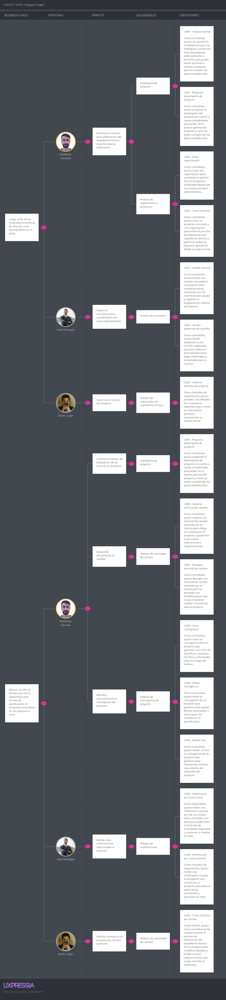

Se determina, a partir del artefacto analizado, que los tres segmentos definidos resultan esenciales para cumplir con los objetivos planteados por la empresa.

En primer lugar, alcanzar que el 3% de las empresas consultoras de obras en Lima utilicen ClearCost será posible si:

* Edilberto Cáceres tiene plena visibilidad del desempeño temporal en relación con el cumplimiento de los hitos del expediente técnico.

* José Rodríguez interviene de manera activa en las reuniones del proyecto.

* Javier Luján realiza un seguimiento constante de que se cumplan sus requisitos durante la elaboración del expediente técnico.

En segundo lugar, el objetivo de reducir en un 50% el tiempo requerido para replanificar un expediente técnico podrá lograrse si:

* Edilberto Cáceres responde con eficacia frente a los cambios, recibiendo notificaciones oportunas de cada solicitud del cliente y reorganizando de manera adecuada el cronograma y los hitos del proyecto.

* José Rodríguez es notificado puntualmente sobre nuevas tareas asignadas y reuniones programadas.

* Javier Luján solicita las modificaciones necesarias de forma oportuna durante el desarrollo del expediente técnico.

## 3.4. Alcance

El alcance del proyecto ClearCost consiste en el desarrollo de una plataforma digital dirigida a pequeñas y medianas empresas constructoras, consultoras, contratistas independientes y entidades contratantes. Su propósito es optimizar la gestión de expedientes técnicos en proyectos de construcción, integrando tanto la coordinación de equipos como el control financiero.

El sistema incluirá funcionalidades para organizar equipos dentro de una organización y subdividirlos en grupos de trabajo por proyecto, facilitar la coordinación de tareas mediante hitos, controlar y dar trazabilidad a los presupuestos asociados a contratos almacenados en la nube, y ofrecer a los clientes contratantes una visualización clara del avance de sus proyectos.

En esta primera etapa, el proyecto no contemplará integraciones con sistemas externos ni módulos avanzados de gestión de recursos humanos. Estas funcionalidades podrán evaluarse en fases futuras de desarrollo.

## 3.5. Product Backlog

La priorización de las SWR, US y TS se llevó a cabo de manera colaborativa, tomando como base los conocimientos técnicos y de dominio que cada integrante del equipo aportó al proyecto. Para facilitar este proceso, empleamos la herramienta YouTrack, que permitió organizar y visualizar las tareas de forma estructurada, coordinar esfuerzos de manera conjunta, establecer prioridades con mayor claridad y mantener una trazabilidad efectiva de los elementos gestionados a lo largo del proyecto.

<table>
<thead>
<tr>
<th># Orden</th>
<th>User Story Id</th>
<th>Título</th>
<th>Descripción</th>
<th>Story Points (1 / 2 / 3 / 5 / 8)</th>
</tr>
</thead>
<tbody>
<tr>
<td>1</td>
<td>SWR01</td>
<td>Cambiar segmento objetivo</td>
<td>Como visitante quiero contar con la opción de especificar qué tipo de visitante soy para obtener información relevante a mis propios intereses en el Landing Page</td>
<td>1</td>
</tr> <tr>
<td>2</td>
<td>SWR06</td>
<td>Call to action Contratista</td>
<td>Como visitante del segmento contratista quiero contar con una sección que me indique como empezar a utilizar el producto</td>
<td>1</td>
</tr> <tr>
<td>3</td>
<td>SWR07</td>
<td>Call to action Cliente</td>
<td>Como visitante del segmento cliente quiero contar con una sección que me indique como empezar a utilizar el producto</td>
<td>1</td>
</tr> <tr>
<td>4</td>
<td>SWR05</td>
<td>Hero Section Contratista</td>
<td>Como visitante del segmento contratista quiero visualizar un hero section para conocer rápidamente el valor principal del producto</td>
<td>1</td>
</tr> <tr>
<td>5</td>
<td>SWR04</td>
<td>Hero Section Cliente</td>
<td>Como visitante del segmento cliente quiero visualizar un hero section para conocer rápidamente el valor principal del producto</td>
<td>1</td>
</tr> <tr>
<td>6</td>
<td>SWR09</td>
<td>Overview contratista</td>
<td>Como visitante del segmento contratista quiero un resumen de las principales funcionalidades del producto para para saber si el producto se adapta a las necesidades de mi empresa</td>
<td>1</td>
</tr> <tr>
<td>7</td>
<td>SWR08</td>
<td>Overview cliente</td>
<td>Como visitante del segmento cliente quiero contar con un resumen de las principales funcionalidades del producto para conocer cual es su propósito</td>
<td>1</td>
</tr> <tr>
<td>8</td>
<td>SWR11</td>
<td>Beneficios contratista</td>
<td>Como visitante de segmento contratista quiero conocer los beneficios de utilizar el producto para mejorar mi producción y gestión de tiempo en la planificación de expedientes técnicos</td>
<td>1</td>
</tr> <tr>
<td>9</td>
<td>SWR10</td>
<td>Beneficios cliente</td>
<td>Como visitante de segmento cliente quiero conocer los beneficios de utilizar el producto para mejorar mi experiencia durante la planificación del proyecto</td>
<td>1</td>
</tr>
<tr>
<td>10</td>
<td>SWR16</td>
<td>About The Product</td>
<td>Como visitante quiero conocer más acerca del producto que voy a adquirir para saber con que producto voy a trabajar</td>
<td>1</td>
</tr> <tr>
<td>11</td>
<td>SWR03</td>
<td>About Us</td>
<td>Como visitante quiero conocer más acerca del equipo detrás del producto para evaluar qué tan confiable es su origen</td>
<td>1</td>
</tr> <tr>
<td>12</td>
<td>SWR13</td>
<td>Testimonios contratista</td>
<td>Como visitante del segmento contratista quiero leer testimonios de otros contratistas que hayan utilizado el producto para saber si empresas similares a la mía han obtenido buenos resultados al usarlo</td>
<td>1</td>
</tr> <tr>
<td>13</td>
<td>SWR12</td>
<td>Testimonios cliente</td>
<td>Como visitante del segmento cliente quiero leer testimonios de otros clientes que hayan tenido experiencias con el producto para conocer los beneficios del mismo</td>
<td>1</td>
</tr> <tr>
<td>14</td>
<td>SWR02</td>
<td>Internacionalización</td>
<td>Como visitante quiero contar con internacionalización para adaptar el contenido de la Landing Page al idioma que entiendo mejor</td>
<td>1</td>
</tr>
<tr>
<td>15</td>
<td>SWR18</td>
<td>Planes</td>
<td>Como visitante quiero conocer los planes del producto para evaluar cuál es el que más me conviene.</td>
<td>1</td>
</tr>
<tr>
<td>16</td>
<td>SWR14</td>
<td>Footer</td>
<td>Como visitante quiero acceder a información clave desde el pie de página para orientarme fácilmente sin tener que volver al inicio</td>
<td>1</td>
</tr> <tr>
<td>17</td>
<td>SWR17</td>
<td>Términos y condiciones de uso</td>
<td>Como visitante quiero conocer los términos y condiciones del servicio para estar informado sobre los lineamientos bajos los cuales opera el servicio</td>
<td>1</td>
</tr> <tr>
<td>18</td>
<td>SWR15</td>
<td>Header</td>
<td>Como visitante quiero contar con un sistema de navegación que me permita explorar fácilmente el contenido de la Landing Page</td>
<td>1</td>
</tr>
<tr>
<td>19</td>
<td>US006</td>
<td>Visualizar listado de proyectos accesibles</td>
<td>Como miembro del equipo deseo consultar todos los proyectos a los que tengo acceso dentro de mi organización para identificar rápidamente los proyectos disponibles y comprender mi responsabilidad en cada uno.</td>
<td>1</td>
</tr>
<tr>
<td>20</td>
<td>US012</td>
<td>Agregar miembro de organización al equipo de proyecto</td>
<td>Como contratista deseo añadir miembros de su organización al equipo de un proyecto activo para formar y estructurar el equipo responsable de cumplir con los entregables del proyecto.</td>
<td>1</td>
</tr>
<tr>
<td>21</td>
<td>US013</td>
<td>Buscar miembro por nombre o correo dentro de la organización</td>
<td>Como contratista deseo filtrar eficientemente la lista de miembros de la organización al seleccionar integrantes del equipo para reducir el tiempo de búsqueda cuando la organización tiene muchos miembros.</td>
<td>1</td>
</tr>
<tr>
<td>22</td>
<td>US046</td>
<td>Adjuntar archivos en la entrega de tarea</td>
<td>Como especialista deseo subir documentos técnicos o evidencias como parte de la entrega de una tarea para centralizar la documentación técnica en el workspace de la organización y asegurar trazabilidad.</td>
<td>2</td>
</tr>
<tr>
<td>23</td>
<td>US058</td>
<td>Ingresar fechas y horarios de la reunión</td>
<td>Como contratista o coordinador deseo definir la fecha y hora de inicio y fin de una reunión planificada para asegurar una correcta organización del cronograma y permitir que los participantes se preparen con anticipación.</td>
<td>1</td>
</tr>
<tr>
<td>24</td>
<td>US059</td>
<td>Ingresar fechas y horarios de la reunión</td>
<td>Como contratista o coordinador deseo definir la fecha y hora de inicio y fin de una reunión planificada para asegurar una correcta organización del cronograma y permitir que los participantes se preparen con anticipación.</td>
<td>1</td>
</tr>
<tr>
<td>25</td>
<td>US072</td>
<td>Renombrar carpeta del expediente</td>
<td>Como contratista deseo actualizar el nombre de una carpeta si se cometió un error o cambió su propósito para mantener la organización del expediente técnico clara y alineada con los estándares del proyecto.</td>
<td>1</td>
</tr>
<tr>
<td>26</td>
<td>US075</td>
<td>Eliminar referencia a archivo del expediente técnico</td>
<td>Como contratista deseo retirar del expediente una referencia que fue añadida por error o ya no es necesaria para mantener la relevancia y organización del expediente sin afectar el archivo original en el workspace.</td>
<td>1</td>
</tr>
<tr>
<td>27</td>
<td>US080</td>
<td>Ver ChangeProcess iniciados (Entidad contratante)</td>
<td>Como entidad contratante deseo consultar las solicitudes de cambio iniciadas por su organización para hacer seguimiento al estado de sus solicitudes y entender la evolución del proceso de evaluación.</td>
<td>1</td>
</tr>
<tr>
<td>28</td>
<td>US081</td>
<td>Restringir acceso a ChangeProcesses iniciados fuera de la organización</td>
<td>Como entidad contratante o residente de obra deseo mantener la confidencialidad de los procesos iniciados por otras organizaciones para proteger la integridad de los datos y asegurar la trazabilidad solo para actores autorizados.</td>
<td>1</td>
</tr>
<tr>
<td>29</td>
<td>US087</td>
<td>Crear una organización</td>
<td>Como persona registrada en el sistema deseo iniciar el registro de una nueva organización consultora para poder organizar su estructura interna y comenzar a gestionar proyectos con su equipo.</td>
<td>1</td>
</tr>
<tr>
<td>30</td>
<td>US088</td>
<td>Crear una organización</td>
<td>Como persona registrada en el sistema deseo registrar una nueva organización consultora para administrar su estructura interna y comenzar a gestionar proyectos con su equipo.</td>
<td>1</td>
</tr>
<tr>
<td>31</td>
<td>US089</td>
<td>Ingresar razón social de la organización</td>
<td>Como persona registrada deseo proporcionar la razón social durante la creación de una organización para registrar formalmente a la organización con el nombre legal requerido.</td>
<td>1</td>
</tr>
<tr>
<td>32</td>
<td>US090</td>
<td>Ingresar nombre comercial de la organización</td>
<td>Como persona registrada deseo proporcionar un nombre comercial durante la creación de una organización para identificar públicamente a la organización con un nombre amigable o representativo.</td>
<td>1</td>
</tr>
<tr>
<td>33</td>
<td>US091</td>
<td>Ingresar RUC de la organización</td>
<td>Como persona registrada deseo proporcionar el RUC como identificador tributario durante la creación de una organización para cumplir con los requisitos legales de registro y evitar duplicidades o inconsistencias.</td>
<td>1</td>
</tr>
<tr>
<td>34</td>
<td>US092</td>
<td>Confirmar creación de la organización</td>
<td>Como persona registrada deseo finalizar el proceso de creación de una organización una vez completado el formulario para registrar formalmente la organización dentro del sistema y habilitarla para operaciones posteriores.</td>
<td>1</td>
</tr>
<tr>
<td>35</td>
<td>US094</td>
<td>Acceder al dashboard de una organización</td>
<td>Como persona registrada deseo ingresar a la vista principal de una organización a la que pertenece para gestionar proyectos, miembros, configuraciones y otros recursos desde un punto centralizado.</td>
<td>1</td>
</tr>
<tr>
<td>36</td>
<td>US095</td>
<td>Editar razón social de la organización</td>
<td>Como contractor deseo actualizar la razón social registrada cuando existan cambios formales en la empresa para mantener alineada la información del sistema con los datos legales oficiales de la organización.</td>
<td>1</td>
</tr>
<tr>
<td>37</td>
<td>US096</td>
<td>Editar nombre comercial de la organización</td>
<td>Como contractor deseo actualizar el nombre comercial cuando cambie la presentación pública de la organización para mantener la información visual y comunicacional coherente con la identidad actual de la empresa.</td>
<td>1</td>
</tr>
<tr>
<td>38</td>
<td>US097</td>
<td>Editar nombre comercial de la organización</td>
<td>Como contractor deseo actualizar el nombre comercial cuando cambie la presentación pública de la organización para mantener la información visual y comunicacional coherente con la identidad actual de la empresa.</td>
<td>1</td>
</tr>
<tr>
<td>39</td>
<td>US098</td>
<td>Eliminar organización (estado INACTIVE)</td>
<td>Como contractor deseo desactivar una organización cuando ya no sea necesaria para proteger el sistema de errores accidentales y mantener control sobre el ciclo de vida de la entidad.</td>
<td>1</td>
</tr>
<tr>
<td>40</td>
<td>US099</td>
<td>Eliminar definitivamente la organización (vía confirmación por correo)</td>
<td>Como contractor deseo eliminar de manera inmediata y permanente una organización cuando se justifique con una confirmación explícita para limpiar datos obsoletos o innecesarios del sistema sin esperar el periodo de eliminación lógica.</td>
<td>1</td>
</tr>
<tr>
<td>41</td>
<td>US100</td>
<td>Invitar a una persona a la organización</td>
<td>Como contractor deseo incorporar nuevos miembros a la organización enviando invitaciones para expandir el equipo de trabajo de forma controlada y con trazabilidad.</td>
<td>1</td>
</tr>
<tr>
<td>42</td>
<td>US102</td>
<td>Impedir invitar a alguien que ya es miembro</td>
<td>Como contractor deseo evitar enviar invitaciones a personas que ya forman parte de la organización para prevenir errores y mantener consistencia en la gestión de miembros.</td>
<td>1</td>
</tr>
<tr>
<td>43</td>
<td>US103</td>
<td>Ver listado de invitaciones enviadas</td>
<td>Como contractor deseo consultar las invitaciones que ha enviado para incorporar miembros a la organización para dar seguimiento a quién ha sido invitado y qué respuesta ha dado.</td>
<td>1</td>
</tr>
<tr>
<td>44</td>
<td>US104</td>
<td>Aceptar o rechazar una invitación recibida</td>
<td>Como persona invitada deseo responder a una invitación de ingreso a una organización para controlar su afiliación a organizaciones y gestionar de forma consciente su participación.</td>
<td>1</td>
</tr>
<tr>
<td>45</td>
<td>US105</td>
<td>Visualizar lista de miembros de la organización</td>
<td>Como miembro de una organización deseo consultar quiénes forman parte de su organización para conocer la composición del equipo y facilitar la comunicación o coordinación.</td>
<td>1</td>
</tr>
<tr>
<td>46</td>
<td>US106</td>
<td>Eliminar miembro de la organización</td>
<td>Como contractor deseo retirar a un miembro que ya no colabora dentro de la organización para mantener actualizada la lista de miembros activos y evitar responsabilidades innecesarias.</td>
<td>1</td>
</tr>
<tr>
<td>47</td>
<td>US111</td>
<td>Notificar a un usuario cuando es invitado a una organización</td>
<td>Como persona externa al sistema o no miembro de la organización deseo ser informado cuando ha sido invitado a unirse a una organización para poder tomar una decisión informada sobre su participación.</td>
<td>1</td>
</tr>
<tr>
<td>48</td>
<td>US145</td>
<td>Mostrar advertencia si la organización está inactiva por falta de workspace</td>
<td>Como miembro de una organización deseo entender por qué no puede acceder a las funciones administrativas de su organización para recibir orientación clara para reactivar el workspace mediante la suscripción correspondiente.</td>
<td>1</td>
</tr>
<tr>
<td>49</td>
<td>US146</td>
<td>Mostrar advertencia al intentar exceder el número máximo de miembros permitidos</td>
<td>Como contratista de una organización deseo comprender por qué no puede añadir más personas al equipo para respetar los límites del plan contratado y evaluar la necesidad de un upgrade.</td>
<td>1</td>
</tr>
<tr>
<td>50</td>
<td>US147</td>
<td>Mostrar advertencia al intentar subir archivos que superan la capacidad del workspace</td>
<td>Como miembro de una organización deseo entender por qué no puede subir nuevos archivos al sistema para evitar pérdidas de tiempo y mantener la organización del almacenamiento según los límites contratados.</td>
<td>1</td>
</tr>
<tr>
<td>51</td>
<td>US010</td>
<td>Actualizar entidad contratante y contrato del proyecto</td>
<td>Como contratista deseo corregir o modificar formalmente la relación contractual del proyecto para mantener la validez legal del encargo ante cambios institucionales o errores de registro.</td>
<td>1</td>
</tr>
<tr>
<td>52</td>
<td>US063</td>
<td>Confirmar creación de la reunión</td>
<td>Como contratista o coordinador deseo finalizar el registro de una reunión con todos sus datos completados para añadir formalmente la reunión al cronograma y notificar a los participantes correspondientes.</td>
<td>1</td>
</tr>
<tr>
<td>53</td>
<td>US116</td>
<td>Eliminar automáticamente notificaciones antiguas</td>
<td>Como sistema deseo remover notificaciones que ya no son relevantes tras un largo periodo para mantener la base de datos limpia y evitar acumulación innecesaria de registros obsoletos.</td>
<td>1</td>
</tr>
<tr>
<td>54</td>
<td>US118</td>
<td>Mostrar campos de registro según tipo de cuenta seleccionado</td>
<td>Como persona externa al sistema deseo llenar solo los campos necesarios para el tipo de cuenta elegida para facilitar el registro con un formulario claro y adaptado a sus necesidades.</td>
<td>1</td>
</tr>
<tr>
<td>55</td>
<td>US121</td>
<td>Confirmar el registro mediante enlace recibido por correo</td>
<td>Como persona que inició su registro deseo validar su identidad para activar su cuenta para garantizar que solo usuarios con acceso a su correo puedan finalizar el registro.</td>
<td>1</td>
</tr>
<tr>
<td>56</td>
<td>US123</td>
<td>Mostrar error si las credenciales son incorrectas</td>
<td>Como usuario del sistema deseo saber cuándo ha ingresado mal su correo o contraseña al intentar iniciar sesión para corregir rápidamente el error y evitar intentos fallidos o bloqueos innecesarios.</td>
<td>1</td>
</tr>
<tr>
<td>57</td>
<td>US129</td>
<td>Ver mensaje de éxito al completar el restablecimiento</td>
<td>Como usuario que ha restablecido su contraseña deseo confirmar que su nueva contraseña fue aceptada para saber que ahora puede iniciar sesión normalmente con su nueva clave.</td>
<td>1</td>
</tr>
<tr>
<td>58</td>
<td>US001</td>
<td>Ingresar nombre del proyecto</td>
<td>Como contratista deseo asignar un nombre claro al proyecto para identificarlo fácilmente y mantenerlo organizado dentro del workspace.</td>
<td>1</td>
</tr>
<tr>
<td>59</td>
<td>US074</td>
<td>Añadir referencia a archivo al expediente</td>
<td>Como contratista deseo integrar documentos ya subidos al workspace dentro del expediente técnico sin duplicarlos para mantener una estructura ordenada y trazable sin aumentar el almacenamiento innecesariamente.</td>
<td>1</td>
</tr>
<tr>
<td>60</td>
<td>US112</td>
<td>Notificar recordatorio de vencimiento de factura</td>
<td>Como usuario responsable de la cuenta de suscripción deseo recibir una alerta cuando una factura está próxima a vencer para evitar la suspensión del servicio por falta de pago.</td>
<td>1</td>
</tr>
<tr>
<td>61</td>
<td>US136</td>
<td>Contratar un nuevo plan de suscripción</td>
<td>Como persona interesada en acceder a funcionalidades avanzadas deseo activar un plan que le permita gestionar organizaciones, proyectos y archivos para adquirir permisos y capacidad de uso según sus necesidades mediante un workspace asociado.</td>
<td>1</td>
</tr>
<tr>
<td>62</td>
<td>US137</td>
<td>Ver detalles de la suscripción activa</td>
<td>Como usuario con suscripción activa deseo consultar la información actual de su plan contratado para gestionar mejor sus fechas, límites y renovar a tiempo si es necesario.</td>
<td>1</td>
</tr>
<tr>
<td>63</td>
<td>US138</td>
<td>Cancelar una suscripción activa y mostrar restricciones asociadas</td>
<td>Como usuario con suscripción activa deseo detener la renovación automática de su plan o darlo de baja para controlar su suscripción y entender las implicancias del cambio.</td>
<td>1</td>
</tr>
<tr>
<td>64</td>
<td>US139</td>
<td>Visualizar facturas generadas por suscripciones</td>
<td>Como usuario con historial de suscripción deseo consultar las facturas emitidas asociadas a sus planes contratados para llevar control financiero y descargar los documentos para su archivo personal o contable.</td>
<td>1</td>
</tr>
<tr>
<td>65</td>
<td>US142</td>
<td>Activar o desactivar pago automático</td>
<td>Como usuario con suscripción activa deseo decidir si desea que las renovaciones se cobren automáticamente para evitar cobros inesperados o garantizar continuidad sin preocuparse por fechas.</td>
<td>1</td>
</tr>
<tr>
<td>66</td>
<td>US144</td>
<td>Ver detalles del workspace asociado a su suscripción</td>
<td>Como usuario con suscripción activa deseo consultar los límites y capacidades asignados a su entorno de trabajo para organizar sus recursos según el espacio disponible y el número de proyectos o miembros permitidos.</td>
<td>1</td>
</tr>
<tr>
<td>67</td>
<td>US002</td>
<td>Ingresar fecha de inicio del proyecto</td>
<td>Como contratista deseo establecer la fecha en que el proyecto comienza oficialmente para definir el punto de partida del cronograma técnico y administrativo.</td>
<td>1</td>
</tr>
<tr>
<td>68</td>
<td>US003</td>
<td>Ingresar fecha de finalización del proyecto</td>
<td>Como contratista deseo definir el plazo previsto para la ejecución del proyecto para planificar los hitos técnicos y asegurar la entrega oportuna del expediente.</td>
<td>1</td>
</tr>
<tr>
<td>69</td>
<td>US004</td>
<td>Asociar contrato firmado y su fecha al proyecto</td>
<td>Como contratista deseo vincular el contrato legal que respalda el proyecto para formalizar la ejecución del proyecto con la entidad contratante de manera legal y trazable.</td>
<td>3</td>
</tr>
<tr>
<td>70</td>
<td>US005</td>
<td>Seleccionar entidad contratante del proyecto</td>
<td>Como contratista deseo asociar la entidad responsable del encargo del proyecto para formalizar y registrar correctamente la relación contractual desde el inicio.</td>
<td>1</td>
</tr>
<tr>
<td>71</td>
<td>US007</td>
<td>Consultar los detalles de un proyecto específico</td>
<td>Como miembro del equipo del proyecto deseo ver toda la información relevante de un proyecto en el que participo para comprender su estado, equipo, documentos y planificación para colaborar efectivamente.</td>
<td>2</td>
</tr>
<tr>
<td>72</td>
<td>US008</td>
<td>Editar nombre y descripción de un proyecto</td>
<td>Como contratista deseo modificar los datos descriptivos del proyecto cuando haya errores o cambios de enfoque para mantener la información del proyecto clara y actualizada para los miembros del equipo.</td>
<td>1</td>
</tr>
<tr>
<td>73</td>
<td>US009</td>
<td>Cambiar el estado del proyecto</td>
<td>Como contratista deseo actualizar manualmente la etiqueta de estado del proyecto para indicar su progreso para ayudar al equipo a interpretar en qué etapa se encuentra el proyecto.</td>
<td>1</td>
</tr>
<tr>
<td>74</td>
<td>US011</td>
<td>Eliminar un proyecto</td>
<td>Como contratista deseo descartar un proyecto si fue creado por error o ya no será ejecutado para mantener el entorno de trabajo limpio y enfocado solo en proyectos activos.</td>
<td>2</td>
</tr>
<tr>
<td>75</td>
<td>US016</td>
<td>Confirmar incorporación de los miembros seleccionados al proyecto</td>
<td>Como contratista deseo revisar y confirmar los miembros que ha preparado para añadir al equipo del proyecto para tener control final antes de que se realicen los cambios en el equipo del proyecto.</td>
<td>1</td>
</tr>
<tr>
<td>76</td>
<td>US017</td>
<td>Visualizar listado de miembros del equipo del proyecto</td>
<td>Como miembro del proyecto deseo consultar los miembros que forman parte del equipo y sus roles para entender la estructura del equipo y saber quién cumple qué función.</td>
<td>1</td>
</tr>
<tr>
<td>77</td>
<td>US018</td>
<td>Editar el rol de un miembro del equipo del proyecto</td>
<td>Como contratista deseo modificar el rol de un miembro del equipo cuando cambien sus responsabilidades para mantener la estructura del equipo alineada con las necesidades del proyecto.</td>
<td>1</td>
</tr>
<tr>
<td>78</td>
<td>US020</td>
<td>Eliminar un miembro del equipo del proyecto sin tareas asignadas</td>
<td>Como contratista deseo retirar a un miembro del equipo cuando ya no tiene función activa en el proyecto y no tiene tareas asignadas para mantener el equipo alineado y evitar confirmaciones accidentales.</td>
<td>1</td>
</tr>
<tr>
<td>79</td>
<td>US021</td>
<td>Eliminar un miembro del equipo del proyecto con tareas asignadas</td>
<td>Como contratista deseo retirar a un miembro que ya no participa, controlando correctamente sus tareas y participaciones para mantener integridad del proyecto evitando tareas huérfanas y reuniones inconsistentes.</td>
<td>1</td>
</tr>
<tr>
<td>80</td>
<td>US022</td>
<td>Visualizar opción de añadir hito al cronograma</td>
<td>Como contratista deseo acceder a la funcionalidad de crear nuevos hitos en el cronograma del proyecto para permitir la planificación estructurada de entregables en etapas definidas.</td>
<td>1</td>
</tr>
<tr>
<td>81</td>
<td>US023</td>
<td>Ingresar nombre del hito del cronograma</td>
<td>Como contratista deseo asignar un nombre claro y representativo al hito del cronograma para identificar fácilmente el propósito de cada etapa del proyecto.</td>
<td>1</td>
</tr>
<tr>
<td>82</td>
<td>US024</td>
<td>Ingresar fechas de inicio y fin del hito</td>
<td>Como contratista deseo definir el período que abarca un hito dentro del cronograma para estructurar temporalmente las etapas del proyecto y facilitar la planificación.</td>
<td>1</td>
</tr>
<tr>
<td>83</td>
<td>US025</td>
<td>Confirmar creación del hito</td>
<td>Como contratista deseo guardar un nuevo hito en el cronograma del proyecto para integrar el hito dentro de la planificación del proyecto y comenzar a estructurar entregables.</td>
<td>1</td>
</tr>
<tr>
<td>84</td>
<td>US026</td>
<td>Visualizar lista de hitos del cronograma del proyecto</td>
<td>Como miembro del proyecto deseo consultar los hitos definidos en el cronograma del proyecto para entender la estructura temporal del proyecto y preparar las actividades por etapa.</td>
<td>1</td>
</tr>
<tr>
<td>85</td>
<td>US027</td>
<td>Editar nombre de un hito del cronograma</td>
<td>Como contratista deseo modificar el nombre de un hito cuando sea necesario ajustarlo o corregirlo para mantener la claridad del cronograma frente al equipo y reflejar adecuadamente la etapa del proyecto.</td>
<td>1</td>
</tr>
<tr>
<td>86</td>
<td>US028</td>
<td>Editar fechas de inicio y fin de un hito</td>
<td>Como contratista deseo ajustar el período de un hito en función de cambios en el cronograma del proyecto para mantener actualizada la planificación temporal y reflejar la realidad del avance.</td>
<td>1</td>
</tr>
<tr>
<td>87</td>
<td>US029</td>
<td>Eliminar un hito del cronograma</td>
<td>Como contratista deseo eliminar un hito que ya no es necesario dentro del cronograma del proyecto para mantener el cronograma limpio y alineado con los hitos verdaderamente relevantes.</td>
<td>1</td>
</tr>
<tr>
<td>88</td>
<td>US032</td>
<td>Visualizar lista de tareas del cronograma por hito</td>
<td>Como miembro del proyecto deseo consultar las tareas planificadas dentro de los hitos del cronograma del proyecto para entender el trabajo técnico pendiente o en curso según la planificación del proyecto.</td>
<td>1</td>
</tr>
<tr>
<td>89</td>
<td>US037</td>
<td>Confirmar creación de la tarea</td>
<td>Como contratista deseo guardar una nueva tarea en el cronograma del proyecto una vez ingresados todos los campos requeridos para formalizar la existencia de la tarea y permitir su visualización y gestión dentro del flujo del proyecto.</td>
<td>1</td>
</tr>
<tr>
<td>90</td>
<td>US040</td>
<td>Editar nombre de una tarea</td>
<td>Como contratista deseo modificar el nombre de una tarea para reflejar mejor su propósito o alcance para mejorar la claridad y comprensión de las actividades planificadas dentro del proyecto.</td>
<td>1</td>
</tr>
<tr>
<td>91</td>
<td>US041</td>
<td>Editar nombre de una tarea</td>
<td>Como contratista deseo modificar el nombre de una tarea para reflejar mejor su propósito o alcance para mejorar la claridad y comprensión de las actividades planificadas dentro del proyecto.</td>
<td>1</td>
</tr>
<tr>
<td>92</td>
<td>US049</td>
<td>Visualizar tareas pendientes de revisión</td>
<td>Como coordinador o contratista deseo consultar todas las tareas del proyecto y saber cuáles requieren revisión para mantener control sobre el estado de avance de las tareas y facilitar la evaluación oportuna.</td>
<td>1</td>
</tr>
<tr>
<td>93</td>
<td>US050</td>
<td>Aprobar entrega de tarea</td>
<td>Como coordinador o contratista deseo marcar una tarea entregada como completada satisfactoriamente tras su revisión para cerrar formalmente el ciclo de ejecución de la tarea y reflejar su avance dentro del proyecto.</td>
<td>1</td>
</tr>
<tr>
<td>94</td>
<td>US052</td>
<td>Volver a enviar una tarea rechazada</td>
<td>Como especialista deseo realizar una nueva entrega luego de recibir retroalimentación en una revisión anterior para permitir el perfeccionamiento del trabajo técnico y el avance del proyecto tras correcciones.</td>
<td>2</td>
</tr>
<tr>
<td>95</td>
<td>US054</td>
<td>Visualizar lista de reuniones del cronograma por hito</td>
<td>Como miembro del proyecto deseo consultar las reuniones planificadas dentro de los hitos del cronograma del proyecto para entender la agenda de coordinación del equipo según el avance por etapas del proyecto.</td>
<td>2</td>
</tr>
<tr>
<td>96</td>
<td>US055</td>
<td>Visualizar detalles de una reunión</td>
<td>Como miembro del proyecto deseo consultar toda la información relevante de una reunión agendada para conocer con claridad los objetivos, participantes y horarios de cada reunión.</td>
<td>1</td>
</tr>
<tr>
<td>97</td>
<td>US061</td>
<td>Buscar participantes por nombre o correo en reuniones</td>
<td>Como contratista o coordinador deseo filtrar rápidamente la lista de miembros del proyecto al convocar una reunión para ahorrar tiempo al seleccionar participantes, especialmente en equipos grandes.</td>
<td>1</td>
</tr>
<tr>
<td>98</td>
<td>US069</td>
<td>Visualizar estructura del expediente técnico del proyecto</td>
<td>Como miembro del proyecto deseo consultar el contenido organizado del expediente técnico asociado al proyecto para acceder fácilmente a los documentos técnicos relevantes según la estructura definida por la empresa.</td>
<td>1</td>
</tr>
<tr>
<td>99</td>
<td>US070</td>
<td>Ver detalles de un archivo referenciado</td>
<td>Como miembro del proyecto deseo consultar información completa sobre un archivo incluido en el expediente técnico para identificar el contenido, origen y propósito del archivo dentro del contexto del proyecto.</td>
<td>1</td>
</tr>
<tr>
<td>100</td>
<td>US071</td>
<td>Crear carpeta dentro del expediente técnico</td>
<td>Como contratista deseo organizar el expediente técnico mediante una estructura jerárquica clara para mantener ordenados los documentos técnicos según los estándares de la empresa y del proyecto.</td>
<td>1</td>
</tr>
<tr>
<td>101</td>
<td>US076</td>
<td>Iniciar solicitud de cambio desde una ChangeRequest</td>
<td>Como entidad contratante deseo solicitar formalmente una modificación del alcance, contenido o entrega del proyecto para asegurar que el cambio sea evaluado, aprobado o rechazado bajo un proceso trazable.</td>
<td>1</td>
</tr>
<tr>
<td>102</td>
<td>US077</td>
<td>Iniciar solicitud de cambio desde una TechnicalQuery</td>
<td>Como residente de obra deseo reportar un problema técnico observado durante la ejecución del proyecto que requiere aprobación formal para ser modificado para registrar incidentes técnicos y estructurar su evaluación mediante un proceso formal de cambio.</td>
<td>1</td>
</tr>
<tr>
<td>103</td>
<td>US079</td>
<td>Ver ChangeProcess iniciados</td>
<td>Como contractor o miembro del equipo deseo consultar todos los procesos de cambio registrados en el proyecto para analizar el historial de solicitudes y realizar un seguimiento efectivo del estado de los cambios.</td>
<td>1</td>
</tr>
<tr>
<td>104</td>
<td>US082</td>
<td>Aprobar un ChangeProcess</td>
<td>Como contractor deseo aceptar formalmente una solicitud de cambio tras evaluar su justificación para avanzar con la modificación del proyecto bajo respaldo documentado y ordenado.</td>
<td>1</td>
</tr>
<tr>
<td>105</td>
<td>US083</td>
<td>Rechazar un ChangeProcess</td>
<td>Como contractor deseo denegar una solicitud de cambio que no se justifica o no puede ser atendida para mantener la estabilidad del proyecto evitando cambios innecesarios o mal fundamentados.</td>
<td>1</td>
</tr>
<tr>
<td>106</td>
<td>US085</td>
<td>Crear nuevo hito a partir de un ChangeOrder aprobado</td>
<td>Como contractor deseo incluir formalmente una etapa adicional en el cronograma del proyecto como resultado de un cambio aprobado para reflejar en la planificación oficial el impacto del cambio aprobado sobre el desarrollo del proyecto.</td>
<td>3</td>
</tr>
<tr>
<td>107</td>
<td>US093</td>
<td>Visualizar organizaciones</td>
<td>Como persona registrada deseo consultar las organizaciones de las que forma parte para acceder rápidamente a las entidades con las que colabora o gestiona proyectos.</td>
<td>1</td>
</tr>
<tr>
<td>108</td>
<td>US107</td>
<td>Notificar a los participantes cuando se crea una reunión</td>
<td>Como miembro del equipo deseo enterarse cuando ha sido convocado a una reunión del proyecto para asistir puntualmente y prepararse adecuadamente.</td>
<td>1</td>
</tr>
<tr>
<td>109</td>
<td>US108</td>
<td>Notificar al responsable cuando se acerca la fecha límite de una tarea</td>
<td>Como especialista del proyecto deseo recibir un recordatorio oportuno antes de la fecha límite de una tarea para evitar retrasos y facilitar la entrega puntual del trabajo técnico.</td>
<td>1</td>
</tr>
<tr>
<td>110</td>
<td>US110</td>
<td>Notificar cuando se crea un nuevo hito como parte de un cambio aprobado</td>
<td>Como equipo del proyecto deseo enterarse cuando se incorpora un nuevo hito al cronograma como resultado de un cambio aprobado para replanificar tareas, coordinar reuniones y alinear entregables de acuerdo al nuevo alcance.</td>
<td>1</td>
</tr>
<tr>
<td>111</td>
<td>US030</td>
<td>Confirmar eliminación de un hito con contenido asociado</td>
<td>Como contratista deseo comprender las consecuencias de eliminar un hito que contiene tareas o reuniones vinculadas para tomar decisiones informadas y evitar la pérdida accidental de contenido importante.</td>
<td>1</td>
</tr>
<tr>
<td>112</td>
<td>US031</td>
<td>Configurar orden de visualización de hitos del cronograma</td>
<td>Como contratista deseo elegir cómo se ordenan los hitos al visualizarlos en el cronograma para mejorar la legibilidad y adaptarse al estilo de trabajo del contratista o del equipo.</td>
<td>1</td>
</tr>
<tr>
<td>113</td>
<td>US033</td>
<td>Ingresar nombre y especialidad de la tarea</td>
<td>Como contratista deseo definir el objetivo técnico de una tarea y su ámbito de especialidad para estructurar claramente el trabajo técnico que debe realizarse dentro de cada hito del cronograma.</td>
<td>1</td>
</tr>
<tr>
<td>114</td>
<td>US043</td>
<td>Editar fechas de inicio y vencimiento de una tarea</td>
<td>Como contratista deseo ajustar el período programado de una tarea ante cambios en el cronograma o entregables para mantener una planificación actualizada y coherente con el hito del cronograma.</td>
<td>1</td>
</tr>
<tr>
<td>115</td>
<td>US015</td>
<td>Seleccionar especialidad del miembro del equipo</td>
<td>Como contratista deseo asignar la especialidad técnica del miembro del equipo si su rol es specialist para organizar correctamente al equipo por áreas de conocimiento y asignación de tareas.</td>
<td>1</td>
</tr>
<tr>
<td>116</td>
<td>US019</td>
<td>Editar la especialidad de un miembro del equipo del proyecto</td>
<td>Como contratista deseo modificar la especialidad técnica de un miembro que tenga el rol de specialist para mantener la asignación de especialidades actualizada para una correcta distribución de tareas.</td>
<td>1</td>
</tr>
<tr>
<td>117</td>
<td>US034</td>
<td>Ingresar nombre de la tarea</td>
<td>Como contratista deseo asignar un nombre que identifique claramente el propósito de la tarea para permitir que el equipo reconozca fácilmente el objetivo técnico de cada actividad.</td>
<td>1</td>
</tr>
<tr>
<td>118</td>
<td>US035</td>
<td>Seleccionar especialidad de la tarea</td>
<td>Como contratista deseo definir la especialidad técnica necesaria para completar una tarea para asignar la tarea al perfil adecuado y permitir una distribución lógica del trabajo.</td>
<td>1</td>
</tr>
<tr>
<td>119</td>
<td>US036</td>
<td>Ingresar fechas de inicio y vencimiento de la tarea</td>
<td>Como contratista deseo definir el rango de tiempo durante el cual debe realizarse una tarea para mantener un cronograma preciso y detectar tareas retrasadas o vencidas.</td>
<td>1</td>
</tr>
<tr>
<td>120</td>
<td>US038</td>
<td>Asignar responsable a una tarea</td>
<td>Como contratista deseo designar a un miembro del equipo como responsable de ejecutar una tarea para garantizar la trazabilidad de la tarea y activar su flujo de trabajo.</td>
<td>1</td>
</tr>
<tr>
<td>121</td>
<td>US039</td>
<td>Filtrar responsables por especialidad afín a la tarea</td>
<td>Como contratista deseo activar un filtro para facilitar la asignación de tareas a especialistas compatibles para agilizar la asignación técnica de tareas evitando errores por desalineación de especialidades.</td>
<td>1</td>
</tr>
<tr>
<td>122</td>
<td>US042</td>
<td>Editar especialidad de una tarea</td>
<td>Como contratista deseo modificar la especialidad técnica requerida para una tarea según cambios en los entregables o enfoque para garantizar que cada tarea esté alineada con el perfil técnico adecuado.</td>
<td>1</td>
</tr>
<tr>
<td>123</td>
<td>US044</td>
<td>Activar filtro por especialidad al seleccionar responsable de una tarea</td>
<td>Como contratista deseo mostrar solo los miembros cuya especialidad coincida con la especialidad de la tarea, tanto en la asignación como en la edición del responsable para facilitar una selección precisa del responsable técnico ideal.</td>
<td>1</td>
</tr>
<tr>
<td>124</td>
<td>US045</td>
<td>Visualizar opción de entregar una tarea</td>
<td>Como especialista deseo saber si tiene permitido enviar la entrega de una tarea que le fue asignada para acceder fácilmente al formulario de entrega solo cuando corresponde.</td>
<td>1</td>
</tr>
<tr>
<td>125</td>
<td>US048</td>
<td>Enviar entrega de tarea</td>
<td>Como especialista deseo finalizar el proceso de entrega de una tarea con los elementos completados para marcar la tarea como enviada para su revisión, asegurando trazabilidad y control de avances.</td>
<td>1</td>
</tr>
<tr>
<td>126</td>
<td>US053</td>
<td>Eliminar una tarea del cronograma</td>
<td>Como contratista deseo retirar tareas que ya no deben ser ejecutadas o que fueron registradas por error para mantener la planificación limpia, precisa y sin tareas obsoletas.</td>
<td>1</td>
</tr>
<tr>
<td>127</td>
<td>US047</td>
<td>Escribir notas en la entrega de tarea</td>
<td>Como especialista deseo incluir observaciones, comentarios técnicos o explicaciones junto a los archivos entregados para facilitar la comprensión y revisión de la entrega por parte del coordinador o contratista.</td>
<td>1</td>
</tr>
<tr>
<td>128</td>
<td>US051</td>
<td>Rechazar entrega de tarea con retroalimentación</td>
<td>Como coordinador o contratista deseo marcar una entrega como no aceptada y proporcionar retroalimentación clara al especialista para garantizar la calidad del trabajo entregado y orientar mejoras en una nueva entrega.</td>
<td>1</td>
</tr>
<tr>
<td>129</td>
<td>US056</td>
<td>Ingresar tema de la reunión</td>
<td>Como contratista o coordinador deseo definir el tema principal que será tratado durante la reunión para comunicar claramente el propósito del encuentro al equipo participante.</td>
<td>1</td>
</tr>
<tr>
<td>130</td>
<td>US057</td>
<td>Ingresar descripción de la reunión</td>
<td>Como contratista o coordinador deseo agregar una descripción con detalles complementarios sobre el propósito o los temas a tratar para proporcionar contexto adicional a los participantes antes de asistir a la reunión.</td>
<td>1</td>
</tr>
<tr>
<td>131</td>
<td>US060</td>
<td>Añadir participantes a una reunión</td>
<td>Como contratista o coordinador deseo incluir a los miembros del equipo que deben asistir a la reunión para asegurar que los participantes pertinentes estén convocados desde el momento de su creación.</td>
<td>1</td>
</tr>
<tr>
<td>132</td>
<td>US062</td>
<td>Eliminar participantes de una reunión</td>
<td>Como contratista o coordinador deseo ajustar la lista de personas convocadas a una reunión antes de confirmarla para asegurar que solo participen quienes realmente deben estar presentes, evitando errores o confusiones.</td>
<td>1</td>
</tr>
<tr>
<td>133</td>
<td>US064</td>
<td>Editar tema de una reunión</td>
<td>Como contratista o convocante deseo actualizar el título o motivo principal de la reunión si cambia el enfoque para reflejar claramente el propósito actualizado del encuentro para todos los participantes.</td>
<td>1</td>
</tr>
<tr>
<td>134</td>
<td>US065</td>
<td>Editar descripción de una reunión</td>
<td>Como contratista o convocante deseo actualizar la información complementaria o aclaratoria de una reunión ya agendada para brindar mayor claridad a los participantes sobre los temas a tratar o los objetivos del encuentro.</td>
<td>1</td>
</tr>
<tr>
<td>135</td>
<td>US066</td>
<td>Editar fechas y horarios de una reunión</td>
<td>Como contratista o convocante deseo modificar la fecha y hora de una reunión ya agendada si hay cambios en la planificación para mantener el cronograma actualizado y notificar correctamente a los participantes.</td>
<td>1</td>
</tr>
<tr>
<td>136</td>
<td>US113</td>
<td>Visualizar lista de notificaciones recibidas</td>
<td>Como usuario del sistema deseo consultar todas las notificaciones que le han sido enviadas para estar al tanto de eventos importantes del sistema y tomar decisiones oportunas.</td>
<td>1</td>
</tr>
<tr>
<td>137</td>
<td>US114</td>
<td>Ver detalles de una notificación específica</td>
<td>Como usuario del sistema deseo consultar el contenido completo y contexto de una notificación para entender claramente la razón y el impacto del mensaje recibido.</td>
<td>1</td>
</tr>
<tr>
<td>138</td>
<td>US115</td>
<td>Eliminar notificación manualmente</td>
<td>Como usuario del sistema deseo descartar notificaciones que ya no son relevantes o útiles para mantener su bandeja de notificaciones limpia y enfocada.</td>
<td>1</td>
</tr>
<tr>
<td>139</td>
<td>US132</td>
<td>Editar correo electrónico personal</td>
<td>Como usuario autenticado deseo cambiar su correo personal si ha cambiado de proveedor o detecta un error para recibir correctamente todas las notificaciones e invitaciones del sistema.</td>
<td>1</td>
</tr>
<tr>
<td>140</td>
<td>US133</td>
<td>Editar número de teléfono</td>
<td>Como usuario autenticado deseo modificar su número de contacto registrado en el perfil para asegurar que su número actual esté disponible en caso de contacto, verificación o notificaciones.</td>
<td>1</td>
</tr>
<tr>
<td>141</td>
<td>US067</td>
<td>Editar participantes de una reunión</td>
<td>Como contratista o convocante deseo ajustar la lista de personas convocadas tras cambios en la disponibilidad o roles para garantizar que solo los miembros pertinentes estén informados y participen activamente.</td>
<td>1</td>
</tr>
<tr>
<td>142</td>
<td>US078</td>
<td>Visualizar detalles de ChangeProcess</td>
<td>Como contractor deseo visualizar el motivo detrás de una solicitud de cambio iniciada por un cliente o residente para analizar el contexto del cambio y tomar una decisión fundamentada sobre su aprobación o rechazo.</td>
<td>1</td>
</tr>
<tr>
<td>143</td>
<td>US084</td>
<td>Solicitar datos para registrar ChangeOrder al aprobar</td>
<td>Como contractor deseo completar los datos necesarios para formalizar la orden de cambio al aprobar una solicitud para emitir la orden de cambio de forma clara, contextualizada y documentada.</td>
<td>1</td>
</tr>
<tr>
<td>144</td>
<td>US086</td>
<td>Registrar ChangeResponse luego de aprobar o rechazar</td>
<td>Como contractor deseo dejar constancia formal de su decisión respecto a una solicitud de cambio para mantener un historial completo de las decisiones tomadas, incluyendo quién respondió y cuándo.</td>
<td>1</td>
</tr>
<tr>
<td>145</td>
<td>US109</td>
<td>Notificar cuando se emite una respuesta a una solicitud de cambio</td>
<td>Como persona que originó el proceso de cambio deseo ser informado cuando se toma una decisión formal sobre su solicitud para actuar con base en la decisión del contratista y continuar con los trabajos o ajustes necesarios.</td>
<td>1</td>
</tr>
<tr>
<td>146</td>
<td>US014</td>
<td>Seleccionar rol del miembro del equipo</td>
<td>Como contratista deseo definir el rol de cada miembro del equipo al momento de asignarlo para organizar el equipo de trabajo según funciones de coordinación o especialización.</td>
<td>1</td>
</tr>
<tr>
<td>147</td>
<td>US068</td>
<td>Cancelar una reunión del cronograma</td>
<td>Como contratista deseo eliminar reuniones que ya no son necesarias o que fueron agendadas por error para mantener el cronograma limpio y reflejar únicamente reuniones vigentes y relevantes.</td>
<td>1</td>
</tr>
<tr>
<td>148</td>
<td>US073</td>
<td>Eliminar carpeta del expediente</td>
<td>Como contratista deseo retirar una carpeta que fue creada por error o ya no es necesaria para mantener la estructura del expediente técnico ordenada y libre de elementos innecesarios.</td>
<td>1</td>
</tr>
<tr>
<td>149</td>
<td>US101</td>
<td>Validar que no exista ya una invitación pendiente</td>
<td>Como contractor deseo evitar el envío redundante de invitaciones a personas que ya han sido invitadas para mantener orden en el proceso de incorporación y evitar confusión en los usuarios.</td>
<td>1</td>
</tr>
<tr>
<td>150</td>
<td>US117</td>
<td>Elegir tipo de cuenta al iniciar el registro</td>
<td>Como persona externa al sistema deseo indicar qué tipo de cuenta desea registrar para visualizar el formulario adecuado según el tipo de participación que tendrá en la plataforma.</td>
<td>1</td>
</tr>
<tr>
<td>151</td>
<td>US119</td>
<td>Validar campos requeridos según tipo de cuenta</td>
<td>Como persona externa al sistema deseo completar correctamente los campos necesarios según el tipo de cuenta seleccionada para garantizar que el sistema tenga la información mínima necesaria para crear la cuenta correctamente.</td>
<td>1</td>
</tr>
<tr>
<td>152</td>
<td>US120</td>
<td>Validar si el correo ya está registrado o en uso en una solicitud pendiente</td>
<td>Como persona externa al sistema deseo saber si su correo ya está vinculado a una cuenta o en uso en una solicitud activa para evitar duplicar cuentas o solicitudes, y guiar correctamente el proceso de ingreso al sistema.</td>
<td>1</td>
</tr>
<tr>
<td>153</td>
<td>US122</td>
<td>Iniciar sesión desde el formulario de login</td>
<td>Como usuario del sistema deseo autenticarse para acceder a las funcionalidades protegidas de la plataforma para trabajar dentro de su entorno personal o organizacional de forma segura.</td>
<td>1</td>
</tr>
<tr>
<td>154</td>
<td>US124</td>
<td>Mantener sesión activa mientras el usuario interactúa</td>
<td>Como usuario del sistema deseo permanecer autenticado mientras trabaja continuamente en la plataforma para evitar interrupciones y pérdida de información por cierre de sesión anticipado.</td>
<td>1</td>
</tr>
<tr>
<td>155</td>
<td>US125</td>
<td>Cerrar sesión manualmente desde el sistema</td>
<td>Como usuario del sistema deseo finalizar su sesión cuando termina de usar la plataforma para garantizar que nadie más acceda a su información tras dejar de utilizar el sistema.</td>
<td>1</td>
</tr>
<tr>
<td>156</td>
<td>US126</td>
<td>Solicitar restablecimiento de contraseña desde el login</td>
<td>Como usuario que no recuerda su contraseña deseo recibir un enlace para restablecer su contraseña de forma segura para volver a acceder a su cuenta sin tener que crear una nueva.</td>
<td>1</td>
</tr>
<tr>
<td>157</td>
<td>US127</td>
<td>Ver mensaje de confirmación tras solicitar restablecimiento</td>
<td>Como usuario que solicitó recuperar su contraseña deseo saber que su solicitud fue aceptada y está siendo procesada para tener tranquilidad de que el sistema enviará el enlace correspondiente al correo indicado.</td>
<td>1</td>
</tr>
<tr>
<td>158</td>
<td>US128</td>
<td>Acceder al formulario de nueva contraseña desde el enlace recibido</td>
<td>Como usuario que ha solicitado restablecer su contraseña deseo establecer una nueva contraseña desde un enlace seguro para recuperar el control de su cuenta sin depender de soporte técnico.</td>
<td>1</td>
</tr>
<tr>
<td>159</td>
<td>US130</td>
<td>Visualizar información personal registrada</td>
<td>Como usuario autenticado deseo consultar los datos que el sistema tiene registrados sobre su identidad personal para verificar que su información esté actualizada y corregir posibles errores.</td>
<td>1</td>
</tr>
<tr>
<td>160</td>
<td>US131</td>
<td>Editar nombre completo del perfil</td>
<td>Como usuario autenticado deseo actualizar su nombre completo si ha cambiado o contiene errores para mantener una representación precisa de su identidad dentro del sistema.</td>
<td>1</td>
</tr>
<tr>
<td>161</td>
<td>US134</td>
<td>Visualizar los planes de suscripción disponibles</td>
<td>Como persona interesada en suscribirse deseo conocer los distintos planes disponibles y sus características para elegir el plan más adecuado según sus necesidades y capacidades.</td>
<td>1</td>
</tr>
<tr>
<td>162</td>
<td>US135</td>
<td>Visualizar los planes de suscripción disponibles</td>
<td>Como persona interesada en suscribirse deseo conocer los distintos planes disponibles y sus características para elegir el plan más adecuado según sus necesidades y capacidades.</td>
<td>1</td>
</tr>
<tr>
<td>163</td>
<td>US140</td>
<td>Visualizar el detalle de una factura</td>
<td>Como usuario con historial de facturación deseo ver el contenido detallado de una factura emitida por el sistema para entender qué conceptos fueron cobrados y validar los importes incluidos.</td>
<td>1</td>
</tr>
<tr>
<td>164</td>
<td>US141</td>
<td>Iniciar pago manual de una factura pendiente</td>
<td>Como usuario con una factura pendiente de pago deseo completar el pago voluntariamente antes de su vencimiento para evitar interrupciones en el acceso al sistema por falta de pago.</td>
<td>1</td>
</tr>
<tr>
<td>165</td>
<td>US143</td>
<td>Ver intentos de pago realizados (transacciones)</td>
<td>Como usuario con pagos recientes o recurrentes deseo consultar los intentos de cobro realizados por el sistema para detectar pagos exitosos o fallidos y actuar con anticipación ante problemas.</td>
<td>1</td>
</tr>
<tr>
<td>166</td>
<td>US148</td>
<td>Cambiar el idioma preferido desde la configuración de cuenta</td>
<td>Como usuario autenticado deseo ajustar el idioma en el que desea navegar la plataforma para tener una experiencia más cómoda y comprensible al utilizar el sistema.</td>
<td>1</td>
</tr>
<tr>
<td>167</td>
<td>TS01</td>
<td>Crear organización</td>
<td>Como Developer, quiero implementar un endpoint que permita registrar una nueva organización para que los contratistas puedan iniciar la gestión de sus proyectos dentro del sistema</td>
<td>3</td>
</tr>
 <tr>
<td>168</td>
<td>TS02</td>
<td>Listar organizaciones</td>
<td>Como Developer, quiero implementar un endpoint que permita obtener todas las organizaciones a las que pertenece un usuario para que pueda visualizar y gestionar aquellas donde tiene participación activa</td>
<td>1</td>
</tr>
 <tr>
<td>169</td>
<td>TS03</td>
<td>Detalles de una organización</td>
<td>Como Developer, quiero implementar un endpoint que permita obtener los detalles de una organización específica para que los usuarios puedan visualizar su información completa y actualizada</td>
<td>1</td>
</tr>
 <tr>
<td>170</td>
<td>TS04</td>
<td>Actualizar información de organización</td>
<td>Como Developer, quiero implementar un endpoint que permita actualizar los datos de una organización para que los contratistas puedan mantener su información empresarial al día, incluyendo la posibilidad de eliminar ciertos campos</td>
<td>1</td>
</tr>
 <tr>
<td>171</td>
<td>TS05</td>
<td>Eliminar organización</td>
<td>Como Developer, quiero implementar un endpoint que permita iniciar la eliminación de una organización, cambiando su estado a pendiente de eliminación para permitir su recuperación antes de eliminarla definitivamente</td>
<td>1</td>
</tr>
 <tr>
<td>172</td>
<td>TS08</td>
<td>Añadir proyecto a organización</td>
<td>Como Developer, quiero implementar un endpoint que permita registrar un nuevo proyecto vinculado a una organización existente, para que los contratistas puedan iniciar la gestión de sus proyectos dentro del sistema</td>
<td>2</td>
</tr>
 <tr>
<td>173</td>
<td>TS09</td>
<td>Listar proyectos de organización</td>
<td>Como Developer, quiero implementar un endpoint que permita obtener todos los proyectos asociados a una organización, para que los usuarios autorizados puedan visualizarlos y gestionarlos</td>
<td>1</td>
</tr>
 <tr>
<td>174</td>
<td>TS10</td>
<td>Detalles de un proyecto</td>
<td>Como Developer, quiero implementar un endpoint que permita obtener los detalles de un proyecto específico para que los usuarios autorizados puedan visualizar su información completa y actualizada</td>
<td>1</td>
</tr>
 <tr>
<td>175</td>
<td>TS57</td>
<td>Eliminar proyecto (soft delete)</td>
<td>Como Developer, quiero implementar un endpoint que permita marcar un proyecto como eliminado (soft delete), para preservar sus datos temporalmente y permitir su recuperación antes de ser eliminado definitivamente</td>
<td>1</td>
</tr>
 <tr>
<td>176</td>
<td>TS14</td>
<td>Actualizar información de proyecto </td>
<td>Como Developer, quiero implementar un endpoint que permita actualizar el nombre y el estado de un proyecto, para reflejar cambios en su identidad o etapa de ejecución</td>
<td>1</td>
</tr>
 <tr>
<td>177</td>
<td>TS06</td>
<td>Añadir miembro a organización</td>
<td>Como Developer, quiero implementar un endpoint que permita añadir un nuevo miembro a una organización existente, asignándole un rol específico, para que pueda colaborar en la gestión de los proyectos de dicha organización</td>
<td>2</td>
</tr>
 <tr>
<td>178</td>
<td>TS07</td>
<td>Actualizar estado de miembro de organización</td>
<td>Como Developer, quiero implementar un endpoint que permita actualizar el estado de un miembro dentro de una organización para gestionar su acceso según las necesidades administrativas (por ejemplo, activo, suspendido o removido)</td>
<td>1</td>
</tr>
 <tr>
<td>179</td>
<td>TS11</td>
<td>Añadir miembro de equipo con salario a proyecto</td>
<td>Como Developer, quiero implementar un endpoint que permita añadir un miembro de la organización a un proyecto para que pueda participar formalmente en su ejecución con un rol asignado</td>
<td>2</td>
</tr>
 <tr>
<td>180</td>
<td>TS12</td>
<td>Listar miembros de proyecto</td>
<td>Como Developer, quiero implementar un endpoint que permita obtener la lista de miembros asignados a un proyecto para que los usuarios autorizados puedan visualizar quiénes forman parte del equipo</td>
<td>1</td>
</tr>
 <tr>
<td>181</td>
<td>TS58</td>
<td>Eliminar usuario de proyecto</td>
<td>Como Developer, quiero implementar un endpoint que permita eliminar a un usuario del equipo de un proyecto, para que ya no tenga acceso ni participación activa en dicho proyecto</td>
<td>1</td>
</tr>
 <tr>
<td>182</td>
<td>TS13</td>
<td>Actualizar información de miembro de proyecto</td>
<td>Como Developer, quiero implementar un endpoint que permita actualizar el rol de un miembro dentro de un proyecto, para mantener alineadas sus responsabilidades con las necesidades operativas del equipo</td>
<td>1</td>
</tr>
 <tr>
<td>183</td>
<td>TS15</td>
<td>Crear cronograma de proyecto</td>
<td>Como Developer, quiero implementar un endpoint que permita crear un cronograma para un proyecto existente, para que los contratistas puedan planificar y gestionar las actividades clave en una línea de tiempo</td>
<td>3</td>
</tr>
 <tr>
<td>184</td>
<td>TS16</td>
<td>Obtener detalles de cronograma</td>
<td>Como Developer, quiero implementar un endpoint que permita obtener los detalles del cronograma asociado a un proyecto, para que los usuarios puedan visualizar su planificación estructurada</td>
<td>1</td>
</tr>
 <tr>
<td>185</td>
<td>TS17</td>
<td>Añadir hito al cronograma</td>
<td>Como Developer, quiero implementar un endpoint que permita registrar un nuevo hito dentro del cronograma de un proyecto, para reflejar eventos clave dentro de su planificación</td>
<td>2</td>
</tr>
 <tr>
<td>186</td>
<td>TS18</td>
<td>Listar hitos del cronograma</td>
<td>Como Developer, quiero implementar un endpoint que permita obtener todos los hitos registrados en el cronograma de un proyecto, para que los usuarios puedan visualizar los eventos clave del mismo</td>
<td>1</td>
</tr>
 <tr>
<td>187</td>
<td>TS19</td>
<td>Obtener detalles de hito</td>
<td>Como Developer, quiero implementar un endpoint que permita obtener la información detallada de un hito registrado en el cronograma de un proyecto, para que los usuarios puedan revisar su contenido y estado</td>
<td>1</td>
</tr>
 <tr>
<td>188</td>
<td>TS20</td>
<td>Actualizar información de hito</td>
<td>Como Developer, quiero implementar un endpoint que permita actualizar el estado y la duración de un hito, para reflejar el avance real del cronograma y ajustar las estimaciones según la ejecución del proyecto</td>
<td>1</td>
</tr>
 <tr>
<td>189</td>
<td>TS21</td>
<td>Crear reunión</td>
<td>Como Developer, quiero implementar un endpoint que permita crear una reunión vinculada a un proyecto, para que los contratistas puedan organizar y coordinar las reuniones del equipo</td>
<td>3</td>
</tr>
 <tr>
<td>190</td>
<td>TS22</td>
<td>Listar todas las reuniones de un hito</td>
<td>Como Developer, quiero implementar un endpoint que permita obtener todas las reuniones asociadas a un hito específico dentro del cronograma de un proyecto, para facilitar su visualización y gestión</td>
<td>1</td>
</tr>
 <tr>
<td>191</td>
<td>TS23</td>
<td>Obtener detalles de reunión</td>
<td>Como Developer, quiero implementar un endpoint que permita obtener los detalles completos de una reunión específica registrada en un proyecto, para que los usuarios puedan acceder a la información relevante de la reunión</td>
<td>1</td>
</tr>
 <tr>
<td>192</td>
<td>TS24</td>
<td>Actualizar información de reunión</td>
<td>Como Developer, quiero implementar un endpoint que permita actualizar la fecha y los detalles generales de una reunión registrada, para reflejar cambios en la planificación o ajustes de última hora</td>
<td>1</td>
</tr>
 <tr>
<td>193</td>
<td>TS59</td>
<td>Eliminar reunión</td>
<td>Como Developer, quiero implementar un endpoint que permita eliminar una reunión registrada en un proyecto, para que los contratistas puedan gestionar las reuniones que ya no son necesarias</td>
<td>1</td>
</tr>
 <tr>
<td>194</td>
<td>TS25</td>
<td>Añadir asistente de reunión</td>
<td>Como Developer, quiero implementar un endpoint que permita añadir un asistente a una reunión registrada, para que los participantes sean notificados y tengan acceso a la reunión</td>
<td>2</td>
</tr>
 <tr>
<td>195</td>
<td>TS26</td>
<td>Edita/eliminar asistente de reunión</td>
<td>Como Developer, quiero implementar un endpoint que permita editar o eliminar un asistente de una reunión, para mantener actualizada la lista de participantes en caso de cambios en la asistencia</td>
<td>1</td>
</tr>
 <tr>
<td>196</td>
<td>TS27</td>
<td>Crear tarea</td>
<td>Como Developer, quiero implementar un endpoint que permita crear una nueva tarea en un proyecto, para que los contratistas puedan organizar y asignar actividades dentro del cronograma del proyecto</td>
<td>2</td>
</tr>
 <tr>
<td>197</td>
<td>TS61</td>
<td>Eliminar tarea</td>
<td>Como Developer, quiero implementar un endpoint que permita eliminar una tarea asociada a un proyecto, para que los contratistas puedan gestionar las actividades del proyecto eliminando tareas innecesarias o incorrectas</td>
<td>1</td>
</tr>
 <tr>
<td>198</td>
<td>TS28</td>
<td>Listar tareas de hito</td>
<td>Como Developer, quiero implementar un endpoint que permita obtener todas las tareas asociadas a un hito específico dentro de un proyecto, para que los usuarios puedan visualizar todas las actividades vinculadas a ese hito en particular</td>
<td>1</td>
</tr>
 <tr>
<td>199</td>
<td>TS35</td>
<td>Obtener detalles de desempeño de hito</td>
<td>Como Developer, quiero implementar un endpoint que permita obtener los detalles del desempeño de un hito específico, incluyendo el desempeño de las tareas asociadas a ese hito, para que los usuarios puedan evaluar el avance y la puntualidad en los entregables del proyecto</td>
<td>1</td>
</tr>
 <tr>
<td>200</td>
<td>TS29</td>
<td>Obtener detalles de tarea</td>
<td>Como Developer, quiero implementar un endpoint que permita obtener los detalles completos de una tarea asociada a un proyecto, para que los usuarios puedan visualizar toda la información relevante de la tarea</td>
<td>1</td>
</tr>
 <tr>
<td>201</td>
<td>TS30</td>
<td>Actualizar información de tarea</td>
<td>Como Developer, quiero implementar un endpoint que permita actualizar la información de una tarea registrada en un proyecto, para que los contratistas puedan ajustar los detalles, responsable y fechas conforme a la evolución del proyecto</td>
<td>1</td>
</tr>
 <tr>
<td>202</td>
<td>TS60</td>
<td>Subir entregable de tarea</td>
<td>Como Developer, quiero implementar un endpoint que permita subir un entregable asociado a una tarea dentro de un proyecto, para que los contratistas puedan registrar avances y documentación de trabajo</td>
<td>2</td>
</tr>
 <tr>
<td>203</td>
<td>TS31</td>
<td>Crear solicitud de cambio</td>
<td>Como Developer, quiero implementar un endpoint que permita a los clientes crear una solicitud de cambio dentro de un proyecto, para que los cambios solicitados sean registrados y procesados de manera adecuada</td>
<td>2</td>
</tr>
 <tr>
<td>204</td>
<td>TS32</td>
<td>Listar solicitudes de cambio</td>
<td>Como Developer, quiero implementar un endpoint que permita listar todas las solicitudes de cambio asociadas a un proyecto, para que los usuarios puedan ver todas las modificaciones solicitadas por los clientes</td>
<td>1</td>
</tr>
 <tr>
<td>205</td>
<td>TS33</td>
<td>Obtener detalles de solicitud de cambio</td>
<td>Como Developer, quiero implementar un endpoint que permita obtener los detalles completos de una solicitud de cambio asociada a un proyecto, para que los usuarios puedan revisar a fondo la solicitud y tomar decisiones informadas</td>
<td>1</td>
</tr>
 <tr>
<td>206</td>
<td>TS34</td>
<td>Aceptar/Denegar solicitud de cambio</td>
<td>Como Developer, quiero implementar un endpoint que permita aceptar o denegar una solicitud de cambio, para que los contratistas puedan procesar las solicitudes de cambio de acuerdo con la viabilidad del proyecto</td>
<td>1</td>
</tr>
 <tr>
<td>207</td>
<td>TS56</td>
<td>Pagar factura</td>
<td>Como Developer, quiero implementar un endpoint que permita a los usuarios pagar sus facturas utilizando una pasarela de pagos, como Stripe, para asegurar un proceso de pago seguro y eficiente</td>
<td>2</td>
</tr>
 <tr>
<td>208</td>
<td>TS55</td>
<td>Visualizar plan de suscripción</td>
<td>Como Developer, quiero implementar un endpoint que permita a los usuarios visualizar el plan de suscripción actual al que están suscritos, para que puedan revisar los detalles de su suscripción activa</td>
<td>1</td>
</tr>
 <tr>
<td>209</td>
<td>TS54</td>
<td>Actualizar plan de suscripción</td>
<td>Como Developer, quiero implementar un endpoint que permita a los usuarios actualizar su plan de suscripción, para que puedan cambiar a un plan superior o inferior según sus necesidades</td>
<td>1</td>
</tr>
 <tr>
<td>210</td>
<td>TS51</td>
<td>Listar facturas de usuario</td>
<td>Como Developer, quiero implementar un endpoint que permita obtener el listado de facturas asociadas a un usuario, para que el usuario pueda consultar el historial de facturación relacionado con sus suscripciones</td>
<td>1</td>
</tr>
 <tr>
<td>211</td>
<td>TS53</td>
<td>Selección del plan de suscripción</td>
<td>Como Developer, quiero implementar un endpoint que permita obtener el listado de facturas asociadas a un usuario, para que el usuario pueda consultar el historial de facturación relacionado con sus suscripciones</td>
<td>1</td>
</tr>
 <tr>
<td>212</td>
<td>TS52</td>
<td>Estado de una factura</td>
<td>Como Developer, quiero implementar un endpoint que permita consultar el estado de una factura asociada a un usuario, para que el usuario pueda conocer si la factura está pagada, pendiente o vencida</td>
<td>1</td>
</tr>
 <tr>
<td>213</td>
<td>TS50</td>
<td>Corroborar nivel de acceso</td>
<td>Como Developer, quiero implementar una verificación de nivel de acceso en cada solicitud del usuario, para asegurar que solo puedan ejecutar acciones autorizadas según su rol</td>
<td>1</td>
</tr>
 <tr>
<td>214</td>
<td>TS45</td>
<td>Cambiar contraseña</td>
<td>Como Developer, quiero implementar un endpoint que permita a un usuario autenticado cambiar su contraseña actual, para mantener la seguridad de su cuenta</td>
<td>1</td>
</tr>
 <tr>
<td>215</td>
<td>TS49</td>
<td>Límite de intentos de login</td>
<td>Como Developer, quiero implementar un mecanismo que limite la cantidad de intentos fallidos de inicio de sesión, para prevenir ataques de fuerza bruta contra las credenciales de los usuarios</td>
<td>1</td>
</tr>
 <tr>
<td>216</td>
<td>TS46</td>
<td>Solicitar recuperar contraseña</td>
<td>Como Developer, quiero implementar un endpoint que permita a los usuarios solicitar la recuperación de su contraseña mediante correo electrónico, para que puedan restablecerla si la han olvidado</td>
<td>1</td>
</tr>
 <tr>
<td>217</td>
<td>TS48</td>
<td>Encriptación segura de credenciales</td>
<td>Como Developer, quiero implementar una función de encriptación de credenciales mediante salteo y hasheo, para garantizar que las contraseñas de los usuarios no se almacenen ni se procesen nunca en texto plano</td>
<td>1</td>
</tr>
 <tr>
<td>218</td>
<td>TS47</td>
<td>Renovar contraseña</td>
<td>Como Developer, quiero implementar un endpoint que permita a los usuarios restablecer su contraseña usando un token de recuperación válido, para que puedan recuperar el acceso a su cuenta de forma segura</td>
<td>1</td>
</tr>
 <tr>
<td>219</td>
<td>TS40</td>
<td>Actualizar datos de perfil</td>
<td>Como Developer, quiero implementar un endpoint que permita actualizar la información profesional y otros detalles del perfil de un usuario, para que su perfil refleje su experiencia y habilidades más actuales</td>
<td>1</td>
</tr>
 <tr>
<td>220</td>
<td>TS44</td>
<td>Registro</td>
<td>Como Developer, quiero implementar un endpoint de registro que permita a nuevos usuarios crear una cuenta proporcionando su información básica, para que puedan autenticarse y acceder al sistema</td>
<td>1</td>
</tr>
 <tr>
<td>221</td>
<td>TS41</td>
<td>Login</td>
<td>Como Developer, quiero implementar un endpoint de login que reciba credenciales de usuario y devuelva un token de autenticación, para permitir el acceso seguro a los recursos de la plataforma</td>
<td>1</td>
</tr>
 <tr>
<td>222</td>
<td>TS43</td>
<td>Cerrar sesión + invalidar token</td>
<td>Como Developer, quiero implementar un endpoint para cerrar sesión e invalidar el <code>refreshToken</code>, para asegurar que el usuario no pueda seguir autenticado tras finalizar su sesión</td>
<td>2</td>
</tr>
 <tr>
<td>223</td>
<td>TS42</td>
<td>Refrescar Token</td>
<td>Como Developer, quiero implementar un endpoint para refrescar el token de autenticación usando un <code>refreshToken</code>, para mantener la sesión activa sin requerir un nuevo login</td>
<td>1</td>
</tr>
 <tr>
<td>224</td>
<td>TS36</td>
<td>Consultar notificaciones de usuario</td>
<td>Como Developer, quiero implementar un endpoint que permita a un usuario consultar todas las notificaciones asociadas a su cuenta, para que pueda ver los eventos importantes que le corresponden</td>
<td>1</td>
</tr>
 <tr>
<td>225</td>
<td>TS39</td>
<td>Actualizar datos personales</td>
<td>Como Developer, quiero implementar un endpoint que permita actualizar los datos personales de un usuario, para que pueda modificar su nombre, correo electrónico y otros detalles de contacto en el sistema</td>
<td>1</td>
</tr>
 <tr>
<td>226</td>
<td>TS37</td>
<td>Marcar notificación como leída</td>
<td>Como Developer, quiero implementar un endpoint que permita a un usuario marcar una notificación como leída, para que pueda llevar un control de las notificaciones que ha revisado</td>
<td>1</td>
</tr>
 <tr>
<td>227</td>
<td>TS38</td>
<td>Obtener detalles de perfil</td>
<td>Como Developer, quiero implementar un endpoint que permita obtener los detalles del perfil de un usuario autenticado, para que el sistema pueda mostrar su información personal y profesional en la interfaz</td>
<td>1</td>
</tr>
</tbody>
</table>

# Conclusiones

- El análisis detallado de las entrevistas permitió al equipo identificar y diferenciar oportunidades de mejora, así como nuevas funcionalidades para el proyecto. De igual manera, la investigación del mercado objetivo, complementada con el estudio de competidores directos e indirectos, facilitó el reconocimiento de debilidades y fortalezas en el enfoque general de **ClearCost**.

- En el ámbito del trabajo colaborativo, se identificó como principal desafío la falta de organización y coordinación en el desarrollo de funcionalidades previamente definidas. Aun así, se logró cumplir en gran medida con los objetivos establecidos y mantener un progreso constante a lo largo del entregable.

- Finalmente, el proyecto demuestra una alta **viabilidad técnica y de mercado**, ya que responde a necesidades reales del sector construcción al ofrecer un control financiero claro y transparente. Esta propuesta no solo aporta valor a las constructoras, sino que también genera confianza en los clientes, lo que aumenta las posibilidades de adopción y sostenibilidad en el tiempo.

# Bibliografía

  Mesias Tello, L. A., & Vásquez Armas, R. L. (2020).Propuesta de mejora en el área de calidad en la fase de acabados, mediante la digitalización móvil, para optimizar la gestión de observaciones en constructoras PYMES que realicen edificaciones multifamiliares en el sector socioeconómico B de Lima Top y Lima Moderna.
  <a style="word-break: break-all; overflow-wrap: break-word; text-decoration: none;" href="https://repositorioacademico.upc.edu.pe/handle/10757/653222">
    https://repositorioacademico.upc.edu.pe/handle/10757/653222
  </a>

  Grupo Propuesta Ciudadana. (2025, febrero). Hacia un nuevo modelo para mejorar la gestión de las inversiones descentralizadas [Evento y estudio]. Cusco, Perú.  

  DPL News. (2022, 16 de agosto). Construcción es el sector más rezagado en cuanto a digitalización.
  <a style="word-break: break-all; overflow-wrap: break-word; text-decoration: none;" href="https://dplnews.com/construccion-es-el-sector-mas-rezagado-en-cuanto-a-digitalizacion/#:~:text=El%20sector%20de%20la%20construcci%C3%B3n,de%20la%20fuerza%20de%20trabajo">
    https://dplnews.com/construccion-es-el-sector-mas-rezagado-en-cuanto-a-digitalizacion/#:~:text=El%20sector%20de%20la%20construcci%C3%B3n,de%20la%20fuerza%20de%20trabajo
  </a>

# Anexos

- Organización de GitHub: [Enlace](https://github.com/GreatBuild)

