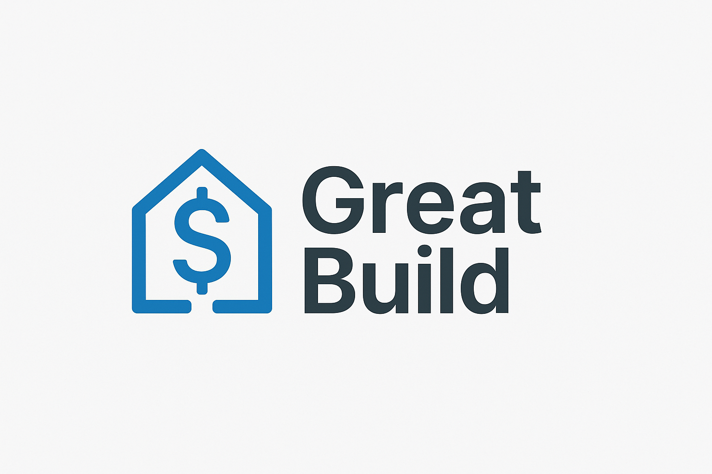
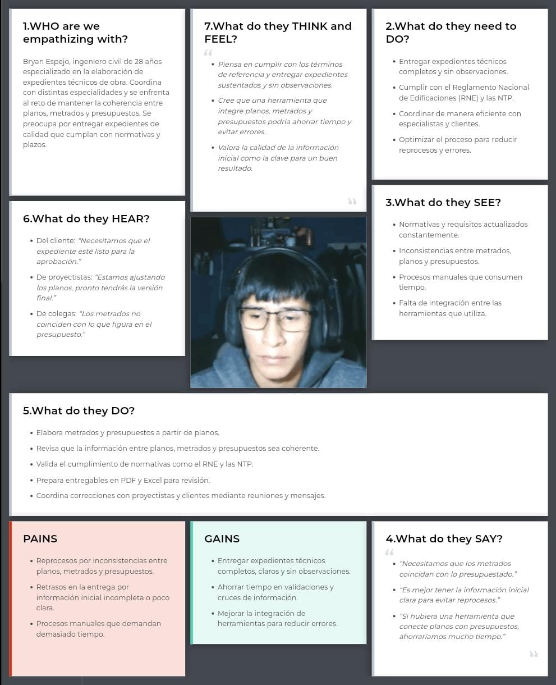

# Capítulo II: Requirements Elicitation & Analysis

## 2.1. Competidores
### 2.1.1. Análisis Competitivo
El análisis competitivo es fundamental para desarrollar una estrategia sólida en el mercado, ya que permite comprender qué soluciones existen, cómo operan y qué valor ofrecen a los clientes. A través de esta metodología, se pueden detectar brechas en el mercado y evaluar qué necesidades de los clientes aún no están cubiertas. Por ese motivo, se presentará el siguiente cuadro con el análisis competitivo correspondiente.

<table style="width: 100%; border-collapse: collapse; text-align: left; page-break-inside: auto;">
    <thead>
        <tr>
            <th style="border: 1px solid #000; padding: 10px; font-weight: bold;" colspan="6">Competitive Analysis Landscape</th>
        </tr>
        <tr>
            <th style="border: 1px solid #000; padding: 10px;font-weight: bold;" colspan="2" rowspan="2">¿Por qué llevar a cabo este análisis?</th>
            <th style="border: 1px solid #000; padding: 10px;font-weight: bold;" colspan="4">¿Cuáles son las principales ventajas competitivas frente a nuestros competidores?</th>
        </tr>
        <tr>
            <td style="border: 1px solid #000; padding: 10px;" colspan="4">El resultado de analizar el mercado y a los competidores directos e indirectos proporciona datos que serán utilizados para delimitar estrategias con el fin de posicionar nuestro producto en el mercado competitivo.</td>
        </tr>
        <tr>
            <th style="border: 1px solid #000; padding: 10px;font-weight: bold;" colspan="2">(En la cabecera colocar por cada competidor nombre y logo)</th>
            <th style="border: 1px solid #000; padding: 10px;font-weight: bold; width: 20%; text-align: center;">GreatBuild
            
            </th>
            <th style="border: 1px solid #000; padding: 10px;font-weight: bold; width: 20%; text-align: center;">
                Autodesk Construction Cloud
                
            </th>
            <th style="border: 1px solid #000; padding: 10px;font-weight: bold; width: 20%; text-align: center;">
                Procore
                
            </th>
            <th style="border: 1px solid #000; padding: 10px;font-weight: bold; width: 20%; text-align: center;">
                Deltek ComputerEase
                
            </th>
        </tr>
    </thead>
    <tbody>
        <tr>
            <th style="border: 1px solid #000; padding: 10px; font-weight: normal; width: 12%; writing-mode: tb-rl; text-align: center; vertical-align: middle; white-space: nowrap; font-weight: bold; width: 8%;" rowspan="2">Perfil</th>
            <th style="border: 1px solid #000; padding: 10px; font-weight: normal; width: 12%;">Overview</th>
            <td style="border: 1px solid #000; padding: 10px;" style="text-align:center;">
                GreatBuild ofrece un sistema de gestión de proyectos de ingeniería civil diseñado para contratistas, consultoras pequeñas de obras y subcontratistas. La plataforma permite gestionar proyectos, planificar cronogramas, controlar costos, administrar documentación técnica y organizar expedientes técnicos en un solo lugar, asegurando eficiencia y cumplimiento de plazos.
            </td>
            <td style="border: 1px solid #000; padding: 10px;" style="text-align:center;">
                Esta plataforma conecta flujos de trabajo, equipos y datos en todas las etapas de la construcción, facilitando la colaboración y mejorando la eficiencia en proyectos de construcción.
            </td>
            <td style="border: 1px solid #000; padding: 10px;" style="text-align:center;">
                Procore ofrece una solución integral en línea para la gestión de proyectos de construcción, incluyendo control de costos, comunicaciones y colaboración, utilizada ampliamente en la industria.
            </td>
            <td style="border: 1px solid #000; padding: 10px;" style="text-align:center;">
                Software de contabilidad y gestión de proyectos de construcción que integra costos laborales con herramientas remotas, ayudando a las empresas a gestionar eficazmente sus proyectos y finanzas.
            </td>
        </tr>
        <tr>
            <th style="border: 1px solid #000; padding: 10px; font-weight: normal; width: 12%;">Ventaja competitiva ¿Qué valor ofrece a los clientes?</th>
            <td style="border: 1px solid #000; padding: 10px;" style="text-align:center;">
                GreatBuild se diferencia por ser una nube especializada en la gestión de proyectos de ingeniería civil, ofreciendo una solución integral que combina planificación, control de costos, gestión documental y expedientes técnicos en una sola plataforma.
            </td>
            <td style="border: 1px solid #000; padding: 10px;" style="text-align:center;">
                Ofrece una integración completa de herramientas para la gestión de proyectos de construcción, desde el diseño hasta la adjudicación.
            </td>
            <td style="border: 1px solid #000; padding: 10px;" style="text-align:center;">
                Procore destaca por su interfaz intuitiva y facilidad de uso, lo que permite a los equipos de construcción gestionar proyectos de manera efectiva sin necesidad de una curva de aprendizaje extensa.
            </td>
            <td style="border: 1px solid #000; padding: 10px;" style="text-align:center;">
                Se enfoca en ofrecer una solución integral para la planificación y gestión de proyectos en el sector de la construccción.
            </td>
        </tr>
        <tr>
            <th style="border: 1px solid #000; padding: 10px; font-weight: normal; width: 12%; writing-mode: tb-rl; text-align: center; vertical-align: middle; white-space: nowrap; font-weight: bold; width: 8%;" rowspan="5">Perfil de marketing</th>
            <th style="border: 1px solid #000; padding: 10px; font-weight: normal; width: 12%;">Mercado objetivo</th>
            <td style="border: 1px solid #000; padding: 10px;">
                <ul>
                    <li>Contratistas independientes.</li>
                    <li>Consultoras pequeñas de obras.</li>
                </ul>
            </td>
            <td style="border: 1px solid #000; padding: 10px;">
                <ul>
                    <li>Grandes empresas de construcción.</li>
                    <li>Consultoras de ingeniería.</li>
                </ul>
            </td>
            <td style="border: 1px solid #000; padding: 10px;">
                <ul>
                    <li>Contratistas generales.</li>
                    <li>Subcontratistas.</li>
                    <li>Empresas constructoras.</li>
                </ul>
            </td>
            <td style="border: 1px solid #000; padding: 10px;">
                <ul>
                    <li>Contratistas de construcción.</li>
                </ul>
            </td>
        </tr>
        <tr>
            <th style="border: 1px solid #000; padding: 10px; font-weight: normal; width: 12%;">Estrategias de marketing</th>
            <td style="border: 1px solid #000; padding: 10px;">
                <ul>
                    <li>Prueba Gratuita de 14 o 30 Días.</li>
                    <li>Casos de Éxito.</li>
                    <li>Campañas de redes sociales.</li>
                </ul> 
            </td>
            <td style="border: 1px solid #000; padding: 10px;">
                <ul>
                    <li>Marketing de Contenidos.</li>
                    <li>Webinars y Formación en Línea.</li>
                    <li>Publicidad Digital y Redes Sociales.</li>
                </ul>
            </td>
            <td style="border: 1px solid #000; padding: 10px;">
                <ul>
                    <li>Email Marketing.</li>
                    <li>Convenios con Empresas Constructoras y Gobiernos.</li>
                    <li>Eventos en línea.</li>
                </ul>
            </td>
            <td style="border: 1px solid #000; padding: 10px;">
                <ul>
                    <li>Eventos y Webinars de Capacitación.</li>
                    <li>Estrategia de Publicidad Directa.</li>
                    <li>Referencias y Testimonios.</li>
                </ul>
            </td>
        </tr>
        <tr>
            <th style="border: 1px solid #000; padding: 10px; font-weight: normal; width: 12%;">Productos & Servicios</th>
            <td style="border: 1px solid #000; padding: 10px;">
                <ul>
                    <li>Aplicación web para gestión de proyectos, planificación y optimización de recursos para agilizar los procesos y plazos del desarrollo de un proyecto.</li>
                    <li>Gestor de expedientes y fichas técnicas en base a roles predefinidos.</li>
                    <li>Funciona como nube para almacenamiento de documentos.</li>
                </ul>
            </td>
            <td style="border: 1px solid #000; padding: 10px;">
                <ul>
                    <li>Plataforma para la gestión de licitaciones y conexión con contratistas, facilitando la comunicación durante las fases iniciales del proyecto.</li>
                    <li>Herramienta para la gestión de planos y documentos en proyectos de construcción, permitiendo a los equipos acceder y actualizar información en tiempo real en la obra.</li>
                    <li>Servicios adicionales para adaptar el software a las necesidades específicas de cada cliente o tipo de proyecto.</li>
                </ul>
            </td>
            <td style="border: 1px solid #000; padding: 10px;">
                <ul>
                    <li>Construction Financials: Herramienta enfocada en la gestión financiera del proyecto, como presupuestos, órdenes de cambio y pagos a contratistas, integrando la contabilidad con la gestión del proyecto.</li>
                    <li>Consultoría personalizada: Servicios de implementación y consultoría para adaptar el software a las necesidades de cada cliente.</li>
                </ul>
            </td>
            <td style="border: 1px solid #000; padding: 10px;">
                <ul>
                    <li>Software de contabilidad para la construcción</li>
                    <li>Gestión de proyectos: Herramienta de gestión integral que ayuda a los contratistas a planificar, programar y controlar los proyectos, asegurando que se mantengan dentro del presupuesto y cronograma.</li>
                    <li>Soporte técnico y consultoría</li>
                </ul>
            </td>
        </tr>
        <tr>
            <th style="border: 1px solid #000; padding: 10px; font-weight: normal; width: 12%;">Precios & Costos</th>
            <td style="border: 1px solid #000; padding: 10px;" style="text-align:center;">
                GreatBuild brinda una modelo de precios basado en suscripción. Además, evalua las funciones y caracteristicas del software en base al cliente.
            </td>
            <td style="border: 1px solid #000; padding: 10px;" style="text-align:center;">
                Utiliza un modelo de precios basado en suscripción. Ofrece prubas gratuitas para su producto BIM 360.
            </td>
            <td style="border: 1px solid #000; padding: 10px;" style="text-align:center;">
                Procore utiliza un modelo de precios basado en suscripción. Los precios varian dependiendo de la organización, rondando entre $1,000 a $2,000 USD al mes. Además, ofrece una prueba gratuita de 14 días.
            </td>
            <td style="border: 1px solid #000; padding: 10px;" style="text-align:center;">
                Deltek ComputerEase ofrece un modelo basado en suscripción o licencias perpetuas, dependiendo de las necesidades del cliente. Asimismo, cuenta con una demostración gratuita que debe ser solicitada.
            </td>
        </tr>
        <tr>
            <th style="border: 1px solid #000; padding: 10px; font-weight: normal; width: 12%;">Canales de distribución (Web y/o Móvil)</th>
            <td style="border: 1px solid #000; padding: 10px;" style="text-align:center;">
                Aplicación web.
            </td>
            <td style="border: 1px solid #000; padding: 10px;" style="text-align:center;">
                Dispone de aplicación web y aplicación móvil.
            </td>
            <td style="border: 1px solid #000; padding: 10px;" style="text-align:center;">
                Dispone de aplicación web y aplicación móvil.
            </td>
            <td style="border: 1px solid #000; padding: 10px;" style="text-align:center;">
                Solo dispone de aplicación web.
            </td>
        </tr>
        <tr>
            <th style="border: 1px solid #000; padding: 10px; font-weight: normal; width: 12%; writing-mode: tb-rl; text-align: center; vertical-align: middle; white-space: nowrap; font-weight: bold; width: 8%;" rowspan="6">Análisis SWOT</th>
            <th style="border: 1px solid #000; padding: 10px; font-weight: normal; width: 12%;" colspan="5">Realice esto para su startup y sus competidores. Sus fortalezas deberían apoyar sus oportunidades y contribuir a lo que ustedes definen como su posible ventaja competitiva.</th>
        </tr>
        <tr>
            <th style="border: 1px solid #000; padding: 10px; font-weight: normal; width: 12%;">Fortalezas</th>
            <td style="border: 1px solid #000; padding: 10px;">
                <ul>
                    <li>Enfoque Específico en Ingeniería Civil.</li>
                    <li>Funciona como una nube.</li>
                    <li>Gestión Integral de Expedientes Técnicos.</li>
                </ul>
            </td>
            <td style="border: 1px solid #000; padding: 10px;">
                <ul>
                    <li>Es uno de los líderes en la tecnología BIM, lo que le permite ofrecer soluciones avanzadas para la gestión de la construcción desde la planificación hasta la adjudicación.</li>
                    <li>Esta posicionada como el estándar en la industria de la construcción.</li>
                    <li>Su infraestructura en la nube permite que los equipos de trabajo se conecten de manera remota desde cualquier lugar y dispositivo.</li>
                </ul>
            </td>
            <td style="border: 1px solid #000; padding: 10px;">
                <ul>
                    <li>Amplia red de colaboradores e integraciones con otros sistemas de la industria.</li>
                    <li>Ofrece una solución compacta, convirtiéndose en una opción atractiva para las grandes empresas.</li>
                </ul>
            </td>
            <td style="border: 1px solid #000; padding: 10px;">
                <ul>
                    <li>Ofrece tanto herramientas de contabilidad como de gestión de proyectos, lo que permite a los contratistas tener una visión clara de sus operaciones y finanzas.</li>
                    <li>Deltek ha ganado una base de clientes leales que aprecian la fiabilidad y la precisión de su software en la gestión financiera.</li>
                </ul>
            </td>
        </tr>
        <tr>
            <th style="border: 1px solid #000; padding: 10px; font-weight: normal; width: 12%;">Debilidades</th>
            <td style="border: 1px solid #000; padding: 10px;">
                <ul>
                    <li>Dependencia de Internet.</li>
                    <li>Requiere inversión en marketing y captación de clientes.</li>
                    <li>Funcionalidades menos competitivas.
                </ul>
            </td>
            <td style="border: 1px solid #000; padding: 10px;">
                <ul>
                    <li>El precio de las suscripciones puede ser alto, especialmente para empresas pequeñas o medianas.</li>
                    <li>Los productos de Autodesk pueden ser complejos y requerir tiempo para aprender a usarlos de manera eficiente, lo que puede ser una barrera para empresas pequeñas o sin experiencia.</li>
                </ul>
            </td>
            <td style="border: 1px solid #000; padding: 10px;">
                <ul>
                    <li>Aunque tiene muchas funciones, la personalización de algunas herramientas puede ser limitada en comparación con otros competidores.</li>
                    <li>Los costos de suscripciones pueden ser prohibitivos para pequeñas empresas o aquellos con presupuestos ajustados, especialmente cuando se incluyen módulos adicionales.</li>
                </ul>
            </td>
            <td style="border: 1px solid #000; padding: 10px;">
                <ul>
                    <li>Enfoque limitado en gestión de proyectos.</li>
                    <li>Interfaz menos moderna.</li>
                    <li>Precios menos competitivos.</li>
                </ul>
            </td>
        </tr>
        <tr>
            <th style="border: 1px solid #000; padding: 10px; font-weight: normal; width: 12%;">Oportunidades</th>
            <td style="border: 1px solid #000; padding: 10px;">
                <ul>
                    <li>Crecimiento del Sector Construcción.</li>
                    <li>Digitalización y Transformación Digital.</li>
                    <li>Integración con Otras Plataformas.</li>
                </ul>
            </td>
            <td style="border: 1px solid #000; padding: 10px;">
                <ul>
                    <li>Expansión a nuevos mercados.</li>
                    <li>Aumento de la demanda de soluciones colaborativas.</li>
                    <li>Avances tecnológicos.</li>
                </ul>
            </td>
            <td style="border: 1px solid #000; padding: 10px;">
                <ul>
                    <li>Crecimiento en mercados internacionales.</li>
                    <li>Innovación en la automatización.</li>
                    <li>Ampliación de funcionalidades.</li>
                </ul>
            </td>
            <td style="border: 1px solid #000; padding: 10px;">
                <ul>
                    <li>Expansión a nuevas funciones.</li>
                    <li>Integración con nuevas tecnologías.</li>
                    <li>Adopción de nuevas plataformas móviles.</li>
                </ul>
            </td>
        </tr>
        <tr>
            <th style="border: 1px solid #000; padding: 10px; font-weight: normal; width: 12%;">Amenazas</th>
            <td style="border: 1px solid #000; padding: 10px;">
                <ul>
                    <li>Resistencia al Cambio por Parte de Empresas Tradicionales.</li>
                    <li>Preocupaciones de Seguridad y Privacidad.</li>
                    <li>Integración al mercado como una startup emergente.</li>
                </ul>
            </td>
            <td style="border: 1px solid #000; padding: 10px;">
                <ul>
                    <li>Competencia creciente.</li>
                    <li>Riesgo de obsolescencia.</li>
                    <li>Condiciones económicas globales.</li>
                </ul>
            </td>
            <td style="border: 1px solid #000; padding: 10px;">
                <ul>
                    <li>Problemas con la adopción en mercados más pequeños.</li>
                    <li>Desafíos de integración.</li>
                </ul>
            </td>
            <td style="border: 1px solid #000; padding: 10px;">
                <ul>
                    <li>Presión de precios bajos.</li>
                    <li>Cambios tecnológicos rápidos.</li>
                    <li>Competencia de plataformas más completas.</li>
                </ul>
            </td>
        </tr>
    </tbody>
</table>

### 2.1.2. Estrategias y tácticas frente a competidores

#### 1. Destacar la Especialización en Ingeniería Civil y la Excelencia Técnica
* Contexto:
    * Fortalezas de los competidores: Se han consolidado como referentes en la industria, cuentan con una amplia red de colaboradores e integraciones, y ofrecen soluciones integrales que abarcan la gestión operativa y financiera.
    * Nuestras fortalezas: Enfoque especializado en ingeniería civil, operación basada en la nube y capacidad para gestionar expedientes técnicos de manera integral.
* Tactica:
    * Desarrollar estudios de caso y campañas de marketing que evidencien la efectividad de nuestra solución, resaltando la experiencia y conocimiento en el sector.

#### 2. Ofrecer Precios Competitivos y Optimizar la Usabilidad
* Contexto:
    * Debilidades de los competidores: Sus precios resultan poco accesibles para pequeñas y medianas empresas, y su alcance en gestión de proyectos suele ser limitado.
    * Nuestras debilidades: Se requiere mayor inversión en estrategias de marketing y captación de clientes, además de una fuerte dependencia de la conectividad a Internet.
* Tactica:
    * Implementar pruebas de usabilidad para asegurar que la interfaz sea intuitiva y sencilla, garantizando una experiencia de usuario eficiente y accesible.

#### 3. Aprovechar el Crecimiento del Mercado y la Transformación Digital
* Contexto:
    * Oportunidades en el mercado: Creciente demanda de soluciones colaborativas y expansión hacia mercados internacionales.
    * Nuestras oportunidades: Expansión del sector construcción y avance sostenido de la transformación digital.
* Tactica:
    * Diseñar campañas digitales orientadas a empresas que aún no han modernizado sus procesos, con el propósito de captar nuevos clientes y ampliar nuestra presencia en el mercado.

#### 4. Posicionar una Plataforma Flexible, Segura y Centrada en el Cliente
* Contexto:
    * Amenazas de los competidores: Baja adopción en mercados pequeños, velocidad de los cambios tecnológicos y una competencia cada vez más intensa.
    * Nuestras amenazas: Resistencia al cambio por parte de organizaciones tradicionales y preocupaciones en torno a la seguridad y privacidad de los datos.
* Tácticas:
    * Adaptar la plataforma a las necesidades de cada usuario, reduciendo la curva de aprendizaje y ofreciendo acompañamiento constante para fomentar confianza y facilitar la adopción.
    * Brindar garantías y certificaciones de seguridad que respalden nuestro compromiso con la protección de la información.
    * Habilitar mecanismos para que los clientes puedan dar retroalimentación sobre el avance de los proyectos, fortaleciendo la relación y mejorando el servicio de manera continua.

## 2.2. Entrevistas

### 2.2.1. Diseño de entrevistas

**Lista de preguntas**

Cada conjunto de preguntas fue diseñado de manera específica para los diferentes segmentos objetivo, con el propósito de comprender cómo desarrollan su trabajo, qué herramientas emplean y qué dificultades encuentran al planificar o modificar proyectos técnicos. Para garantizar un flujo natural durante las entrevistas, se recreó una conversación completa a modo de simulación, lo que permitió identificar quiebres en el ritmo o repeticiones innecesarias. A partir de ese ejercicio, se reorganizó el orden de las preguntas, manteniendo un enfoque coherente y dinámico sin sacrificar la precisión técnica.

Las preguntas numeradas con un solo dígito corresponden a las preguntas principales, orientadas a guiar la entrevista y generar información valiosa. En complemento, se incluyen preguntas secundarias que permiten profundizar según las respuestas del entrevistado, enriqueciendo así el análisis.

**Preguntas para Contratista / Proyectista**

**Empathy and Persona**

1. Primero, díganos un poco sobre usted y a qué se dedica.
- 1.1. En base a su respuesta, se pregunta los campos que no se hayan podido llenar directamente según el formato presente en Plantilla de datos generales.
2. Cuéntenos, ¿Cómo luce un día típico de trabajo para usted?
3. ¿Qué herramientas utiliza en su día a día para realizar o apoyarse en el desarrollo de estas labores?
4. De estas actividades, ¿Qué parte identifica usted como la más laboriosa o frustrante?
5. ¿Qué cree que necesite para revertir esta situación?
6. Y de ellas, ¿Cuál cree usted que es la más importante, y por qué razón?

**Domain Model**

7. Describir el dominio en base a lo aprendido autónomamente y en base a ello.
- 7.1. ¿Las secciones que hemos planteado son correctas? ¿Son un reflejo de su trabajo?
- 7.2. ¿Cuál de estas (del nuevo modelo) considera que es la más importante o fundamental para el éxito de la planificación del proyecto? ¿Por qué razón?
8. En base a su experiencia, ¿Cómo organiza los documentos de un expediente técnico? (directorios, carpetas, documentos)
9. ¿Cómo es la organización y repartición de tareas en la elaboración de un expediente técnico?
10. ¿Qué valor tiene la comunicación entre especialistas del expediente técnico?
11. ¿Qué otras áreas de la organización se involucran directa o indirectamente en la elaboración de los expedientes técnicos? ¿Cómo se relacionan con el equipo principal?
12. ¿Qué tan importante es el cumplimiento de plazos con respecto al expediente técnico? ¿Se realizan estimaciones de tiempo?
13. ¿Es posible que deba realizar cambios al expediente técnico durante su desarrollo o tras la adjudicación de la obra?
    - ¿Cómo se realiza este proceso y qué tan importante o difícil resulta para la organización lidiar con él?

**Preguntas para Especialista de área**

**Empathy and Persona**

1. Primero, díganos un poco sobre usted y a qué se dedica.
- 1.1. En base a su respuesta, se pregunta los campos que no se hayan podido llenar directamente según el formato presente en Plantilla de datos generales.
2. Cuéntenos, ¿Cómo es trabajar en la elaboración de un expediente técnico de obra / proyecto?
3. ¿Qué herramientas utiliza para apoyarse en el desarrollo de estas labores?
4. De estas actividades, ¿Qué parte identifica usted como la más laboriosa o frustrante?
5. ¿Qué cree que necesite para revertir esta situación?
6. Y de ellas, ¿Cuál cree usted que es la más importante, y por qué razón?

**Domain Model**

7. ¿Cómo obtiene la información o datos necesarios para elaborar su parte del expediente técnico?
8. ¿Qué procesos sigue para transformar esa información en entregables o documentos técnicos?
9. ¿Cómo presenta o entrega finalmente su trabajo? ¿En qué formato y a través de qué canal?
10. ¿Qué estándares, normativas o lineamientos debe cumplir en su especialidad?
11. ¿Cómo asegura que su trabajo cumpla con los cronogramas establecidos?
12. ¿Qué tan fácil o difícil es coordinar con su equipo directo? ¿Qué herramientas utilizan para ello?
13. ¿Cómo se comunica con otras áreas técnicas (como estructuras, arquitectura, etc.) durante el desarrollo del expediente?

**Preguntas para Entidad contratante**

**Empathy and Persona**

1. Primero, díganos un poco sobre usted y a qué se dedica.
- 1.1. En base a su respuesta, se pregunta los campos que no se hayan podido llenar directamente según el formato presente en Plantilla de datos generales
2. Cuéntenos, ¿Alguna vez se ha planteado construir su propio hogar? ¿Por qué?
3. En base a ello, ¿ha llegado a contactar a algún contratista o proyectista? ¿Qué impresión le dejaron?
- 3.1. ¿Por qué razón no ha contactado con ellos? ¿Es debido a algún factor de confianza?
4. ¿Conoce a alguien en su entorno (amigos, familiares, conocidos) que haya planificado la construcción de su hogar? ¿Cómo fue su experiencia?
5. Cuando empiece a planificar su vivienda, ¿qué expectativas tendría respecto al servicio?

**(Explicar brevemente la propuesta del proyecto al entrevistado).**

6. ¿Ha escuchado de algún proyecto similar a este?
- 6.1. ¿Qué piensa de ello?¿En qué cree que aportaría?
- 6.2. ¿Qué características añadiría para mejorar la experiencia?

**Tabla de datos generales**

La plantilla de datos generales permite obtener información básica sobre los entrevistados, como su entorno, personalidad, herramientas favoritas y preferencias tecnológicas. Esta información sirve como punto de partida para profundizar durante la entrevista.

<table style="
        width: 100%;
        text-align: left;
        font-size: 14px;">
  <thead>
    <tr>
      <th style="width: 50%; border: 1px solid #000;">Campo</th>
      <th style="width: 50%; border: 1px solid #000;">Valor</th>
    </tr>
  </thead>
  <tbody>
    <tr><td style="border: 1px solid #000;">Género</td><td style="border: 1px solid #000;"></td></tr>
    <tr><td style="border: 1px solid #000;">Personalidad</td><td style="border: 1px solid #000;"></td></tr>
    <tr><td style="border: 1px solid #000;">Nombre</td><td style="border: 1px solid #000;"></td></tr>
    <tr><td style="border: 1px solid #000;">Edad</td><td style="border: 1px solid #000;"></td></tr>
    <tr><td style="border: 1px solid #000;">Ocupación</td><td style="border: 1px solid #000;"></td></tr>
    <tr><td style="border: 1px solid #000;">Estado Civil</td><td style="border: 1px solid #000;"></td></tr>
    <tr><td style="border: 1px solid #000;">Dispositivos favoritos</td><td style="border: 1px solid #000;"></td></tr>
    <tr><td style="border: 1px solid #000;">Browsers (Safari, Google, Chrome, Mozilla, Edge, etc.)</td><td style="border: 1px solid #000;"></td></tr>
    <tr><td style="border: 1px solid #000;">Canales o medios de comunicación</td><td style="border: 1px solid #000;"></td></tr>
    <tr><td style="border: 1px solid #000;">Marcas e influencers</td><td style="border: 1px solid #000;"></td></tr>
  </tbody>
</table>

### 2.2.2. Registro de entrevistas

<table class="tabla-entrevista">
  <thead>
    <tr>
      <th style="
            text-align: left;
            padding: 12px;
            background-color: #f0f0f0;
            font-size: 22px;"><strong>SEGMENTO OBJETIVO: CONTRATISTA</strong></th>
      <th><strong>#1</strong></th>
    </tr>
  </thead>
  <tbody>
    <tr>
      <td colspan="2" style="padding: 0; vertical-align: top; background-color: #fff border-top: 1px solid #ddd;">
        

          

            
Datos generales

            <ul style="margin: 0; padding-left: 20px; list-style-type: disc; font-size: 1.05em; line-height: 1.7; color: #333;">
              <li><strong>Nombres: </strong>Mario Joaquín </li>
              <li><strong>Apellidos: </strong>Lopez Acuña </li>
              <li><strong>Edad: </strong>29 </li>
              <li><strong>Distrito: </strong>La Molina </li>
              <li><strong>URL Entrevista:</strong> <a href="https://upcedupe-my.sharepoint.com/:v:/g/personal/u20221b778_upc_edu_pe/EXUmfDv35CtJlqIayO7BJjsB5uF_qp8kDdevyEcgz3_gKw?e=qMDWgB&nav=eyJyZWZlcnJhbEluZm8iOnsicmVmZXJyYWxBcHAiOiJTdHJlYW1XZWJBcHAiLCJyZWZlcnJhbFZpZXciOiJTaGFyZURpYWxvZy1MaW5rIiwicmVmZXJyYWxBcHBQbGF0Zm9ybSI6IldlYiIsInJlZmVycmFsTW9kZSI6InZpZXcifX0%3D" target="_blank">Ver video</a></li>
              <li><strong>Timestamp:</strong> 00:00</li>
              <li><strong>Duración:</strong> 11:05</li>
            </ul>
          

          
        

      </td>
    </tr>
    <tr>
      <td colspan="2" style="padding: 0; vertical-align: top; background-color: #fff border-top: 1px solid #ddd;">
        

          
Resumen

          <ul style="padding-left: 20px; list-style-type: disc; color: #333; font-size: 1em; margin: 0;">
            <li><strong>Personalidad:</strong>  Guardián. Lleva la gran responsabilidad de dirigir una empresa con más de 30 años en el mercado que trabaja para el Estado Peruano. El cumplimiento de las normativas, los acuerdos y las expectativas de los clientes son su máxima prioridad.</li>
            <li><strong>Marcas:</strong> Microsoft, Autodesk Inc y S10. Son herramientas que utiliza en su trabajo.</li>
            <li><strong>Uso de tecnología:</strong> Minimo. Su empresa refleja un nivel de adopción de la tecnología bastante bajo, incluyendo prácticas poco convencionales como almacenar archivos en discos duros físicos.</li>
            <li><strong>Canales:</strong> WhatsApp. Lo usa como medio de comunicación y transferencia de archivos.</li>
            <li><strong>Browsers:</strong> Google Chrome. Sin razón en particular, posiblemente por la popularidad de Google.</li>
            <li><strong>Dispositivos:</strong> Celular y Laptop. Debido a su portabilidad.</li>
            <li><strong>Background:</strong> En 1992 fundó su empresa dedicada a la ejecución de obras para empresas privadas, consolidando experiencia como residente de obra. En la actualidad su empresa se dedica a la consultoría y elaboración de expedientes técnicos para el Estado Peruano. </li>
            <li>
              <strong>Frustraciones:</strong>
              <ul style="list-style-type: circle; padding-left: 20px;">
                <li>La adopción de tecnología.</li>
                <li>Capacitación de personal.</li>
              </ul>
            </li>
            <li>
              <strong>Flujos principales:</strong>
              <ul style="list-style-type: circle; padding-left: 20px;">
                <li>Estudios básicos (medidas descriptivas).</li>
                <li>Elaboración y seguimiento de calendario.</li>
                <li>Gestión de observaciones y compatibilidad.</li>
                <li>Seguimiento del contrato.</li>
              </ul>
            </li>
          </ul>
        

      </td>
    </tr>
  </tbody>
</table>

<table class="tabla-entrevista">
  <thead>
    <tr>
      <th style="
            text-align: left;
            padding: 12px;
            background-color: #f0f0f0;
            font-size: 22px;"><strong>SEGMENTO OBJETIVO: CONTRATISTA</strong></th>
      <th><strong>#2</strong></th>
    </tr>
  </thead>
  <tbody>
    <tr>
      <td colspan="2" style="padding: 0; vertical-align: top; background-color: #fff border-top: 1px solid #ddd;">
        

          

            
Datos generales

            <ul style="margin: 0; padding-left: 20px; list-style-type: disc; font-size: 1.05em; line-height: 1.7; color: #333;">
              <li><strong>Nombres: </strong>Álvaro Martín </li>
              <li><strong>Apellidos: </strong>Torres Huamani </li>
              <li><strong>Edad: </strong>27 </li>
              <li><strong>Distrito: </strong>San Juan de Lurigancho </li>
              <li><strong>URL Entrevista:</strong> <a href="https://upcedupe-my.sharepoint.com/:v:/g/personal/u20221b778_upc_edu_pe/EXUmfDv35CtJlqIayO7BJjsB5uF_qp8kDdevyEcgz3_gKw?e=qMDWgB&nav=eyJyZWZlcnJhbEluZm8iOnsicmVmZXJyYWxBcHAiOiJTdHJlYW1XZWJBcHAiLCJyZWZlcnJhbFZpZXciOiJTaGFyZURpYWxvZy1MaW5rIiwicmVmZXJyYWxBcHBQbGF0Zm9ybSI6IldlYiIsInJlZmVycmFsTW9kZSI6InZpZXcifX0%3D" target="_blank">Ver video</a></li>
              <li><strong>Timestamp:</strong> 11:05</li>
              <li><strong>Duración:</strong> 07:20</li>
            </ul>
          

          
        

      </td>
    </tr>
    <tr>
      <td colspan="2" style="padding: 0; vertical-align: top; background-color: #fff border-top: 1px solid #ddd;">
        

          
Resumen

          <ul style="padding-left: 20px; list-style-type: disc; color: #333; font-size: 1em; margin: 0;">
            <li><strong>Personalidad:</strong> Guardian. Demuestra un claro respeto por las normas y el cumplimiento de los acuerdos.</li>
            <li><strong>Marcas:</strong> Microsoft y Autodesk Inc. Principalmente sigue marcas porque ofrecen herramientas o soluciones valiosas para su trabajo.</li>
            <li><strong>Uso de tecnología:</strong> Medio, práctico. Posee habilidades de navegación, ofimática y uso de software específico para su trabajo.</li>
            <li><strong>Canales:</strong> Plataformas y herramientas de Microsoft (Microsoft Teams, por ejemplo). Demuestra un grado de integración alto con las herramientas de ofimática de Microsoft.</li>
            <li><strong>Browsers:</strong> Google Chrome. Sin una razón específica, posiblemente debido a la popularidad de Google.</li>
            <li><strong>Dispositivos:</strong> Celular y Laptop. Esto es debido a la portabilidad, lo que le permite seguir trabajando sin estar atado a una oficina.</li>
            <li><strong>Background:</strong> Su experiencia ha estado tanto en la parte administrativa (como gerente) como en la parte operativa (como residente de obra), actividad que suele extrañar. </li>
            <li>
              <strong>Frustraciones:</strong>
              <ul style="list-style-type: circle; padding-left: 20px;">
                <li>El factor distancia, pues no siempre puede estar en el lugar de la obra para dar su mejor juicio.</li>
                <li>La poca interconexión entre sistemas, pues muchos procesos dependen de autorizaciones que terminan en lo manual, muchas veces.</li>
              </ul>
            </li>
            <li>
              <strong>Flujos principales:</strong>
              <ul style="list-style-type: circle; padding-left: 20px;">
                <li>Comunicación / contacto con el cliente.</li>
                <li>Seguimiento de normativas y acuerdos (contratos).</li>
                <li>Conceder y solicitar autorización entre distintas áreas.</li>
                <li>Seguimiento y cumplimiento de calendarización.</li>
              </ul>
            </li>
          </ul>
        

      </td>
    </tr>
  </tbody>
</table>

<table class="tabla-entrevista">
  <thead>
    <tr>
      <th style="
            text-align: left;
            padding: 12px;
            background-color: #f0f0f0;
            font-size: 22px;"><strong>SEGMENTO OBJETIVO: CONTRATISTA</strong></th>
      <th><strong>#3</strong></th>
    </tr>
  </thead>
  <tbody>
    <tr>
      <td colspan="2" style="padding: 0; vertical-align: top; background-color: #fff border-top: 1px solid #ddd;">
        

          

            
Datos generales

            <ul style="margin: 0; padding-left: 20px; list-style-type: disc; font-size: 1.05em; line-height: 1.7; color: #333;">
              <li><strong>Nombres: </strong>Jorge Rolando </li>
              <li><strong>Apellidos: </strong>García Roca </li>
              <li><strong>Edad: </strong>30 </li>
              <li><strong>URL Entrevista:</strong> <a href="poner el link del video">Ver video</a></li>
              <li><strong>Timestamp:</strong> 18:26</li>
              <li><strong>Duración:</strong> 09:00</li>
            </ul>
          

          
        

      </td>
    </tr>
    <tr>
      <td colspan="2" style="padding: 0; vertical-align: top; background-color: #fff border-top: 1px solid #ddd;">
        

          
Resumen

          <ul style="padding-left: 20px; list-style-type: disc; color: #333; font-size: 1em; margin: 0;">
            <li><strong>Personalidad:</strong> Guardián. Como contratista de ejecución de obra, entiende la importancia de seguir lo establecido en el expediente técnico.</li>
            <li><strong>Marcas:</strong> Microsoft, Autodesk Inc y S10. Son herramientas que utiliza en su trabajo.</li>
            <li><strong>Uso de tecnología:</strong> Mínimo. Su empresa refleja un nivel de adopción de la tecnología bastante bajo, sin un grado de integración completa en las operaciones de empresa.</li>
            <li><strong>Canales:</strong> WhatsApp y Telegram. Los usa como canales de comunicación.</li>
            <li><strong>Browsers:</strong> Google Chrome. Sin razón en particular, posiblemente por la popularidad de Google.</li>
            <li><strong>Dispositivos:</strong> Celular y PC. Son aquellos que le resultan más familiares.</li>
            <li><strong>Background:</strong> Es gerente de su propia empresa dedicada a la ejecución de acabados finos en obras, públicas o privadas.</li>
            <li>
              <strong>Frustraciones:</strong>
              <ul style="list-style-type: circle; padding-left: 20px;">
                <li>Realizar consultas al residente de obra ante incompatibilidad de planos.</li>
              </ul>
            </li>
            <li>
              <strong>Flujos principales:</strong>
              <ul style="list-style-type: circle; padding-left: 20px;">
                <li>Seguir y cumplir los lineamientos de el expediente técnico.</li>
                <li>Realizar consultas o solicitar revisiones ante incompatibilidad de planos.</li>
              </ul>
            </li>
          </ul>
        

      </td>
    </tr>
  </tbody>
</table>

<table class="tabla-entrevista">
  <thead>
    <tr>
      <th style="
            text-align: left;
            padding: 12px;
            background-color: #f0f0f0;
            font-size: 22px;"><strong>SEGMENTO OBJETIVO: ESPECIALISTA</strong></th>
      <th><strong>#1</strong></th>
    </tr>
  </thead>
  <tbody>
    <tr>
      <td colspan="2" style="padding: 0; vertical-align: top; background-color: #fff border-top: 1px solid #ddd;">
        

          

            
Datos generales

            <ul style="margin: 0; padding-left: 20px; list-style-type: disc; font-size: 1.05em; line-height: 1.7; color: #333;">
              <li><strong>Nombres: </strong>Bryan </li>
              <li><strong>Apellidos: </strong>Espejo </li>
              <li><strong>Edad: </strong>28 </li>
              <li><strong>URL Entrevista:</strong> <a href="https://upcedupe-my.sharepoint.com/:v:/g/personal/u202218110_upc_edu_pe/EaXm8JKIl2tJuBEe8dJViRkBDhAqC27mTxNw2yEHDqvv4Q?e=IGj6qN&nav=eyJyZWZlcnJhbEluZm8iOnsicmVmZXJyYWxBcHAiOiJTdHJlYW1XZWJBcHAiLCJyZWZlcnJhbFZpZXciOiJTaGFyZURpYWxvZy1MaW5rIiwicmVmZXJyYWxBcHBQbGF0Zm9ybSI6IldlYiIsInJlZmVycmFsTW9kZSI6InZpZXcifX0%3D">Ver video</a></li>
              <li><strong>Timestamp:</strong> 28:02</li>
              <li><strong>Duración:</strong> 05:27</li>
            </ul>
          

          
        

      </td>
    </tr>
    <tr>
      <td colspan="2" style="padding: 0; vertical-align: top; background-color: #fff border-top: 1px solid #ddd;">
        

          
Resumen

          <ul style="padding-left: 20px; list-style-type: disc; color: #333; font-size: 1em; margin: 0;">
            <li><strong>Personalidad:</strong> Innovador, colaborador, analítico y oridentado a resultados.</li>
            <li><strong>Marcas:</strong> Autodesk, BIM360, Contech influencers. Son herramientas que utiliza en su trabajo.</li>
            <li><strong>Canales:</strong> Email corporativo, Microsoft Teams, WhatsApp Business, Trello.</li>
            <li><strong>Browsers:</strong> Google Chrome, Mircosoft Edge</li>
            <li><strong>Dispositivos:</strong> Laptop y celular.</li>
            <li>
              <strong>Frustraciones:</strong>
              <ul style="list-style-type: circle; padding-left: 20px;">
                <li>Revisar que los metrados y presupuestos estén alineados con los planos, ya que las inconsistencias obligan a validar varias veces.</li>
    <li>Recibir información inicial poco clara (planos y especificaciones), lo que complica todo el trabajo posterior.</li>
    <li>Dependencia de un cruce manual entre planos, metrados y presupuestos, aumentando la probabilidad de errores.</li>
    <li>Dificultades de coordinación porque cada especialista trabaja a un ritmo distinto, lo que genera retrasos.</li>
              </ul>
            </li>
            <li>
              <strong>Flujos principales:</strong>
              <ul style="list-style-type: circle; padding-left: 20px;">
                <li>Recepción de planos y términos de referencia del cliente.</li>
                <li>Extracción de metrados a partir de los planos en AutoCAD/Civil 3D.</li>
                <li>Elaboración de presupuestos y control en Excel.</li>
                <li>Coordinación y comunicación con proyectistas y especialistas.</li>
                <li>Seguimiento de cronogramas con fases y recordatorios en Google Calendar.</li>
              </ul>
            </li>
          </ul>
        

      </td>
    </tr>
  </tbody>
</table>

<table class="tabla-entrevista">
  <thead>
    <tr>
      <th style="
            text-align: left;
            padding: 12px;
            background-color: #f0f0f0;
            font-size: 22px;"><strong>SEGMENTO OBJETIVO: ESPECIALISTA</strong></th>
      <th><strong>#2</strong></th>
    </tr>
  </thead>
  <tbody>
    <tr>
      <td colspan="2" style="padding: 0; vertical-align: top; background-color: #fff border-top: 1px solid #ddd;">
        

          

            
Datos generales

            <ul style="margin: 0; padding-left: 20px; list-style-type: disc; font-size: 1.05em; line-height: 1.7; color: #333;">
              <li><strong>Nombres: </strong>Juan Manuel </li>
              <li><strong>Apellidos: </strong>Santos </li>
              <li><strong>Edad: </strong>25 </li>
              <li><strong>URL Entrevista:</strong> <a href="https://upcedupe-my.sharepoint.com/:v:/g/personal/u202218110_upc_edu_pe/ER4P_mI9465Lk4gnybJnVtIBoEfEy4FL4OuIu7wVAdAWZw?e=XNXkUi&nav=eyJyZWZlcnJhbEluZm8iOnsicmVmZXJyYWxBcHAiOiJTdHJlYW1XZWJBcHAiLCJyZWZlcnJhbFZpZXciOiJTaGFyZURpYWxvZy1MaW5rIiwicmVmZXJyYWxBcHBQbGF0Zm9ybSI6IldlYiIsInJlZmVycmFsTW9kZSI6InZpZXcifX0%3D">Ver video</a></li>
              <li><strong>Timestamp:</strong> 33:07</li>
              <li><strong>Duración:</strong> 06:17</li>
            </ul>
          

          
        

      </td>
    </tr>
    <tr>
      <td colspan="2" style="padding: 0; vertical-align: top; background-color: #fff border-top: 1px solid #ddd;">
        

          
Resumen

          <ul style="padding-left: 20px; list-style-type: disc; color: #333; font-size: 1em; margin: 0;">
            <li><strong>Personalidad:</strong> Colaborador, trabaja en equipo y comunicación efectiva.</li>
            <li><strong>Marcas:</strong> Autodesk, BIM360</li>
            <li><strong>Canales:</strong> Microsoft Teams, WhatsApp y correo.</li>
            <li><strong>Browsers:</strong> Google Chrome</li>
            <li><strong>Dispositivos:</strong> Laptop y celular.</li>
            <li>
              <strong>Frustraciones:</strong>
              <ul style="list-style-type: circle; padding-left: 20px;">
                <li>Integrar información de distintas especialidades (estructuras, arquitectura, instalaciones), ya que los datos llegan en formatos distintos y con inconsistencias.</li>
                  <li>Necesidad de validar constantemente normativas y requisitos, lo que consume tiempo adicional.</li>
                  <li>Dificultades en la coordinación entre equipos por diversidad de disciplinas y herramientas utilizadas.</li>
              </ul>
            </li>
            <li>
              <strong>Flujos principales:</strong>
              <ul style="list-style-type: circle; padding-left: 20px;">
                 <li>Obtención de información mediante entrevistas, planos preliminares y normativas.</li>
    <li>Validación de normativas y requisitos de la entidad contratante.</li>
    <li>Estandarización de formatos y plantillas de trabajo.</li>
                  <li>Entrega final en PDF y DWG mediante correo, nube o plataformas colaborativas.</li>
    <li>Planificación y control de cronogramas con Trello/MS Project.</li>
    <li>Coordinación continua con equipos mediante Teams, Trello y WhatsApp Business.</li>
              </ul>
            </li>
          </ul>
        

      </td>
    </tr>
  </tbody>
</table>

<table class="tabla-entrevista">
  <thead>
    <tr>
      <th style="
            text-align: left;
            padding: 12px;
            background-color: #f0f0f0;
            font-size: 22px;"><strong>SEGMENTO OBJETIVO: ESPECIALISTA</strong></th>
      <th><strong>#3</strong></th>
    </tr>
  </thead>
  <tbody>
    <tr>
      <td colspan="2" style="padding: 0; vertical-align: top; background-color: #fff border-top: 1px solid #ddd;">
        

          

            
Datos generales

            <ul style="margin: 0; padding-left: 20px; list-style-type: disc; font-size: 1.05em; line-height: 1.7; color: #333;">
              <li><strong>Nombres: </strong>Jeremy </li>
              <li><strong>Apellidos: </strong>Escudero </li>
              <li><strong>Edad: </strong>27 </li>
              <li><strong>URL Entrevista:</strong> <a href="https://upcedupe-my.sharepoint.com/:v:/g/personal/u202218110_upc_edu_pe/EWUwAvoIjZxGmilwGb2EKwYBkuAENoFbcbiRkpcpFgKuVA?e=H4V9ha&nav=eyJyZWZlcnJhbEluZm8iOnsicmVmZXJyYWxBcHAiOiJTdHJlYW1XZWJBcHAiLCJyZWZlcnJhbFZpZXciOiJTaGFyZURpYWxvZy1MaW5rIiwicmVmZXJyYWxBcHBQbGF0Zm9ybSI6IldlYiIsInJlZmVycmFsTW9kZSI6InZpZXcifX0%3D">Ver video</a></li>
              <li><strong>Timestamp:</strong> 39:48</li>
              <li><strong>Duración:</strong> 04:58</li>
            </ul>
          

          
        

      </td>
    </tr>
    <tr>
      <td colspan="2" style="padding: 0; vertical-align: top; background-color: #fff border-top: 1px solid #ddd;">
        

          
Resumen

          <ul style="padding-left: 20px; list-style-type: disc; color: #333; font-size: 1em; margin: 0;">
            <li><strong>Personalidad:</strong> Responsable, práctico y orientado a los resultados.</li>
            <li><strong>Marcas:</strong> Autodesk, Bentley Systems, Construtech LATAM.</li>
            <li><strong>Canales:</strong> Correo corporativo, WhatsApp y Microsoft Teams.</li>
            <li><strong>Browsers:</strong> Google Chrome, Mircosoft Edge</li>
            <li><strong>Dispositivos:</strong> Laptop y celular.</li>
            <li>
              <strong>Frustraciones:</strong>
              <ul style="list-style-type: circle; padding-left: 20px;">
                <li>Consolidar la información de todas las especialidades. Los errores de coordinación generan observaciones que retrasan la aprobación del expediente técnico.</li>
    <li>Altos niveles de presión por tiempos ajustados y múltiples revisiones que demandan rehacer entregables.</li>
              </ul>
            </li>
            <li>
              <strong>Flujos principales:</strong>
              <ul style="list-style-type: circle; padding-left: 20px;">
                <li>Elaboración de estudios básicos y cálculos técnicos.</li>
                <li>Revisión de planos y consistencia entre especialidades.</li>
                <li>Elaboración de metrados, presupuestos y análisis de costos.</li>
                <li>Generación de reportes, memorias y entregables.</li>
              </ul>
            </li>
          </ul>
        

      </td>
    </tr>
  </tbody>
</table>

<table class="tabla-entrevista">
  <thead>
    <tr>
      <th style="
            text-align: left;
            padding: 12px;
            background-color: #f0f0f0;
            font-size: 22px;"><strong>SEGMENTO OBJETIVO: ENTIDAD CONTRATANTE</strong></th>
      <th><strong>#1</strong></th>
    </tr>
  </thead>
  <tbody>
    <tr>
      <td colspan="2" style="padding: 0; vertical-align: top; background-color: #fff border-top: 1px solid #ddd;">
        

          

            
Datos generales

            <ul style="margin: 0; padding-left: 20px; list-style-type: disc; font-size: 1.05em; line-height: 1.7; color: #333;">
              <li><strong>Nombres: Maryori</strong> </li>
              <li><strong>Apellidos: Atanacio Cruces</strong> </li>
              <li><strong>Edad: 24 años</strong> </li>
              <li><strong>Distrito: San Juan de Lurigancho</strong> </li>
              <li><strong>URL Entrevista:</strong> <a href="https://upcedupe-my.sharepoint.com/:v:/g/personal/u20221b778_upc_edu_pe/EXUmfDv35CtJlqIayO7BJjsB5uF_qp8kDdevyEcgz3_gKw?e=qMDWgB&nav=eyJyZWZlcnJhbEluZm8iOnsicmVmZXJyYWxBcHAiOiJTdHJlYW1XZWJBcHAiLCJyZWZlcnJhbFZpZXciOiJTaGFyZURpYWxvZy1MaW5rIiwicmVmZXJyYWxBcHBQbGF0Zm9ybSI6IldlYiIsInJlZmVycmFsTW9kZSI6InZpZXcifX0%3D" target="_blank">Ver video</a></li>
              <li><strong>Timestamp:</strong> 00:00</li>
              <li><strong>Duración: 05:24 minutos</strong> </li>
            </ul>
          

          
        

      </td>
    </tr>
    <tr>
      <td colspan="2" style="padding: 0; vertical-align: top; background-color: #fff border-top: 1px solid #ddd;">
        

          
Resumen

          <ul style="padding-left: 20px; list-style-type: disc; color: #333; font-size: 1em; margin: 0;">
            <li><strong>Personalidad: Muy alegre</strong> </li>
            <li><strong>Marcas: Urbania</strong> </li>
            <li><strong>Uso de tecnología: Android y Windows</strong> </li>
            <li><strong>Canales: Facebook, Instagram y Youtube</strong>  </li>
            <li><strong>Browsers: Google</strong> </li>
            <li><strong>Dispositivos: Teléfono y laptop</strong> </li>
            <li>
              <strong>Frustraciones: Falta de confianza</strong>
              <ul style="list-style-type: circle; padding-left: 20px;">
              </ul>
            </li>
            <li>
              <strong>Flujos principales:</strong>
              <ul style="list-style-type: circle; padding-left: 20px;">
                <li>Contactar con el proyectista.</li>
              </ul>
            </li>
          </ul>
        

      </td>
    </tr>
  </tbody>
</table> 

<table class="tabla-entrevista">
  <thead>
    <tr>
      <th style="
            text-align: left;
            padding: 12px;
            background-color: #f0f0f0;
            font-size: 22px;"><strong>SEGMENTO OBJETIVO: ENTIDAD CONTRATANTE</strong></th>
      <th><strong>#2</strong></th>
    </tr>
  </thead>
  <tbody>
    <tr>
      <td colspan="2" style="padding: 0; vertical-align: top; background-color: #fff border-top: 1px solid #ddd;">
        

          

            
Datos generales

            <ul style="margin: 0; padding-left: 20px; list-style-type: disc; font-size: 1.05em; line-height: 1.7; color: #333;">
              <li><strong>Nombres: Jefry Alfredo</strong> </li>
              <li><strong>Apellidos: Prado Remón</strong> </li>
              <li><strong>Edad: 24 años</strong> </li>
              <li><strong>Distrito: San Juan de Lurigancho</strong> </li>
              <li><strong>URL Entrevista:</strong> <a href="https://upcedupe-my.sharepoint.com/:v:/g/personal/u20221e247_upc_edu_pe/EREC9iNRgJhIinK3osJI6IYBrl5jviZ00gGwKmbTa1DFvA?nav=eyJyZWZlcnJhbEluZm8iOnsicmVmZXJyYWxBcHAiOiJTdHJlYW1XZWJBcHAiLCJyZWZlcnJhbFZpZXciOiJTaGFyZURpYWxvZy1MaW5rIiwicmVmZXJyYWxBcHBQbGF0Zm9ybSI6IldlYiIsInJlZmVycmFsTW9kZSI6InZpZXcifX0%3D&e=LTJHiH" target="_blank">Ver video</a></li>
              <li><strong>Timestamp:</strong> 00:00</li>
              <li><strong>Duración: 0 minutos</strong> </li>
            </ul>
          

          
        

      </td>
    </tr>
    <tr>
      <td colspan="2" style="padding: 0; vertical-align: top; background-color: #fff border-top: 1px solid #ddd;">
        

          
Resumen

          <ul style="padding-left: 20px; list-style-type: disc; color: #333; font-size: 1em; margin: 0;">
            <li><strong>Personalidad: Muy responsable</strong> </li>
            <li><strong>Marcas:</strong> </li>
            <li><strong>Uso de tecnología:</strong> </li>
            <li><strong>Canales:</strong>  </li>
            <li><strong>Browsers:</strong> </li>
            <li><strong>Dispositivos:</strong> </li>
            <li><strong>Background:</strong> </li>
            <li>
              <strong>Frustraciones:</strong>
              <ul style="list-style-type: circle; padding-left: 20px;">
                <li></li>
              </ul>
            </li>
            <li>
              <strong>Flujos principales:</strong>
              <ul style="list-style-type: circle; padding-left: 20px;">
                <li>Contactar con el proyectista.</li>
                <li>Presentar el requerimiento del proyecto.</li>
              </ul>
            </li>
          </ul>
        

      </td>
    </tr>
  </tbody>
</table>

<table class="tabla-entrevista">
  <thead>
    <tr>
      <th style="
            text-align: left;
            padding: 12px;
            background-color: #f0f0f0;
            font-size: 22px;"><strong>SEGMENTO OBJETIVO: ENTIDAD CONTRATANTE</strong></th>
      <th><strong>#3</strong></th>
    </tr>
  </thead>
  <tbody>
    <tr>
      <td colspan="2" style="padding: 0; vertical-align: top; background-color: #fff border-top: 1px solid #ddd;">
        

          

            
Datos generales

            <ul style="margin: 0; padding-left: 20px; list-style-type: disc; font-size: 1.05em; line-height: 1.7; color: #333;">
              <li><strong>Nombres: Jefry Alfredo</strong> </li>
              <li><strong>Apellidos: Prado Remón</strong> </li>
              <li><strong>Edad: 24 años</strong> </li>
              <li><strong>Distrito: San Juan de Lurigancho</strong> </li>
              <li><strong>URL Entrevista:</strong> <a href="https://upcedupe-my.sharepoint.com/:v:/g/personal/u20221e247_upc_edu_pe/EREC9iNRgJhIinK3osJI6IYBrl5jviZ00gGwKmbTa1DFvA?nav=eyJyZWZlcnJhbEluZm8iOnsicmVmZXJyYWxBcHAiOiJTdHJlYW1XZWJBcHAiLCJyZWZlcnJhbFZpZXciOiJTaGFyZURpYWxvZy1MaW5rIiwicmVmZXJyYWxBcHBQbGF0Zm9ybSI6IldlYiIsInJlZmVycmFsTW9kZSI6InZpZXcifX0%3D&e=LTJHiH" target="_blank">Ver video</a></li>
              <li><strong>Timestamp:</strong> 00:00</li>
              <li><strong>Duración: 0 minutos</strong> </li>
            </ul>
          

          
        

      </td>
    </tr>
    <tr>
      <td colspan="2" style="padding: 0; vertical-align: top; background-color: #fff border-top: 1px solid #ddd;">
        

          
Resumen

          <ul style="padding-left: 20px; list-style-type: disc; color: #333; font-size: 1em; margin: 0;">
            <li><strong>Personalidad: Muy responsable</strong> </li>
            <li><strong>Marcas:</strong> </li>
            <li><strong>Uso de tecnología:</strong> </li>
            <li><strong>Canales:</strong>  </li>
            <li><strong>Browsers:</strong> </li>
            <li><strong>Dispositivos:</strong> </li>
            <li><strong>Background:</strong> </li>
            <li>
              <strong>Frustraciones:</strong>
              <ul style="list-style-type: circle; padding-left: 20px;">
                <li></li>
              </ul>
            </li>
            <li>
              <strong>Flujos principales:</strong>
              <ul style="list-style-type: circle; padding-left: 20px;">
                <li>Contactar con el proyectista.</li>
                <li>Presentar el requerimiento del proyecto.</li>
              </ul>
            </li>
          </ul>
        

      </td>
    </tr>
  </tbody>
</table>

### 2.2.3. Análisis de entrevistas

**CONTRATISTAS**

**1. Resumen:** Los contratistas son en su mayoría varones adultos con experiencia previa como residentes de obra. Actualmente desempeñan la función de gerentes en oficinas, alejados del área operativa, lo cual les genera cierta nostalgia por “los viejos tiempos” en campo. Son personas sencillas, de trato directo y verbo fluido, con un alto respeto por las normas y los acuerdos establecidos. Presentan ciertas dificultades en el uso de tecnologías digitales, aunque muestran disposición al aprendizaje, motivados principalmente por aumentar la eficiencia de su organización.

**2. Edad:**  Las edades de los entrevistados de este segmento están en mediados de llegar a los 30 años de edad. Se toma como edad representativa la media aritmética de los datos.

| Entrevistado | Mario López | Alvaro Torres | Jorge García | Valor representativo |
|-|-|-|-|-|
| **Edad** | 29 | 27 | 30 | 29 |

**3. Personalidad:** La totalidad de los entrevistados (100%) se alínean al arquetipo de personalidad *Guardián*, debido a su respeto irrestricto y meticuloso de las normas y acuerdos. Se toma este arquetipo de personalidad como representativo.

| Entrevistado | Mario López | Alvaro Torres | Jorge García | Valor representativo |
|-|-|-|-|-|
| **Personalidad** | Guardián | Guardián | Guardián | Guardián |

**4. Marcas e influencers:** La totalidad de los entrevistados (100%) mencionó las marcas Microsoft y Autodesk. De ellos, la gran mayoría (66.7%) mencionaron la marca S10. Se toma como marcas representativas Microsoft, Autodesk y S10.

| Marca | Frecuencia Absoluta | Frecuencia Relativa | Entrevistados que la siguen (%) |
|-|-|-|-|
| Microsoft | 3 | 37.5% | 100% |
| Autodesk Inc. | 3 | 37.5% | 100% |
| S10 | 2 | 25% | 66.7% |
| **Total** | 8 | 100% | - |

**5. Uso de tecnología:** La gran mayoría de los entrevistados (66.7%) demostró un nivel bajo de dominio e integración de la tecnología en su trabajo y vida diaria, mientras que la menor parte (33.3%) mostró un nivel intermedio. Se toma como nivel de uso de tecnología representativo el nivel Bajo.

| Nivel de uso de tecnología | Frecuencia Absoluta | % de entrevistados en este nivel |
|-|-|-|
| Bajo | 2 | 66.7% |
| Medio | 1 | 33.3% |
| Alto | 0 | 0% |
| **Total** | 3 | 100% |

**6. Canales:** La gran mayoría de los entrevistados (66.7%) mencionó utilizar WhatsApp como canal de comunicación, especialmente para el trabajo, mientras que la menor parte (33.3%) mencionó utilizar el ecosistema de Microsoft y Telegram.

| Canal de comunicación | Frecuencia Absoluta | Frecuencia Relativa | Entrevistados que lo usan (%) |
|-|-|-|-|
| WhatsApp | 2 | 50% | 66.7% |
| Ecosistema Microsoft | 1 | 25% | 33.3% |
| Telegram | 1 | 25% | 33.3% |
| **Total** | 4 | 100% | - |

**7. Browsers:** La totalidad de los entrevistados (100%) mencionó utilizar exclusivamente Google Chrome como su navegador web. Esta preferencia podría estar relacionada con su bajo nivel de dominio tecnológico, lo que los lleva a mantenerse en entornos digitales conocidos y seguros, sin explorar otras alternativas disponibles. Se toma como representativa la única alternativa mencionada.

| Navegador Web | Frecuencia Absoluta | Frecuencia Relativa | Entrevistados que lo usan (%) |
|-|-|-|-|
| Google Chrome | 3 | 100% | 100% |
| **Total** | 3 | 100% | - |

**8. Dispositivos:** La totalidad de los entrevistados (100%) mencionó utilizar el celular como herramienta principal para acceder a recursos digitales. La gran mayoría (66.7%) reportó el uso de Laptops, mientras que una menor parte reportó el uso de computadoras de escritorio (33.3%). Se toma como representativa la clara tendencia hacia la portabilidad (Celular y Laptop).

| Dispositivo | Frecuencia Absoluta | Frecuencia Relativa | Entrevistados que lo usan (%) |
|-|-|-|-|
| Celular | 3 | 50% | 100% |
| Laptop | 2 | 33.3% | 66.7% |
| PC | 1 | 16.7% | 33.3% |
| **Total** | 6 | 100% | - |

**9. Flujos principales:** La totalidad de los entrevistados (100%) señaló la importancia del seguimiento y cumplimiento del calendario. La gran mayoría (66.7%) destacó la importancia del seguimiento del contrato y la gestión de observaciones y compatibilidad de los planos. De manera aislada se mencionaron otros flujos como el contacto con el cliente o la recaudación ded medidas descriptivas, entre otras. Estos últimos flujos tienen cierto grado de solapamiento con los flujos principales mayoritarios, cumpliendo un rol de apoyo o soporte.

| Flujo de trabajo | Frecuencia Absoluta | Frecuencia Relativa | Entrevistados que lo priorizan (%) |
|-|-|-|-|
| Comunicación / contacto con el cliente | 1 | 9.1% | 33.3% |
| Conceder y solicitar autorización entre distintas áreas | 1 | 9.1% | 33.3% |
| Estudios básicos (medidas descriptivas) | 1 | 9.1% | 33.3% |
| Elaboración del calendario | 1 | 9.1% | 33.3% |
| Seguimiento y cumplimiento del calendario | 3 | 27.3% | 100% |
| Seguimiento del contrato | 2 | 18.2% | 66.7% |
| Gestión de observaciones y compatibilidad de planos | 2 | 18.2% | 66.7% |
| **Total** | 11 | 100% | - |

## 2.3. Needfinding

### 2.3.1. User Personas

Para la definición de los segmentos objetivo se tomaron en cuenta principalmente características demográficas extraídas de las entrevistas. Estos datos sirvieron como base para construir los perfiles de los User Personas y, a su vez, para reconocer sus motivaciones e intereses. De manera complementaria, se incorporaron también aspectos relacionados con sus competencias, hábitos y preferencias en el uso de tecnología y herramientas, los cuales fueron identificados durante el análisis de las entrevistas.

**Contratistas**

Edilberto Cáceres es ingeniero civil de 29 años que inició su carrera como asistente y luego residente de obra, adquiriendo habilidades fundamentales en gestión de proyectos y en la resolución de imprevistos en campo. Actualmente dirige una pequeña empresa consultora dedicada a la elaboración de expedientes técnicos para proyectos de obra civil, enfocándose en asegurar la calidad de los entregables y el cumplimiento de la normativa vigente. Se le reconoce por su profesionalismo, su compromiso con la excelencia técnica y su capacidad para brindar soluciones viables tanto a entidades públicas como a clientes privados.

  

**Especialistas**

José Rodríguez representa al segmento objetivo de los Especialistas. Es arquitecto de profesión con una amplia trayectoria. Se caracteriza por su motivación constante y su pasión por la arquitectura. Posee un sólido compromiso con el cumplimiento de las normativas en el ejercicio de sus funciones. Destaca por su capacidad de comunicación con otros profesionales y por su habilidad analítica en el desarrollo de proyectos.

  

**Entidad Contratante**

Alfonso Villarán representa al segmento objetivo de las Entidades contratantes. Actualmente busca un contratista para planificar la construcción de su vivienda en un terreno heredado. Se caracteriza por ser una persona precavida, orientada a garantizar la seguridad y bienestar de su futura familia. Además, muestra una marcada afinidad con el uso de la tecnología, lo que le facilita involucrarse activamente en la gestión de su proyecto.

  

### 2.3.2. User Task Matrix

Se considera para la realización de este User Task Matrix los User Persona, sus actividades, frecuencia e importancia.

<table border="1" cellpadding="5" cellspacing="0">
  <thead>
    <tr>
      <th rowspan="2">Task</th>
      <th colspan="2">Edilberto Cáceres</th>
      <th colspan="2">José Rodríguez</th>
      <th colspan="2">Alfonso Villarán</th>
    </tr>
    <tr>
      <th>Frecuencia</th>
      <th>Importancia</th>
      <th>Frecuencia</th>
      <th>Importancia</th>
      <th>Frecuencia</th>
      <th>Importancia</th>
    </tr>
  </thead>
  <tbody>
    <tr><td>Contacto con cliente</td><td>Alta</td><td>Alta</td><td>Baja</td><td>Alta</td><td>Nunca</td><td>Baja</td></tr>
    <tr><td>Conceder autorización de comunicación de áreas</td><td>Media</td><td>Alta</td><td>Baja</td><td>Alta</td><td>Nunca</td><td>Alta</td></tr>
    <tr><td>Planificación de cronogramas</td><td>Media</td><td>Alta</td><td>Media</td><td>Alta</td><td>Baja</td><td>Media</td></tr>
    <tr><td>Cumplimiento de cronogramas</td><td>Alta</td><td>Alta</td><td>Alta</td><td>Alta</td><td>Nunca</td><td>Baja</td></tr>
    <tr><td>Planificación de estudios básicos</td><td>Media</td><td>Alta</td><td>Alta</td><td>Alta</td><td>Nunca</td><td>Baja</td></tr>
    <tr><td>Ejecución de estudios básicos</td><td>Baja</td><td>Alta</td><td>Media</td><td>Alta</td><td>Nunca</td><td>Baja</td></tr>
    <tr><td>Seguimiento de normativas</td><td>Alta</td><td>Alta</td><td>Alta</td><td>Alta</td><td>Media</td><td>Alta</td></tr>
    <tr><td>Consultar a otras áreas</td><td>Media</td><td>Alta</td><td>Alta</td><td>Alta</td><td>Nunca</td><td>Baja</td></tr>
    <tr><td>Solicitar revisiones</td><td>Nunca</td><td>Baja</td><td>Alta</td><td>Alta</td><td>Alta</td><td>Alta</td></tr>
    <tr><td>Reuniones de coordinación</td><td>Alta</td><td>Alta</td><td>Alta</td><td>Media</td><td>Media</td><td>Alta</td></tr>
    <tr><td>Entregar avances de expediente</td><td>Media</td><td>Alta</td><td>Alta</td><td>Alta</td><td>Media</td><td>Baja</td></tr>
    <tr><td>Cálculo de materiales y precios unitarios</td><td>Media</td><td>Alta</td><td>Alta</td><td>Alta</td><td>Nunca</td><td>Baja</td></tr>
    <tr><td>Comunicarse con contratista</td><td>Nunca</td><td>Baja</td><td>Media</td><td>Alta</td><td>Alta</td><td>Alta</td></tr>
    <tr><td>Explicar requisitos</td><td>Media</td><td>Alta</td><td>Nunca</td><td>Baja</td><td>Alta</td><td>Alta</td></tr>
    <tr><td>Supervisar cumplimiento de requisitos</td><td>Alta</td><td>Alta</td><td>Media</td><td>Alta</td><td>Alta</td><td>Alta</td></tr>
  </tbody>
</table>

**INTERPRETACIÓN DE RESULTADOS**

* Edilberto Cáceres: En su rol de contratista, participa de manera constante en reuniones y coordinaciones tanto con el cliente como con los especialistas. Otorga gran relevancia al cumplimiento de las normativas y a la observancia de los términos de referencia de cada proyecto. Considera que todas las fases del expediente técnico —desde la coordinación inicial con el cliente hasta la elaboración detallada de cada sección— resultan esenciales para garantizar la calidad del trabajo.

### 2.3.3. Empathy Mapping

**Contratistas**

En este segmento se reflejan las necesidades, frustraciones y oportunidades propias del contratista, junto con las percepciones de su entorno y sus observaciones directas. Se determina que el contratista cumple un rol fundamental en la elaboración del expediente técnico, asumiendo una participación activa en diversas actividades críticas que abarcan todo el proceso.

  

**Especialistas**

Se representan las necesidades, frustraciones y oportunidades del especialista, así como las percepciones de su entorno y sus propias observaciones. Se hace especial énfasis en la importancia de la comunicación entre especialidades, la participación en reuniones de coordinación y el cumplimiento riguroso de las normativas establecidas.

  

**Entidad contratante**

Se representan las necesidades, frustraciones y oportunidades de la entidad contratante, junto con las percepciones de su entorno y sus propias observaciones. Se destaca especialmente la influencia de las experiencias compartidas por colegas y conocidos, así como la comunicación constante y directa que mantiene con el contratista a lo largo del proceso.

  

### 2.3.4. As-is Scenario Mapping

Para construir esta sección del As-Is Scenario Mapping, el equipo trabajó de manera colaborativa, adoptando la perspectiva de los usuarios con el fin de describir situaciones que reflejaran las dificultades detectadas en el Empathy Map. Si bien durante el análisis surgieron más tareas, el resultado final se limitó a aquellas que se ajustaban al alcance definido para el proyecto.

**Contratistas**

Este escenario describe el flujo de trabajo dentro de la etapa de planificación de un proyecto. Se resalta la importancia de cumplir con los requisitos establecidos y de mantener un seguimiento constante durante la preparación del expediente técnico.

  

**Especialista**

Este escenario representa el flujo de trabajo del especialista durante la entrega de un encargo relacionado con el expediente técnico. Se resalta la importancia del cumplimiento de las normativas vigentes y la comunicación constante con otras especialidades para garantizar la coherencia y calidad del proyecto.

  

**Entidad contratante**

Este escenario representa el flujo de trabajo de la entidad contratante, desde el primer contacto con el contratista hasta el seguimiento del proyecto. Se hace especial énfasis en la verificación y cumplimiento de los requisitos establecidos.

  

