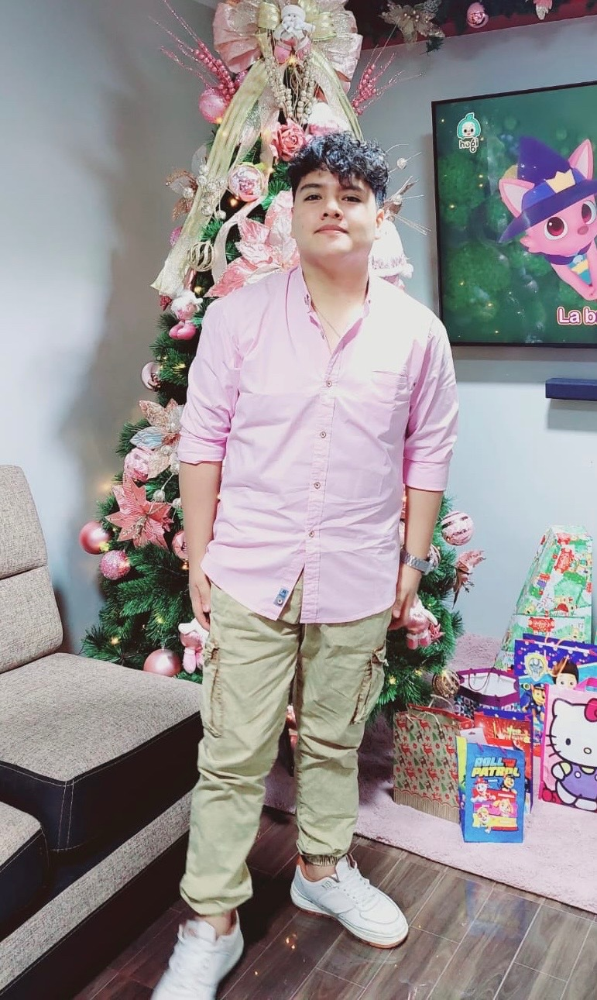

# 1.1. Startup Profile

### 1.1.1. Descripción de la Startup
GreatBuild impulsa la transformación digital en el sector de la ingeniería civil. A través de ClearCost, desarrollamos soluciones tecnológicas que optimizan la planificación, el control financiero y la gestión integral de proyectos de construcción. Nuestro enfoque no solo busca reducir errores en los expedientes técnicos, sino también mejorar la coordinación de equipos multidisciplinarios, la organización de tareas y el seguimiento de reuniones, asegurando una ejecución más eficiente y transparente.

Misión: Nuestra misión es transformar la manera en que se gestionan los expedientes técnicos y la operación diaria de los proyectos de construcción mediante herramientas digitales innovadoras. Nos proponemos reducir errores en la recopilación y procesamiento de información, optimizar la asignación de tareas y fortalecer la comunicación entre equipos. A través de una plataforma accesible y colaborativa, facilitamos el trabajo de constructoras, contratistas y especialistas, garantizando un flujo de información claro, ordenado y en tiempo real.

Visión: Aspiramos a convertirnos en la plataforma de referencia para constructoras y consultoras independientes en la gestión financiera y operativa de proyectos de construcción. En los próximos tres años, buscamos consolidar nuestra presencia alcanzando al menos el 3% de las empresas consultoras de obra en Lima Metropolitana, posicionándonos como un aliado estratégico en la modernización y digitalización de los procesos constructivos en el país. Nuestro compromiso es ofrecer una herramienta que no solo optimice los presupuestos y expedientes, sino que también eleve la productividad y colaboración de los equipos en cada proyecto.

Valores:

- Transparencia: garantizar información clara y sin ambigüedades sobre el uso del presupuesto.
- Confianza: fortalecer la relación entre constructoras y clientes mediante datos verificables.
- Accesibilidad: ofrecer una solución disponible 24/7 en cualquier dispositivo.
- Seguridad: proteger la información financiera con altos estándares de privacidad.
- Eficiencia: optimizar el tiempo y los recursos en la gestión financiera de cada obra.

### 1.1.2. Perfiles de intregrantes del equipo

<table style="width: 100%; border-collapse: collapse; margin-bottom: 20px;">
        <thead>
            <tr>
                <th style="border: 1px solid #ddd; padding: 10px; text-align: left; width: 25%;">Foto</th>
                <th style="border: 1px solid #ddd; padding: 10px; text-align: left; width: 15%;">Nombres y Apellidos</th>
                <th style="border: 1px solid #ddd; padding: 10px; text-align: left; width: 15%;">Código de Alumno</th>
                <th style="border: 1px solid #ddd; padding: 10px; text-align: left; width: 15%;">Carrera</th>
                <th style="border: 1px solid #ddd; padding: 10px; text-align: left; width: 30%;">Habilidades</th>
            </tr>
        </thead>
        <tbody>
            <tr>
                <td style="border: 1px solid #ddd; padding: 10px; text-align: left; background-color: #f2f2f2; color: #333;"></td>
                <td style="border: 1px solid #ddd; padding: 10px; text-align: left; background-color: #f2f2f2; color: #333;">Diestra Zambrano, Adriana Maria</td>
                <td style="border: 1px solid #ddd; padding: 10px; text-align: left; background-color: #f2f2f2; color: #333;">202218110</td>
                <td style="border: 1px solid #ddd; padding: 10px; text-align: left; background-color: #f2f2f2; color: #333;">Ingeniería de Software</td>
                <td style="max-width: 300px; overflow: hidden; text-overflow: ellipsis; white-space: normal;">
                    <ul>
                        <li>Desarrollo web</li>
                        <li>Gestión y diseño de bases de datos SQL y noSQL</li>
                        <li>Experiencia con Frameworks ágiles</li>
                        <li>Programación en C++ y Python</li>
                    </ul>
                </td>
            </tr>
            <tr>
                <td style="border: 1px solid #ddd; padding: 10px; text-align: left; background-color: #f2f2f2; color: #333;"></td>
                <td style="border: 1px solid #ddd; padding: 10px; text-align: left; background-color: #f2f2f2; color: #333;">Fernandez Remon, Roy Linsh</td>
                <td style="border: 1px solid #ddd; padding: 10px; text-align: left; background-color: #f2f2f2; color: #333;">20221b778</td>
                <td style="border: 1px solid #ddd; padding: 10px; text-align: left; background-color: #f2f2f2; color: #333;">Ingeniería de Software</td>
                <td style="max-width: 300px; overflow: hidden; text-overflow: ellipsis; white-space: normal;">
                    <ul>
                        <li>Análisis de datos</li>
                        <li>Gestión y diseño de bases de datos SQL</li>
                        <li>Experiencia en programación en C++, Python y uso de herramientas de Análisis de datos</li>
                    </ul>
                </td>
            </tr>
            <tr>
                <td style="border: 1px solid #ddd; padding: 10px; text-align: left; background-color: #f2f2f2; color: #333;"></td>
                <td style="border: 1px solid #ddd; padding: 10px; text-align: left; background-color: #f2f2f2; color: #333;">León Vivas, Fabrizio Amir</td>
                <td style="border: 1px solid #ddd; padding: 10px; text-align: left; background-color: #f2f2f2; color: #333;">20211b994</td>
                <td style="border: 1px solid #ddd; padding: 10px; text-align: left; background-color: #f2f2f2; color: #333;">Ingeniería de Software</td>
                <td style="max-width: 300px; overflow: hidden; text-overflow: ellipsis; white-space: normal;">
                    <ul>
                        <li>Desarrollo front-end</li>
                        <li>Conocimiento de TI en sistemas basados en UNIX</li>
                        <li>Competente en C++, JavaScript y Python</li>
                        <li>Experiencia con Frameworks ágiles</li>
                    </ul>
                </td> 
            </tr>
        </tbody>
</table>
