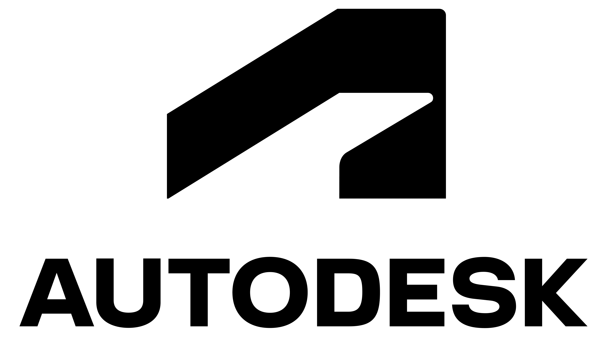
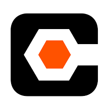

## 2.1. Competidores
### 2.1.1. Análisis Competitivo
El análisis competitivo es fundamental para desarrollar una estrategia sólida en el mercado, ya que permite comprender qué soluciones existen, cómo operan y qué valor ofrecen a los clientes. A través de esta metodología, se pueden detectar brechas en el mercado y evaluar qué necesidades de los clientes aún no están cubiertas. Por ese motivo, se presentará el siguiente cuadro con el análisis competitivo correspondiente.

<table style="width: 100%; border-collapse: collapse; text-align: left; page-break-inside: auto;">
    <thead>
        <tr>
            <th style="border: 1px solid #000; padding: 10px; font-weight: bold;" colspan="6">Competitive Analysis Landscape</th>
        </tr>
        <tr>
            <th style="border: 1px solid #000; padding: 10px;font-weight: bold;" colspan="2" rowspan="2">¿Por qué llevar a cabo este análisis?</th>
            <th style="border: 1px solid #000; padding: 10px;font-weight: bold;" colspan="4">¿Cuáles son las principales ventajas competitivas frente a nuestros competidores?</th>
        </tr>
        <tr>
            <td style="border: 1px solid #000; padding: 10px;" colspan="4">El resultado de analizar el mercado y a los competidores directos e indirectos proporciona datos que serán utilizados para delimitar estrategias con el fin de posicionar nuestro producto en el mercado competitivo.</td>
        </tr>
        <tr>
            <th style="border: 1px solid #000; padding: 10px;font-weight: bold;" colspan="2">(En la cabecera colocar por cada competidor nombre y logo)</th>
            <th style="border: 1px solid #000; padding: 10px;font-weight: bold; width: 20%; text-align: center;">Galaxia Wonder
            
            </th>
            <th style="border: 1px solid #000; padding: 10px;font-weight: bold; width: 20%; text-align: center;">
                Autodesk Construction Cloud
                
            </th>
            <th style="border: 1px solid #000; padding: 10px;font-weight: bold; width: 20%; text-align: center;">
                Procore
                
            </th>
            <th style="border: 1px solid #000; padding: 10px;font-weight: bold; width: 20%; text-align: center;">
                Deltek ComputerEase
                
            </th>
        </tr>
    </thead>
    <tbody>
        <tr>
            <th style="border: 1px solid #000; padding: 10px; font-weight: normal; width: 12%; writing-mode: tb-rl; text-align: center; vertical-align: middle; white-space: nowrap; font-weight: bold; width: 8%;" rowspan="2">Perfil</th>
            <th style="border: 1px solid #000; padding: 10px; font-weight: normal; width: 12%;">Overview</th>
            <td style="border: 1px solid #000; padding: 10px;" style="text-align:center;">
                Galaxia Wonder ofrece un sistema de gestión de proyectos de ingeniería civil diseñado para contratistas, consultoras pequeñas de obras y subcontratistas. La plataforma permite gestionar proyectos, planificar cronogramas, controlar costos, administrar documentación técnica y organizar expedientes técnicos en un solo lugar, asegurando eficiencia y cumplimiento de plazos.
            </td>
            <td style="border: 1px solid #000; padding: 10px;" style="text-align:center;">
                Esta plataforma conecta flujos de trabajo, equipos y datos en todas las etapas de la construcción, facilitando la colaboración y mejorando la eficiencia en proyectos de construcción.
            </td>
            <td style="border: 1px solid #000; padding: 10px;" style="text-align:center;">
                Procore ofrece una solución integral en línea para la gestión de proyectos de construcción, incluyendo control de costos, comunicaciones y colaboración, utilizada ampliamente en la industria.
            </td>
            <td style="border: 1px solid #000; padding: 10px;" style="text-align:center;">
                Software de contabilidad y gestión de proyectos de construcción que integra costos laborales con herramientas remotas, ayudando a las empresas a gestionar eficazmente sus proyectos y finanzas.
            </td>
        </tr>
        <tr>
            <th style="border: 1px solid #000; padding: 10px; font-weight: normal; width: 12%;">Ventaja competitiva ¿Qué valor ofrece a los clientes?</th>
            <td style="border: 1px solid #000; padding: 10px;" style="text-align:center;">
                Galaxia Wonder se diferencia por ser una nube especializada en la gestión de proyectos de ingeniería civil, ofreciendo una solución integral que combina planificación, control de costos, gestión documental y expedientes técnicos en una sola plataforma.
            </td>
            <td style="border: 1px solid #000; padding: 10px;" style="text-align:center;">
                Ofrece una integración completa de herramientas para la gestión de proyectos de construcción, desde el diseño hasta la adjudicación.
            </td>
            <td style="border: 1px solid #000; padding: 10px;" style="text-align:center;">
                Procore destaca por su interfaz intuitiva y facilidad de uso, lo que permite a los equipos de construcción gestionar proyectos de manera efectiva sin necesidad de una curva de aprendizaje extensa.
            </td>
            <td style="border: 1px solid #000; padding: 10px;" style="text-align:center;">
                Se enfoca en ofrecer una solución integral para la planificación y gestión de proyectos en el sector de la construccción.
            </td>
        </tr>
        <tr>
            <th style="border: 1px solid #000; padding: 10px; font-weight: normal; width: 12%; writing-mode: tb-rl; text-align: center; vertical-align: middle; white-space: nowrap; font-weight: bold; width: 8%;" rowspan="5">Perfil de marketing</th>
            <th style="border: 1px solid #000; padding: 10px; font-weight: normal; width: 12%;">Mercado objetivo</th>
            <td style="border: 1px solid #000; padding: 10px;">
                <ul>
                    <li>Contratistas independientes.</li>
                    <li>Consultoras pequeñas de obras.</li>
                </ul>
            </td>
            <td style="border: 1px solid #000; padding: 10px;">
                <ul>
                    <li>Grandes empresas de construcción.</li>
                    <li>Consultoras de ingeniería.</li>
                </ul>
            </td>
            <td style="border: 1px solid #000; padding: 10px;">
                <ul>
                    <li>Contratistas generales.</li>
                    <li>Subcontratistas.</li>
                    <li>Empresas constructoras.</li>
                </ul>
            </td>
            <td style="border: 1px solid #000; padding: 10px;">
                <ul>
                    <li>Contratistas de construcción.</li>
                </ul>
            </td>
        </tr>
        <tr>
            <th style="border: 1px solid #000; padding: 10px; font-weight: normal; width: 12%;">Estrategias de marketing</th>
            <td style="border: 1px solid #000; padding: 10px;">
                <ul>
                    <li>Prueba Gratuita de 14 o 30 Días.</li>
                    <li>Casos de Éxito.</li>
                    <li>Campañas de redes sociales.</li>
                </ul> 
            </td>
            <td style="border: 1px solid #000; padding: 10px;">
                <ul>
                    <li>Marketing de Contenidos.</li>
                    <li>Webinars y Formación en Línea.</li>
                    <li>Publicidad Digital y Redes Sociales.</li>
                </ul>
            </td>
            <td style="border: 1px solid #000; padding: 10px;">
                <ul>
                    <li>Email Marketing.</li>
                    <li>Convenios con Empresas Constructoras y Gobiernos.</li>
                    <li>Eventos en línea.</li>
                </ul>
            </td>
            <td style="border: 1px solid #000; padding: 10px;">
                <ul>
                    <li>Eventos y Webinars de Capacitación.</li>
                    <li>Estrategia de Publicidad Directa.</li>
                    <li>Referencias y Testimonios.</li>
                </ul>
            </td>
        </tr>
        <tr>
            <th style="border: 1px solid #000; padding: 10px; font-weight: normal; width: 12%;">Productos & Servicios</th>
            <td style="border: 1px solid #000; padding: 10px;">
                <ul>
                    <li>Aplicación web para gestión de proyectos, planificación y optimización de recursos para agilizar los procesos y plazos del desarrollo de un proyecto.</li>
                    <li>Gestor de expedientes y fichas técnicas en base a roles predefinidos.</li>
                    <li>Funciona como nube para almacenamiento de documentos.</li>
                </ul>
            </td>
            <td style="border: 1px solid #000; padding: 10px;">
                <ul>
                    <li>Plataforma para la gestión de licitaciones y conexión con contratistas, facilitando la comunicación durante las fases iniciales del proyecto.</li>
                    <li>Herramienta para la gestión de planos y documentos en proyectos de construcción, permitiendo a los equipos acceder y actualizar información en tiempo real en la obra.</li>
                    <li>Servicios adicionales para adaptar el software a las necesidades específicas de cada cliente o tipo de proyecto.</li>
                </ul>
            </td>
            <td style="border: 1px solid #000; padding: 10px;">
                <ul>
                    <li>Construction Financials: Herramienta enfocada en la gestión financiera del proyecto, como presupuestos, órdenes de cambio y pagos a contratistas, integrando la contabilidad con la gestión del proyecto.</li>
                    <li>Consultoría personalizada: Servicios de implementación y consultoría para adaptar el software a las necesidades de cada cliente.</li>
                </ul>
            </td>
            <td style="border: 1px solid #000; padding: 10px;">
                <ul>
                    <li>Software de contabilidad para la construcción</li>
                    <li>Gestión de proyectos: Herramienta de gestión integral que ayuda a los contratistas a planificar, programar y controlar los proyectos, asegurando que se mantengan dentro del presupuesto y cronograma.</li>
                    <li>Soporte técnico y consultoría</li>
                </ul>
            </td>
        </tr>
        <tr>
            <th style="border: 1px solid #000; padding: 10px; font-weight: normal; width: 12%;">Precios & Costos</th>
            <td style="border: 1px solid #000; padding: 10px;" style="text-align:center;">
                Galaxia Wonder brinda una modelo de precios basado en suscripción. Además, evalua las funciones y caracteristicas del software en base al cliente.
            </td>
            <td style="border: 1px solid #000; padding: 10px;" style="text-align:center;">
                Utiliza un modelo de precios basado en suscripción. Ofrece prubas gratuitas para su producto BIM 360.
            </td>
            <td style="border: 1px solid #000; padding: 10px;" style="text-align:center;">
                Procore utiliza un modelo de precios basado en suscripción. Los precios varian dependiendo de la organización, rondando entre $1,000 a $2,000 USD al mes. Además, ofrece una prueba gratuita de 14 días.
            </td>
            <td style="border: 1px solid #000; padding: 10px;" style="text-align:center;">
                Deltek ComputerEase ofrece un modelo basado en suscripción o licencias perpetuas, dependiendo de las necesidades del cliente. Asimismo, cuenta con una demostración gratuita que debe ser solicitada.
            </td>
        </tr>
        <tr>
            <th style="border: 1px solid #000; padding: 10px; font-weight: normal; width: 12%;">Canales de distribución (Web y/o Móvil)</th>
            <td style="border: 1px solid #000; padding: 10px;" style="text-align:center;">
                Aplicación web.
            </td>
            <td style="border: 1px solid #000; padding: 10px;" style="text-align:center;">
                Dispone de aplicación web y aplicación móvil.
            </td>
            <td style="border: 1px solid #000; padding: 10px;" style="text-align:center;">
                Dispone de aplicación web y aplicación móvil.
            </td>
            <td style="border: 1px solid #000; padding: 10px;" style="text-align:center;">
                Solo dispone de aplicación web.
            </td>
        </tr>
        <tr>
            <th style="border: 1px solid #000; padding: 10px; font-weight: normal; width: 12%; writing-mode: tb-rl; text-align: center; vertical-align: middle; white-space: nowrap; font-weight: bold; width: 8%;" rowspan="6">Análisis SWOT</th>
            <th style="border: 1px solid #000; padding: 10px; font-weight: normal; width: 12%;" colspan="5">Realice esto para su startup y sus competidores. Sus fortalezas deberían apoyar sus oportunidades y contribuir a lo que ustedes definen como su posible ventaja competitiva.</th>
        </tr>
        <tr>
            <th style="border: 1px solid #000; padding: 10px; font-weight: normal; width: 12%;">Fortalezas</th>
            <td style="border: 1px solid #000; padding: 10px;">
                <ul>
                    <li>Enfoque Específico en Ingeniería Civil.</li>
                    <li>Funciona como una nube.</li>
                    <li>Gestión Integral de Expedientes Técnicos.</li>
                </ul>
            </td>
            <td style="border: 1px solid #000; padding: 10px;">
                <ul>
                    <li>Es uno de los líderes en la tecnología BIM, lo que le permite ofrecer soluciones avanzadas para la gestión de la construcción desde la planificación hasta la adjudicación.</li>
                    <li>Esta posicionada como el estándar en la industria de la construcción.</li>
                    <li>Su infraestructura en la nube permite que los equipos de trabajo se conecten de manera remota desde cualquier lugar y dispositivo.</li>
                </ul>
            </td>
            <td style="border: 1px solid #000; padding: 10px;">
                <ul>
                    <li>Amplia red de colaboradores e integraciones con otros sistemas de la industria.</li>
                    <li>Ofrece una solución compacta, convirtiéndose en una opción atractiva para las grandes empresas.</li>
                </ul>
            </td>
            <td style="border: 1px solid #000; padding: 10px;">
                <ul>
                    <li>Ofrece tanto herramientas de contabilidad como de gestión de proyectos, lo que permite a los contratistas tener una visión clara de sus operaciones y finanzas.</li>
                    <li>Deltek ha ganado una base de clientes leales que aprecian la fiabilidad y la precisión de su software en la gestión financiera.</li>
                </ul>
            </td>
        </tr>
        <tr>
            <th style="border: 1px solid #000; padding: 10px; font-weight: normal; width: 12%;">Debilidades</th>
            <td style="border: 1px solid #000; padding: 10px;">
                <ul>
                    <li>Dependencia de Internet.</li>
                    <li>Requiere inversión en marketing y captación de clientes.</li>
                    <li>Funcionalidades menos competitivas.
                </ul>
            </td>
            <td style="border: 1px solid #000; padding: 10px;">
                <ul>
                    <li>El precio de las suscripciones puede ser alto, especialmente para empresas pequeñas o medianas.</li>
                    <li>Los productos de Autodesk pueden ser complejos y requerir tiempo para aprender a usarlos de manera eficiente, lo que puede ser una barrera para empresas pequeñas o sin experiencia.</li>
                </ul>
            </td>
            <td style="border: 1px solid #000; padding: 10px;">
                <ul>
                    <li>Aunque tiene muchas funciones, la personalización de algunas herramientas puede ser limitada en comparación con otros competidores.</li>
                    <li>Los costos de suscripciones pueden ser prohibitivos para pequeñas empresas o aquellos con presupuestos ajustados, especialmente cuando se incluyen módulos adicionales.</li>
                </ul>
            </td>
            <td style="border: 1px solid #000; padding: 10px;">
                <ul>
                    <li>Enfoque limitado en gestión de proyectos.</li>
                    <li>Interfaz menos moderna.</li>
                    <li>Precios menos competitivos.</li>
                </ul>
            </td>
        </tr>
        <tr>
            <th style="border: 1px solid #000; padding: 10px; font-weight: normal; width: 12%;">Oportunidades</th>
            <td style="border: 1px solid #000; padding: 10px;">
                <ul>
                    <li>Crecimiento del Sector Construcción.</li>
                    <li>Digitalización y Transformación Digital.</li>
                    <li>Integración con Otras Plataformas.</li>
                </ul>
            </td>
            <td style="border: 1px solid #000; padding: 10px;">
                <ul>
                    <li>Expansión a nuevos mercados.</li>
                    <li>Aumento de la demanda de soluciones colaborativas.</li>
                    <li>Avances tecnológicos.</li>
                </ul>
            </td>
            <td style="border: 1px solid #000; padding: 10px;">
                <ul>
                    <li>Crecimiento en mercados internacionales.</li>
                    <li>Innovación en la automatización.</li>
                    <li>Ampliación de funcionalidades.</li>
                </ul>
            </td>
            <td style="border: 1px solid #000; padding: 10px;">
                <ul>
                    <li>Expansión a nuevas funciones.</li>
                    <li>Integración con nuevas tecnologías.</li>
                    <li>Adopción de nuevas plataformas móviles.</li>
                </ul>
            </td>
        </tr>
        <tr>
            <th style="border: 1px solid #000; padding: 10px; font-weight: normal; width: 12%;">Amenazas</th>
            <td style="border: 1px solid #000; padding: 10px;">
                <ul>
                    <li>Resistencia al Cambio por Parte de Empresas Tradicionales.</li>
                    <li>Preocupaciones de Seguridad y Privacidad.</li>
                    <li>Integración al mercado como una startup emergente.</li>
                </ul>
            </td>
            <td style="border: 1px solid #000; padding: 10px;">
                <ul>
                    <li>Competencia creciente.</li>
                    <li>Riesgo de obsolescencia.</li>
                    <li>Condiciones económicas globales.</li>
                </ul>
            </td>
            <td style="border: 1px solid #000; padding: 10px;">
                <ul>
                    <li>Problemas con la adopción en mercados más pequeños.</li>
                    <li>Desafíos de integración.</li>
                </ul>
            </td>
            <td style="border: 1px solid #000; padding: 10px;">
                <ul>
                    <li>Presión de precios bajos.</li>
                    <li>Cambios tecnológicos rápidos.</li>
                    <li>Competencia de plataformas más completas.</li>
                </ul>
            </td>
        </tr>
    </tbody>
</table>

### 2.1.2. Estrategias y tácticas frente a competidores

#### 1. Destacar la Especialización en Ingeniería Civil y la Excelencia Técnica
* Contexto:
    * Fortalezas de competidores: Se posicionan como estándar en la industria, poseen amplia red de colaboradores e integraciones, y ofrecen herramientas integrales para gestionar operaciones y finanzas.
    * Nuestras fortalezas: Enfoque específico en ingeniería civil, funcionamiento basado en la nube y gestión integral de expedientes técnicos.
* Tactica:
    * Utilizar estudios de caso y campañas de marketing que demuestren la eficacia de nuestra solución y resalten nuestra experiencia en el área.

#### 2. Ofrecer Precios Competitivos y Optimizar la Usabilidad
* Contexto:
    * Debilidades de competidores: Ofrecen precios elevados para empresas pequeñas o medianas y presentan un enfoque limitado en la gestión de proyectos.
    * Nuestras debilidades: Requieren mayor inversión en marketing y captación de clientes, y dependen en gran medida de la conectividad a Internet.
* Tactica:
    * Realizar pruebas de usabilidad para garantizar que nuestra interfaz sea intuitiva y accesible, proporcionando una experiencia de usuario óptima.

#### 3. Aprovechar el Crecimiento del Mercado y la Transformación Digital
* Contexto:
    * Oportunidades del mercado: Aumento de la demanda de soluciones colaborativas y expansión en mercados internacionales.
    * Nuestras oportunidades: Crecimiento del sector de la construcción y aceleración de la digitalización.
* Tactica:
    * Lanzar campañas digitales dirigidas a aquellas empresas que aún no han modernizado sus procesos, con el objetivo de captar nuevos clientes y ampliar nuestra presencia en el mercado.

#### 4. Posicionar una Plataforma Flexible, Segura y Centrada en el Cliente
* Contexto:
    * Amenazas de competidores: Problemas de adopción en mercados pequeños, rápidos cambios tecnológicos y competencia creciente.
    * Nuestras amenazas: Resistencia al cambio por parte de empresas tradicionales y preocupaciones en materia de seguridad y privacidad.
* Tácticas:
    * Adaptar la herramienta a las necesidades específicas de cada usuario, reduciendo la curva de aprendizaje y ofreciendo soporte continuo para facilitar la adopción y generar confianza.
    * Ofrecer garantías y certificaciones de seguridad que respalden nuestro compromiso con la protección de la información.
    * Permitir a los clientes dar retroalimentación u observaciones sobre el avance del proyecto.