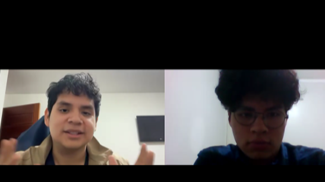
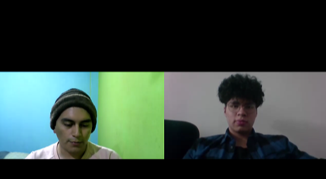

## 2.2. Entrevistas

### 2.2.1. Diseño de entrevistas

**Lista de preguntas**

Cada conjunto de preguntas fue diseñado de manera específica para los diferentes segmentos objetivo, con el propósito de comprender cómo desarrollan su trabajo, qué herramientas emplean y qué dificultades encuentran al planificar o modificar proyectos técnicos. Para garantizar un flujo natural durante las entrevistas, se recreó una conversación completa a modo de simulación, lo que permitió identificar quiebres en el ritmo o repeticiones innecesarias. A partir de ese ejercicio, se reorganizó el orden de las preguntas, manteniendo un enfoque coherente y dinámico sin sacrificar la precisión técnica.

Las preguntas numeradas con un solo dígito corresponden a las preguntas principales, orientadas a guiar la entrevista y generar información valiosa. En complemento, se incluyen preguntas secundarias que permiten profundizar según las respuestas del entrevistado, enriqueciendo así el análisis.

**Preguntas para Contratista / Proyectista**

**Empathy and Persona**

1. Primero, díganos un poco sobre usted y a qué se dedica.
- 1.1. En base a su respuesta, se pregunta los campos que no se hayan podido llenar directamente según el formato presente en Plantilla de datos generales.
2. Cuéntenos, ¿Cómo luce un día típico de trabajo para usted?
3. ¿Qué herramientas utiliza en su día a día para realizar o apoyarse en el desarrollo de estas labores?
4. De estas actividades, ¿Qué parte identifica usted como la más laboriosa o frustrante?
5. ¿Qué cree que necesite para revertir esta situación?
6. Y de ellas, ¿Cuál cree usted que es la más importante, y por qué razón?

**Domain Model**

7. Describir el dominio en base a lo aprendido autónomamente y en base a ello.
- 7.1. ¿Las secciones que hemos planteado son correctas? ¿Son un reflejo de su trabajo?
- 7.2. ¿Cuál de estas (del nuevo modelo) considera que es la más importante o fundamental para el éxito de la planificación del proyecto? ¿Por qué razón?
8. En base a su experiencia, ¿Cómo organiza los documentos de un expediente técnico? (directorios, carpetas, documentos)
9. ¿Cómo es la organización y repartición de tareas en la elaboración de un expediente técnico?
10. ¿Qué valor tiene la comunicación entre especialistas del expediente técnico?
11. ¿Qué otras áreas de la organización se involucran directa o indirectamente en la elaboración de los expedientes técnicos? ¿Cómo se relacionan con el equipo principal?
12. ¿Qué tan importante es el cumplimiento de plazos con respecto al expediente técnico? ¿Se realizan estimaciones de tiempo?
13. ¿Es posible que deba realizar cambios al expediente técnico durante su desarrollo o tras la adjudicación de la obra?
    - ¿Cómo se realiza este proceso y qué tan importante o difícil resulta para la organización lidiar con él?

**Preguntas para Especialista de área**

**Empathy and Persona**

1. Primero, díganos un poco sobre usted y a qué se dedica.
- 1.1. En base a su respuesta, se pregunta los campos que no se hayan podido llenar directamente según el formato presente en Plantilla de datos generales.
2. Cuéntenos, ¿Cómo es trabajar en la elaboración de un expediente técnico de obra / proyecto?
3. ¿Qué herramientas utiliza para apoyarse en el desarrollo de estas labores?
4. De estas actividades, ¿Qué parte identifica usted como la más laboriosa o frustrante?
5. ¿Qué cree que necesite para revertir esta situación?
6. Y de ellas, ¿Cuál cree usted que es la más importante, y por qué razón?

**Domain Model**

7. ¿Cómo obtiene la información o datos necesarios para elaborar su parte del expediente técnico?
8. ¿Qué procesos sigue para transformar esa información en entregables o documentos técnicos?
9. ¿Cómo presenta o entrega finalmente su trabajo? ¿En qué formato y a través de qué canal?
10. ¿Qué estándares, normativas o lineamientos debe cumplir en su especialidad?
11. ¿Cómo asegura que su trabajo cumpla con los cronogramas establecidos?
12. ¿Qué tan fácil o difícil es coordinar con su equipo directo? ¿Qué herramientas utilizan para ello?
13. ¿Cómo se comunica con otras áreas técnicas (como estructuras, arquitectura, etc.) durante el desarrollo del expediente?

**Preguntas para Entidad contratante**

**Empathy and Persona**

1. Primero, díganos un poco sobre usted y a qué se dedica.
- 1.1. En base a su respuesta, se pregunta los campos que no se hayan podido llenar directamente según el formato presente en Plantilla de datos generales
2. Cuéntenos, ¿Alguna vez se ha planteado construir su propio hogar? ¿Por qué?
3. En base a ello, ¿ha llegado a contactar a algún contratista o proyectista? ¿Qué impresión le dejaron?
- 3.1. ¿Por qué razón no ha contactado con ellos? ¿Es debido a algún factor de confianza?
4. ¿Conoce a alguien en su entorno (amigos, familiares, conocidos) que haya planificado la construcción de su hogar? ¿Cómo fue su experiencia?
5. Cuando empiece a planificar su vivienda, ¿qué expectativas tendría respecto al servicio?

**(Explicar brevemente la propuesta del proyecto al entrevistado).**

6. ¿Ha escuchado de algún proyecto similar a este?
- 6.1. ¿Qué piensa de ello?¿En qué cree que aportaría?
- 6.2. ¿Qué características añadiría para mejorar la experiencia?

**Tabla de datos generales**

La plantilla de datos generales permite obtener información básica sobre los entrevistados, como su entorno, personalidad, herramientas favoritas y preferencias tecnológicas. Esta información sirve como punto de partida para profundizar durante la entrevista.

<table style="
        width: 100%;
        text-align: left;
        font-size: 14px;">
  <thead>
    <tr>
      <th style="width: 50%; border: 1px solid #000;">Campo</th>
      <th style="width: 50%; border: 1px solid #000;">Valor</th>
    </tr>
  </thead>
  <tbody>
    <tr><td style="border: 1px solid #000;">Género</td><td style="border: 1px solid #000;"></td></tr>
    <tr><td style="border: 1px solid #000;">Personalidad</td><td style="border: 1px solid #000;"></td></tr>
    <tr><td style="border: 1px solid #000;">Nombre</td><td style="border: 1px solid #000;"></td></tr>
    <tr><td style="border: 1px solid #000;">Edad</td><td style="border: 1px solid #000;"></td></tr>
    <tr><td style="border: 1px solid #000;">Ocupación</td><td style="border: 1px solid #000;"></td></tr>
    <tr><td style="border: 1px solid #000;">Estado Civil</td><td style="border: 1px solid #000;"></td></tr>
    <tr><td style="border: 1px solid #000;">Dispositivos favoritos</td><td style="border: 1px solid #000;"></td></tr>
    <tr><td style="border: 1px solid #000;">Browsers (Safari, Google, Chrome, Mozilla, Edge, etc.)</td><td style="border: 1px solid #000;"></td></tr>
    <tr><td style="border: 1px solid #000;">Canales o medios de comunicación</td><td style="border: 1px solid #000;"></td></tr>
    <tr><td style="border: 1px solid #000;">Marcas e influencers</td><td style="border: 1px solid #000;"></td></tr>
  </tbody>
</table>

### 2.2.2. Registro de entrevistas

<table class="tabla-entrevista">
  <thead>
    <tr>
      <th style="
            text-align: left;
            padding: 12px;
            background-color: #f0f0f0;
            font-size: 22px;"><strong>SEGMENTO OBJETIVO: CONTRATISTA</strong></th>
      <th><strong>#1</strong></th>
    </tr>
  </thead>
  <tbody>
    <tr>
      <td colspan="2" style="padding: 0; vertical-align: top; background-color: #fff border-top: 1px solid #ddd;">
        

          

            
Datos generales

            <ul style="margin: 0; padding-left: 20px; list-style-type: disc; font-size: 1.05em; line-height: 1.7; color: #333;">
              <li><strong>Nombres: </strong>Mario Joaquín </li>
              <li><strong>Apellidos: </strong>Lopez Acuña </li>
              <li><strong>Edad: </strong>29 </li>
              <li><strong>Distrito: </strong>La Molina </li>
              <li><strong>URL Entrevista:</strong> <a href="https://upcedupe-my.sharepoint.com/:v:/g/personal/u20221b778_upc_edu_pe/EXUmfDv35CtJlqIayO7BJjsB5uF_qp8kDdevyEcgz3_gKw?e=qMDWgB&nav=eyJyZWZlcnJhbEluZm8iOnsicmVmZXJyYWxBcHAiOiJTdHJlYW1XZWJBcHAiLCJyZWZlcnJhbFZpZXciOiJTaGFyZURpYWxvZy1MaW5rIiwicmVmZXJyYWxBcHBQbGF0Zm9ybSI6IldlYiIsInJlZmVycmFsTW9kZSI6InZpZXcifX0%3D" target="_blank">Ver video</a></li>
              <li><strong>Timestamp:</strong> 00:00</li>
              <li><strong>Duración:</strong> 11:05</li>
            </ul>
          

          
        

      </td>
    </tr>
    <tr>
      <td colspan="2" style="padding: 0; vertical-align: top; background-color: #fff border-top: 1px solid #ddd;">
        

          
Resumen

          <ul style="padding-left: 20px; list-style-type: disc; color: #333; font-size: 1em; margin: 0;">
            <li><strong>Personalidad:</strong>  Guardián. Lleva la gran responsabilidad de dirigir una empresa con más de 30 años en el mercado que trabaja para el Estado Peruano. El cumplimiento de las normativas, los acuerdos y las expectativas de los clientes son su máxima prioridad.</li>
            <li><strong>Marcas:</strong> Microsoft, Autodesk Inc y S10. Son herramientas que utiliza en su trabajo.</li>
            <li><strong>Uso de tecnología:</strong> Minimo. Su empresa refleja un nivel de adopción de la tecnología bastante bajo, incluyendo prácticas poco convencionales como almacenar archivos en discos duros físicos.</li>
            <li><strong>Canales:</strong> WhatsApp. Lo usa como medio de comunicación y transferencia de archivos.</li>
            <li><strong>Browsers:</strong> Google Chrome. Sin razón en particular, posiblemente por la popularidad de Google.</li>
            <li><strong>Dispositivos:</strong> Celular y Laptop. Debido a su portabilidad.</li>
            <li><strong>Background:</strong> En 1992 fundó su empresa dedicada a la ejecución de obras para empresas privadas, consolidando experiencia como residente de obra. En la actualidad su empresa se dedica a la consultoría y elaboración de expedientes técnicos para el Estado Peruano. </li>
            <li>
              <strong>Frustraciones:</strong>
              <ul style="list-style-type: circle; padding-left: 20px;">
                <li>La adopción de tecnología.</li>
                <li>Capacitación de personal.</li>
              </ul>
            </li>
            <li>
              <strong>Flujos principales:</strong>
              <ul style="list-style-type: circle; padding-left: 20px;">
                <li>Estudios básicos (medidas descriptivas).</li>
                <li>Elaboración y seguimiento de calendario.</li>
                <li>Gestión de observaciones y compatibilidad.</li>
                <li>Seguimiento del contrato.</li>
              </ul>
            </li>
          </ul>
        

      </td>
    </tr>
  </tbody>
</table>

<table class="tabla-entrevista">
  <thead>
    <tr>
      <th style="
            text-align: left;
            padding: 12px;
            background-color: #f0f0f0;
            font-size: 22px;"><strong>SEGMENTO OBJETIVO: CONTRATISTA</strong></th>
      <th><strong>#2</strong></th>
    </tr>
  </thead>
  <tbody>
    <tr>
      <td colspan="2" style="padding: 0; vertical-align: top; background-color: #fff border-top: 1px solid #ddd;">
        

          

            
Datos generales

            <ul style="margin: 0; padding-left: 20px; list-style-type: disc; font-size: 1.05em; line-height: 1.7; color: #333;">
              <li><strong>Nombres: </strong>Álvaro Martín </li>
              <li><strong>Apellidos: </strong>Torres Huamani </li>
              <li><strong>Edad: </strong>27 </li>
              <li><strong>Distrito: </strong>San Juan de Lurigancho </li>
              <li><strong>URL Entrevista:</strong> <a href="https://upcedupe-my.sharepoint.com/:v:/g/personal/u20221b778_upc_edu_pe/EXUmfDv35CtJlqIayO7BJjsB5uF_qp8kDdevyEcgz3_gKw?e=qMDWgB&nav=eyJyZWZlcnJhbEluZm8iOnsicmVmZXJyYWxBcHAiOiJTdHJlYW1XZWJBcHAiLCJyZWZlcnJhbFZpZXciOiJTaGFyZURpYWxvZy1MaW5rIiwicmVmZXJyYWxBcHBQbGF0Zm9ybSI6IldlYiIsInJlZmVycmFsTW9kZSI6InZpZXcifX0%3D" target="_blank">Ver video</a></li>
              <li><strong>Timestamp:</strong> 11:05</li>
              <li><strong>Duración:</strong> 07:20</li>
            </ul>
          

          
        

      </td>
    </tr>
    <tr>
      <td colspan="2" style="padding: 0; vertical-align: top; background-color: #fff border-top: 1px solid #ddd;">
        

          
Resumen

          <ul style="padding-left: 20px; list-style-type: disc; color: #333; font-size: 1em; margin: 0;">
            <li><strong>Personalidad:</strong> Guardian. Demuestra un claro respeto por las normas y el cumplimiento de los acuerdos.</li>
            <li><strong>Marcas:</strong> Microsoft y Autodesk Inc. Principalmente sigue marcas porque ofrecen herramientas o soluciones valiosas para su trabajo.</li>
            <li><strong>Uso de tecnología:</strong> Medio, práctico. Posee habilidades de navegación, ofimática y uso de software específico para su trabajo.</li>
            <li><strong>Canales:</strong> Plataformas y herramientas de Microsoft (Microsoft Teams, por ejemplo). Demuestra un grado de integración alto con las herramientas de ofimática de Microsoft.</li>
            <li><strong>Browsers:</strong> Google Chrome. Sin una razón específica, posiblemente debido a la popularidad de Google.</li>
            <li><strong>Dispositivos:</strong> Celular y Laptop. Esto es debido a la portabilidad, lo que le permite seguir trabajando sin estar atado a una oficina.</li>
            <li><strong>Background:</strong> Su experiencia ha estado tanto en la parte administrativa (como gerente) como en la parte operativa (como residente de obra), actividad que suele extrañar. </li>
            <li>
              <strong>Frustraciones:</strong>
              <ul style="list-style-type: circle; padding-left: 20px;">
                <li>El factor distancia, pues no siempre puede estar en el lugar de la obra para dar su mejor juicio.</li>
                <li>La poca interconexión entre sistemas, pues muchos procesos dependen de autorizaciones que terminan en lo manual, muchas veces.</li>
              </ul>
            </li>
            <li>
              <strong>Flujos principales:</strong>
              <ul style="list-style-type: circle; padding-left: 20px;">
                <li>Comunicación / contacto con el cliente.</li>
                <li>Seguimiento de normativas y acuerdos (contratos).</li>
                <li>Conceder y solicitar autorización entre distintas áreas.</li>
                <li>Seguimiento y cumplimiento de calendarización.</li>
              </ul>
            </li>
          </ul>
        

      </td>
    </tr>
  </tbody>
</table>

<table class="tabla-entrevista">
  <thead>
    <tr>
      <th style="
            text-align: left;
            padding: 12px;
            background-color: #f0f0f0;
            font-size: 22px;"><strong>SEGMENTO OBJETIVO: CONTRATISTA</strong></th>
      <th><strong>#3</strong></th>
    </tr>
  </thead>
  <tbody>
    <tr>
      <td colspan="2" style="padding: 0; vertical-align: top; background-color: #fff border-top: 1px solid #ddd;">
        

          

            
Datos generales

            <ul style="margin: 0; padding-left: 20px; list-style-type: disc; font-size: 1.05em; line-height: 1.7; color: #333;">
              <li><strong>Nombres: </strong>Bryan </li>
              <li><strong>Apellidos: </strong>Espejo </li>
              <li><strong>Edad: </strong>28 </li>
              <li><strong>URL Entrevista:</strong> <a href="poner el link del video">Ver video</a></li>
              <li><strong>Timestamp:</strong> 00:00</li>
              <li><strong>Duración:</strong> 05:00</li>
            </ul>
          

          
        

      </td>
    </tr>
    <tr>
      <td colspan="2" style="padding: 0; vertical-align: top; background-color: #fff border-top: 1px solid #ddd;">
        

          
Resumen

          <ul style="padding-left: 20px; list-style-type: disc; color: #333; font-size: 1em; margin: 0;">
            <li><strong>Personalidad:</strong> Innovador, colaborador, analítico y oridentado a resultados.</li>
            <li><strong>Marcas:</strong> Autodesk, BIM360, Contech influencers. Son herramientas que utiliza en su trabajo.</li>
            <li><strong>Canales:</strong> Email corporativo, Microsoft Teams, WhatsApp Business, Trello.</li>
            <li><strong>Browsers:</strong> Google Chrome, Mircosoft Edge</li>
            <li><strong>Dispositivos:</strong> Laptop, tablet y celular.</li>
            <li>
              <strong>Frustraciones:</strong>
              <ul style="list-style-type: circle; padding-left: 20px;">
                <li>Revisar quue los metrados y presupuestos estén alineados con los planos. A veces hay inconsistencias y toca regresar a validar varias veces.</li>
              </ul>
            </li>
            <li>
              <strong>Flujos principales:</strong>
              <ul style="list-style-type: circle; padding-left: 20px;">
                <li>Estudios básicos (medidas descriptivas).</li>
                <li>Elaboración y seguimiento de calendario.</li>
                <li>Gestión de observaciones y compatibilidad.</li>
                <li>Seguimiento del contrato.</li>
              </ul>
            </li>
          </ul>
        

      </td>
    </tr>
  </tbody>
</table>

<table class="tabla-entrevista">
  <thead>
    <tr>
      <th style="
            text-align: left;
            padding: 12px;
            background-color: #f0f0f0;
            font-size: 22px;"><strong>SEGMENTO OBJETIVO: Entidad contratante</strong></th>
      <th><strong>#1</strong></th>
    </tr>
  </thead>
  <tbody>
    <tr>
      <td colspan="2" style="padding: 0; vertical-align: top; background-color: #fff border-top: 1px solid #ddd;">
        

          

            
Datos generales

            <ul style="margin: 0; padding-left: 20px; list-style-type: disc; font-size: 1.05em; line-height: 1.7; color: #333;">
              <li><strong>Nombres: Maryori</strong> </li>
              <li><strong>Apellidos: Atanacio Cruces</strong> </li>
              <li><strong>Edad: 24 años</strong> </li>
              <li><strong>Distrito: San Juan de Lurigancho</strong> </li>
              <li><strong>URL Entrevista:</strong> <a href="https://upcedupe-my.sharepoint.com/:v:/g/personal/u20221b778_upc_edu_pe/EXUmfDv35CtJlqIayO7BJjsB5uF_qp8kDdevyEcgz3_gKw?e=qMDWgB&nav=eyJyZWZlcnJhbEluZm8iOnsicmVmZXJyYWxBcHAiOiJTdHJlYW1XZWJBcHAiLCJyZWZlcnJhbFZpZXciOiJTaGFyZURpYWxvZy1MaW5rIiwicmVmZXJyYWxBcHBQbGF0Zm9ybSI6IldlYiIsInJlZmVycmFsTW9kZSI6InZpZXcifX0%3D" target="_blank">Ver video</a></li>
              <li><strong>Timestamp:</strong> 00:00</li>
              <li><strong>Duración: 05:24 minutos</strong> </li>
            </ul>
          

          
        

      </td>
    </tr>
    <tr>
      <td colspan="2" style="padding: 0; vertical-align: top; background-color: #fff border-top: 1px solid #ddd;">
        

          
Resumen

          <ul style="padding-left: 20px; list-style-type: disc; color: #333; font-size: 1em; margin: 0;">
            <li><strong>Personalidad: Muy alegre</strong> </li>
            <li><strong>Marcas: Urbania</strong> </li>
            <li><strong>Uso de tecnología: Android y Windows</strong> </li>
            <li><strong>Canales: Facebook, Instagram y Youtube</strong>  </li>
            <li><strong>Browsers: Google</strong> </li>
            <li><strong>Dispositivos: Teléfono y laptop</strong> </li>
            <li>
              <strong>Frustraciones: Falta de confianza</strong>
              <ul style="list-style-type: circle; padding-left: 20px;">
              </ul>
            </li>
            <li>
              <strong>Flujos principales:</strong>
              <ul style="list-style-type: circle; padding-left: 20px;">
                <li>Contactar con el proyectista.</li>
              </ul>
            </li>
          </ul>
        

      </td>
    </tr>
  </tbody>
</table> 

<table class="tabla-entrevista">
  <thead>
    <tr>
      <th style="
            text-align: left;
            padding: 12px;
            background-color: #f0f0f0;
            font-size: 22px;"><strong>SEGMENTO OBJETIVO: </strong></th>
      <th><strong>#1</strong></th>
    </tr>
  </thead>
  <tbody>
    <tr>
      <td colspan="2" style="padding: 0; vertical-align: top; background-color: #fff border-top: 1px solid #ddd;">
        

          

            
Datos generales

            <ul style="margin: 0; padding-left: 20px; list-style-type: disc; font-size: 1.05em; line-height: 1.7; color: #333;">
              <li><strong>Nombres: Jefry Alfredo</strong> </li>
              <li><strong>Apellidos: Prado Remón</strong> </li>
              <li><strong>Edad: 24 años</strong> </li>
              <li><strong>Distrito: San Juan de Lurigancho</strong> </li>
              <li><strong>URL Entrevista:</strong> <a href="https://upcedupe-my.sharepoint.com/:v:/g/personal/u20221e247_upc_edu_pe/EREC9iNRgJhIinK3osJI6IYBrl5jviZ00gGwKmbTa1DFvA?nav=eyJyZWZlcnJhbEluZm8iOnsicmVmZXJyYWxBcHAiOiJTdHJlYW1XZWJBcHAiLCJyZWZlcnJhbFZpZXciOiJTaGFyZURpYWxvZy1MaW5rIiwicmVmZXJyYWxBcHBQbGF0Zm9ybSI6IldlYiIsInJlZmVycmFsTW9kZSI6InZpZXcifX0%3D&e=LTJHiH" target="_blank">Ver video</a></li>
              <li><strong>Timestamp:</strong> 00:00</li>
              <li><strong>Duración: 0 minutos</strong> </li>
            </ul>
          

          
        

      </td>
    </tr>
    <tr>
      <td colspan="2" style="padding: 0; vertical-align: top; background-color: #fff border-top: 1px solid #ddd;">
        

          
Resumen

          <ul style="padding-left: 20px; list-style-type: disc; color: #333; font-size: 1em; margin: 0;">
            <li><strong>Personalidad: Muy responsable</strong> </li>
            <li><strong>Marcas:</strong> </li>
            <li><strong>Uso de tecnología:</strong> </li>
            <li><strong>Canales:</strong>  </li>
            <li><strong>Browsers:</strong> </li>
            <li><strong>Dispositivos:</strong> </li>
            <li><strong>Background:</strong> </li>
            <li>
              <strong>Frustraciones:</strong>
              <ul style="list-style-type: circle; padding-left: 20px;">
                <li></li>
              </ul>
            </li>
            <li>
              <strong>Flujos principales:</strong>
              <ul style="list-style-type: circle; padding-left: 20px;">
                <li>Contactar con el proyectista.</li>
                <li>Presentar el requerimiento del proyecto.</li>
              </ul>
            </li>
          </ul>
        

      </td>
    </tr>
  </tbody>
</table>

### 2.2.3. Análisis de entrevistas

**CONTRATISTAS**

**1. Resumen:** Los contratistas son en su mayoría varones adultos con experiencia previa como residentes de obra. Actualmente desempeñan la función de gerentes en oficinas, alejados del área operativa, lo cual les genera cierta nostalgia por “los viejos tiempos” en campo. Son personas sencillas, de trato directo y verbo fluido, con un alto respeto por las normas y los acuerdos establecidos. Presentan ciertas dificultades en el uso de tecnologías digitales, aunque muestran disposición al aprendizaje, motivados principalmente por aumentar la eficiencia de su organización.

**2. Edad:**  Las edades de los entrevistados de este segmento están en mediados de llegar a los 30 años de edad. Se toma como edad representativa la media aritmética de los datos.

| Entrevistado | Mario López | Alvaro Torres | Kevin Apolinario | Valor representativo |
|-|-|-|-|-|
| **Edad** | 29 | 27 | 28 | 28 |

**3. Personalidad:** La totalidad de los entrevistados (100%) se alínean al arquetipo de personalidad *Guardián*, debido a su respeto irrestricto y meticuloso de las normas y acuerdos. Se toma este arquetipo de personalidad como representativo.

| Entrevistado | Mario López | Raúl Reaño | William Salcedo | Valor representativo |
|-|-|-|-|-|
| **Personalidad** | Guardián | Guardián | Guardián | Guardián |

**4. Marcas e influencers:** La totalidad de los entrevistados (100%) mencionó las marcas Microsoft y Autodesk. De ellos, la gran mayoría (66.7%) mencionaron la marca S10. Se toma como marcas representativas Microsoft, Autodesk y S10.

| Marca | Frecuencia Absoluta | Frecuencia Relativa | Entrevistados que la siguen (%) |
|-|-|-|-|
| Microsoft | 3 | 37.5% | 100% |
| Autodesk Inc. | 3 | 37.5% | 100% |
| S10 | 2 | 25% | 66.7% |
| **Total** | 8 | 100% | - |

**5. Uso de tecnología:** La gran mayoría de los entrevistados (66.7%) demostró un nivel bajo de dominio e integración de la tecnología en su trabajo y vida diaria, mientras que la menor parte (33.3%) mostró un nivel intermedio. Se toma como nivel de uso de tecnología representativo el nivel Bajo.

| Nivel de uso de tecnología | Frecuencia Absoluta | % de entrevistados en este nivel |
|-|-|-|
| Bajo | 2 | 66.7% |
| Medio | 1 | 33.3% |
| Alto | 0 | 0% |
| **Total** | 3 | 100% |

**6. Canales:** La gran mayoría de los entrevistados (66.7%) mencionó utilizar WhatsApp como canal de comunicación, especialmente para el trabajo, mientras que la menor parte (33.3%) mencionó utilizar el ecosistema de Microsoft y Telegram.

| Canal de comunicación | Frecuencia Absoluta | Frecuencia Relativa | Entrevistados que lo usan (%) |
|-|-|-|-|
| WhatsApp | 2 | 50% | 66.7% |
| Ecosistema Microsoft | 1 | 25% | 33.3% |
| Telegram | 1 | 25% | 33.3% |
| **Total** | 4 | 100% | - |

**7. Browsers:** La totalidad de los entrevistados (100%) mencionó utilizar exclusivamente Google Chrome como su navegador web. Esta preferencia podría estar relacionada con su bajo nivel de dominio tecnológico, lo que los lleva a mantenerse en entornos digitales conocidos y seguros, sin explorar otras alternativas disponibles. Se toma como representativa la única alternativa mencionada.

| Navegador Web | Frecuencia Absoluta | Frecuencia Relativa | Entrevistados que lo usan (%) |
|-|-|-|-|
| Google Chrome | 3 | 100% | 100% |
| **Total** | 3 | 100% | - |

**8. Dispositivos:** La totalidad de los entrevistados (100%) mencionó utilizar el celular como herramienta principal para acceder a recursos digitales. La gran mayoría (66.7%) reportó el uso de Laptops, mientras que una menor parte reportó el uso de computadoras de escritorio (33.3%). Se toma como representativa la clara tendencia hacia la portabilidad (Celular y Laptop).

| Dispositivo | Frecuencia Absoluta | Frecuencia Relativa | Entrevistados que lo usan (%) |
|-|-|-|-|
| Celular | 3 | 50% | 100% |
| Laptop | 2 | 33.3% | 66.7% |
| PC | 1 | 16.7% | 33.3% |
| **Total** | 6 | 100% | - |

**9. Flujos principales:** La totalidad de los entrevistados (100%) señaló la importancia del seguimiento y cumplimiento del calendario. La gran mayoría (66.7%) destacó la importancia del seguimiento del contrato y la gestión de observaciones y compatibilidad de los planos. De manera aislada se mencionaron otros flujos como el contacto con el cliente o la recaudación ded medidas descriptivas, entre otras. Estos últimos flujos tienen cierto grado de solapamiento con los flujos principales mayoritarios, cumpliendo un rol de apoyo o soporte.

| Flujo de trabajo | Frecuencia Absoluta | Frecuencia Relativa | Entrevistados que lo priorizan (%) |
|-|-|-|-|
| Comunicación / contacto con el cliente | 1 | 9.1% | 33.3% |
| Conceder y solicitar autorización entre distintas áreas | 1 | 9.1% | 33.3% |
| Estudios básicos (medidas descriptivas) | 1 | 9.1% | 33.3% |
| Elaboración del calendario | 1 | 9.1% | 33.3% |
| Seguimiento y cumplimiento del calendario | 3 | 27.3% | 100% |
| Seguimiento del contrato | 2 | 18.2% | 66.7% |
| Gestión de observaciones y compatibilidad de planos | 2 | 18.2% | 66.7% |
| **Total** | 11 | 100% | - |

