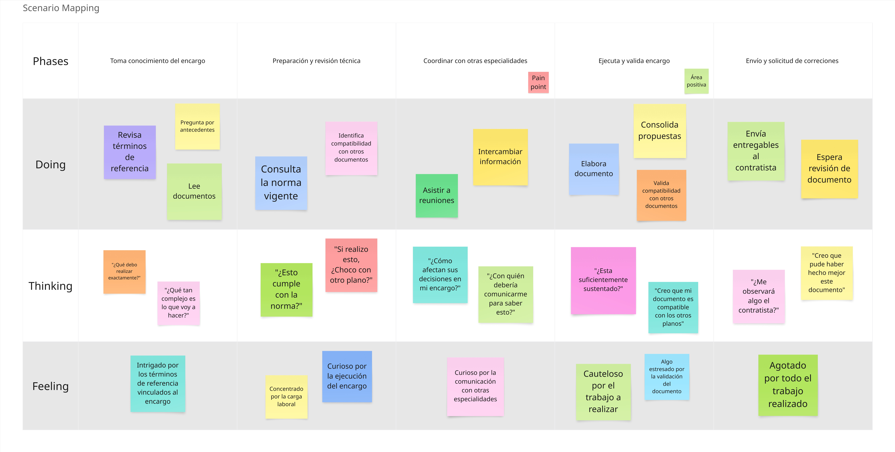

## 2.3. Needfinding

### 2.3.1. User Personas

Para la definición de los segmentos objetivo se tomaron en cuenta principalmente características demográficas extraídas de las entrevistas. Estos datos sirvieron como base para construir los perfiles de los User Personas y, a su vez, para reconocer sus motivaciones e intereses. De manera complementaria, se incorporaron también aspectos relacionados con sus competencias, hábitos y preferencias en el uso de tecnología y herramientas, los cuales fueron identificados durante el análisis de las entrevistas.

**Contratistas**

Edilberto Cáceres es ingeniero civil de 29 años que inició su carrera como asistente y luego residente de obra, adquiriendo habilidades fundamentales en gestión de proyectos y en la resolución de imprevistos en campo. Actualmente dirige una pequeña empresa consultora dedicada a la elaboración de expedientes técnicos para proyectos de obra civil, enfocándose en asegurar la calidad de los entregables y el cumplimiento de la normativa vigente. Se le reconoce por su profesionalismo, su compromiso con la excelencia técnica y su capacidad para brindar soluciones viables tanto a entidades públicas como a clientes privados.

  

**Especialistas**

José Rodríguez representa al segmento objetivo de los Especialistas. Es arquitecto de profesión con una amplia trayectoria. Se caracteriza por su motivación constante y su pasión por la arquitectura. Posee un sólido compromiso con el cumplimiento de las normativas en el ejercicio de sus funciones. Destaca por su capacidad de comunicación con otros profesionales y por su habilidad analítica en el desarrollo de proyectos.

  

**Entidad Contratante**

Javier Luján representa al segmento objetivo de las Entidades contratantes. Actualmente busca un contratista para planificar la construcción de su vivienda en un terreno heredado. Se caracteriza por ser una persona precavida, orientada a garantizar la seguridad y bienestar de su futura familia. Además, muestra una marcada afinidad con el uso de la tecnología, lo que le facilita involucrarse activamente en la gestión de su proyecto.

  

### 2.3.2. User Task Matrix

Se considera para la realización de este User Task Matrix los User Persona, sus actividades, frecuencia e importancia.

<table border="1" cellpadding="5" cellspacing="0">
  <thead>
    <tr>
      <th rowspan="2">Task</th>
      <th colspan="2">Edilberto Cáceres</th>
      <th colspan="2">José Rodríguez</th>
      <th colspan="2">Javier Luján</th>
    </tr>
    <tr>
      <th>Frecuencia</th>
      <th>Importancia</th>
      <th>Frecuencia</th>
      <th>Importancia</th>
      <th>Frecuencia</th>
      <th>Importancia</th>
    </tr>
  </thead>
  <tbody>
    <tr><td>Contacto con cliente</td><td>Alta</td><td>Alta</td><td>Baja</td><td>Alta</td><td>Nunca</td><td>Baja</td></tr>
    <tr><td>Conceder autorización de comunicación de áreas</td><td>Media</td><td>Alta</td><td>Baja</td><td>Alta</td><td>Nunca</td><td>Alta</td></tr>
    <tr><td>Planificación de cronogramas</td><td>Media</td><td>Alta</td><td>Media</td><td>Alta</td><td>Baja</td><td>Media</td></tr>
    <tr><td>Cumplimiento de cronogramas</td><td>Alta</td><td>Alta</td><td>Alta</td><td>Alta</td><td>Nunca</td><td>Baja</td></tr>
    <tr><td>Planificación de estudios básicos</td><td>Media</td><td>Alta</td><td>Alta</td><td>Alta</td><td>Nunca</td><td>Baja</td></tr>
    <tr><td>Ejecución de estudios básicos</td><td>Baja</td><td>Alta</td><td>Media</td><td>Alta</td><td>Nunca</td><td>Baja</td></tr>
    <tr><td>Seguimiento de normativas</td><td>Alta</td><td>Alta</td><td>Alta</td><td>Alta</td><td>Media</td><td>Alta</td></tr>
    <tr><td>Consultar a otras áreas</td><td>Media</td><td>Alta</td><td>Alta</td><td>Alta</td><td>Nunca</td><td>Baja</td></tr>
    <tr><td>Solicitar revisiones</td><td>Nunca</td><td>Baja</td><td>Alta</td><td>Alta</td><td>Alta</td><td>Alta</td></tr>
    <tr><td>Reuniones de coordinación</td><td>Alta</td><td>Alta</td><td>Alta</td><td>Media</td><td>Media</td><td>Alta</td></tr>
    <tr><td>Entregar avances de expediente</td><td>Media</td><td>Alta</td><td>Alta</td><td>Alta</td><td>Media</td><td>Baja</td></tr>
    <tr><td>Cálculo de materiales y precios unitarios</td><td>Media</td><td>Alta</td><td>Alta</td><td>Alta</td><td>Nunca</td><td>Baja</td></tr>
    <tr><td>Comunicarse con contratista</td><td>Nunca</td><td>Baja</td><td>Media</td><td>Alta</td><td>Alta</td><td>Alta</td></tr>
    <tr><td>Explicar requisitos</td><td>Media</td><td>Alta</td><td>Nunca</td><td>Baja</td><td>Alta</td><td>Alta</td></tr>
    <tr><td>Supervisar cumplimiento de requisitos</td><td>Alta</td><td>Alta</td><td>Media</td><td>Alta</td><td>Alta</td><td>Alta</td></tr>
  </tbody>
</table>

**INTERPRETACIÓN DE RESULTADOS**

* Edilberto Cáceres: En su rol de contratista, participa de manera constante en reuniones y coordinaciones tanto con el cliente como con los especialistas. Otorga gran relevancia al cumplimiento de las normativas y a la observancia de los términos de referencia de cada proyecto. Considera que todas las fases del expediente técnico —desde la coordinación inicial con el cliente hasta la elaboración detallada de cada sección— resultan esenciales para garantizar la calidad del trabajo.

### 2.3.3. Empathy Mapping

**Contratistas**

En este segmento se reflejan las necesidades, frustraciones y oportunidades propias del contratista, junto con las percepciones de su entorno y sus observaciones directas. Se determina que el contratista cumple un rol fundamental en la elaboración del expediente técnico, asumiendo una participación activa en diversas actividades críticas que abarcan todo el proceso.

  

**Especialistas**

Se representan las necesidades, frustraciones y oportunidades del especialista, así como las percepciones de su entorno y sus propias observaciones. Se hace especial énfasis en la importancia de la comunicación entre especialidades, la participación en reuniones de coordinación y el cumplimiento riguroso de las normativas establecidas.

  

**Entidad contratante**

Se representan las necesidades, frustraciones y oportunidades de la entidad contratante, junto con las percepciones de su entorno y sus propias observaciones. Se destaca especialmente la influencia de las experiencias compartidas por colegas y conocidos.

  

### 2.3.4. As-is Scenario Mapping

Para construir esta sección del As-Is Scenario Mapping, el equipo trabajó de manera colaborativa, adoptando la perspectiva de los usuarios con el fin de describir situaciones que reflejaran las dificultades detectadas en el Empathy Map. Si bien durante el análisis surgieron más tareas, el resultado final se limitó a aquellas que se ajustaban al alcance definido para el proyecto.

**Contratistas**

Este escenario describe el flujo de trabajo dentro de la etapa de planificación de un proyecto. Se resalta la importancia de cumplir con los requisitos establecidos y de mantener un seguimiento constante durante la preparación del expediente técnico.

  

**Especialista**

Este escenario representa el flujo de trabajo del especialista durante la entrega de un encargo relacionado con el expediente técnico. Se resalta la importancia del cumplimiento de las normativas vigentes y la comunicación constante con otras especialidades para garantizar la coherencia y calidad del proyecto.

  

**Entidad contratante**

Este escenario representa el flujo de trabajo de la entidad contratante, desde el primer contacto con el contratista hasta el seguimiento del proyecto. Se hace especial énfasis en la verificación y cumplimiento de los requisitos establecidos.

  

