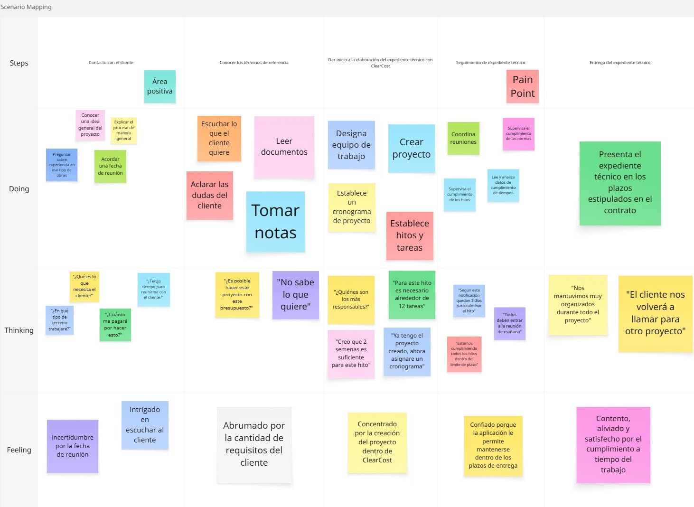
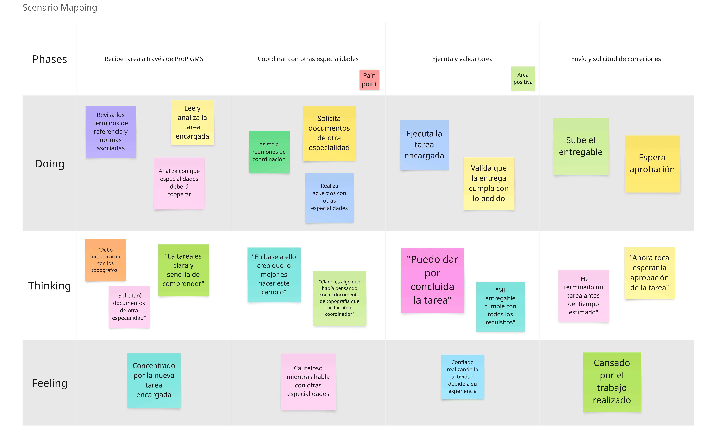

## 3.1. To-Be Scenario Mapping

Para elaborar esta sección del To-be Scenario Mapping, el equipo trabajó en conjunto poniéndose en el lugar de los usuarios, y en base al escenario planteando en As-is se planteo una situación de mejora para los segmentos con ProP GMS presente en su flujo de trabajo.

**Contratista**

Este escenario representa el flujo de trabajo dentro del ciclo de vida de la planificación del proyecto. A diferencia del As-is Scenario se nota una clara mejora en la creación del proyecto y planificación de los cronogramas e hitos del expediente técnico.

**Especialista**

Este escenario representa el flujo de trabajo del especialista durante la entrega de un encargo relacionado con el expediente técnico. A comparación del As-is Scenario se nota una clara mejora en el recepcionamiento de la tarea encargada para el especialista. Se mejora la coordinación y comunicación entre distitantas especialidades que trabajan en el expediente técnico.

**Entidad contratante**

Este escenario representa el flujo de trabajo de la entidad contratante, desde el primer contacto con el contratista hasta el seguimiento del proyecto. Se nota una clara mejora con respecto al As-is Scenario en la supervisión del proyecto con respecto a los plazos establecidos e hitos entregados.

