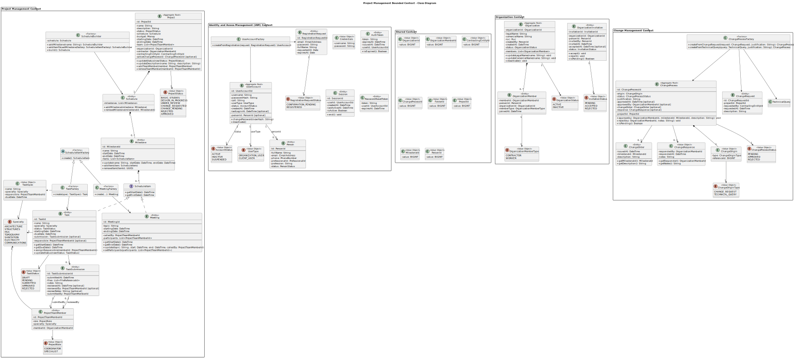
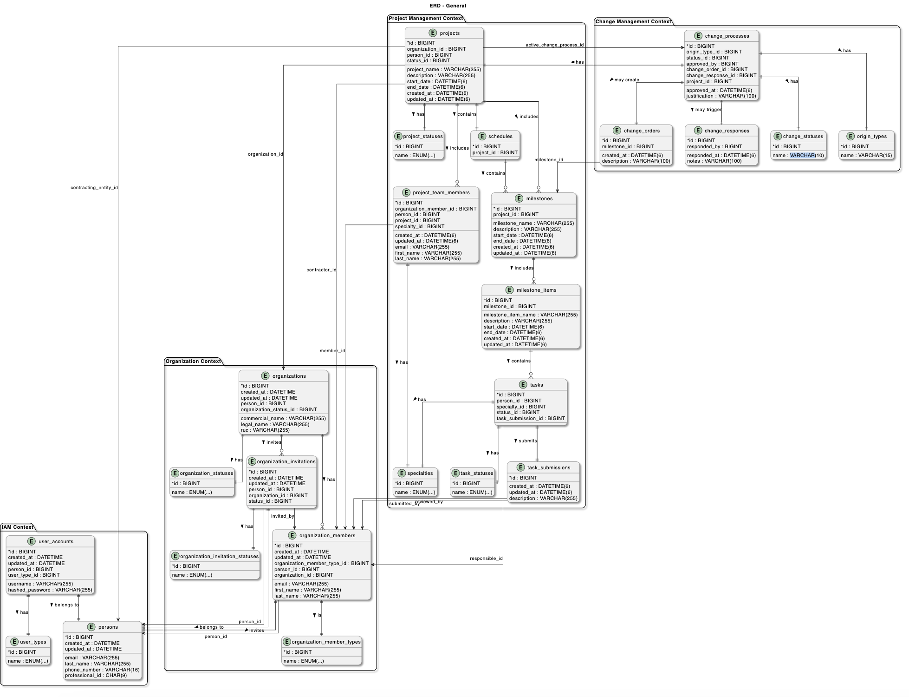

# Capítulo IV: Product Architecture Design

## 4.1. Design Concepts, ViewPoints & ER Diagrams

### 4.1.1. Principles Statements

A partir de la visión arquitectónica y los objetivos de negocio de **ClearCost**, se definen los siguientes principios que orientarán el desarrollo y evolución de la plataforma, garantizando coherencia y sostenibilidad a largo plazo:  

- **Transparencia como eje central**: toda la información financiera y de gestión de proyectos debe ser clara, verificable y fácilmente accesible para usuarios internos y clientes.  
- **Disponibilidad 24/7**: la plataforma debe garantizar un acceso constante, desde cualquier lugar y dispositivo, asegurando continuidad en las operaciones de obra.  
- **Escalabilidad modular**: la solución debe construirse con una arquitectura modular que facilite la incorporación de nuevas funcionalidades en fases futuras sin comprometer la estabilidad.  
- **Simplicidad y usabilidad**: la interfaz debe priorizar la facilidad de uso, reduciendo la curva de aprendizaje para contratistas, especialistas y entidades contratantes.  
- **Seguridad y privacidad de datos**: el sistema debe implementar prácticas sólidas de protección de la información financiera y documental, respetando la confidencialidad de cada usuario.  
- **Colaboración integrada**: ClearCost debe favorecer la comunicación fluida entre equipos y áreas, centralizando tareas, cronogramas y documentos en un mismo entorno.  
- **Estandarización de procesos**: las funcionalidades deben fomentar la uniformidad en la elaboración de expedientes técnicos y en la gestión financiera, reduciendo errores y reprocesos.  

### 4.1.2. Approaches Statements Architectural Styles & Patterns

#### A. Approaches Statements
Enfoques que guiarán el diseño y la evolución de **ClearCost**:

- **Domain-Driven Design (DDD)**  
  Modelar el dominio (expedientes, presupuestos, contratos, tareas, hitos, reuniones) en **bounded contexts** claros (Finanzas, Proyectos, Colaboración, Identidad & Accesos), con contratos explícitos entre dominios.
  
- **Arquitectura Evolutiva y entrega incremental**  
  Roadmap por incrementos funcionales; decisiones reversibles y *fitness functions* para validar atributos de calidad (disponibilidad 24/7, trazabilidad, desempeño).

- **Twelve-Factor App**  
  Configuración por entorno, dependencias explícitas, *build/release/run* separados y logs como *streams* para portabilidad entre nubes.

- **DevOps & CI/CD**  
  Automatización de *build*, pruebas y despliegues; *feature flags* para habilitar capacidades sin relanzar; *blue/green* o *rolling updates* para minimizar downtime.

- **Observabilidad desde el diseño**  
  *Tracing* distribuido, métricas (SLO/SLA) y *structured logging* por servicio para diagnosticar cuellos de botella y cumplir objetivos de disponibilidad.

- **Security & Privacy by Design**  
  Autenticación y autorización centralizada, mínimos privilegios, cifrado en tránsito y en reposo, segregación de datos por cliente y auditoría de acceso.

- **Infraestructura como Código (IaC)**  
  Definir entornos reproducibles (provisión, redes, seguridad) con plantillas versionadas para asegurar consistencia y escalabilidad.

- **APIs primero**  
  Contratos bien definidos (p. ej., OpenAPI) y gestión del ciclo de vida de APIs para habilitar integraciones graduales con terceros en fases futuras.

---

#### B. Architectural Styles & Patterns

**Estilo principal: Microservicios**  
Servicios autónomos por dominio de negocio, con datos propios y comunicación principalmente asíncrona. Beneficios buscados: escalabilidad independiente, despliegue aislado, resiliencia y alineamiento con equipos multifuncionales.

**Patrones de integración y resiliencia**
- **API Gateway**: único punto de entrada (agregación, *rate limiting*, *authz*); expone APIs públicas y orquesta llamadas hacia servicios internos.
- **Service Mesh** (opcional/etapa futura): *mTLS*, *traffic shaping*, *retries* y *circuit breaking* sin cambiar código de negocio.
- **Circuit Breaker & Retry/Backoff**: evitar cascadas de fallos y mejorar tolerancia a errores transitorios entre servicios.
- **Bulkhead**: aislamiento de recursos por servicio/cola para contener fallos.

**Patrones de datos y mensajería**
- **Database per Service**: cada microservicio es dueño de su esquema para reducir acoplamiento.
- **Outbox + Event Relay**: consistencia entre operaciones locales y publicación de eventos (evita pérdida/duplicidad).
- **Event-Driven Architecture** (mensajería/colas): propagar cambios entre Finanzas, Proyectos y Colaboración sin acoplamiento fuerte.
- **CQRS** (selectivo): separar comandos/lecturas cuando se requiera alto rendimiento en consultas (p. ej., paneles financieros).
- **Saga** (coreografía/orquestación): coordinar transacciones de larga duración (p. ej., creación de proyecto + presupuesto + permisos).

**Patrones de acceso y seguridad**
- **AuthN/AuthZ centralizado**: proveedor de identidad (OIDC) + **RBAC** por rol (contratista, especialista, entidad contratante, admin).
- **Tenant Isolation**: segmentación lógica/física de datos por cliente; políticas de retención y auditoría.

**Patrones para experiencia y colaboración**
- **Backend for Frontend (BFF)**: adaptaciones por público (equipo interno vs. cliente) para optimizar payloads y permisos.
- **Scheduler/Worker**: trabajos programados (recordatorios, cortes de período, conciliaciones) fuera del *request/response*.

**Patrones de evolución**
- **Strangler Fig**: migrar o incorporar módulos gradualmente, permitiendo sustituir componentes sin interrumpir a los usuarios.
- **Feature Toggle**: activar funcionalidades a grupos piloto y reducir riesgo en lanzamientos.

**Asignación sugerida de bounded contexts (ejemplo)**
- **Finanzas**: Presupuestos, valorizaciones, liquidaciones, contratos, reportes.
- **Proyectos**: Expediente, hitos, cronogramas, tareas, adjuntos, control de cambios.
- **Colaboración**: Mensajes, reuniones, notificaciones, recordatorios.
- **Identidad & Accesos**: Usuarios, roles, permisos, auditoría.

**Atributos de calidad soportados por la arquitectura**
- **Disponibilidad 24/7**: despliegues sin caída, escalado horizontal, *health checks* y *self-healing*.
- **Seguridad**: cifrado, principio de mínimo privilegio y trazabilidad de acceso.
- **Escalabilidad**: servicios y almacenes que escalan de forma independiente según la carga (p. ej., reportes financieros).
- **Mantenibilidad**: módulos pequeños con límites claros; contratos API versionados.
- **Observabilidad**: *tracing* y métricas por servicio para detectar anomalías y cumplir SLOs.

> Nota: la adopción de patrones como **CQRS**, **Service Mesh** o **Sagas** puede ser progresiva. La primera entrega priorizará API Gateway, *database per service*, mensajería para eventos clave, *circuit breaker* y observabilidad básica; los patrones avanzados se incorporarán conforme crezca la carga y el alcance funcional.

### 4.1.3. Context Diagram

Se adjuntó diagrama de contexto del sistema ***ClearCost*** realizado con Visual Paradigm.

### 4.1.4. Approach driven ViewPoints Diagrams

**Activity Diagrams**

Se presenta el flujo de actividades desde que el contratista crea una cuenta en ClearCost hasta el momento de finalización del expediente técnico e inicio de la obra.

**State Diagrams**

Se presenta el diagrama de estado de una tarea dentro de un hito.

**Class diagram**

### 4.1.5. Relational/Non Relational Database Diagram

### 4.1.6. Design Patterns

Detalle por bounded context

**1) IAM (Identidad y Accesos)**

* Adapter + Facade
    - Cuándo: integrarte con Auth0/Keycloak sin “filtrar” su API a tu dominio.
    - Beneficio: desacoplas tu core del proveedor; si cambias IdP no rompes el dominio.
    - Aplicación: AuthFacade expone login(), assignRole(), verifyToken(), y por debajo usa Auth0Adapter.

* Strategy / Policy (RBAC/ABAC)
    - Cuándo: reglas distintas por rol/tenant (contratista, especialista, cliente).
    - Beneficio: cambiar políticas sin tocar lógica de aplicación.
    - Aplicación: PermissionPolicy con estrategias ContractorPolicy, ClientPolicy, etc.

* Specification
    - Cuándo: expresar reglas complejas: “usuario pertenece al proyecto y tiene rol X”.
    - Beneficio: reglas recomponibles y testeables.
    - Aplicación: BelongsToProjectSpec AND HasRoleSpec.

* Proxy
    - Cuándo: llamadas remotas al IdP con timeouts/retries.
Beneficio: punto único para resiliencia y circuit breaking.

* Repository
    - Cuándo: gestionar usuarios, roles y grants propios.
    - Beneficio: persistencia encapsulada; prepara CQRS si lo necesitas.

**2) Organizations (Estructura organizacional)**

* Composite
    - Cuándo: modelar jerarquías (Organización → Equipo → Sub-equipo → Miembro).
    - Beneficio: operaciones uniformes (listar, mover, contar).
    - Aplicación: OrgComponent con Organization, Team, Member.

* Chain of Responsibility
    - Cuándo: pipeline de validaciones de alta/invitación (dominio, cupo, política, conflictos).
    - Beneficio: agregar/quitar validaciones sin reescribir flujo.

* Specification
    - Cuándo: pertenencia/compatibilidad de roles (“miembro puede ser responsable de especialidad”).

* Observer (Domain Events)
    - Cuándo: cuando cambie un rol, notificar a Colaboración/Proyectos.
    - Beneficio: baja cohesión entre servicios.

* Repository
    - Cuándo: persistir organizaciones, equipos, membresías.

**3) Budget (Presupuesto, valorizaciones y liquidación)**

* Composite
    - Cuándo: estructura jerárquica (Presupuesto → Partidas → Actividades → Insumos).
    - Beneficio: acumular montos y navegar jerarquías fácilmente.

* Strategy
    - Cuándo: distintos métodos de valorización (por avance físico, por hitos, mixto) y prorrateos.
    - Beneficio: conmutar cálculo sin tocar el dominio.

* State
    - Cuándo: ciclo de vida del presupuesto (Borrador → En_Revision → Aprobado → En_Valorización → Liquidado).
    - Beneficio: reglas por estado (qué operaciones se permiten).

* Specification
    - Cuándo: reglas de aprobación: “si aumento > X% requiere doble firma”.

* Builder
    - Cuándo: armar un presupuesto a partir de plantillas/cotizaciones.
    - Beneficio: construcción paso a paso, validando consistencia.

* Observer
    - Cuándo: cambios de partidas disparan recalculo de totales y reportes.

**4) Change Management (Solicitudes y control de cambios)**

* Command + Handler
    - Cuándo: cada cambio es un comando (RequestBudgetChange, AdjustMilestone).
    - Beneficio: separa intención de ejecución; facilita colas/reintentos.

* State
    - Cuándo: ciclo del cambio (Propuesto → En_Análisis → Aprobado/Rechazado → Implementado).
    - Beneficio: control de transiciones válidas.

* Saga (coreografía u orquestación)
    - Cuándo: cambios que involucran varios servicios (Budget, Projects, Colaboración, IAM).
    - Beneficio: consistencia eventual sin transacciones distribuidas.

* Memento + Audit Log
    - Cuándo: necesitas “antes y después” para auditoría o rollback lógico.
    - Beneficio: trazabilidad completa del cambio.

* Outbox
    - Cuándo: publicar eventos confiablemente tras confirmar cambios.
    - Beneficio: evita perder/duplicar eventos.

* Mediator
    - Cuándo: coordinar tareas de revisión entre varios roles sin dependencias directas.

**Transversal (aplica a varios servicios)**

- DTO/Assembler (Mapper) para separar API ↔ dominio.

- Decorator para logging/metrics sin ensuciar la lógica.

- Template Method para flujos similares por especialidad (p.ej., envío/validación de entregables).

- Anti-Corruption Layer (Adapter) en integraciones (Auth0, S3, GA4, Mercado Pago).

#### Qué aplicar primero (evitar sobre-ingeniería en el MVP)

* Budget: Composite + State + Strategy + Repository.

* Projects/Colaboración: State (tareas) + Template Method (workflows por especialidad) + Observer (notificaciones).

* IAM: Adapter/Facade con el IdP + Specification/Policy para permisos.

* Change Management: Command + State.

### 4.1.7. Tactics

A continuación se detallan tácticas de arquitectura alineadas a los atributos de calidad prioritarios de ClearCost (microservicios con bounded contexts: IAM, Organizations, Budget, Change Management). Cada táctica indica qué se hace y cómo aplicarla en la plataforma.

#### Disponibilidad & Continuidad (24/7)

* Despliegues sin caída: rolling updates y blue/green detrás del API Gateway; readiness/liveness probes y graceful shutdown.

* Redundancia: instancias en múltiples zonas; stateless services; sesiones en store compartido solo cuando sea necesario.

* Aislamiento de fallos: circuit breaker, timeouts, bulkheads por servicio y por pool de conexiones.

* Colas como búfer: desacoplar procesos pesados (cálculo de reportes, notificaciones) con mensajería y reintentos.

* Base de datos: réplicas de lectura y failover gestionado por servicio (DB-per-service).

#### Rendimiento & Escalabilidad

* Horizontal scaling: autoscaling por CPU/RAM/cola; rate limiting y quotas en el Gateway.

* Caching: caché de lectura en BFF/API Gateway, ETags y compresión; precálculo de paneles (Budget, Proyectos).

* Procesamiento asíncrono: jobs batch y workers para valorizaciones, generación de reportes y envíos masivos.

* Lecturas optimizadas: CQRS ligero para dashboards; paginación y streaming en listados de tareas/documentos.

* Archivos: URLs prefirmadas en S3 para subir/descargar grandes adjuntos sin sobrecargar la API.

#### Seguridad & Privacidad (Security by Design)

* AuthN/AuthZ centralizado: OIDC con RBAC por rol (contratista, especialista, cliente) y scopes por API.

* Aislamiento por tenant: segmentación de datos (filtros a nivel de servicio y/o esquema por organización).

* Cifrado: TLS extremo a extremo; cifrado en reposo; rotación de llaves y secrets management.

* Validación de entrada: input validation y sanitización en BFF/APIs; límites de tamaño de payload y archivos.

* Auditoría: logs inmutables de acceso y cambios (Budget y Change Management), 4-eyes principle para montos sobre umbral.

* Políticas de retención: eliminación/anonimización programada de PII y documentos caducos.

#### Modificabilidad & Evolución

* API-first: contratos OpenAPI versionados; contract testing (Pact) y política de deprecation.

* Feature flags: habilitar capacidades por cohortes y canary releases.

* Versionado de esquema: migraciones forward-only y compatibilidad hacia atrás (eventos versionados).

* DDD + límites claros: bounded contexts (IAM, Organizations, Budget, Change) con repositorios y anti-corruption layer para externos.

* Infraestructura como código: entornos reproducibles y reviewables.

#### Fiabilidad & Resiliencia

* Reintentos con exponential backoff y jitter solo en operaciones idempotentes.

* Idempotencia: idempotency keys en pagos/ajustes; deduplication de eventos.

* Dead-letter queues: aislar mensajes problemáticos y re-procesarlos.

* Sagas: coordinar cambios de larga duración (p. ej., Change Management afectando Budget y Projects).

* Outbox: publicación confiable de eventos de dominio tras commit local.

#### Observabilidad & Operación

* Trazas distribuidas: OpenTelemetry con correlation IDs por solicitud.

* Métricas: KPIs técnicos (latencia, errores, saturación) y de negocio (avance de hitos, variaciones de presupuesto).

* Logging estructurado: JSON con niveles, request-id y user-id; retención y búsqueda centralizada.

* SLOs y alertas: objetivos por servicio (p. ej., p95 de API < X ms, disponibilidad mensual) con alertas accionables.

* Monitoreo sintético: health checks externos a flujos críticos (login, subida de archivo, aprobación de hito).

#### Usabilidad & Experiencia

* BFF por audiencia: endpoints y payloads adaptados para contratista, especialista y cliente.

* Validación en cliente: formularios con errores en línea, empty states y estados de carga.

* Accesibilidad: guía de estilos y componentes con criterios WCAG; atajos y navegación por teclado.

* Notificaciones útiles: recordatorios y resúmenes accionables (no spam).

#### Gestión de Datos & Reportes

* DB-per-service: cada microservicio dueño de su esquema; evitar joins cross-servicio.

* Eventos de dominio: sincronización eventual (BudgetUpdated, MilestoneApproved).

* Auditoría financiera: append-only para valorizaciones y liquidaciones; snapshots (tipo Memento) para comparativos.

* ETL liviano: proyección segura a almacén de reportes para paneles históricos.

#### Integraciones Externas (ACL)

* Anti-Corruption Layer: adapters para Auth0, S3, SendGrid/FCM, Calendar, Mercado Pago, GA4.

* Backpressure: colas y rate limiting hacia terceros; circuit breaker por proveedor.

* Simuladores/stubs: pruebas determinísticas cuando los externos no estén disponibles.

